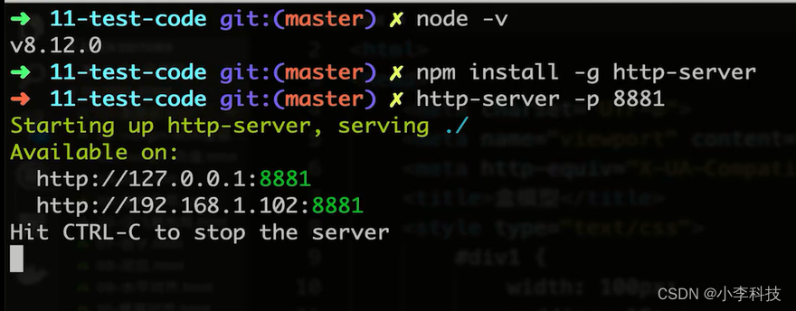

# 一 node小工具(http-server)

> 原文出处：https://blog.csdn.net/qq_35812380/article/details/124881866

### 一 node小工具(http-server)

目的:

为了模拟本地服务器

​ 1.全局安装http-server

> npm install -g http-server

2. 通过http-server -p <端口号> 启动一个服务
3. 然后再浏览器看运行的html 网站

