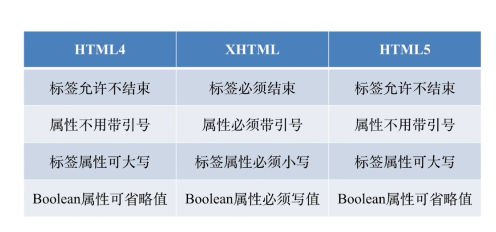
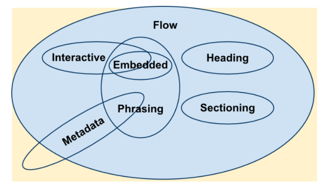
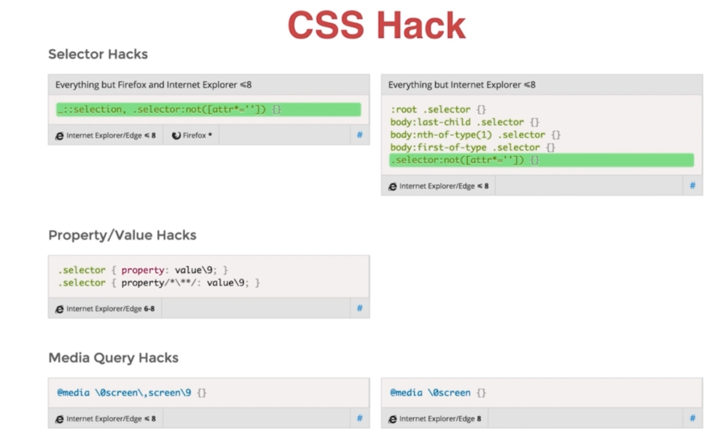
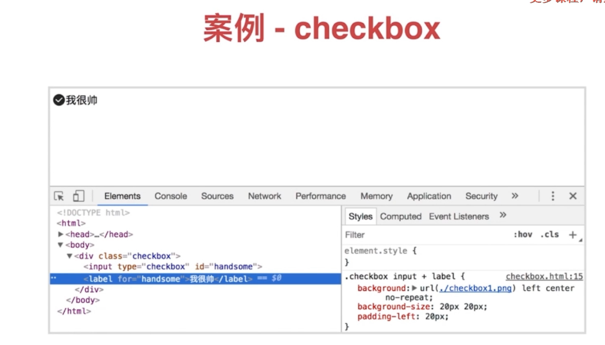
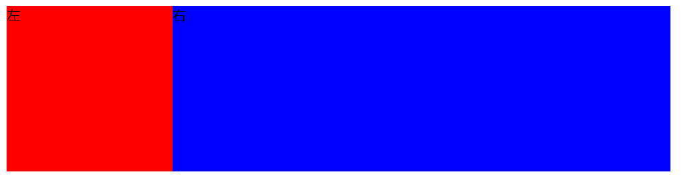

# CSS 基础


## 一 简介

pass

## 二 HTML

> ###### 前端三大件
>
> + HTML结构
> + CSS样式
> + Javascript 行为

---

> 1. **HTML常见元素和理解**
> 2. **HTML版本**
> 3. **HTML元素分类**
> 4. **HTML元素嵌套关系**
> 5. **HTML元素默认样式和定制化**
> 6. **HTML面试真题解答**

---

### 一 HTML常见元素  

> chapter2html-ele.html

#### 1. head 中

+ meta

  + 1. meta 标签   charset: 表示页面使用什么字符集(使用什么编码:默认utf-8) ,防止出现编码问题

       ```html
       <meta charset="utf-8">
       ```

  + 2. **viewport视口(适配移动端必备)**

       使用该meta标签时，在content中写属性，用逗号隔开

       ```html
       <meta name="viewport" content="width=device-width, initial-scale=1.0, maximum-scale=1.0,minimum-scale=1.0,user-scalable=no" />
       ```

       

  

  

+ title

+ style

+ link

+ script

+ base:

  + 1.  <base> 标签为页面上的所有链接规定默认地址或默认目标  
        
        </base>

       ```html
       <base target="_blank" />
       ```
  
       
  
  + 2. 指定基础路径,  指定之后所有的链接都是以这个路径为基础进行计算的
  
       如果 `<a href="a" />` 链接到 a
  
       如果 `<base href="123/" />`,  `<a href="a" />` , 链接到 123/a
  
       ```html
       <base href="/" />
       ```
  
       


```html
+ div/section/article/aside/header/footer
+ p
+ span/em/strong:   行内 em斜体 strong 粗体
+ table/thead/th/tbody/tr/td
+ ul/ol/li/dl/dd: 列表相关  ul无序,ol有序,  dl:标题, dd : 内容
+ a: 链接标签, 体现页面关联跳转 web灵魂
+ form/input/select/textarea/button
```

### 二 HTML重要属性

> chapter2/html-ele.html


>a[href,   target]:    target: "_self" 默认为当前页面打开,  "_blank"
>
>img[src,  alt]:  alt:(alternate) 没有图片时候的替代文字
>
>table td[colspan,   rowspan]
>
>form[target, method,       enctype]:
>
>```
> target 提交地址,  
> method, 表单提交的方法(get ,post), 
> enctype: 指定post提交时候的编码, urlencode,   formData(数据编码后上传,  上传文件(使用formData))
> 			application/x-www-form-urlencoded
>			multipart/form-data
>			text/plain
> 指定将表单数据提交到服务器时应如何编码（仅用于method =“ post”）
> 
>```
>
>
>
>input[type,    value]
>
>>- `<input type="text">` (default value)
>>- `<input type="button">`
>>- `<input type="checkbox">`
>>- `<input type="date">`
>>- `<input type="datetime-local">`
>>- `<input type="email">`
>>- `<input type="file">`
>>- `<input type="image">`
>>- `<input type="number">`
>>- `<input type="password">`
>>- `<input type="radio">`
>>- `<input type="range">`
>>- `<input type="reset">`
>>- `<input type="search">`
>>- `<input type="submit">`
>>- `<input type="tel">`
>>- `<input type="time">`
>>- `<input type="url">`
>
>button[type]
>
>select  >  option[value]
>
>label[for]
>
>> 与表单项关联,   当点击label 时候,  相当于点击表单项本身, 单选框说明,  (点文字进行选择)
>
>textarea
>
>>| Attribute                                                    | Value    | Description                                                  |
>>| ------------------------------------------------------------ | -------- | ------------------------------------------------------------ |
>>| [cols](https://www.w3schools.com/tags/att_textarea_cols.asp) | *number* | Specifies the visible width of a text area                   |
>>| [disabled](https://www.w3schools.com/tags/att_textarea_disabled.asp) | disabled | Specifies that a text area should be disabled                |
>>| [maxlength](https://www.w3schools.com/tags/att_textarea_maxlength.asp) | *number* | Specifies the maximum number of characters allowed in the text area |
>>| [placeholder](https://www.w3schools.com/tags/att_textarea_placeholder.asp) | *text*   | Specifies a short hint that describes the expected value of a text area |
>>| [readonly](https://www.w3schools.com/tags/att_textarea_readonly.asp) | readonly | Specifies that a text area should be read-only               |
>>| [required](https://www.w3schools.com/tags/att_textarea_required.asp) | required | Specifies that a text area is required/must be filled out    |
>>| [rows](https://www.w3schools.com/tags/att_textarea_rows.asp) | *number* | Specifies the visible number of lines in a text area         |
>>
>>*右下角*有小图标: resize: none;
>
>```html
><textarea id="w3review" name="w3review" rows="4" cols="50">
>```


#### Form与Ajax提交表单的区别

> submit提交和ajax提交的区别submit会刷新页面，ajax不会刷新页面form表单内有button的type为submit的按钮可以点击按钮提交表单，
>
> 触发submit事件form表单内即使没有button的type为submit的按钮,也可以在输入框内回车来提交，
>
> 触发submit事件在submit事件中，阻止默认事件或返回false，可停止提交表单，例如表单校验但是如果你的数据需要处理，就需要在submit中阻止原生提交，自定义用ajax来提交
>
> + 建议有提交输入时候,  放上form元素,  通过jq 的  series 方法做序列化,  利于表单校验   


### 三 如何理解HTML

> http://man.hubwiz.com/docset/HTML.docset/Contents/Resources/Documents/developer.mozilla.org/en-US/docs/Web/Guide/HTML/Using_HTML_sections_and_outlines.html

+ **HTML "文档"** 

+ **描述文档的"结构"**

+ **有区块和大纲**

  ```html
      <section>
          <h1>Forest elephants</h1> 
          <section>
            <h1>Introduction</h1>
            <p>In this section, we discuss the lesser known forest elephants.</p>
          </section>
          <section>
            <h1>Habitat</h1>
            <p>Forest elephants do not live in trees but among them.</p>
          </section>
          <aside>
            <p>advertising block</p>
          </aside>
        </section>
        <footer>
          <p>(c) 2010 The Example company</p>
        </footer>
  ```

  这导致了以下概述：

  ```html
  1. Forest elephants
     1.1 Introduction
     1.2 Habitat
  ```


+ 工具:  

  https://h5o.github.io

  大纲

  h5o,  基于w3c 的 大纲算法工具,  web语义化 优化,  帮助分析html 结构是否合理, 

  **放置一个标签含义是什么,  整体的结构是什么**

   

  避免结构混乱,  使页面有语义,  知道那些块是干什么的.不同标签的含义

  

### 四 HTML版本

+ HTML4/4.01(SGML)

**Standard Generalized Markup Language**

+ XHTML(XML)
+ HTML5



工具:  

https://validator.w3.org/#validate_by_upload

w3c ,  校验html 文档的编码的合法性

在之前的时代中,  写完html 文件都需要验证 html 文件的合法性,   `https://validator.w3.org/#validate_by_upload`


### 五 HTML5新增内容


::: details
+ min, max

+ 新区块标签

  + section: 区块, 出现在大纲中
  + article:区块, 出现在大纲中
  + nav:导航, 出现在大纲中
  + aside: ** 标签定义 article 以外的内容。aside 的内容应该与 article 的内容相关。** 的内容可用作文章的侧栏。

+ 表单增强

+ 日期, 时间, 搜索,search
+ 表单验证, , url, tel, email
required 在submit表单之前必须填写。可用的元素是, input,select和textarea（例外, type类型为hidden, image或类似submit的input元素）。
:::


+ 如果在select上使用required属性，那就得设置一个带有空值的占位符option。

      ```html
      <label>Color: 
          <select name="color" required>
       		<option value="">Choose one
      		<option>Red
       		<option>Green
       		<option>Blue
      	</select>
      </label>
      ```

    + disabled

    + input下的新属性(**autocomplete**, min, max, multiple, pattern, step)

      ```html
       <input name="clublet" required pattern="[A-Za-z]+"></label></p>
      ```

      

    

  + placeholder

  + autofocus 自动聚焦: 定义当页面 load以后，焦点自动作用于当前元素上。

  + style:    scoped属性,  用来启用限定作用范围的样式表。

    > style 元素有了一个新的 scoped 属性，用来启用限定作用范围的样式表。
    >
    > 在一个这样的 style 元素里的样式规则**只应用到当前style元素的父元素根下的子树，即兄弟树。**

    ```html
    <!-- 这个article正常使用head里声明的style -->
     <article>
        <h1>Blah Title Blah</h1>
        <p>Blah blah article blah blah.</p>
    </article>
    
    <article>
        <!-- 这里声明的style只能让该article以及子元素使用 -->
        <style scoped>
            h1 { color: hotpink; }
            article { border: solid 1px hotpink; }
        </style>
        <h1>Blah Title Blah</h1>
        <p>Blah blah article blah blah.</p>
    </article>
    ```

  


### 六 HTML5新增语义

+ header / footer 头尾

+ section / article 区域

+ nav 导航

+ aside   : 侧边栏 / 不重要内容

+ em /strong  强调(文档, 语义化标签)  斜体/粗体

  之前写法

  + i ,  italics  斜体(样式元素)
  + b,  bold 粗体(样式元素)

+ i:  icon : **通常做图标**

  `<i> 标签显示斜体文本效果。,  与<em> 标签类似`

  **通常做图标**

### 七 HTML元素分类

> https://blog.csdn.net/weixin_44663399/article/details/102492236


#### 1. **按默认样式分**

+ **按默认样式分**

  + 块级block**(可设置宽高)**

    + 1. 方块
    + 2. 占据整行, 不给其他元素留出空间,     每个块级元素都会从新的一行开始，从上到下排布；
    + 3. 可以设置宽高、内、外边距值；
    + 4. 若不设置宽度和高度 ，则宽度默认为父级元素的宽度（100%），高度根据内容大小自动填充；
    + 5. 块级元素大多都可以容纳行内元素（内联元素 ）和其他块级元素；

    > 常见块级:
    >
    > **div/section/article/aside**

  + 非块级

    + 行内(或内联) inline (在一行中的某一个地方)--**-(不可设置宽高)**
      + 1. 不一定是方形的
      + 2. 不独占一行, 和谐的与其他元素挤在一起
      + 3. 对其设置宽、高、垂直方向的padding、margin值无效，但水平方向设置padding、margin值有效；
      + 4. 默认宽度是本身内容的宽度；
      + 5. 行内元素只能容纳文本或者其他行内元素***（a特殊，链接中不可再放链接），不可在其中嵌套其他块级元素；***

    > 常见inline:与**文本**相关的
    >
    > span/em/strong ....

    + inline-block**(可设置宽高)**

      + **对外表现:**为 **inline 元素**,  **与其他元素和谐共处,**与其他元素挤在一起, 不会占据一整行
      + **对内表现:**为**block元素**, **有形状,有尺寸,**  是一个方块形状,  是block元素
      + 默认宽度是本身内容的宽度
      + 可以设置宽高、内、外边距值；

      ```html
      <body>
          <div>DIV元素</div>
          <p><span>内联元素</span><em>内联元素</em><strong>好巧，我也是内联元素</strong></p>
          <p><select><option>下拉框</option></select><span>你猜左边是什么元素</span></p>
      </body>
      ```

    > 常见inline-block
    >
    > img,    表单输入: input /select 下拉...


 #### 2. 按内容分

> https://developer.mozilla.org/zh-CN/docs/Web/Guide/HTML/Content_categories


分为很多类,  contentModel 内容模型

**Flow**: 文档流中, 有影响的元素,  大部分可视元素, 都是flow元素

**metadata**: header 中的元素 : title/base/script/style/link ... , 引入的一些信息,不占据文档流

**heading**:标题元素  h1-h6, hgroup.

**section**: 分区元素, `<article>, <aside>, <nav> and <section>`. 

**Interactive**: 交互元素, 为用户交互而特别设计的元素.`<a>，<button>，<details>，<embed>，<iframe>， <keygen>，<label>，<select> 和 <textarea>`。

**Phrasing**: 短语元素,  一句话中不完整的词汇,  **`<span>`**,   某些文字需要强调`<b>, <storng>,   倾斜:<em>` , 等.

 + `<del>: 删除线`

**Embedded**: 嵌入元素,  嵌入的其他资源, 嵌入的音频, 图片, 视频, iframe等, `<audio>, <canvas>, <iframe>, ,<svg>, <video>`.


### 八 HTML元素嵌套关系

> https://www.w3.org/TR/2011/WD-html5-20110525/content-models.html
>
> 
>
> https://www.w3.org/TR/2014/REC-html5-20141028/text-level-semantics.html
>
> https://www.w3.org/TR/2014/REC-html5-20141028/grouping-content.html#the-p-element

***html 元素的嵌套关系,   那些元素是可以出现在那些地方***

+ **块级元素可以包含行内元素**
  + div 包含 a / span
+ **块级元素不一定能包含块级元素**
  + div包含div, section 包含div
  + p(段落), 不应包含 div 块级元素
+ **行内元素一般不能包含块级元素**
  + span 不能包含div
+ **但是.... 什么叫一般,什么时候行内元素可以包含块级元素?:**
  + html5 中  a 元素可以包含块级元素


#### 为什么a (包含) div 是合法的?

**不一定,  取决于父级元素,  因为a 是嵌套 transparent ,   计算时候,  将a 拿掉,   所以, 取决于外层元素**

工具:  https://validator.w3.org/#validate_by_upload. 校验html 文档的编码的合法性

看被嵌套元素,  属不属于  嵌套元素的 content Model , 属于 就是合法, 否则不合法

```html
<body>
    <div><a href="#">DIV &gt; A</a></div>
    <a href="#"><div>A &gt; DIV</div></a>
    <p><a href="#"><div>P &gt; A &gt; DIV</div></a></p>
</body>
```

**p 嵌套div 不合法**

```html
 <p><a href="#"><div>P &gt; A &gt; DIV</div></a></p>
```

```html
 <span><a href="#"><div>P &gt; A &gt; DIV</div></a></p>
```

**span 嵌套div 不合法**


透明元素的内容模型是从其父元素的内容模型派生而来的：

内容模型的“透明”部分所需的元素与元素的父元素的内容模型部分所需的元素相同。

> a 属于透明元素,   判断嵌套关系时候不看,    应为 p 嵌套 div,    查看文档,   p 的内容模型中没有div , 不合法

改为

```html
<p><a href="#">P A  DIV</a></p>
```

### 九 HTML 元素的默认样式

什么样式都不加,  元素的默认样式, 表现

+ **1. 默认样式的意义**

+ **2. 默认样式带来的问题** : 表单元素的美化, 各浏览器默认样式不一致

+ **3. CSS Reset**: 解决方案, 人们在实践中总结

  + 样式归0

  + 解决各个浏览器版本, 样式不同问题

  + 最佳解决: normalize.css

    > https://necolas.github.io/normalize.css

    **既然样式不同, 那么就把他变为一致**, 认为浏览器样式有意义的

```html
<!DOCTYPE html>
<html>
<head>
    <meta charset="UTF-8">
    <title>default style</title>
    <style>
        *{
            /*为所有元素设置,  带来性能问题,一般不考虑性能*/
            margin:0;
            padding:0;
        } 
        ul{
            list-style-type: decimal;
            list-style-position: inside;/*设置点的位置,  在li 元素之中*/
            padding: 0;
        }
    </style>
</head>
<body>
    <div>DIV元素</div>
    <ul>
        <li>LI元素</li>
        <li>LI元素</li>
    </ul>
</body>
</html>
```

###  十 HTML 面试真题

#### 1. 	doctype的意义是什么?

+ 让浏览器以标准模式渲染
+ 让浏览器知道元素的合法性

#### 2. HTML XHTML HTML5的关系?

+ HTML属于SGML
+ XHTML 属于XML, 是HTML进行XML严格化的结果
+ HTML5不属于SGML或XML, 比XHTML宽松

#### 3. HTML5有什么变化?

+ 新的语义化元素
+ 表单增强, 表单校验等
+ 新的API(离线**cache manifest,   service worker** , 音视频audio, video, 之前(flash), 图形 canvas ,svg, 之前(flash), 实时通信(**websocket**), 本地存储(localStorage/sessionStorage , **IndexedDB,  Web Sql**),  设备能力(定位, 获取加速器, 获取陀螺仪状态等,  摇一摇,  地图定位  ))
+ 分类和嵌套变更
  + a元素的嵌套

#### 4. em和i有什么区别?

共同:

​	都是斜体

不同:

+ em是语义化的标签, 表强调
+ i是纯样式的标签, 表斜体
+ **HTML5中i不推荐使用, 一般用作图标, 代表icon含义**

#### 5.语义化的意义是什么?

+ 开发者容易理解

+ 机器容易理解结构(搜索, 读屏软件)

+ 有助于SEO 搜索结果

+ **semantic microdata(语义微数据)**

  方便搜索

#### 6. 哪些元素可以自闭合?

+ 表单元素 input
+ 图片 img
+ br/hr
+ meta  link

#### 7. HTML和DOM的关系?

+ HTML是"死"的, 是字符串

+ DOM是浏览器由HTML解析而来, 是活的, 是一个树

+ JS可以维护DOM,  操作DOM

  innerHTML, 通过在body 中加入html字符串, 经过dom解析器解析, 看到的页面

  实际上还是在操作DOM

#### 8.property和attribute的区别?

- property:    :DOM中的属性,  是"活"的  ，是JavaScript里的对象；
- attribute     :特性,  是"死"的，它的值只能够是字符串；


假如用户在输入框中输入`'John'`，

那么`Input.value`的返回值是`John`，                                // **取property ,  是实际输入的值**

而`Input.getAttribute('value')`的返回值是`Name:`。// **取 attribute   的是字符串**

```html
<input type="text" value="Name:">
```

```html
<input id="the-input" type="text" value="Name:">
```

**如果你需要知道当前输入框的内容，就直接读取DOM节点对象的`value`属性(`property`)；, Input.value     **

**如果你想知道输入框的初始值是什么，就直接读取HTML标签元素的`value`属性(`attribute`)，getAttribute('value') **

设置初始化特性值,   **setAttribute**

**或者使用DOM节点对象的`defaultValue`属性，它与HTML标签上的`value`属性(`attribute`)是纯映射关系：**

```javascript
Input.value                 // returns "John"
Input.getAttribute('value') // returns "Name:"
Input.defaultValue          // returns "Name:"
```

#### 9.form的作用有那些?

+ 直接提交表单

+ 使用submit/reset 按钮

+ 便于浏览器保存表单

+ 第三方库可以整体提取值,    var serializeUrl = $("#test_form").serialize();

  ```js
          function testJquerySerializeUrl() {
              var serializeUrl = $("#test_form").serialize();
              alert("序列化为url格式为："+serializeUrl);
          }
  ```

  

  ```js
    function testJquerySerializeJson() {
              var serializeJson = $("#test_form").serializeArray();
              alert("序列化为json格式为："+JSON.stringify(serializeJson)); //JSON.stringify(json对象) 将json对象转化为json字符串
          }
  
  ```

+ 第三方库可以进行表单验证

推荐涉及表单的  , 使用form 

## 三 CSS

+ Cascading Style Sheet(层叠样式表)

  > .\chapter3\css-basic.html

```html
    <style>
        body{
            padding: 10px;
            font-size: 14px;
            background:red; 
        }
        body.body{
            font-size: 20px;
            background: red;
        }
        #body{
            background: blue;
        }
    </style>

<body class="body" id="body">
    Hello CSS!
</body>
```


#### 一 基本规则

```
选择器 {
	属性: 值;
	属性: 值;
	...
}
```

##### 1. 选择器

+ **选择器**
  + **用于匹配HTML元素**
  + **有不同的匹配规则**
  + **多个选择器可叠加**

+ **用于匹配HTML元素**

+ **分类和权重**

+ **解析方式和性能**

  浏览器解析css, **从右往左解析**,  

  目的: 加快浏览器对css的解析速度, 更快速的匹配, 那些元素是

+ **值得关注的选择器**

##### 2. 选择器的分类(9种)

+ **元素选择器 a{}**
+ **伪元素选择器 ::before{}**, :: 双冒号 伪元素是页面中真实存在的一个元素
+ **类选择器 .link{}**
+ **属性选择器 [type=radio]{}**
+ **伪类选择器 :hover{}**,   :  单冒号,    伪类是状态, 行为 
+ **ID选择器 #id{}**, html 中唯一
+ **组合选择器[type=checkbox] + label{}**,  + 兄弟元素,  后面的元素
+ **否定选择器 :not(.link){}**
+ **通用选择器 *{}**: 所有的元素都匹配

##### 3. 选择器权重(4种)

+ **ID选择器  #id{}   +100**

+ **类  属性  伪类      + 10**

+ **元素   伪元素       +  1**

+ **其他选择器          +  0**:  * 号, 通用选择器


  权重越高,   优先级越高,     优先生效谁.

  + **!important   优先级最高**

  + **元素属性 (定义在元素上的style样式)  优先级高**

  + **相同权重    后写的生效**

    

  **权重计算的数字,  不会进位!!!**

  选择器权重判断1:

  \chapter3\selector-priority.html

  选择器权重判断2:

  \chapter3\selector-priority2.html

  

#### 二 非布局样式

与布局无关的样式, 

+ **字体, 字重, 颜色 , 大小,行高**
+ **背景, 边框**
+ **滚动, 换行**
+ **粗体, 斜体,下划线**
+ **其他**

##### 一 非布局样式(字体)

> chapter3\fonts.html

###### **1. 字体族**

> https://developer.mozilla.org/zh-CN/docs/Web/CSS/font-family

族: 一堆

字体族: 一堆字体

> serif:    衬线字体.   笔画末端有叫做衬线的小细节的额外装饰.  如 :宋体, 仿宋
>
> sans-serif: 非衬线字体.      末端无额外修饰.  如:  黑体
>
> monospace: 等宽字体.  字母字体宽度相同的字体，写代码常用的字体。
>
> cursive:草体，手写体。  如: 草体, 手写体
>
> fantasy: 花体,   梦幻体.   如:主要用于艺术字

###### 2. 多字体fallback

多字体 fallback 机制：当指定的字体找不到（或者某些文字不支持这个字体）时，那就接着往后找。比如：

```css
.div1{
    font-family: "PingFang SC", "Microsoft Yahei", monospace;
}
```

上方 CSS 代码的意思是：

让指定标签元素中的文字，

在 Mac & iOS 平台用苹方字体，

在 Win 平台用微软雅黑字体，

如果这两个字体都没有，就随便找一个等宽的字体进行渲染。

**注意**：

（1）写 CSS 代码时，**字体族不需要带引号**。

（2）有些 Mac 用户会安装 Office 等软件，安装这些软件后，系统会顺带安装微软雅黑字体。此时，写 CSS 代码时，如果写成 `"Microsoft Yahei", "PingFang SC"`这种顺序，可能导致有些 Mac 用户用微软雅黑来显示字体。

###### 3. 网络字体, 自定义字体

###### 4. iconfont  字体图标

> chapter3\icon-font-file.zip

> 本地字体
>
> 远程字体:  引用需要注意,   **跨域问题**, 字体对方服务器网站是否为cors 头


##### 二 非布局样式（行高）

+ **行高的构成**

  > chapter3\line.html

  + 由 line-box 决定,   line-box 由 inline-box  组成,   inline-box 高度决定行高的高度

+ **行高相关的现象和方案**

  > chapter3\line-height.html

  > 为 span 设置line-height: xxx; 可以起到    垂直居中的目的
  >
  > `&emsp;`             全角的空格,  一个中文字的宽度

  ```html
      <div style="border:solid 1px red;">
          <span style="background:blue;color:#fff;font-size:20px;line-height:60px;">
              居中xfg&emsp;&emsp;&emsp;&emsp;&emsp;&emsp;&emsp;&emsp;&emsp;&emsp;&emsp;
          </span>
  </div>
  ```

  文字默认基线对齐   , vertical-align: 0px;

  vertical-align: middle;  

  vertical-align: 5px;  向上移5px(尽量不用数字对齐,适应性差,   文字大小改变又会对不齐)

  ​	% 使用 “line-height” 属性的百分比值来排列此元素。允许使用负值。

+ **行高的调整**

  **图片 与 文字间隙问题?**

  图片 在行内,  与文字也是基线对齐,   基线与底线有距离,  与文字大小有关,  12px 字体, 默认是3px距离

  修改方式:   

  方式1:设置图片样式:    ` vertical-align: bottom;`  

  方式2: （块状元素不存在基线对齐）

  设置图片为样式为block:

  ```css
  .img{   display:block; /*图片会独占一行*/ }
  
  ```

  方式3: 设置图片的浮动属性，

  原理：创造一个BFC环境（由于浮动元素没有高度，为解决高度塌陷问题，一般配合overflow:hiddren使用）

  ```css
  .img{  float: left; }
  .img_box{
              background-color: red;
              border:1px solid black;
              overflow:hidden; //父级设定超出部分隐藏，可以解决高度塌陷问题
          }
  ```

  

  方式4:行高足够小，使基线上移

  ```css
  .img_box{ line-height: 0px;}
  ```

  方式5:设置父对象的文字大小为0px;（缺点：父对象不能有文字，且无实际意义）

  ```css
  .img_box{ font-size: 0px;}
  ```

*注意: 如果把一个元素 设置为 `inline-block`  水平排列,    常用的布局*

##### 三 非布局样式（背景）

背景:    容器底层的铺垫,   不影响容器文字排布

> chapter3\background.html


###### 1. **背景颜色**, 纯色背景

16位表示 ,  #FF0000,  rgb色系

hsl(),  色相饱和度 :  hsl(0, 100%, 50%),  色相0-360角度,饱和度   0-100%,  亮度: 0-100%

hsla(),hsla(0, 100%, 50%, .3 )            0.3的透明度,  半透明的

rgb(): rgb(255, 0 , 0 )                          16 进制转10进制结果

rgba():rgb(255, 0 , 0 , .3)                    0.3的透明度,  半透明的


背景充满整个屏幕:(background-size: 100% 100%;)

```css
        .c1{
            height:90px;
            /* background:rgba(255,0,0, .3); */
            background:url(./test.png) no-repeat;
	       background-size: 100% 100%;  /*背景图拉伸占满整个屏幕*/

        }
```


###### **2. 渐变色背景**

> css3 ,线性渐变,  左上角->右下角渐变,   右上角  -> 左下角渐变,  中心渐变


```html
<!DOCTYPE html>
<html>
<head>
<style>
#grad1 {
  height: 100px;
  background-image: linear-gradient(0deg, red, blue);
}

#grad2 {
  height: 100px;
  background-image: linear-gradient(90deg, red, blue);
}

#grad3 {
  height: 100px;
  background-image: linear-gradient(180deg, red, blue);
}

#grad4 {
  height: 100px;
  background-image: linear-gradient(-90deg, red, blue);
}
</style>
</head>
<body>

<h3>Linear Gradients - Using Different Angles</h3>
<div id="grad1" style="color:white;text-align:center;">0deg</div><br>
<div id="grad2" style="color:white;text-align:center;">90deg</div><br>
<div id="grad3" style="color:white;text-align:center;">180deg</div><br>
<div id="grad4" style="color:white;text-align:center;">-90deg</div>

<p><strong>Note:</strong> Internet Explorer 9 and earlier versions do not support gradients.</p>

</body>
</html>
```

###### 3. **多背景叠加**

> 多个背景图片,  多个渐变色叠加

```css
    .c2{
            height:90px;
            /* background: -webkit-linear-gradient(left, red, green); */
            /* background: linear-gradient(to right, red, green); */
            /* background: linear-gradient(180deg, red, green); */
            /* background: linear-gradient(135deg, red 0, green 10%, yellow 50%, blue 100%); */
            background: linear-gradient(135deg, transparent 0, transparent 49.5%, green 49.5%, green 50.5%, transparent 50.5%, transparent 100%),
                linear-gradient(45deg, transparent 0, transparent 49.5%, red 49.5%, red 50.5%, transparent 50.5%, transparent 100%);
            background-size: 30px 30px;
        }
```

```html
 <div class="c2"></div>
```


###### 4. **背景图片和属性(雪碧图)**

>  性能优化,  将多个icon放在一张图片中,  发送一个http 请求获取,  优化性能

> chapter3\background-image.html
>
> background简写样式:
>
> > https://blog.csdn.net/SilenceJude/article/details/83268875
>
> **background: [background-color] [background-image] [background-repeat] [background-attachment] [background-position] / [ background-size] [background-origin] [background-clip];**
>
> background: url("../images/icon_category.png") no-repeat center  /  44rem 70rem;
>
> **如果background-position和background-size同时设置，需要在background-size前面加“/”**

雪碧图(width, height,  background,  background-position,  background-size)

```css
        .c2{
            width:40px;/*设置容器宽高*/
            height:40px;
            background:url(./test_bg.png) no-repeat;/*设置背景图*/
            background-position: -34px -10px; /*设置展示位置, 是负数*/
            background-size: 522px 226px;/*设置图片像素大小*/
        }
```


二倍缩放(适配移动端, 将大图片   两倍图, Retina屏, 使用两倍比例的图/2)

```css
           .c3{
               width:20px;/*设置容器宽高/2*/
               height:20px;
               background:url(./test_bg.png) no-repeat;/*设置背景图*/
               background-position: -34px/2 -10px/2; /*设置展示位置/2, 是负数*/
               background-size: 522px/2 226px/2;/*设置图片像素大小/2*/
           }
```


三倍缩放(三倍图,   使用3倍比例的图片/3)


###### 5. **base64和性能优化**

> 通过图片转 base64 工具实现,
>
> https://tool.chinaz.com/tools/imgtobase
>
> ```css
>       .c1{
>             height:900px;
>             background:red url(data:image/png;base64,iVBORw0KGgoAAAANSU...);
>             background-repeat: no-repeat;
>             /* background-repeat: repeat-x; */
> 
>             /* background-position: center top; */
>             /* background-position: 20px 30px; */
>             /* background-size:100px 50px; */  /* 指定背景图的大小 */
>         }
> ```
>
> 图片转base64,  减少http连接数,  
>
>  缺点:
>
> 1. 文件体积增大,  图片本身体积变为原来的 4/3,  增大 1/3
> 2. 本来图片是一个文件, 现在我们放到了css中,  导致css文件本身变得很大
>
> 
>
> base64,  减少http连接数, 增大体积开销,  增大解码开销
>
> 用于 : 小图标,  少量,   减少http请求, 如loading 转圈圈, 变为base64


**生产时候, 还是写一个图片的地址,  在构建打包时候,  将其转换为base64, 方便维护**

###### 6. **多分辨率适配**

> pc端, 移动端 ;  PC ,移动端不同机型适配

两倍缩放/三倍缩放  

##### 四 非布局样式（边框） 

> chapter3\border.html

###### 1. 边框的属性:  大小 线型 颜色

border: boder-width / border-style / boder-color

###### 2. 边框背景图

```css
.c2{
            width:400px;
            height: 200px;
            /* border-width: 30px; */
            border:30px solid transparent;
            border-image:url(./border.png) 30 round;         /*round位置为:  设置重复方式*/
        }

```


纯色背景,  边框扁平化,  这种设计较少

###### 3. 边框衔接(三角形)

> 原理: 边框的衔接部分使用的是   **"斜切"**衔接

三角形

```css
        .c3{
            width:400px;                        /*width->0  三角形*/
            height: 200px;
            border-bottom:30px solid red;
            /* border-right:30px solid blue; */
            border-left:30px solid transparent; /*调整左右角的角度*/
            border-right:30px solid transparent;
        }
```

扇形

```css
 .c3{
     		border-ridus :30px;
            width:0px;                        /*width->0  三角形*/
            height: 200px;
            border-bottom:30px solid red;
            /* border-right:30px solid blue; */
            border-left:30px solid transparent; /*调整左右角的角度*/
            border-right:30px solid transparent;
        }
```


##### 五 非布局样式（滚动)   overflow

> chapter3\scroll.html

> 内容比容器多,  容器装不下内容 时候,   需要滚动

> ​      /* overflow: hidden; *//*内容 超出容器,  需要隐藏文字, 追加滚动*/
>
> ​      /* overflow: visible; */
>
> ​      overflow: auto;        文字少,  没有滚动条, 文字多展示滚动条
>
> ​      /* overflow: scroll;   始终显示滚动条

```css
        .c1{
            background:red;
            height:200px;
            overflow: hidden;/*内容 超出容器,   需要隐藏文字,  追加滚动*/
        }
```

```css
        .c1{
            background:red;
            height:200px;
            overflow: auto;/*内容 超出容器,  文字少,  没有滚动条, 文字多展示滚动条*/
        }
```


###### 1. 滚动行为和滚动条


##### 六 非布局样式（文本折行）

> chapter3\wrap.html

+ overflow-wrap(word-wrap)   通用换行控制
  + 是否保留单词
+ word-break 针对多字节文字
  + 中文句子也是单词
+ white-space 空白处是否断行

```html
    <style>
        .c1{
            border: 1px solid;
            width: 8em;
            overflow-wrap: normal;
            word-break: normal;
            white-space: normal;
        }

    </style>

<body>
    <div class="c1">
        This is a long and Supercalifragilisticexpialidocious sentence. 一二三四五六，七八九零一二，这是一句巨长巨长又没有空间可以换行的句子哦。
    </div>
</body>
```


###### 让一个很长的句子不换行:

white-space: nowrap;


##### 七 非布局样式（装饰性属性）

> chapter3\font-weight.html

+ 字重(粗体) font-weight
+ 斜体 font-style:itatic
+ 下划线:text-decoration
+ 指针 cursor:    point 手形

```css
        .weight{
            font-weight: normal;
            font-weight: bold;
            font-weight: bolder;
            font-weight: lighter;
            font-weight: 200;
        }
```


400 ---normal

700 ---bold 

生产环境多用:  normal, bold

##### 八 CSS Hack

> 处理浏览器  css 部分兼容性问题

+ Hack 即不合法但生效的写法
+ 主要用于区分不同浏览器
+ 缺点: 难理解   难维护  易失效(如: 浏览器升级)
+ 替代方案: 特性检测 
+ 替代方案: 针对性的加class(.ie6_xxx)




hack样式写在标准属性后面

```css
body{
    width: 200px;
    width: 180px\9;  /*仅在IE 7、8和9中有效*/
}
```


##### 九 案例

> chapter3\checkbox.html




```html
<!DOCTYPE html>
<html>
<head>
    <meta charset="UTF-8">
    <meta name="viewport" content="width=device-width, initial-scale=1.0">
    <meta http-equiv="X-UA-Compatible" content="ie=edge">
    <title>checkbox</title>
    <style>
        .checkbox{

        }
        .checkbox input{
            display: none;
        }
        .checkbox input + label{
            background:url(./checkbox1.png) left center no-repeat;
            background-size:20px 20px;
            padding-left:20px;
        }
        .checkbox input:checked + label{
            background-image:url(./checkbox2.png);
        }
    </style>
</head>
<body>
    <div class="checkbox">
        <input type="checkbox" id="handsome"/>
        <label for="handsome">我很帅</label>
    </div>
</body>
</html>
```


##### 十 css面试真题

+ 1. css样式(选择器)的优先级

  1. 计算权重确定
  2. !important
  3. 内联样式
  4. 后写的优先级高

+ 2.雪碧图的作用

  + 减少HTTP请求数 提高页面加载性能
  + 有一些情况下可以减少图片大小

+ 3.自定义字体的使用场景

  + 1. 宣传/品牌/banner 等固定文案
  + 2. 字体图标

+ 4.base64 的使用

  + 1. 减少http 请求,  增加加载性能
  + 2. 适用于小图片
  + 3. base64的体积约为原图的4/3

+ 5.伪类与伪元素的区别?

  + 伪类表状态
  + 伪元素是真的有元素
  + 前者单冒号, 后者双冒号

+ 6.如何美化checkbox

  + label[for] 和id
  + 隐藏原生input
  + :checked + label   覆盖选中时候的样式


## 四 CSS布局

+ css知识体系的重中之重
+ 早期以table为主(简单)
+ 后来以技巧性布局为主(难)
+ 现在有flexbox/grid(偏简单)
+ 响应式布局是必备知识

### 一 .常用的布局方法

+ table表格布局 :chapter4\03-table.html
+ float 浮动 + margin
+ inline-block 布局
+ flexbox布局

#### 盒模型


盒子模型: 

1. 宽度高度指的是   内容(content)的宽度高度

2. 盒子占用空间: 盒子内容区域 + 盒子 padding + 盒子边框


### 二. 一些布局属性

#### 1. display / position

+ 确定元素的显示类型:chapter4\01-display.html
  + block/inline/inline-block
+ 确定元素的位置:chapter4\02-position.html
  + static/relative/absolute/fixed

**static: 静态布局,    按照文档流**

**relative: 相对定位,  相对于元素本身的初始位置,  偏移**

**relative改动的时候,  不会改动其 占用的空间, 不因为布局, 改变原有布局空间的计算**

**absolute: 绝对定位,  相对于body*(最近的relative/  absolute), 脱离文档流(相当于独立的存在),对其他元素的布局不产生影响,  不占据空间**

**fixed:相对于可视区域/屏幕 去固定的, 脱离文档流 **


##### absolute 相对于, 最近的父级 relative/  absolute,  做定位

如果一直没有,  一直往上找,  最后会找到body定位


#### 2. 层级问题

z-index

- 1. 定位为relative/absolute/fixed 的元素可以指定z-index
- 2. z-index谁的数值高, 谁就覆盖


#### 总结:

1. absolute/ fixed 是脱离文档流的, 

2. 通过z-index 确定元素的层级

3. **absolute: 相对于最近的父级relative/absolute的位移,   一直找到body为止**

4. relative: 相对定位,  相对于元素自身的初始位置,  偏移,  不脱离文档流

****

### 三 flexbox布局

+ 弹性盒子
+ 盒子本来就是并列的
+ 指定宽度即可


+ 还可指定顺序


兼容flexbox 语法不同, wx小程序, rn 中使用较多

#### 1. 平分


```html
<!DOCTYPE html>
<html lang="en">
<head> 
    <meta charset="UTF-8">
    <meta name="viewport" content="width=device-width, initial-scale=1.0">
    <meta http-equiv="X-UA-Compatible" content="ie=edge">
    <title>Document</title>
    <style>
        .container{
            width:800px;
            height:200px;
            display: flex;
            border:1px solid black;
        }
        .flex{
            background:red;
            margin:5px;
            flex:1
        }
        
    </style>
</head>
<body>
    <div class="container">
        <div class="flex">
            flex
        </div>
        <div class="flex">
            flex
        </div>
        <div class="flex">
            flex
        </div>
        <div class="flex">
            flex
        </div>
        <div class="flex">
            flex
        </div>
    </div>
</body>
</html>
```


#### 2. 固比模型

```html
    <style>
        .container{
            width:800px;
            height:200px;
            display: flex;
        }
        .left{
            background: red;
            display: flex;
            width:200px;
        }
        .right{
            background: blue;
            display: flex;
            flex:1;
        }
        
    </style>
</head>
<body>
    <div class="container">
        <div class="left">
            左
        </div>
        <div class="right">
            右
        </div>
    </div>
</body>
```


### 四 float布局

+ 元素"浮动"
+ 脱离文档流
+ 但不会脱离文本流


  特点:

+ 对自身的影响
  + 形成"块" (BFC), 可以设置宽高
  + 位置尽量靠上
  + 位置尽量靠左(右)

+ 对兄弟的影响:
  + 上面贴非float元素
  + 旁边贴float元素
  + 不影响其他块级元素位置
  + 影响其他块级元素内部文本

+ 对父级元素的影响

  + 从布局上"消失"
  + 高度塌陷

  清除浮动的方式

  ```css
          .container2::after{
              content: 'aaa';
              clear:both;
              display: block;
              visibility: hidden;
              height:0;
          }
  ```

  

#### 1. 图文混排

chapter4\04-float.html


#### 2. 浮动布局

浮动, 两栏三栏布局

```css
    <style>
        .container{
            width:800px;
            height:200px;
        }
        .left{
            background:red;
             float:left;
            height:100%;
            width:200px;
            /* position: absolute; */
            height:200px;
        }
        .right{
            background:blue;
            float:right;
            width:200px;
            height:100%;
        }
        .middle{
            margin-left:200px;
            margin-right:200px;
        }
        
    </style>
</head>
<body>
    <div class="container">
        <div class="left">
            左
        </div>
        <div class="right">
            右
        </div>
        <div class="middle">
            中间
        </div>
    </div>
</body>
```

### 五 inline-block布局

chapter4\06-inline-block.html

+ 像文本一样排block元素
+ 没有清除浮动等问题
+ 需要处理间隙


```html
    <style>
        .container{
            width:800px;
            height:200px;
            font-size:0;
        }
        .left{
            font-size:14px;
            background:red;
            display: inline-block;
            width:200px;
            height:200px;
        }
        .right{
            font-size:14px;
            background:blue;
            display: inline-block;
            width:600px;
            height:200px;
        }
        
    </style>
</head>
<body>
    <div class="container">
        <div class="left">
            左
        </div>
        <div class="right">
            右
        </div>
    </div>
</body>
```

### 六 响应式设计和布局

+ 在不同设备上正常使用
+ 一般主要处理屏幕大小问题
+ 主要方法:
  + 隐藏 + 折行 + 自适应空间
  + rem/viewport/media query

chapter4\09-responsive.html

+ 1. 加 viewport

+ 2. 媒体查询隐藏不重要的内容

     **注意: 写媒体查询时候,  范围小的放在下面,范围大的放在上面**

chapter4\10-responsive.html

+ 折行展示

pc端 横行

mobile端 竖行 ,  折行展示

chapter4\11-responsive.html


+ html 元素默认为16像素,  不好计算,  所以可以写成10px, 20px,  使用rem 单位适配

 font-size: 16 px; 


### 七 CSS面试真题

+ 1. 实现两栏(三栏)布局的方法

     + 1. 表格布局

     + 2. float + margin布局
     + 3. inline-block
     + 4. flexbox布局
     + 

+ 2. position , absolute/ fixed有什么区别?
     + 前者相对最近的absolute /relative
     + 后者相对屏幕(viewport)

+ 3. display inline-block, 间隙问题?

  原因:空白字符

  解决: 消灭字符(消灭字符, 加注释)/ 消灭间距(fz:0)

+ 4. 如何清除浮动?
     + 让盒子负责自己的布局
     + overflow:hidden(auto)
     + ::after{clear:both}

+ 5. 如何适配移动端页面?

     viewport

     rem/viewport/media query

     设计上:      隐藏 + 折行 + 自适应空间


## 五 CSS效果

效果属性

"这个效果怎么实现?"


CSS最出彩的一部分


+ box-shadow
+ text-shadow
+ border-radius
+ background
+ clip-path


### 一 boxshadow 盒子阴影

> chapter5\01-box-shadow.html

> chapter5\02-box-shadow.html

+ 营造层次感(立体感)
+ 充当没有宽度的边框
+ 特殊效果


```css
       .container{
            background:red;
            width:200px;
            height:200px;
            margin: 100px;
            /* box-shadow: 5px 5px 10px 0 rgba(0,0,0,.2); */
            /* box-shadow: inset 5px 5px 10px 0 rgba(0,0,0,.2); */
            box-shadow: 0 0 0 5px green;
        }
```

### 二 textshadow 文字阴影

> chapter5\04-text-shadow.html

+ 立体感
+ 印刷品质感

### 三 border-radius

> chapter5\05-border-radius.html

+ 圆角矩形
+ 圆角
+ 半圆 / 扇形
+ 一些奇怪的角角


### 四 background 背景

+ 纹理, 图案
+ 渐变
+ 雪碧图动画

+ 背景图尺寸适应

#### 1. 雪碧图动画

> chapter5\06-background-animate.html

#### 2. 背景图尺寸适应

> chapter5\08-clip-path.html


### 五 clip-path 路径裁剪

> chapter5\08-clip-path.html

+ 对容器进行裁剪
+ 场景几何图形
+ 自定义路径


### 六. 3D 变换

> chapter5\09-3d.html


### 七 总结

+ 1. 如何用一个div画xxx?

  box-shadow无限投影

  :: before

  ::after

+ 2. 如何产生不占空间的边框?
     1. box-shadow
     2. outline

+ 3. 如何实现圆形元素(头像)?

     border-radius: 50%

+ 4. 如何实现ios图标的图形


+ 5. 如何实现半圆, 扇形等图形?

     border-radius组合:

     有无边框

     边框粗细

     圆角半径

+ 6. 如何实现背景图居中显示/ 不重复/改变大小?

     background-position

     background-repeat

     background-size(cover/ contain)

+ 7. 如何平移/放大一个元素?

     transform: translateX(100px)

     transform:scale(2)

+ 8. 如何实现3D效果
     1. perspective:500px
     2. transform-style:perspective-3d
     3. transform: translate rotate ...

  

## 六 CSS动画

动画的原理:

	1. 视觉暂留作用
	2. 画面逐渐变化

### 一 CSS 中的动画类型

1. transition 补间动画

   chapter6\01-transition.html

   > transition 过渡 
   >
   > transition: width 1s;    //过渡
   >
   > transition: width 1s, green 3s;
   >
   > transition: all 1s;

   **timing (easing) : 定义动画进度和时间的关系**

   非线性:贝塞尔曲线;

   线性: 时间是均衡的;

   指定时间进度, 是否为匀速

   transition-timing-function

2. keyframe 关键帧动画

3. 逐帧动画


### 二  补间动画

chapter6\01-transition.html

位置-平移

(left/right/margin/transform)

方位-旋转(transform)

大小-缩放(transform)

透明度(opacity)

其他-线性变换(transform)


### 三 关键帧动画

chapter6\02-keyframe.html


+ 相当于多个补间动画

+ 与元素状态的变化无关

+ 定义更加灵活

  ```html
       <style>
          .container{
              width: 100px;
              height: 100px;
              background: red;
              animation: run 1s linear;
              /* animation-direction: reverse; */
              /* animation-fill-mode: forwards; */
              animation-iteration-count: infinite;
              /* animation-play-state: paused; */
          }
          @keyframes run{
              0%{
                  width: 100px;
              }
              50%{
                  width: 800px;
              }
              100%{
                  width: 100px;
              }
          }
      </style>
  
  <div class="container">
      </div>
  ```

  

### 四 逐帧动画

chapter6\03-animal.html


特殊的关键帧动画,

+ 适用于无法补间计算的动画

+ 资源较大

+ 使用steps()   

   animation-timing-function: steps(1);

### 总结

1. CSS 动画的实现方式有几种?

   transition

   keyframes(animation)

2. 过渡动画和关键帧动画的区别?

   过渡动画需要有状态变化

   关键帧动画不需要状态变化

   关键帧动画能控制更精细

3. 如何实现逐帧动画?

   使用关键帧动画 @keyframes

   去掉补间(steps)

4. CSS动画的性能

   1. 性能不坏

   2. 部分情况下优于JS

   3. 但JS可以做到更好

   4. 部分高危属性

      box-shadow等

   5. 

   

## 七 预处理器

### 一 预处理器

+ 基于CSS的另一种语言
+ 通过工具编译成CSS
+ 添加了很多CSS不具备的特性
+ 能提升CSS文件的组织

LESS(.less)  js写的         Sass(.sass, scss) ruby写的

> npm install less -g 全局安装
>
> npm install less -S 就是本地安装,   添加依赖文件到 package.json


> npm install node-sass -g
>
> npm install node-sass -S 就是本地安装


> lessc xxx.less
>
> 输出编译的文件
>
> lessc xxx.less>xxx.css 


> node-sass xxx.scss  编译sass文件
>
> 输出编译的文件
>
> node-sass  xxx.scss > xxx.css
>
> 展开嵌套结构
>
> node-sass  --output-style expanded xxx.scss > xxx.css

+ **嵌套  反映层级和约束**
+ **变量和计算   减少重复代码**
+ **Extend 和Mixin 代码片段(css函数)**
+ **循环   适用于复杂有规律的样式**(网格系统)
+ **import CSS  文件模块化**


> 1.nest
>
> 2.variable
>
> 3.mixin (混入 复用函数)
>
> 4.extend 继承(mixin 代码复制带来重复情况, 更好复用)
>
> 5.loop
>
> 6.import-main


### 二 CSS预处理器框架

+ **SASS-Compass**
+ **Less-Lesshat / EST**
+ **提供现成的 mixin**
+ **类似JS 类库  封装常用功能**


> est .less 常用 less 工具库


> 提供了mixin , 不用考虑兼容, 可以直接使用


### 三 真题

+ 1. 常见的css预处理器
     + less(node.js)
     + Sass(Ruby 有node版本)

+ 2. 预处理器的作用?
     1. 帮助更好的组织CSS代码
     2. 提高代码复用率
     3. 提升可维护性
+ 3. 预处理器的能力
     + **嵌套  反映层级和约束**
     + **变量和计算   减少重复代码**
     + **Extend 和Mixin 代码片段(css函数)**
     + **循环   适用于复杂有规律的样式**(网格系统)
     + **import CSS  文件模块化**

+ 4. 预处理器的优缺点
     + 优点: 提高代码复用率和可维护性
     + 缺点:需要引入编译过程, 有学习成本


## 八 Bootstrap

+ 一个CSS框架
+ twitter 出品
+ 提供通用基础样式

> https://v4.bootcss.com/docs/getting-started/introduction/
>
> https://getbootstrap.com/docs/4.0/getting-started/download/

### 一 Bootstrap4

> chapter8\1-basic-bootstrap.html
>
> chapter8\1-basic.html

+ 兼容IE10+
+ 使用flexbox布局
+ 抛弃Nomalize.css
+ 提供布局和reboot版本


### 二 基本使用

### 三 Bootstrap JS 组件

+ 用于组件交互
+ dropdown (下拉)
+ modal (弹窗)
+ ...


+ jQuery
+ Popper.js --- 弹出窗口 第三方 js 插件
+ bootstrap.js 


+ 使用方式: 
  + 基于data-* 属性
  + 基于JS API


### 四 响应式布局


### 五 BootStrap 定制方法

+ 使用CSS同名类覆盖
+ 修改源码 重新构建
+ 引用Scss源文件修改 变量


### 总结

+ 1. Bootstrap的优缺点
     + 优点:CSS代码结构合理   现成的样式可以直接用
     + 缺点: 定制较为繁琐 体积大
+ 2. Bootstrap 如何实现响应式布局
     + 原理:通过 media query 设置不同分辨率的class
     + 使用:为不同分辨率选择不同的网格class
+ 3. 如何基于Bootstrap 定制自己的样式?
     + 使用CSS同名类覆盖
     + 修改源码 重新构建
     + 引用Scss源文件修改 变量

+ 


## 九 CSS 工程化


## 补充知识

进制转换:

例：2AF5换算成10进制:

用[竖式计算](https://baike.baidu.com/item/竖式计算)：

第0位： 5 * 16^0 = 5

第1位： F * 16^1 = 240

第2位： A * 16^2= 2560

第3位： 2 * 16^3 = 8192

\-------------------------------------

10997

直接计算就是：

5 * 16^0 + F * 16^1 + A * 16^2 + 2 * 16^3 = 10997

16进制到二进制

由于在二进制的表示方法中，每四位所表示的数的最大值对应[16进制](https://baike.baidu.com/item/16进制)的15，即16进制每一位上最大值，所以，我们可以得出简便的转换方法，将16进制上每一位分别对应二进制上四位进行转换，即得所求：

例：2AF5换算成2进制:

第0位： （5）16 = （0101) 2

第1位： （F）16 = (1111) 2

第2位： (A) 16 = (1010) 2

第3位： (2) 16 = (0010) 2 -------------------------------------

得：(2AF5)16=(0010.1010.1111.0101)2

### 2转16

[16进制](https://baike.baidu.com/item/16进制)就有16个数，0~15，用[二进制](https://baike.baidu.com/item/二进制)表示15的方法就是1111，从而可以推断出，16进制用2进制可以表现成0000~1111，顾名思义，也就是每四个为一位。举例：

00111101可以这样分：

0011|1101（最高位不够可用零代替），对照着二进制的表格，1024 512 256 128 64 32 16 8 4 2 1 （一般例举这么多就够了，如果有[小数](https://baike.baidu.com/item/小数)的话就继续往右边列举，如0.5 0.25 0.125 0.0625……）

1024 512 256 128 64 32 16 8 4 2 1

0 0 1 1| 1 1 0 1

左半边=2+1=3 右半边=8+4+1=13=D

结果，00111101就可以换算成[16进制](https://baike.baidu.com/item/16进制)的3D。


## 学习手册

> [学习手册]-----[https://download.csdn.net/download/qq_35812380/19417517](https://download.csdn.net/download/qq_35812380/19417517)


