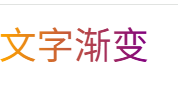
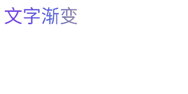

# 文字渐变

## 1. 基础渐变



```html
<!DOCTYPE html>
<html lang="en">
<head>
  <meta charset="UTF-8">
  <style>
    .text-gradient {
      background-image: linear-gradient(to right, orange, purple);
      -webkit-background-clip: text;
      color: transparent;
      font-size: 30px;
    }
  </style>
</head>
<body>
  <span class="text-gradient">文字渐变</span>
</body>
</html>
```


## 2. 基础渐变 + 动画



```html
<!DOCTYPE html>
<html lang="en">
<head>
  <meta charset="UTF-8">
  <style>
    .text-gradient {
      /* 明确渐变方向从左到右，添加更多颜色使过渡更自然 */
      background-image: linear-gradient(to right,  #8a2be2, #4169e1, #ff9a00, #ffd700);
      background-size: 200% 100%;
      -webkit-background-clip: text;
      background-clip: text; /* 标准属性，增强兼容性 */
      color: transparent;
      font-size: 30px;
      /* 延长动画时间，使用更平滑的缓动函数 */
      animation: gradientAnimation 3s cubic-bezier(0.45, 0, 0.55, 1) infinite;
    }

    @keyframes gradientAnimation {
      0% {
        background-position: 100% 50%;

      }
      100% {
        background-position: 0% 50%;

      }
    }
  </style>
</head>
<body>
  <span class="text-gradient">文字渐变</span>
</body>
</html>
```