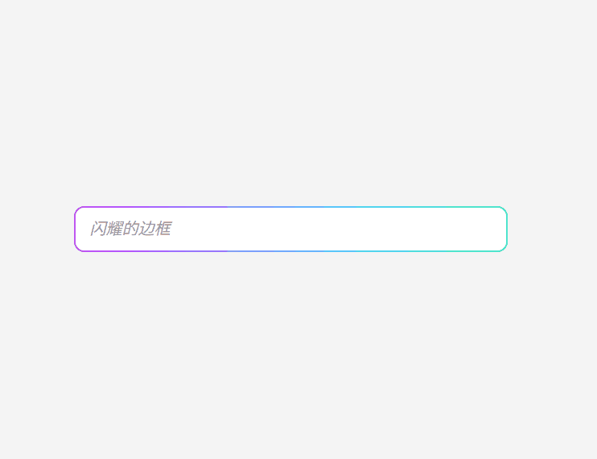

# 边框渐变


```html
<!DOCTYPE html>
<html lang="en">
<head>
  <meta charset="UTF-8">
  <style>
    /* 输入框容器 */
    .input-wrapper {
      display: flex;
      justify-content: center;
      align-items: center;
      height: 100vh;
      background-color: #f4f4f4;
    }
    
    /* 跑马灯输入框 */
    .marquee-input {
      width: 400px;
      height: 42px;
      padding: 0 14px;
      font-size: 16px;
      border: 2px solid transparent;
      border-radius: 10px;
      outline: none;
      color: #333;
      background: 
        linear-gradient(white, white) padding-box, 
        linear-gradient(270deg, 
                        #ff4d4d, #ffa64d, #ffff4d, #4dff88, 
                        #4dd2ff, #b84dff, #ff4da6, #ff4d4d
                       ) border-box;
      background-size: 400% 100%;
      background-repeat: repeat;
      background-position: 0 0;
      animation: marquee-border 6s linear infinite;
    
      transition: box-shadow 0.3s ease;
    }
    
    /* 动画关键帧 */
    @keyframes marquee-border {
      0% {
        background-position: 0% 0;
      }
      100% {
        background-position: 100% 0;
      }
    }
    
    /* placeholder 样式 */
    .marquee-input::placeholder {
      color: #999;
      font-style: italic;
    }
    
    /* hover + focus 时加点炫光效果 */
    .marquee-input:hover,
    .marquee-input:focus {
      box-shadow: 0 0 8px rgba(255, 77, 77, 0.3), 0 0 20px rgba(77, 210, 255, 0.4);
    }
    </style>
    
</head>
<body>
    <div class="input-wrapper">
        <input type="text" placeholder="闪耀的边框" class="marquee-input" />
      </div>
</body>
</html>
```