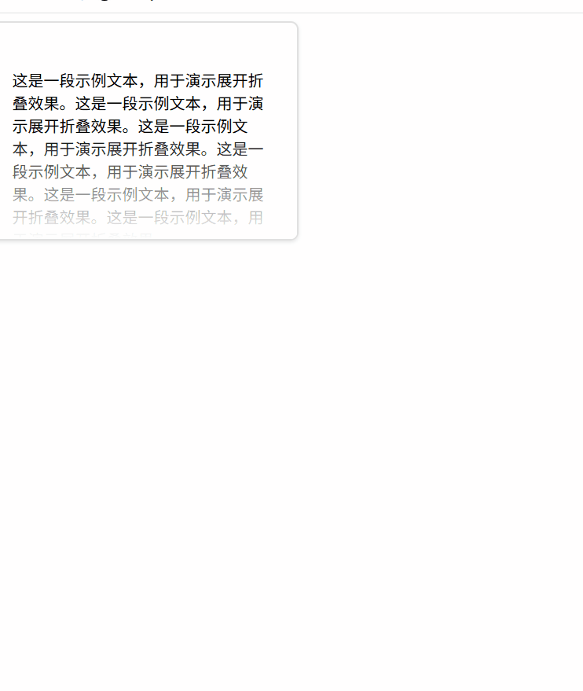
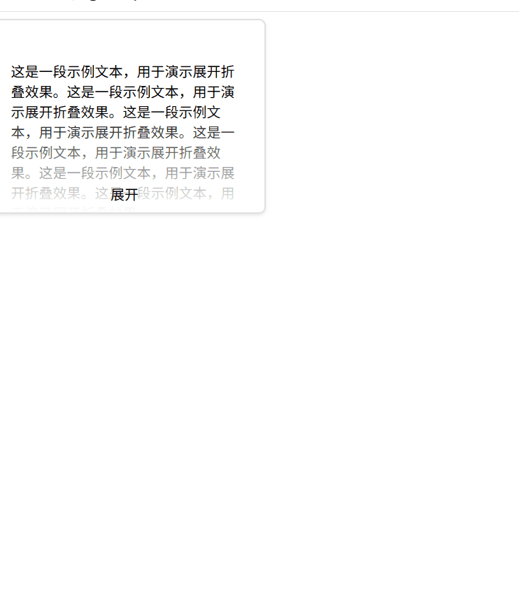

# 遮罩类

## 无回弹
### 0.点击蒙版之后直接隐藏蒙版 

```html
<!DOCTYPE html>
<html lang="en">

<head>
    <meta charset="UTF-8">
    <style>
        .content-container {
            width: 300px;
            position: relative;
            overflow: hidden;
            max-height: 200px;
            /* 初始最大高度，可按需调整 */
            transition: max-height 0.3s ease-in-out;
            /* 添加边框样式 */
            border: 2px solid #e0e0e0;
            /* 添加圆角 */
            border-radius: 8px;
            /* 添加阴影效果 */
            box-shadow: 0 2px 4px rgba(0, 0, 0, 0.1);
            /* 添加内边距 */
            padding: 10px;
        }

        .content {
            padding: 20px;
        }

        .mask {
            position: absolute;
            bottom: 0;
            left: 0;
            right: 0;
            height: 50%;
            background: linear-gradient(to bottom, rgba(255, 255, 255, 0), rgba(255, 255, 255, 1));
            cursor: pointer;
            /* 为遮罩的显示与隐藏添加过渡效果 */
            transition: opacity 0.3s ease-in-out;
        }

        .content-container.expanded {
            /* 设为较大值以确保内容全部显示 */
            max-height: 9999px;
        }

        .content-container.expanded .mask {
            /* 展开时隐藏遮罩 */
            opacity: 0;
            pointer-events: none;
        }
    </style>
</head>

<body>
    <!-- 核心代码：内容容器，包含内容和遮罩层 -->
    <div class="content-container">
        <!-- 核心代码：内容区域 -->
        <div class="content">
            <!-- 这里放置你的内容 -->
            <p>这是一段示例文本，用于演示展开折叠效果。这是一段示例文本，用于演示展开折叠效果。这是一段示例文本，用于演示展开折叠效果。这是一段示例文本，用于演示展开折叠效果。这是一段示例文本，用于演示展开折叠效果。这是一段示例文本，用于演示展开折叠效果。
            </p>
            <p>这是一段示例文本，用于演示展开折叠效果。这是一段示例文本，用于演示展开折叠效果。这是一段示例文本，用于演示展开折叠效果。这是一段示例文本，用于演示展开折叠效果。这是一段示例文本，用于演示展开折叠效果。这是一段示例文本，用于演示展开折叠效果。
            </p>
            <p>这是一段示例文本，用于演示展开折叠效果。这是一段示例文本，用于演示展开折叠效果。这是一段示例文本，用于演示展开折叠效果。这是一段示例文本，用于演示展开折叠效果。这是一段示例文本，用于演示展开折叠效果。这是一段示例文本，用于演示展开折叠效果。
            </p>
        </div>
        <!-- 核心代码：遮罩层 -->
        <div class="mask" id="mask"></div>
    </div>

    <script>
        // 核心代码：获取遮罩和容器元素
        const mask = document.getElementById('mask');
        const container = mask.parentElement;

        // 核心代码：为遮罩添加点击事件监听器，控制展开折叠状态
        mask.addEventListener('click', function () {
            container.classList.toggle('expanded');
        });
    </script>
</body>

</html>
```

## 有回弹
### 1. 点击蒙版 + 实现展开

```html
<!DOCTYPE html>
<html lang="en">
<head>
  <meta charset="UTF-8">
  <style>
    /* 核心代码：内容容器样式，控制展开折叠的关键 */
    .content-container {
      position: relative;
      overflow: hidden;
      max-height: 200px; /* 初始最大高度，可按需调整 */
      /* 控制展开折叠动画的过渡效果 */
      transition: max-height 0.05s cubic-bezier(0.4, 0, 0.2, 1); 

      /* 美化代码：添加边框样式 */
      width: 300px;

      border: 2px solid #e0e0e0;
      /* 美化代码：添加圆角 */
      border-radius: 8px;
      /* 美化代码：添加阴影效果 */
      box-shadow: 0 2px 4px rgba(0, 0, 0, 0.1);
      /* 美化代码：添加内边距 */
      padding: 10px;
    }

    /* 核心代码：内容区域样式 */
    .content {
      padding: 20px;
    }

    /* 核心代码：遮罩层样式，控制模糊效果和点击事件 */
    .mask {
      position: absolute;
      bottom: 0;
      left: 0;
      right: 0;
      height: 50%;
      background: linear-gradient(to bottom, rgba(255, 255, 255, 0), rgba(255, 255, 255, 1));
      cursor: pointer;
      /* 控制遮罩背景变化的过渡效果 */
      transition: background 0.05s cubic-bezier(0.4, 0, 0.2, 1); 
    }

    /* 核心代码：展开状态下容器的最大高度 */
    .content-container.expanded {
      max-height: 9999px; 
    }

    /* 核心代码：展开状态下遮罩层的背景样式 */
    .content-container.expanded .mask {
      background: rgba(255, 255, 255, 0);
    }
  </style>
</head>
<body>
  <!-- 核心代码：内容容器，包含内容和遮罩层 -->
  <div class="content-container">
    <!-- 核心代码：内容区域 -->
    <div class="content">
      <!-- 这里放置你的内容 -->
      <p>这是一段示例文本，用于演示展开折叠效果。这是一段示例文本，用于演示展开折叠效果。这是一段示例文本，用于演示展开折叠效果。这是一段示例文本，用于演示展开折叠效果。这是一段示例文本，用于演示展开折叠效果。这是一段示例文本，用于演示展开折叠效果。</p>
      <p>这是一段示例文本，用于演示展开折叠效果。这是一段示例文本，用于演示展开折叠效果。这是一段示例文本，用于演示展开折叠效果。这是一段示例文本，用于演示展开折叠效果。这是一段示例文本，用于演示展开折叠效果。这是一段示例文本，用于演示展开折叠效果。</p>
      <p>这是一段示例文本，用于演示展开折叠效果。这是一段示例文本，用于演示展开折叠效果。这是一段示例文本，用于演示展开折叠效果。这是一段示例文本，用于演示展开折叠效果。这是一段示例文本，用于演示展开折叠效果。这是一段示例文本，用于演示展开折叠效果。</p>
    </div>
    <!-- 核心代码：遮罩层 -->
    <div class="mask" id="mask"></div>
  </div>

  <script>
    // 核心代码：获取遮罩和容器元素
    const mask = document.getElementById('mask');
    const container = mask.parentElement;

    // 核心代码：为遮罩添加点击事件监听器，控制展开折叠状态
    mask.addEventListener('click', function() {
      container.classList.toggle('expanded');
    });
  </script>
</body>
</html>
```

### 2. 蒙版文字点击展开


```html
<!DOCTYPE html>
<html lang="en">

<head>
    <meta charset="UTF-8">
    <style>
        .content-container {
            width: 300px;
            position: relative;
            overflow: hidden;
            max-height: 200px;
            /* 初始最大高度，可按需调整 */
            transition: max-height 0.15s cubic-bezier(0.4, 0, 0.2, 1);
            border: 2px solid #e0e0e0;
            border-radius: 8px;
            box-shadow: 0 2px 4px rgba(0, 0, 0, 0.1);
            padding: 10px;
        }

        .content {
            padding: 20px;
        }

        .mask {
            position: absolute;
            bottom: 0;
            left: 0;
            right: 0;
            height: 50%;
            background: linear-gradient(to bottom, rgba(255, 255, 255, 0), rgba(255, 255, 255, 1));
            cursor: pointer;
            transition: background 0.15s cubic-bezier(0.4, 0, 0.2, 1);
            /* 新增：文字居中显示 */
            display: flex;
            justify-content: center;
            align-items: flex-end;
            padding-bottom: 10px;
        }

        .content-container.expanded {
            max-height: 9999px;
        }

        .content-container.expanded .mask {
            background: rgba(255, 255, 255, 0);
        }
    </style>
</head>

<body>
    <div class="content-container">
        <div class="content">
            <!-- 这里放置你的内容 -->
            <p>这是一段示例文本，用于演示展开折叠效果。这是一段示例文本，用于演示展开折叠效果。这是一段示例文本，用于演示展开折叠效果。这是一段示例文本，用于演示展开折叠效果。这是一段示例文本，用于演示展开折叠效果。这是一段示例文本，用于演示展开折叠效果。
            </p>
            <p>这是一段示例文本，用于演示展开折叠效果。这是一段示例文本，用于演示展开折叠效果。这是一段示例文本，用于演示展开折叠效果。这是一段示例文本，用于演示展开折叠效果。这是一段示例文本，用于演示展开折叠效果。这是一段示例文本，用于演示展开折叠效果。
            </p>
            <p>这是一段示例文本，用于演示展开折叠效果。这是一段示例文本，用于演示展开折叠效果。这是一段示例文本，用于演示展开折叠效果。这是一段示例文本，用于演示展开折叠效果。这是一段示例文本，用于演示展开折叠效果。这是一段示例文本，用于演示展开折叠效果。
            </p>
        </div>
        <!-- 新增：在蒙版内添加文字元素 -->
        <div class="mask" id="mask">
            <span id="toggleText">展开</span>
        </div>
    </div>

    <script>
        const mask = document.getElementById('mask');
        const container = mask.parentElement;
        const toggleText = document.getElementById('toggleText');

        mask.addEventListener('click', function () {
            container.classList.toggle('expanded');
            // 根据展开状态切换文字
            if (container.classList.contains('expanded')) {
                toggleText.textContent = '收起';
            } else {
                toggleText.textContent = '展开';
            }
        });
    </script>
</body>

</html>
```