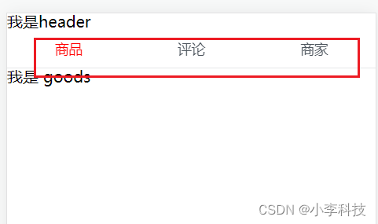
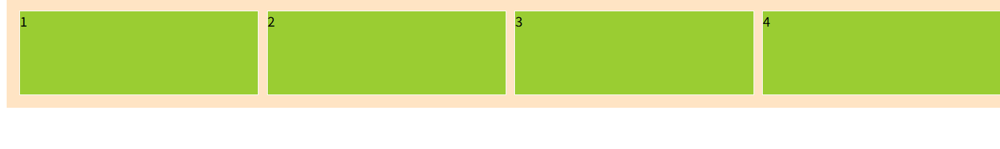

# Flex经典等分布局
## CSS 书写规范

+ 布局
+ 宽高
+ 对齐(水平/垂直)
+ 颜色/字体/背景色


+ display :     block/flex
+ width: xxx% ,xxx px
+ height: xxx px
+ line-height: xxx px





## flex 等分布局

::: warning
flexible 模型又被称为 flexbox，它不像栅格布局可以同时处理行跟列，只能处理单行或者当列，是一维的布局模型。它可以简便、完整且适应的实现页面各种布局，web网站页面一般用 em 或者 rem 单位(1em = 16px, 1rem = 10px)，小程序一般用 rpx 单位(1px = 2rpx)进行相对布局，特别的是字体能够放缩方便且自适应。flex 是我平常使用最多的布局，它适用的场景有很多，主要是用于比例分割居中显示，例如携程的移动页面或者淘宝网页的布局等。

特点：能够调整其子元素在不同的屏幕分辨率下用最适合的方法填充合适的空间。
优点：适应性强，容易上手，且很简便的完成很多页面布局效果，后期维护容易，若需求细微度不高，那么是很好的选择。
缺点：兼容性差，在低版本的浏览器有可能渲染不出效果（ie9及以上）。
注：弹性容器外及弹性子元素内是正常渲染的。弹性盒子只定义了弹性子元素如何在弹性容器内布局。弹性子元素通常在弹性盒子内一行显示。默认情况每个容器只有一行。

:::




```html
<!DOCTYPE html>
<html lang="en">

<head>
    <meta charset="UTF-8">
    <title>flex布局</title>
    <style>
        .flexbox {
            width: 100%;
            background: bisque;
            display: flex;
            flex-direction: row;
            justify-content: space-around;
            align-items: center;
            padding: 10px;
        }

        .flexbox div {
            /* width: 100px;
             */

            flex: 1;
            height: 100px;
            background-color: yellowgreen;
            border: 1px solid #fefefe;
            margin: 5px;
        }
    </style>
</head>

<body>
    <div class="flexbox">
        <div>1</div>
        <div>2</div>
        <div>3</div>
        <div>4</div>
    </div>
</body>

</html>
```


字体, 样式,  背景色

```html

<div class="tab">
      <div class="tab-item">
        <router-link to="/goods">商品</router-link>
      </div>
      <div class="tab-item">
        <router-link to="/ratings">评论</router-link>
      </div>
      <div class="tab-item">
        <router-link to="/seller">商家</router-link>
      </div>
    </div>
```

```css
@import './common/stylus/mixins.less';


.tab{
  // flex 三栏布局
  display: flex;
  width: 100%;
  height: 40px;
  line-height: 40px; 
  	// 调用该方法,
    // border-bottom: 1px solid rgba(7,17,27,0.1);
	// 解决下边框1px
  .border-1px(rgba(7,17,27,0.1));
  .tab-item{
    flex: 1;
    text-align: center;

	
    & > a{
      display: block; // 保证a 标签变为块级元素,撑满整个父容器
      font-size: 14px;
      color: rgb(77, 85, 93);

      &.active{// a 标签 active 时候的样式
        color: rgb(240,20,20);
      }
    }
  }
}
```


## 解决下边框1px 像素问题?
mixins?
定义一个css 方法
```css
.border-1px(@color;){
    position:relative;
    &:after{
        display:block;
        position:absolute;
        left:0;
        bottom:0;
        width:100%;
        border-top:1px solid @color;
        content:' ';
    }
}
```


