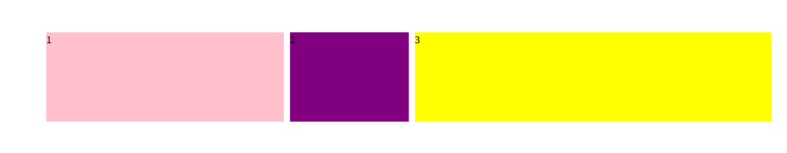
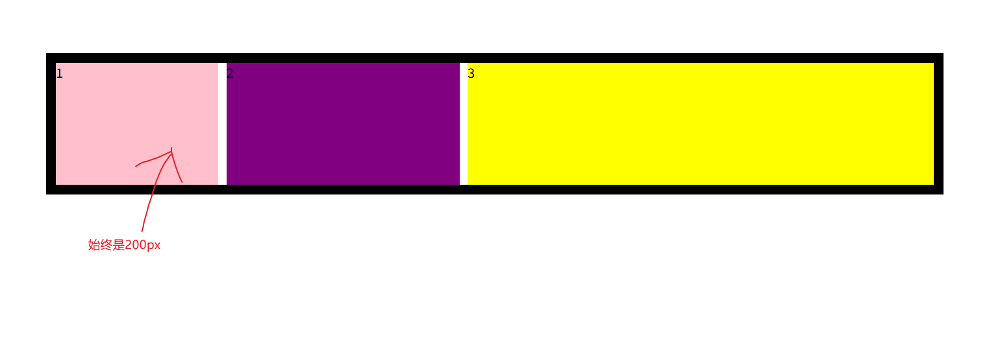
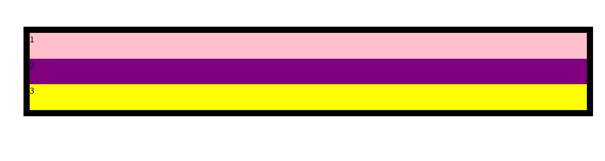
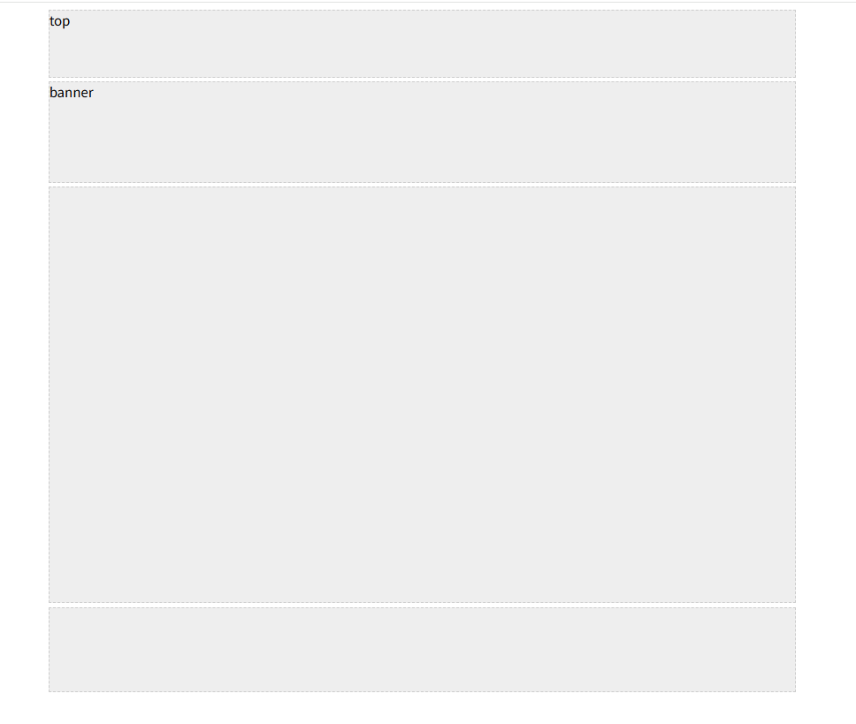

# 伸缩布局

## 1. 不定宽度



```html
<!DOCTYPE html>
<html lang="en">
  <head>
    <meta charset="UTF-8" />
    <meta name="viewport" content="width=device-width, initial-scale=1.0" />
    <meta http-equiv="X-UA-Compatible" content="ie=edge" />
    <title>Document</title>
    <style>
      section {
        width: 80%;
        height: 150px;
        margin: 100px auto;
        /* background-color: pink; */

        /* 父亲添加  伸缩布局 */
        display: flex;
      }

      section div {
        height: 100%;
        flex: 1; /* 孩子的份数 */
      }

      section div:nth-child(1) {
        background-color: pink;

        flex: 2; /* 这个盒子占两份 */
      }

      section div:nth-child(2) {
        margin: 0 10px;
        background-color: purple;

        /* 默认flex:1, 可以省略不写 */
        flex: 1;
      }

      section div:nth-child(3) {
        background-color: yellow;

        flex: 3;
      }
    </style>
  </head>
  <body>
    <section>
      <div>1</div>
      <div>2</div>
      <div>3</div>
    </section>
  </body>
</html>
```

## 2. 固定宽度 (固比模型)



```html
<!DOCTYPE html>
<html lang="en">
  <head>
    <meta charset="UTF-8" />
    <meta name="viewport" content="width=device-width, initial-scale=1.0" />
    <meta http-equiv="X-UA-Compatible" content="ie=edge" />
    <title>Document</title>
    <style>
      section {
        width: 80%;
        height: 150px;
        margin: 100px auto;

        border: .75em solid;
        /* background-color: pink; */

        /* 父亲添加  伸缩布局 */
        display: flex;
        flex-direction: row;
        min-width: 500px;/* 表示 section 标签最小宽度是500px,  不能无限制的小*/
        max-width: 1280px;/* 表示 section 标签最大宽度是1280px,  不能无限制的大*/
        

      }

      section div {
        height: 100%;
        /* flex: 1; 孩子的份数 */
      }

      section div:nth-child(1) {
        background-color: pink;

/* child1 是 200px , child2 ,child3 分 80%(父盒子的宽度) -200 的宽度 */
        width: 200px;
      }

      section div:nth-child(2) {
        margin: 0 10px;
        background-color: purple;
        flex:1
        /* 默认flex:1, 可以省略不写 */
      }

      section div:nth-child(3) {
        background-color: yellow;
        flex:2
      }
    </style>
  </head>
  <body>
    <section>
      <div>1</div>
      <div>2</div>
      <div>3</div>
    
    </section>
  </body>
</html>
```


## 3. 垂直分布
+ flex-direction: column;



```html
<!DOCTYPE html>
<html lang="en">
  <head>
    <meta charset="UTF-8" />
    <meta name="viewport" content="width=device-width, initial-scale=1.0" />
    <meta http-equiv="X-UA-Compatible" content="ie=edge" />
    <title>Document</title>
    <style>
      section {
        width: 80%;
        margin: 100px auto;
        height: 150px;
        border: .75em solid;
        /* background-color: pink; */

        /* 父亲添加  伸缩布局 */
        display: flex;
        flex-direction: column;/* 盒子垂直分布 */

        min-width: 500px;/* 表示 section 标签最小宽度是500px,  不能无限制的小*/
        max-width: 1280px;/* 表示 section 标签最大宽度是1280px,  不能无限制的大*/
        /* 
        flex布局 , 默认


        flex: 1; 
        flex-direction: row;
        
        */
        

      }

      section div {
        flex: 1; /* 孩子的份数 */
      }

      section div:nth-child(1) {
        background-color: pink;

/* child1 是 200px , child2 ,child3 分 80%(父盒子的宽度) -200 的宽度 */
      }

      section div:nth-child(2) {
        background-color: purple;
        /* 默认flex:1, 可以省略不写 */
      }

      section div:nth-child(3) {
        background-color: yellow;
      }
    </style>
  </head>
  <body>
    <section>
      <div>1</div>
      <div>2</div>
      <div>3</div>
    
    </section>
  </body>
</html>
```


## 4. 一列固定宽度且居中



```html
<!DOCTYPE html>
<html lang="en">
  <head>
    <meta charset="UTF-8" />
    <meta name="viewport" content="width=device-width, initial-scale=1.0" />
    <meta http-equiv="X-UA-Compatible" content="ie=edge" />
    <title>Document</title>
    <style>
      .top,
      .banner,
      .main ,
      .footer{
        width: 900px;
        background-color: #eee;
        border: 1px dashed #ccc;
        margin: 0 auto;
      }
      .top {
        /* width: 900px;
        background-color: #eee;
        border: 1px dashed #ccc;
        margin: 0 auto;
         */
        height: 80px;
      }
      .banner {
        /* width: 900px;
        background-color: #eee;
        border: 1px dashed #ccc; */
        height: 120px;
        /* margin: 0 auto; */
        margin: 5px auto;
      }
      .main {
       /*  width: 900px;
        background-color: #eee;
        border: 1px dashed #ccc; */
        height: 500px;
      }
      .footer {
/*         width: 900px;
        background-color: #eee;
        border: 1px dashed #ccc; */
        height: 100px;
        /* margin: 0 auto;
        margin-top: 5px; */
        margin: 5px auto 0;
      }
    </style>
  </head>
  <body>
    <!-- .top+.banner+.main+.footer -->
    <div class="top">top</div>
    <div class="banner">banner</div>
    <div class="main"></div>
    <div class="footer"></div>
  </body>
</html>
```