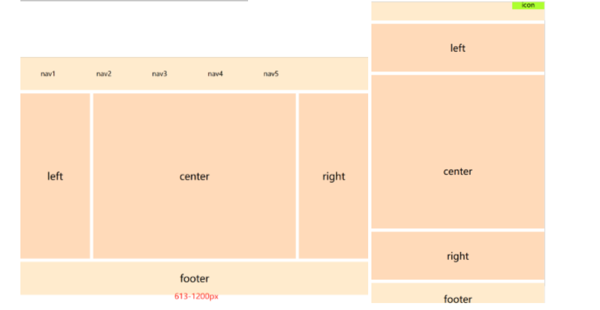

# 响应式

## CSS响应式

rem 适配长度, 设置根元素 html fontsize, 属性

1rem = 100px ,  先进行人为规定


```
方法一：@media + rem

方法二:手机淘宝 flexible.js

方法三：vw,vh进行适配
```

1. 通过 media-query 适配屏幕宽度

2. pc---bootstrap

   移动端, 计算

3. 如何根据设计稿件进行计算?

4. 如何自动计算?


## 1. pc端响应式尺寸

**常见节点划分:**

父容器版心的尺寸划分

超小屏幕（手机，小于 768px）：设置宽度为 100%
小屏幕（平板，大于等于 768px）：设置宽度为 750px
中等屏幕（桌面显示器，大于等于 992px）：宽度设置为 970px
大屏幕（大桌面显示器，大于等于 1200px）：宽度设置为 1170px
但是我们也可以根据实际情况自己定义划分如：

```css
 *{
            margin: 0;
            padding: 0;
 }
        @media screen and ( max-width : 768px) {
            .box{
                width : 100%;
                background-color: red;
            }
        }
        @media screen and (min-width:769px) and (max-width:992px){
            .box{
                width: 750px;
                margin: 0 auto;
                background-color: aqua;
            }
        }
        @media screen and (min-width:993px) and (max-width:1200px){
            .box{
                width: 970px;
                margin: 0 auto;
                background-color: green;
            }
        }
        @media screen and (min-width:1201px){
            .box{
                width: 1170px;
                margin: 0 auto;
                background-color: pink;
            }
        }


```


#### 如果不想自己去设置，那我们可以去使用Bootstrap这个框架。


## 2. 移动端响应式尺寸


```html
<!DOCTYPE html>
<html lang="en">

<head>
    <meta charset="UTF-8">
    <meta http-equiv="X-UA-Compatible" content="IE=edge">
    <meta name="viewport" content="width=device-width, initial-scale=1.0">
    <title>响应式布局</title>
    <style>
        @media only screen and (max-width:374px) {

            /* iphone5 或者更小尺寸, 以iphone5 宽度(320px) 比例设置 font-size */
            html {
                font-size: 86px;
            }

        }


        @media only screen and (min-width:375px) and (max-width:413px) {

            /* iphone6/7/8 iphone x */
            html {
                font-size: 100px;
            }

            /*100/x = 375/320*/

        }


        @media only screen and (min-width:414px) {

            /* iphone6p 或者更大尺寸, 以iphone6p的宽度(414px) 比例设置 font-size */
            html {
                font-size: 110px;
            }

        }

        body {
            font-size: 0.16rem;
        }

        .div1 {
            width: 1rem;
            background-color: #ccc;
        }
    </style>
</head>

<body>
    <div class="div1">
        this i div
    </div>
</body>

</html>
```


## 3. 响应式布局
:::tip
当时 Ethan Marcotte 提出这个自适应这个概念是为了能够解决移动端网页的问题。总结的来说就是创建多个静态布局，每个布局对应一个屏幕的分辨率范围，每个静态布局页面的元素大小不会因为窗口的改变而变化，除非从一个静态布局变到另外一个布局，不然在同一设备下还是固定的布局。常用的方式有使用 CSS 的 @media 媒体查询，也有高成本的 JS 进行设计开发，或者使用第三方开源框架 bootstrap，这个能够很好的支持多个浏览器。

特点：自适应多端，不同的分辨率下为固定布局，不会使元素大小发生变化。
优点：

对网站的复杂程度兼容性大。
测试容易，代码执行效率高，降低了开发者的页面开发成本代价。
在一定宽度范围内提供了稳定的视觉体验，增加用户体验。
缺点：对老旧或者非标准的浏览器兼容性较差，当对一个页面作出修改时，同时需要改变多种尺寸的布局，流程相对变得繁琐。
下面用的CSS媒体查询的方式来实现响应式布局：
:::



li 技巧： 如何变横排， 如何hover或者点击高亮 CSS, 块级元素，与a标签配合

```html
<!DOCTYPE html>
<html>
    <head>
        <meta charset="UTF-8">
        <title>自适应布局</title>
        <style>
            *{
                margin: 0px;
                padding: 0px;
            }
            #head, #foot, #main
            {
                height: 100px;
                width: 1200px;
                background-color: blanchedalmond;
                text-align: center;
                font-size: 30px;
                line-height: 100px;
                margin: 0 auto;
            }
            #head div{
                display: none;
                font-size: 20px;
                height: 30px;
                width: 100px;
                background-color: greenyellow;
                float: right;
                line-height: 30px;
                margin-top: 35px;
            }
            #head ul{
                width: 80%;
            }
            #head ul li{
                width: 20%;
                float: left;
                text-align: center;
                list-style: none;font-size: 20px;
            }
            #main{
                height: auto;
                margin: 10px auto;
                overflow: hidden;
            }
            .left, .center, .right{
                height: 500px;
                line-height: 500px;
                float: left;
                width: 20%;
                background-color: peachpuff;
            }
            .center{
                width: 60%;
                border-left: 10px solid #FFF;
                border-right: 10px solid #FFF;
                box-sizing: border-box;
            }
            @media only screen and (max-width: 1200px) {
                #head, #foot, #main{
                width: 100%;
                }
            }
            @media only screen and (max-width: 612px) {
                .left, .center, .right{
                    width: 100%;
                    display: block;
                    height: 150px;
                    line-height: 150px;
                }
                .center{
                    border: hidden;
                    border-top: 10px  solid #FFFFFF;
                    border-bottom: 10px solid #FFFFFF;
                    height: 500px;
                    line-height: 600px;
                }
                #head ul{
                    display: none;
                }
                #head div{
                    display: block;
                }
            }
        </style>   
    </head>
    <body>
        <div>
            <header id="head">
                <ul>
                    <li>nav1</li>
                    <li>nav2</li>
                    <li>nav3</li>
                    <li>nav4</li>
                    <li>nav5</li>
                </ul>
                <div>icon</div>
            </header>
            <section id="main">
                <div class="left">left</div>
                <div class="center">center</div>
                <div class="right">right</div>
            </section>
            <footer id="foot">footer</footer>
        </div>
    </body>
</html>
```

## 参考文章

https://juejin.cn/post/7078324788090896420