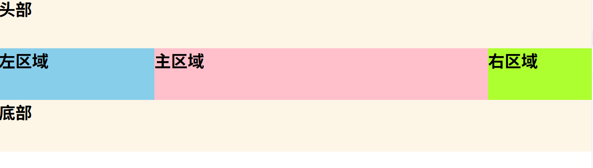
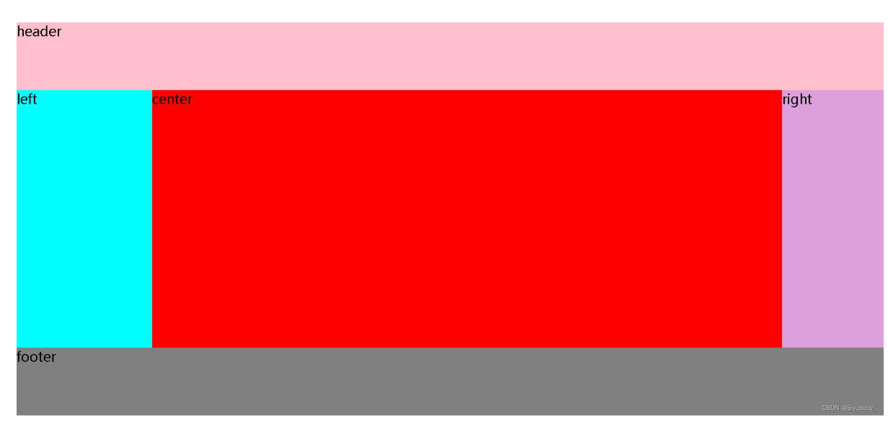
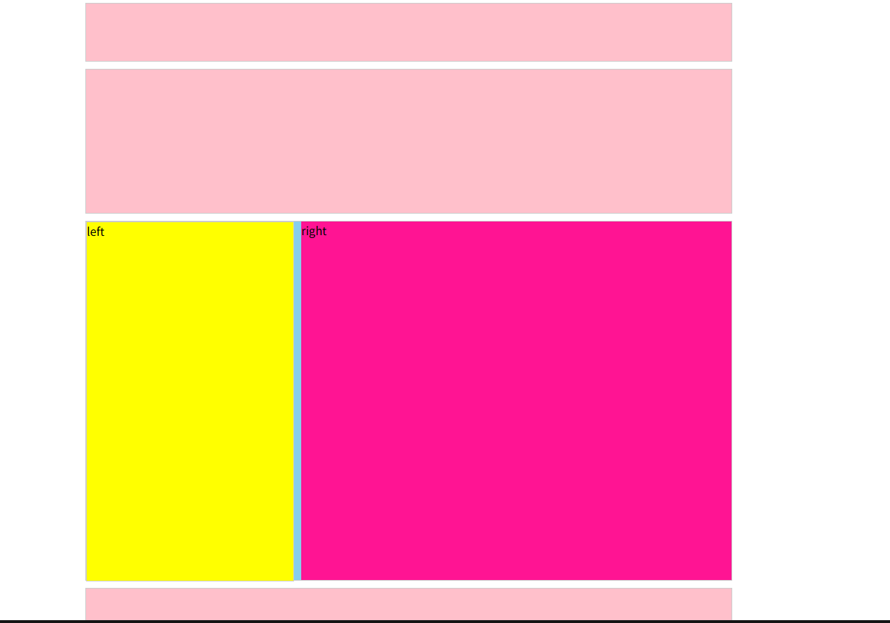

# 左右形结构

::: tip
圣杯布局和双飞翼布局都是三栏布局的典型布局。

1.为了保证页面渲染快，在写结构的时候，需要把中间盒子放在左右盒子的前面，中间一栏最先加载,渲染出来(主要内容)。

2.两侧内容宽度固定,中间自适应，盒子随着内容而撑开。
:::


::: warning
圣杯布局与双飞翼布局的优缺点：

圣杯布局优点：不需要添加再多添加一个dom节点（嵌套盒子） 缺点：正常情况下是没有问题的，但是特殊情况下，当中间部分宽度小于左盒子的时候 就会发生布局混乱。

双飞翼布局：优点：不会像圣杯布局那样变形，CSS样式代码更简洁 缺点：多加了一层dom节点。

:::


## 圣杯布局


通过浮动+定位+margin


```html
<!DOCTYPE html>
<html lang="en">
<head>
    <meta charset="UTF-8">
    <meta http-equiv="X-UA-Compatible" content="IE=edge">
    <meta name="viewport" content="width=device-width, initial-scale=1.0">
    <title>Document</title>
    <style>
        *{
            margin: 0;
            padding: 0;
        }
        .content{
            /* 给左盒子留位置 */
            padding-left: 300px;
            /* 给右盒子留位置 */
            padding-right: 200px;
            /* 父级添加overfloat属性 清除浮动 让父盒子拥有高度 */
            overflow: hidden;
        } 
        /* 三个盒子都要浮动 */
        .center,.left,.right{
            float: left;
        }
        .center{
            background-color: pink;
            /* 中间盒子宽度必须是百分之百 */
            width: 100%;
            height: 100px;
        }
        .left{
            background-color: skyblue;
            height: 100px;
            width: 300px;
            /* 重要理解 这里 margin-left是指当前左盒子的左边框相对于父盒子的右边框的距离*/
            margin-left: -100%;
            /* 重要理解 只有定位的属性才有left right 并且这个移动的方向是相反的*/
            right: 300px;
            /* 这个是相对于自身原来的位置 */
            position: relative;
        }
        .right{
            background-color: greenyellow;
            height: 100px;
            width: 200px;
            /* 重要理解: 因为父盒子设置了padding 因此可以直接不算左边的空白处*/
            margin-right: -200px;
        }
        footer{
           clear: both;
        }
        header,footer{
            background-color: oldlace;
            height: 100px;
        }
         
    </style>
</head>
<body>
    <header><h1>头部</h1></header>
    <div class="content">
        <div class="center"><h1>主区域</h1></div>
        <div class="left"><h1>左区域</h1></div>
        <div class="right"><h1>右区域</h1></div>
    </div>
    <footer><h1>底部</h1></footer>
</body>
</html>
```

## 双飞翼布局 (推荐)
通过浮动+margin




```html
 
<!DOCTYPE html>
<html lang="en">
<head>
    <meta charset="UTF-8">
    <meta http-equiv="X-UA-Compatible" content="IE=edge">
    <meta name="viewport" content="width=device-width, initial-scale=1.0">
    <title>Document</title>
    <style>
        *{
            margin: 0;
            padding: 0;
            font-size: 20px;
        }
        .header{
            width: 100%;
            height: 100px;
            background-color:pink;
        }
        .footer{
            width: 100%;
            height: 100px;
            background-color:gray;
        }
        .left,.right,.center{
            float: left;
            height: 380px;
        }
        .left{
            width: 200px;
            background-color: aqua;
            /* 将左盒子移动父级宽度的100% 与父级的左边框重合 */
            margin-left: -100%;
        }
        .right{
            width: 150px;
            background-color: plum;
            /* 将右盒子移动自身宽度的负距离 以达到右盒子右边界与父级右边界重合的效果*/
            margin-left:-150px;
        }
       
        .center{
            width: 100%;
            background-color: red;
        }
        .container{
            /* 给父级盒子清除浮动 让父盒子拥有高度*/
            overflow: hidden;
        }
        .content{
            /* margin:上右下左 设置左右距离 以腾出中间内容盒子的位置*/
            margin: 0 150px 0 200px;
        }
 
    </style>
</head>
<body>
    <div class="header">header</div>
    <!-- 主体部分 -->
    <div class="container">
        <!-- 中间 -->
        <div class="center">
            <!-- 嵌套盒子 与圣杯布局的不同之处-->
            <div class="content">center</div>
        </div>
        <!-- 左 -->
        <div class="left">left</div>
        <!-- 右 -->
        <div class="right">right</div>
    </div>
    <div class="footer">footer</div>
</body>
</html>
```

## 浮动实现 


``` html
<!DOCTYPE html>
<html lang="en">
  <head>
    <meta charset="UTF-8" />
    <meta name="viewport" content="width=device-width, initial-scale=1.0" />
    <meta http-equiv="X-UA-Compatible" content="ie=edge" />
    <title>Document</title>
    <style>

        /* 左右布局, 注意盒子宽度 , 进行加减
            border : 是两边, 要减去两次
         */
      .top,
      .banner,
      .main ,
      .foot{
        width: 900px;
        height: 80px;
        background-color: pink;
        margin: 0 auto;
        border: 1px solid #ccc;
      }
      .banner {
        height: 200px;
        margin-top: 10px;
      }

      .main {
        height: 500px;
        margin-top: 10px;
        background-color: skyblue;
      }

      .left {
        float: left;
        /* width: 300px; */
        /* width: 298px; */  /*  margin-left: 10px;  再减去 10px */
        width: 288px;

        height: 100%;
        background-color: yellow;
        border: 1px solid #ccc;
      }

      .right {
        /* float: left; */
        float: right;
        width: 600px;
        height: 100%;
        background-color: deeppink;
        margin-left: 10px;
      }

      .foot{
        margin-top: 10px;
        height: 120px;
      }
    </style>
  </head>
  <body>
    <!-- .top+.banner+(.main>.left+.right)+.foot -->
    <div class="top"></div>
    <div class="banner"></div>
    <div class="main">
      <div class="left">left</div>
      <div class="right">right</div>
    </div>
    <div class="foot"></div>
  </body>
</html>
```