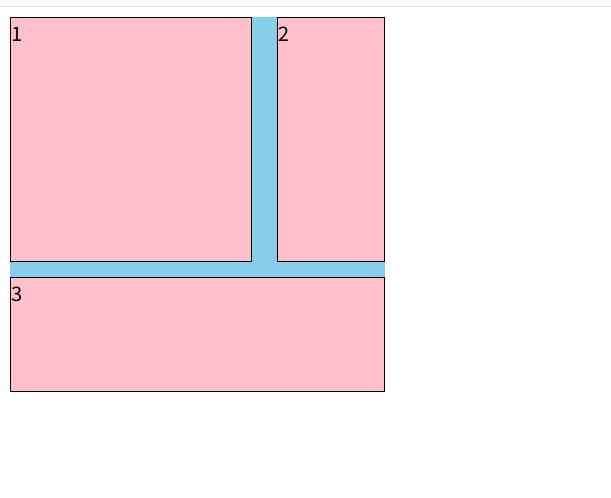

# 栅格布局
::: tip
栅格布局也被称为网格布局，它是一种新兴的布局方式，常用的有瀑布流（每列的项目高度是随机的，根据自身的内容而定，详细可以看这个）。栅格布局是二维的，包含了行和列，与弹性布局相似，栅格系统也是由栅格容器包裹栅格元素进行使用，且它的布局很简单，就是把一个区域划分为一个个的格子排列好，再把需要的元素填充进去。它的应用场景没有弹性布局和浮动布局多，因为有些浏览器对它的支持性较不好。详细可以看这位大佬的CSS栅格布局

特点：重视比例、秩序、连续感和现代感。以及对存在于版面上的元素进行规划、组合、保持平衡或者打破平衡，以便让信息可以更快速、更便捷、更系统和更有效率的读取；另外最重要的一点是，负空间的规划（即：留白）也是栅格系统设计当中非常重要的部分 ---wiki
优点：

能大大的提高网页的规范性和可重用性。在栅格系统下，固定和灵活的尺寸，这对于大型网站的开发和维护来说，能节约不少成本。
基于栅格进行设计，可以让整个网站各个页面的布局保持一致。这能增加页面的相似度，提升用户体验。
将多个项目放入网格单元格或区域中，可以部分重叠。
缺点：兼容性不好。
这里使用grip布局，还有跟 flex 和响应式结合等。
:::

## 等分


```html
<!DOCTYPE html>
<html lang="en">

<head>
    <meta charset="UTF-8">
    <title>栅格布局</title>
    <style>
        main {
            border: solid 5px gray;
            display: inline-grid;
            grid-template-rows: repeat(3, 100px);
            grid-template-columns: repeat(3, 100px);
        }

        main div {
            background: burlywood content-box;
            padding: 10px;
            border: 1px black dashed;
            text-align: center;
            line-height: 80px;
            color: #fff;
        }
    </style>
</head>

<body>
    <main>
        <div>1</div>
        <div>2</div>
        <div>3</div>
        <div>4</div>
        <div>5</div>
        <div>6</div>
        <div>7</div>
        <div>8</div>
        <div>9</div>
   </main>
</body>

</html>

```


## 不等分


```html
<!DOCTYPE html>
<html lang="en">
<head>
    <meta charset="UTF-8">
    <meta http-equiv="X-UA-Compatible" content="IE=edge">
    <meta name="viewport" content="width=device-width, initial-scale=1.0">
    <title>Document</title>
    <style>
        /* .main{
            width:300px;
            height:300px;
            background:skyblue;
            display: grid;
            grid-template-columns: 1fr 1fr 1fr;
            grid-template-rows: 1fr 1fr 1fr;
            grid-template-areas: 
            "a1 a1 a2"
            "a1 a1 a2"
            "a3 a3 a3";
        }
        .main div{
            background:pink;
            border:1px black solid;
            box-sizing: border-box;
        }
        .main div:nth-of-type(1){
            grid-area: a1;
        }
        .main div:nth-of-type(2){
            grid-area: a2;
        }
        .main div:nth-of-type(3){
            grid-area: a3;
        } */

        /* .main{
            width:300px;
            height:300px;
            background:skyblue;
            display: grid;
            grid-template-columns: 1fr 1fr 1fr;
            grid-template-rows: 1fr 1fr 1fr;
            grid-template-areas: 
            "a1 a2 a3";
        }
        .main div{
            background:pink;
            border:1px black solid;
            box-sizing: border-box;
        }
        .main div:nth-of-type(1){
            grid-area: a3;
        } */

        .main{
            width:300px;
            height:300px;
            background:skyblue;
            display: grid;
            /* grid-template-columns: 1fr 1fr 1fr;
            grid-template-rows: 1fr 1fr 1fr;
            grid-template-areas: 
            "a1 a1 a2"
            "a1 a1 a2"
            "a3 a3 a3"; */
            grid-template: 
            "a1 a1 a2" 1fr
            "a1 a1 a2" 1fr 
            "a3 a3 a3" 1fr
            / 1fr 1fr 1fr;
            gap: 20px 30px;
        }
        .main div{
            background:pink;
            border:1px black solid;
            box-sizing: border-box;
        }
        .main div:nth-of-type(1){
            grid-area: a1;
        }
        .main div:nth-of-type(2){
            grid-area: a2;
        }
        .main div:nth-of-type(3){
            grid-area: a3;
        }
    </style>
</head>
<body>
    <div class="main">
        <div>1</div>
        <div>2</div>
        <div>3</div>
    </div>
</body>
</html>
```