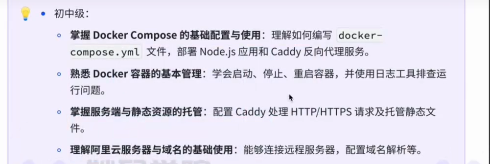

# Antd组件库设计

`https://github.com/ant-design/ant-design/blob/master/components/button/button.tsx`

`https://github.com/mantinedev/mantine/blob/master/packages/%40mantine/core/src/components/Button/Button.tsx`


## 开发过组件库吗， 请说明设计与开发思路？


### 架构设计

### 1. 业务架构
- 分层
    - rc-xxx, 基础组件， unstyled component 组件
    - 只具备功能交互不具备 UI表现
    - 样式体系， theming
    - 基础组件
    - 复合组件， Search, Input + Select, IconButton ，Icon + Button
    - 业务组件， 业务组件是有业务含义的

- 解耦
    - 对每个组件都定义样式， ts 类型， 基础操作，工具方法

-响应式设计
    - 媒体查询 media query, ResizeObserver, Grid.


### 状态管理
- 全局状态， 基础配置， 国际化配置， 主题配置，
  `React ----> Context, useSyncExternalStore`,
  `Vue   ----> vue demi`
- 局部状态， 设计在组件内部
    - 表单场景 （受控与非受控，  状态是否和表单值双向奔赴）
    -  input value={(v)=>setV} 受控组件
    - 非受控 
    - input defaultvalue={v}

### 样式体系与主题设计
- Color Tokens: 颜色色值系统， （antd, arco | mantineUI| mui| shadcn/ui(tailwindcss)）

- 样式模块化方案: CSS-IN-JS(弊端： 运行时候性能消耗， ssr 不好【emotion, styled-components】)，  module css

- 样式优先级与覆盖： 控制样式优先级

### 模块化
- 可复用性，对于props,events的设计非常重要，为什么input ,textarea 都需要value, onChange 成对
- 公共方法: 颜色计算函数， 格式化处理，本地化，工具函数处理---@ant-design/utils


### 开发流程

#### 本地开发
二次开发， antd 来做二次开发

#### 组件库开发流程
> mantinue ui 
+ `https://mantine.dev/`
+ `https://github.com/mantinedev/mantine`

1. 工程架构： monorepo, core + components + hooks + utils + shared

2. Typescript

3. 流程化，规范化， 自动化,
    + 1.  script(如何定义 ci cd的源头)，
    + 2. eslint9, stylelint, spellcheck,commitlint
    + 3. 颜色值的生成，自动构建，增量构建， 构建缓存

4. 构建打包：rollup，esbuild,swc
5. 测试，单元测试，vitest, jest + react-testing-library


#### 从0到1实现组件库的基础框架


- 技术选型与方案评审
- 包管理： pnpm workspace多包管理
- 语言选择： typescript
- 打包构建： rollup, esbuild
- 样式管理： css-in-js
- 组件设计： 模块化设计与分层
- 测试： jest + react-testing-library
- ci/cd
- 构建产物与发布

#### 更合适的方案
- 构建： esbuild
- 整体架构使用pnpm workspace改良
- 构建： nx,构建缓存与增量构建
- CI/CD： 流水线编排
- 文档发布： docker-compose 服务器编排部署


#### 初始化

```bash
$ npm init -y
```


#### 依赖选择

`package.json`
```json
{
  "name": "tiniui",
  "version": "1.0.0",
  "main": "index.js",
  "scripts": {
    "dev": "tsc --watch",
    "build": "tsc",
    "docs:dev": "dumi dev"
  },
  "keywords": [],
  "author": "",
  "license": "ISC",
  "description": "",
  "devDependencies": {
    "@types/react": "18.3.1",
    "@types/react-dom": "18.3.1",
    "@types/styled-components": "5.3.3",
    "dumi": "2.4.21",
    "styled-components": "5.3.3"
  },
  "peerDependencies": {
    "react": "18.3.1",
    "react-dom": "18.3.1",
    "styled-components": "5.3.3",
    "typescript": "5.6.3"
  }
}

```

#### ts配置

`tsconfig.json`
```json
{
    "compilerOptions": {
        "module": "esnext",
        "target": "es6",
        "jsx": "react",
        "declaration": true,
        "declarationDir": "./es/components/types",
        "outDir": "./es/components",
        // "outDir": "./dist",
        "moduleResolution": "node",
        "strict": true,
        "allowSyntheticDefaultImports": true
    },
    "include": ["src/**/*"]
}
```

```bash
$ pnpm i 
```


#### 实现一个基本的Button组件
`\src\components\Button\index.tsx`

```tsx
import React from "react";
import styled, { css } from "styled-components";
import "../../theme/style.css"; // 导入主题样式
import { ButtonSize, ButtonType } from "../../types/button";

// https://github.com/dL-hx/mantine/blob/master/packages/%40mantine/core/src/components/Button/Button.tsx


/**
 * 第一点：
 * 组件属性设置
 * 组件的事件设计
 * 组件的数据协议设计
 *
 * 定义Button组件属性接口
 */

interface ButtonProps extends Omit<React.ButtonHTMLAttributes<HTMLButtonElement>, "type"> {
  /** 按钮变体（样式类型） */
  type?: ButtonType;
  /** 按钮尺寸 */
  size?: ButtonSize;
  /** 加载状态（禁用交互并显示加载文本） */
  loading?: boolean; // 新增loading属性
}

// 创建加载状态小图标组件
const Spinner = styled.span`
  width: 12px;
  height: 12px;
  border: 2px solid currentColor;
  border-radius: 50%;
  border-top-color: transparent;
  animation: spin 1s linear infinite;
  margin-right: 8px;
  display: inline-block;
  vertical-align: middle;

  @keyframes spin {
    to { transform: rotate(360deg); }
  }
`;

// 创建样式化按钮组件 - 使用主题变量
const StyledButton = styled.button<ButtonProps>`
  padding: var(--spacing-sm) var(--spacing-md);
  border-radius: var(--border-radius-base);
  border: var(--border-width-base) solid var(--color-neutral-300);
  background-color: var(--color-white);
  color: var(--color-neutral-800);
  font-size: var(--font-size-base);
  cursor: pointer;
  transition: all 0.2s ease;

  &:hover {
    background-color: var(--color-neutral-100);
    border-color: var(--color-neutral-400);
  }

  &:active {
    background-color: var(--color-neutral-200);
  }

  // ... 可基于variant/size扩展样式逻辑
`;

/**
 * 第二点：
 * 根据不同的属性，求解不同组件的Ui 表现
 */
export const useStyle = (props: ButtonProps) => {
  const { type = "default", size = "md" } = props;
  const colorPrefix = type === "primary" ? "primary" : type;
  
  const sizeConfig = {
    sm: { padding: "var(--spacing-xs) var(--spacing-sm)", fontSize: "12px" },
    md: { padding: "var(--spacing-sm) var(--spacing-md)", fontSize: "var(--font-size-base)" },
    lg: { padding: "var(--spacing-md) var(--spacing-lg)", fontSize: "16px" },
  }[size];

  // 返回纯 CSS 字符串（而非 styled-components 的 css 模板）
  return `
    border-radius: var(--border-radius-base);
    border: var(--border-width-base) solid;
    cursor: pointer;
    transition: all 0.2s ease;
    padding: ${sizeConfig.padding};
    font-size: ${sizeConfig.fontSize};
    background-color: var(--color-${colorPrefix}-500);
    border-color: var(--color-${colorPrefix}-500);
    color: ${type === "default" ? "var(--color-default-800)" : "white"};

    &:hover {
      background-color: var(--color-${colorPrefix}-600);
      border-color: var(--color-${colorPrefix}-600);
    }

    &:active {
      background-color: var(--color-${colorPrefix}-700);
    }
  `.replace(/\s+/g, ' ').trim(); // 压缩空格，避免多余换行
};


/**
 * 第三点：
 * 组件的本体
 */
export const Button = (props: ButtonProps) => {
  const { loading } = props;
  const styles = useStyle(props); 
  
  return (
    <StyledButton 
      style={{ cssText: styles }} 
      disabled={loading} // 加载时禁用按钮
    >
      {loading && <Spinner />} {/* 加载状态显示小图标 */}
      {props.children || 'default'} {/* 保持原有文字不变 */}
    </StyledButton>
  );
};

export default Button;

```


`src\theme\style.css`
```css
/* 为项目定义theme，放到src/theme/style.css, 基础样式放到其中，形成对应颜色色阶， */


/* 基础主题变量 - 颜色色阶与基础样式 */
:root {
  /* 主色调色阶 - 蓝色系 */
  --color-primary-100: #e6f7ff;
  --color-primary-200: #b3e0ff;
  --color-primary-300: #80c8ff;
  --color-primary-400: #4db0ff;
  --color-primary-500: #1a98ff; /* 基础主色 */
  --color-primary-600: #0080e6;
  --color-primary-700: #0066b3;
  --color-primary-800: #004d80;
  --color-primary-900: #00334d;

  /* 辅助色调色阶 - 灰色系列 */
  --color-default-100: #f9f9f9; /* 最浅灰 */
  --color-default-200: #f0f0f0;
  --color-default-300: #e0e0e0;
  --color-default-400: #d0d0d0;
  --color-default-500: #c0c0c0; /* 基础辅助色（中性灰） */
  --color-default-600: #a0a0a0;
  --color-default-700: #808080;
  --color-default-800: #606060;
  --color-default-900: #404040; /* 最深灰 */


  /* 功能色 */
  --color-success: var(--color-default-500);
  --color-warning: #ed8936;
  --color-error: #e53e3e;
  --color-info: var(--color-primary-500);

  /* 基础样式变量 */
  --font-family-base: 'Inter', system-ui, sans-serif;
  --font-size-base: 14px;
  --line-height-base: 1.5;
  --border-radius-base: 4px;
  --border-width-base: 1px;
  --spacing-xs: 4px;
  --spacing-sm: 8px;
  --spacing-md: 16px;
  --spacing-lg: 24px;
  --spacing-xl: 32px;
}

/* 基础样式重置与设置 */
* {
  box-sizing: border-box;
  margin: 0;
  padding: 0;
}

body {
  font-family: var(--font-family-base);
  font-size: var(--font-size-base);
  line-height: var(--line-height-base);
  color: var(--color-neutral-800);
  background-color: var(--color-neutral-50);
}

```

`src\types\button.ts`
```ts
/**
 * Button Component
 */

/**
 * size of the Button
*/

export type ButtonSize = 'sm' | 'md' | 'lg';

export type ButtonType = 'primary'  | 'default' | 'success' | 'danger';

```
#### 组件库文档编写

`docs`

```md
---
title: 迷你组件库
demo:
    cols: 2

---

## 迷你组件库

`https://d.umijs.org/guide/write-demo`
`https://d.umijs.org/config/markdown`

- Button

```jsx
import React from 'react';

export default () => <h1>Hello dumi!</h1>;
```

```jsx
import React from 'react';
import {Button} from '../src/components/Button';

export default () => <Button type="primary">Hello dumi!</Button>;
```


```jsx
import React from 'react';
import {Button} from '../src/components/Button';

export default () => <Button type="primary" loading>Hello dumi!</Button>;
```


<code src="../src/components/Button/index.tsx"></code>


- Input 

- Tag


```
```


### 组件库发布
```bash
$   pnpm build
$   pnpm publish
```

### 组件库文档的发布
选择docker, nginx静态资源托管的方式进行处理发布
```yml
# docker-compose.yml
services:
    miaoma-ui-docs:
        image: nginx:lastest
        container_name: miaoma-ui-docs
        ports:
            - 80:80
        volumes:
            - ./:/app
```

用下面这行命令启动容器，文档就可以本地查看了
> 如何启动镜像服务？

```bash
$ docker compose -f docker-compose.yml up  -d
```

### 版本号管理
使用`np`进行管理版本号


