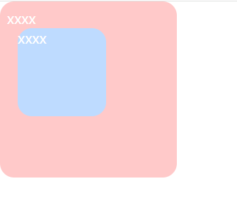
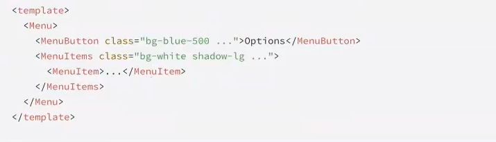
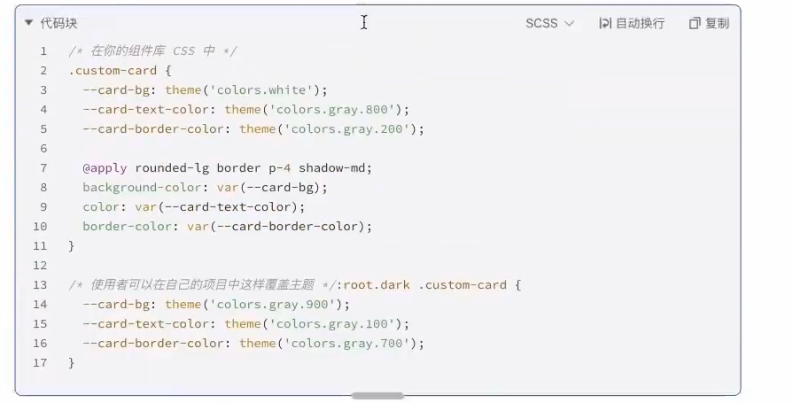
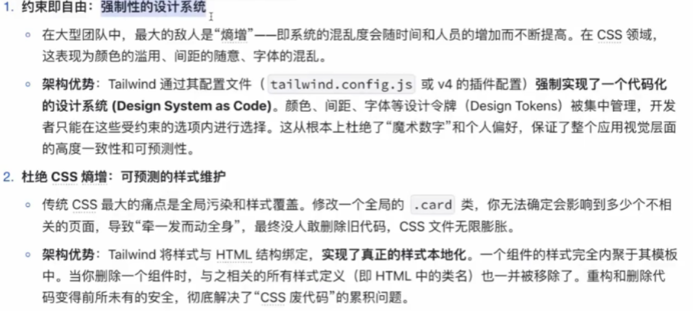
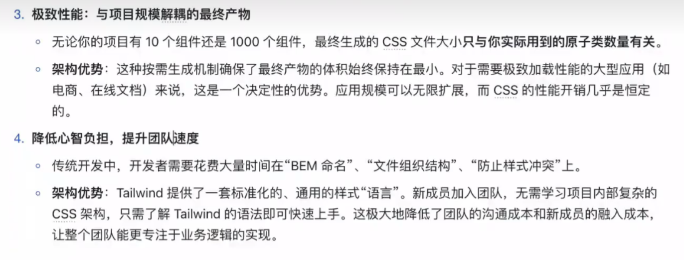

# Tailwind踩坑实录


## 一 Tailwind CSS 基础
### 1.1 有了解过那些样式实现方案？ 为什么 AI 产品都选择 Tailwind CSS 作为样式方案 ？
### 主流样式体系方案

- 手写原生 CSS & CSS 预处理器 （Sass / Less）
- cssinjs (styled-components, emotion)
  - 优势：
    - 组件化： 样式与组件逻辑内聚，方便复用和维护
    - 动态样式：可以方便地基于组件的 props 或 state 动态改变样式
  - 问题：
    - 运行时开销： 需要在运行时解析 JS 并生成 CSS ，带来一定的性能损耗
    - 心智负担： 在JS 和 CSS 之间切换语法， 需要学习特定库的API

- 原子化CSS（Tailwind CSS）
  - 核心思想： 你不再为组件编写专门的CSS 类，而是在HTML中组合这些原子类来构建样式

```html
<!-- 原 CSS 实现 -->
<button class="btn-primary"> Submit</button>

<style>
  .btn-primary {
   background-color: #3b82f6;
   color: #fff;
   padding: 8px 16px;
   border-radius: 4px;
  }

</style>
<!-- Tailwind CSS 实现 -->
<button class="bg-blue-500 text-white py-2 px-4 rounded">
  Submit
</button>
```

  - 优势：
    - 无需思考命名： 从根本上消除了为 class 命名的烦恼
    - 无需切换文件： 样式和结构在一起，开发心流不会被打断
    - 极致的性能： 通过 PurgeCSS 等工具，在构建时扫描样式文件，只讲用到的原子类，
    打包到最终的CSS文件中，体积通常只有几 KB
    - 约束与一致性：所有的样式都来自于预设的 desigin tokens (在tailwind.config.js中定义)，
    保证了整个项目视觉上的一致性

### 1.2 为什么 AI时代 ，Tailwind CSS 更受欢迎？
- 追求极致的开发和迭代速度
- 专注功能，而非繁琐的样式细节
- 与现代前端框架的完美契合
- AI 场景下的明星产品案例
  - OpenAI 的 ChatGPT: 其简洁，响应迅速的对话界面，大量使用 Tailwind CSS 来实现布局和样式
  - Vercel AI Playground ： 作为前端领域的技术领导者，其推出的AI 产品与模板库，官方首选Tailwind CSS
  - Hugging Face: 组件与布局深度契合Tailwind CSS

### 1.3 说说 Tailwind CSS 工程初始化，内核，工具体系完整内容，详细说明在业务，组件库场景的应用？
- https://vitejs.cn/vite3-cn/config/#async-config

- https://tailwindcss.com/docs/background-color


```shell
$ npx pnpm create vite 1.basic --template=vanilla-ts
$ pnpm i
$ cd 1.basic
```

#### 初始化

- node:  20.19.0

- tailwindcss :  4.x

安装依赖：

```
    "tailwindcss":"4.1.8",
    "@tailwindcss/vite":"4.1.8"
```


直接去样式主入口中引入 tailwindcss

`src\style.css`

```
@import "tailwindcss";
```

`vite.config.js`

```js
import { defineConfig } from 'vite'
import tailwindcss from '@tailwindcss/vite'

export default defineConfig({
  plugins: [tailwindcss()],
  server:{
    port:5273,
  }
})
```


#### 核心概念
##### 使用原子类进行样式设置
每个类名代表一个 单一，不可再分的CSS属性
- font-bold 对应 font-weight:700;
- text-center 对应 text-align: center;
- p-4 对应 padding: 1rem
- flex 对应 display: flex
- `-mt-8` 对应  距顶-8rem
- `p-0 px-0 x 表示左右; `
- `py-0 y 表示上下 `


这种模式可以**在HTML中完成所有样式工作**，提高开发体验




```html
<!doctype html>
<html lang="en">

<head>
  <meta charset="UTF-8" />
  <link rel="icon" type="image/svg+xml" href="/vite.svg" />
  <meta name="viewport" content="width=device-width, initial-scale=1.0" />
  <title>web</title>
</head>

<body>
  <div id="app"></div>
  <!-- <div class="bg-red-200 text-white w-[200px] h-[200px]">xxxx</div> -->
  <div class="bg-red-200 text-white size-[200px] relative  rounded-[16px] p-[8px] hover:bg-violet-600">
    xxxx
    <div class="bg-blue-200 size-[100px] absolute top-[30px] left-[20px] rounded-[16px]">
      xxxx
    </div>
  </div>
  <script type="module" src="/src/main.ts"></script>
</body>

</html>
```

1. flex
flex 类用于创建一个弹性容器，使你可以轻松控制子元素的对齐和间距。可以将其与 justify-center 和 items-center 等类搭配使用，以实现精确的对齐。


```html
<div class="flex justify-center items-center">
  Hello, Tailwind!
</div>
```


2. grid
grid 类用于创建一个网格容器，提供了一种强大的方式来设计响应式布局。你可以将其与 grid-cols-2、grid-cols-3 等类搭配使用，以定义列数。


```html
<div class="grid grid-cols-3 gap-4">
  <div>Item 1</div>
  <div>Item 2</div>
  <div>Item 3</div>
</div>
```


3. p 和 m（内边距和外边距）
内边距（p）和外边距（m）类使间距调整变得简单。例如，p-4 添加内边距，m-4 添加外边距。


```html
<div class="p-4 m-4">
  这个盒子有内边距和外边距。
</div>
```


4. bg（背景）
bg 类允许你设置背景颜色。你可以使用预定义的颜色，如 bg-red-500，或渐变，如 bg-gradient-to-r。


```html
<div class="bg-green-500 text-white p-4">
  成功消息！
</div>
```


5. text（排版）
text 类对于控制字体大小、颜色和对齐至关重要。例如，text-xl 使文本变大，text-center 使其居中。


```html
<h1 class="text-xl text-center">
  欢迎使用 Tailwind
</h1>
```


6. rounded（圆角）
rounded 类用于为元素添加圆角。你可以使用 rounded-lg 或 rounded-full 等修饰符来调整圆角半径。

```html

```


7. shadow（阴影）
使用 shadow 类为设计添加深度。你可以使用 shadow-md 或 shadow-lg 等变体来实现不同的阴影强度。


```html
<div class="shadow-lg p-4">
  带阴影的盒子
</div>
```


8. h 和 w（高度和宽度）
使用 h（高度）和 w（宽度）类来控制元素的尺寸。例如，h-64 设置高度，w-full 使元素占据整个宽度。

```html
<div class="h-64 w-full bg-blue-500">
  尺寸盒子
</div>


```


9. flex-wrap 和 gap
flex-wrap 类确保弹性容器中的项目在必要时换行。gap 类在项目之间添加一致的间距。

```html
<div class="flex flex-wrap gap-4">
  <div>Item 1</div>
  <div>Item 2</div>
  <div>Item 3</div>
</div>

```


10. hover（悬停状态）
Tailwind 使得定义悬停状态变得简单。例如，hover:bg-blue-700 在用户悬停在元素上时改变背景颜色。

```html
<button class="bg-blue-500 hover:bg-blue-700 text-white p-2">
  悬停我
</button>
```


#### 色值体系
https://tailwindcss.com/docs/colors

1. `@apply`用法
```html
<div class="miaoma-btn">btn</div>

<style>
.miaoma-btn{
  @apply bg-blue-200 size-[100px] absolute top-[30px] left-[20px] rounded-[16px]
}
</style>
```

2. `@utility @theme`用法
+ https://tailwindcss.com/docs/theme

```html
<div class="miaoma-btn-green">btn</div>


<div class="text-shadow-green">有绿色阴影的文字</div>
<button class="btn-miaoma">btn</button>

<style>
@theme {
  --color-primay-green: #28a745;
  --color-primay-yellow: #ffc107;
  --color-primay-red: #dc3545;
}


@utility btn-miaoma{
  background: black;
  @variant dark{/* 暗黑模式 */
    background: gray;
  }
}


@utility miaoma-btn-*{
  background-color: --value(--color-primay-*);
}


@utility text-shadow-* {
  text-shadow: 2px 2px 4px --value(--color-primay-*);
}
</style>
```


### 1.4 业务与组件库场景实战应用
**在业务系统中的应用（追求效率与一致性）**

在开发内部后台、管理仪表盘或面向用户的Web应用时，效率和一致性是首要目标。

+ 1.**95%的场景直接使用工具类**：对于页面布局、卡片、表单等，直接在Vue组件的模板中组合工具类。这是最
快、最直观的方式。
+ 2.**封装可复用组件**：将高频出现的UI 模式(如Button，Card，Input，Modal）封装成Vue组件。样式（工
具类）写在组件内部，对外只暴露props。这样整个应用的视觉风格由这些基础组件决定，高度统一。
+ 3.**配置文件是唯一真相来源（SingleSourceofTruth）**：将公司的品牌色、标准间距、字体规范等全部定义
在vite.config·js的tailwindcss插件配置中。所有开发者都基于此进行开发，从根本上保证了UI的
一致性。
+ 4.**@apply用于特殊场景**：比如，对于从富文本编辑器生成的、无法直接修改HTML结构的内容，可以定义一个
`.prose`样式的类来统一渲染。

### 1.5 在通用组件库中的应用（追求灵活性与可扩展性）
开发一个给别人使用的组件库时，思路需要转变。你的目标不是定死样式，而是提供一个**无头（Headless)或易于主题化**的骨架。

#### 无头组件 (Headless UI)模式:
这是最灵活的方式。你的组件库只提供功能和状态管理，完全不提供任何样式。

+ **实现方式**：组件通过**作用域插槽（scopedslots）** 将内部状态和方法暴露出去，让使用者自己决定用什么
HTML标签和Tailwind类来渲染。

**例子**：**HeadlessUI库就是这种模式的典范。它提供了一个Menu组件，但按钮和下拉项长什么样完全由你决定。**




### 可主题化(Themable)模式：
> 提供一套默认样式，但允许使用者轻松地进行覆盖和定制。
+ **实现方式**
+ 使用@apply为组件定义一套基础的、结构化的class。
+ 将关键的可变样式（如颜色、边框、背景）通过**CSS自定义属性（CSSVariables）**暴露出来。
+ 使用者不需要修改你的组件库源码，只需要在自己的项目中覆盖这些CSS变量，就能实现主题切换（比如
暗黑模式）。




```html
<button class="btn-miaoma">btn</button>

<style>
@utility btn-miaoma{
  background: black;
  @variant dark{/* 暗黑模式 */
    background: gray;
  }
}

</style>
```

**这种方式在提供开箱即用体验的同时，也保留了高度的灵活性，是许多现代组件库（如shadcn/ui）采用的核心用法**


### `vue项目中使用`
```shell
$ pnpm create vite 2.vue --template vue-ts
$ cd 2.vue
$ pnpm i
```

安装依赖：

```
    "tailwindcss":"4.1.8",
    "@tailwindcss/vite":"4.1.8"
```


直接去样式主入口中引入 tailwindcss

`src\style.css`

```
@import "tailwindcss";
```

`vite.config.js`

```js
import { defineConfig } from 'vite'
import vue from '@vitejs/plugin-vue'
import tailwindcss from '@tailwindcss/vite';

// https://vite.dev/config/

export default defineConfig({
  plugins: [vue(), tailwindcss()],
})

```


### `react项目中使用`
```shell
$ pnpm create vite 3.react --template react-ts
$ cd 3.react
$ pnpm i
```

安装依赖：

```
    "tailwindcss":"4.1.8",
    "@tailwindcss/vite":"4.1.8"
```


直接去样式主入口中引入 tailwindcss

`src\style.css`

```
@import "tailwindcss";
```

`vite.config.js`

```js
import { defineConfig } from 'vite'
import react from '@vitejs/plugin-react'
import tailwindcss from '@tailwindcss/vite';

// https://vite.dev/config/
export default defineConfig({
  plugins: [react(), tailwindcss()],
})

```


### 1.6 站在前端架构的角度，详细说说 Tailwind CSS 框架优势及原理， 如何从0到1 构建Tailwind 及组件库生态？





## 二 Tailwind CSS 进阶


## 三 AI时代 Tailwind CSS 最佳实践

## 四 Tailwind CSS 组件封装实战


