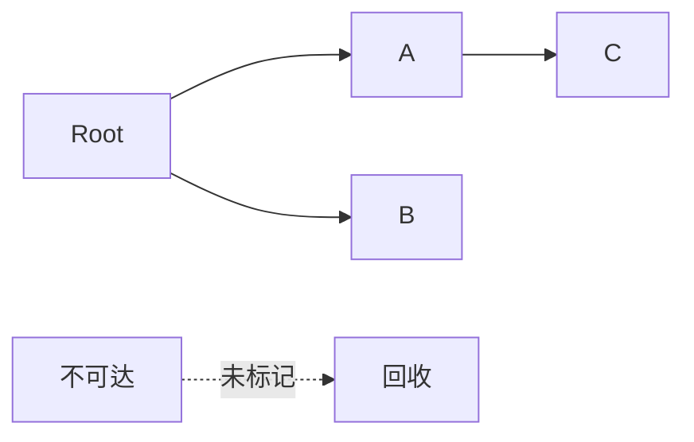

# JavaScript 性能优化

> 本文档系统讲解 JavaScript 的内存管理与垃圾回收机制、性能监控与内存分析方法、代码优化基础，以及执行上下文与深度优化技巧，帮助你编写高性能、低内存占用的前端代码。

## 目录

- 一、内存管理与垃圾回收机制
  - 1.1 课程概述
  - 1.2 内存管理
  - 1.3 JavaScript 中的垃圾回收
  - 1.4 GC 算法介绍
  - 1.5 引用计数算法实现原理
  - 1.6 引用计数算法优缺点
  - 1.7 标记清除算法实现原理
  - 1.8 标记清除算法优缺点
  - 1.9 标记整理算法实现原理
  - 1.10 常见 GC 算法总结
  - 1.11 认识 V8 垃圾回收策略
  - 1.12 V8 垃圾回收策略
  - 1.13 V8 如何回收新生代对象
  - 1.14 V8 如何回收老生代对象
  - 1.15 V8 垃圾回收总结
- 二、性能监控与内存分析
  - 2.1 Performance 工具介绍
  - 2.2 内存问题的体现
  - 2.3 监控内存的几种方式
  - 2.4 任务管理器监控内存
  - 2.5 Timeline 记录内存
  - 2.6 堆快照查看分析（DOM）
  - 2.7 判断是否存在频繁 GC
  - 2.8 Performance 总结
- 三、代码优化基础
  - 3.1 代码优化介绍
  - 3.2 避免全局变量（上）
  - 3.3 避免全局变量（下）
  - 3.4 避免循环引用
  - 3.5 采用字面量替换 New 操作
  - 3.6 使用 setTimeout 替换 setInterval
  - 3.7 采用事件委托
  - 3.8 合并循环变量和条件
  - 3.9 数组循环优化
  - 3.10 使用文档碎片替代多次 append
  - 3.11 使用 clone 替代 create
  - 3.12 innerHTML 创建 DOM
- 四、执行上下文与深度优化
  - 4.1 JSBench 使用
  - 4.2 堆栈中的 JS 执行过程
  - 4.3 减少判断层级（一）
  - 4.4 减少作用域链查找层级
  - 4.5 减少数据读取次数
  - 4.6 字面量与构造式
  - 4.7 减少循环体中的 JS 执行过程
  - 4.8 减少判断层级（二）
  - 4.9 惰性函数与性能
  - 4.10 采用事件委托（进阶）

---

## 一、内存管理与垃圾回收机制

### 1.1 课程概述

本节聚焦 JavaScript 性能的两大根基：**内存管理**（避免泄漏与不合理占用）与**代码执行效率**。掌握浏览器（尤其 V8）的垃圾回收（GC）机制后，才能有的放矢地进行性能优化与问题定位。

### 1.2 内存管理

程序运行需要占用内存，内存生命周期通常分为三步：

1. **分配**：声明变量、创建对象时由引擎分配内存。
2. **使用**：读写变量、操作对象。
3. **释放**：不再使用的内存被回收，交还系统。

JavaScript 中内存的分配与释放由引擎自动完成（自动垃圾回收），开发者无法直接 `free`，但理解其原理可避免写出导致内存无法释放的代码。

### 1.3 JavaScript 中的垃圾回收

JavaScript 使用**自动垃圾回收**机制：引擎周期性地找出"不再被引用"的对象并释放其内存。

- 所谓"垃圾"，即没有任何引用指向的对象（不可达）。
- 不同引擎实现不同算法，主流浏览器（Chrome/V8、Safari/JSCore）采用不同策略。

### 1.4 GC 算法介绍

常见的垃圾回收算法包括：

- **引用计数（Reference Counting）**
- **标记清除（Mark-Sweep）**
- **标记整理（Mark-Compact）**

V8 等现代引擎通常会**组合多种算法**，并分代（新生代 / 老生代）处理。

### 1.5 引用计数算法实现原理

每个对象记录"被引用的次数"：

- 当对象被变量、属性、参数引用时，引用数 +1。
- 当引用被移除（变量重新赋值、属性删除、离开作用域）时，引用数 -1。
- 引用数变为 **0** 时，立即回收该对象。

```javascript
let a = { name: 'obj' }   // 引用计数 = 1
let b = a                 // 引用计数 = 2
a = null                  // 引用计数 = 1
b = null                  // 引用计数 = 0 → 可被回收
```

### 1.6 引用计数算法优缺点

**优点**：

- 回收及时，对象变为垃圾可立即释放，无需等待 GC 周期。
- 实现简单，内存释放时间点可预期。

**缺点**：

- **循环引用无法回收**——两个对象互相引用，即使外部已不可达，引用计数仍不为 0，造成内存泄漏。

```javascript
function leak() {
  const a = {}
  const b = {}
  a.ref = b
  b.ref = a   // 互相引用，计数永不为 0
}
```

- 维护引用计数开销大，现代主流引擎已弃用该算法作为主回收方案。

### 1.7 标记清除算法实现原理

现代引擎（如 V8）的主流算法，分两步：

1. **标记（Mark）**：从"根对象"（Root，如全局对象、当前执行上下文的变量）出发，递归遍历所有可达对象，标记为"存活"。
2. **清除（Sweep）**：遍历堆中所有对象，将未被标记的对象回收。



### 1.8 标记清除算法优缺点

**优点**：

- 解决了循环引用问题——只要从根不可达，无论是否互相引用都会被回收。

**缺点**：

- 回收后会产生**内存碎片**（不连续空闲块），可能影响大对象分配。
- 需要暂停 JS 执行（Stop-The-World）进行标记与清除。

### 1.9 标记整理算法实现原理

标记整理（Mark-Compact）是标记清除的改进版：

1. 先执行**标记**阶段，识别存活对象。
2. 执行**整理（Compact）**：将所有存活对象向内存一端**移动、紧凑排列**。
3. 清理边界以外的全部内存。

这样回收后内存是连续的，消除了碎片问题。

### 1.10 常见 GC 算法总结

| 算法 | 核心思想 | 循环引用 | 内存碎片 | 回收时机 |
|------|----------|----------|----------|----------|
| 引用计数 | 计数归零即回收 | 不支持 | 无 | 立即 |
| 标记清除 | 标记可达后清除 | 支持 | 有 | 周期性 |
| 标记整理 | 标记后整理再清除 | 支持 | 无 | 周期性 |

实际引擎会**组合使用**：新生代常用复制/整理，老生代结合标记清除与整理。

### 1.11 认识 V8 垃圾回收策略

V8（Chrome / Node.js 引擎）采用**分代式垃圾回收**：

- 将堆内存分为**新生代（Young Generation）**与**老生代（Old Generation）**。
- 基于"**代际假说**"：绝大多数对象"朝生夕死"，存活时间短。
- 对新生代用高效算法快速回收，对老生代用更耗时但更彻底的算法。

### 1.12 V8 垃圾回收策略

- **新生代**：存放生命周期短的对象，空间小（约 1~8MB），回收频繁。
- **老生代**：存放存活久、体积大的对象，空间大，回收较少。
- 对象在新生代经历多次回收仍存活，会被**晋升（Promote）**到老生代。

### 1.13 V8 如何回收新生代对象

新生代采用 **Scavenge（复制）算法**：

1. 新生代分为 `From` 和 `To` 两个等大小空间。
2. 新对象分配到 `From`。
3. 回收时，将 `From` 中存活对象复制到 `To`，然后清空 `From`。
4. 交换 `From` 与 `To` 角色，循环往复。

特点：只复制存活对象，效率高；适合"多数对象很快死亡"的场景。

### 1.14 V8 如何回收老生代对象

老生代主要采用 **标记清除 + 标记整理**：

- 使用**三色标记 + 增量标记（Incremental Marking）**减少卡顿。
- 当内存碎片过多或晋升空间不足时，触发**标记整理**压缩内存。
- 配合**并行 / 并发回收**利用多核，降低主线程停顿。

### 1.15 V8 垃圾回收总结

- 分代回收是性能关键：小对象在新生代快速消亡，大/久对象进老生代。
- 优化方向：减少不必要的长生命周期对象、避免大对象频繁创建、警惕闭包与全局引用导致对象"晋升"老生代而长期占用内存。

---

## 二、性能监控与内存分析

### 2.1 Performance 工具介绍

Chrome DevTools 的 **Performance** 面板用于记录页面运行时的性能轨迹：

- 记录 CPU、内存、网络、渲染耗时。
- 通过 flame chart 定位耗时函数。
- 配合 **Memory** 面板分析堆内存与 DOM 占用。

### 2.2 内存问题的体现

常见内存问题表现：

- **内存泄漏**：内存只增不减，长时间运行后页面越来越卡。
- **内存膨胀**：占用远超实际需要，设备资源不足时卡顿。
- **频繁 GC**：GC 占用大量主线程时间，造成掉帧、卡顿。

### 2.3 监控内存的几种方式

- 浏览器**任务管理器**（查看 JS 内存、DOM 节点数）。
- Performance 面板的 **Memory** 指标曲线。
- **堆快照（Heap Snapshot）** 对比分析。
- `performance.memory`（Chrome 非标准 API）在代码中读取。
- 在 Node 中使用 `process.memoryUsage()`。

### 2.4 任务管理器监控内存

打开 Chrome 任务管理器（Shift+Esc）：

- **内存占用**：该标签页的总内存。
- **JavaScript 内存**：实时堆大小（括号中数字为实际使用的 JS 堆）。
- 持续观察数字是否只升不降，判断是否存在泄漏。

### 2.5 Timeline 记录内存

在 Performance 面板点击录制，操作后停止：

- 查看 **JS Heap** 曲线，正常应呈锯齿状（涨→GC→落）。
- 若曲线整体持续上扬且不回落，提示存在泄漏。
- 结合 flame chart 找出高频分配内存的函数。

### 2.6 堆快照查看分析（DOM）

Memory 面板拍摄 **Heap Snapshot**：

- 按构造函数、距离（Distance）、保留树（Retainers）分析对象。
- 关注 **Detached DOM tree**：已从文档移除但仍被 JS 引用的 DOM 节点，是常见泄漏源。
- 对比两次快照，筛选新增且未释放的对象。

### 2.7 判断是否存在频繁 GC

频繁 GC 的特征：

- Performance 中 **GC 事件密集**且占用大量时间。
- 页面出现周期性、无规律的卡顿/掉帧。
- JS Heap 曲线呈极密集的锯齿。

优化手段：减少短生命周期大对象、复用对象、避免循环内大量分配。

### 2.8 Performance 总结

- Performance + Memory 是定位性能/内存问题的核心工具组合。
- 标准流程：录制 → 观察曲线 → 定位热点/泄漏 → 优化 → 复测对比。

---

## 三、代码优化基础

### 3.1 代码优化介绍

本部分聚焦**代码层面**的可落地优化：减少全局污染、降低内存分配、优化 DOM 操作。原则：先测量、再优化，避免"过早优化"。

### 3.2 避免全局变量（上）

全局变量的问题：

- 生命周期贯穿整个页面，难以被 GC 回收。
- 查找需沿作用域链到顶层，速度慢。
- 易引发命名冲突与意外污染。

```javascript
// 不推荐
var count = 0
function add() { count++ }
```

### 3.3 避免全局变量（下）

优化方式：

- 使用 **IIFE / 模块** 封装，将变量局限于局部作用域。
- 使用 `let` / `const` 替代 `var`（块级作用域）。
- 用 ES Module 自然隔离作用域。

```javascript
// 推荐
;(function () {
  let count = 0
  function add() { count++ }
})()
```

### 3.4 避免循环引用

循环引用虽被标记清除解决，但在某些场景（如 IE 旧引擎、缓存对象互相持有）仍会泄漏：

```javascript
// 避免：对象互相引用且长期存活
function create() {
  const a = {}
  const b = {}
  cache.set(a, b)
  cache.set(b, a)
}
```

优化：使用 `WeakMap` / `WeakSet`，其键为弱引用，不影响 GC 回收。

### 3.5 采用字面量替换 New 操作

字面量写法更简洁、性能更好（引擎对字面量有专门优化）：

```javascript
// 推荐
const obj = {}
const arr = []
const reg = /abc/

// 不推荐
const obj = new Object()
const arr = new Array()
const reg = new RegExp('abc')
```

### 3.6 使用 setTimeout 替换 setInterval

`setInterval` 的回调若执行时间超过间隔，会**堆积任务**；而 `setTimeout` 递归调度可保证"上一次完成后再排下一次"：

```javascript
// 推荐：自调度，避免堆积
function poll() {
  doWork()
  setTimeout(poll, 100)
}
setTimeout(poll, 100)
```

注意：需要精确周期控制且任务极轻量时，仍可用 `setInterval`。

### 3.7 采用事件委托

将多个子元素的同类事件统一绑定到**父元素**，减少监听器数量、提升性能、自动支持动态新增子元素：

```javascript
list.addEventListener('click', (e) => {
  if (e.target.matches('li')) {
    handle(e.target)
  }
})
```

### 3.8 合并循环变量和条件

减少重复计算与多余循环：

```javascript
// 不推荐：多次循环
const len = arr.length
for (let i = 0; i < len; i++) { /*...*/ }
for (let i = 0; i < len; i++) { /*...*/ }

// 推荐：一次循环内合并处理
for (let i = 0, len = arr.length; i < len; i++) {
  stepA(arr[i])
  stepB(arr[i])
}
```

### 3.9 数组循环优化

- 缓存 `length`，避免每次迭代重复读取（`for` 循环）。
- 能用 `map` / `filter` / `reduce` 表达时优先使用，可读且引擎优化好。
- 大数据量避免在循环体内做 DOM 操作或函数调用开销。
- 倒序循环可省略 `i < len` 判断（特定场景优化）。

### 3.10 使用文档碎片替代多次 append

多次 `appendChild` 会触发多次重排。使用 `DocumentFragment` 批量插入：

```javascript
const frag = document.createDocumentFragment()
for (let i = 0; i < 100; i++) {
  const li = document.createElement('li')
  frag.appendChild(li)
}
list.appendChild(frag)   // 仅一次重排
```

### 3.11 使用 clone 替代 create

当要创建大量结构相似的元素时，克隆模板节点比逐个 `createElement` 更快：

```javascript
const tpl = document.querySelector('#row-tpl')
for (let i = 0; i < 100; i++) {
  const node = tpl.cloneNode(true)
  container.appendChild(node)
}
```

### 3.12 innerHTML 创建 DOM

对于大批量、静态结构的 DOM，`innerHTML` 一次赋值通常比逐个 `createElement + appendChild` 更快（浏览器底层 C++ 解析更快）：

```javascript
container.innerHTML = items.map(i => `<li>${i}</li>`).join('')
```

注意：避免使用未转义的用户输入拼接 `innerHTML`，防止 XSS。

---

## 四、执行上下文与深度优化

### 4.1 JSBench 使用

JSBench（类似 jsbench.me）用于**微观性能对比**：

- 将不同写法放入不同用例，工具多次运行取平均耗时。
- 帮助用数据而非直觉判断哪种写法更快。
- 注意：基准测试结果受引擎、设备影响，仅作参考。

### 4.2 堆栈中的 JS 执行过程

- **执行上下文（EC）**：每次函数调用创建，包含变量环境、作用域链、`this`。
- **调用栈（Call Stack）**：LIFO，记录当前执行路径；栈过深会栈溢出。
- 引擎在执行上下文创建阶段进行变量提升、作用域确定，理解它有助于优化作用域查找。

### 4.3 减少判断层级（一）

嵌套 `if` 越多，分支预测与执行成本越高。提前返回（guard clause）减少嵌套：

```javascript
// 不推荐
function process(user) {
  if (user) {
    if (user.active) {
      if (user.age > 18) { /*...*/ }
    }
  }
}

// 推荐
function process(user) {
  if (!user || !user.active || user.age <= 18) return
  /*...*/
}
```

### 4.4 减少作用域链查找层级

变量在越外层作用域，查找越慢。将频繁访问的跨作用域变量**缓存到局部**：

```javascript
// 不推荐：每次循环都沿作用域链查找
function sum(list) {
  let total = 0
  for (let i = 0; i < list.length; i++) {
    total += window.config.rate * list[i]
  }
  return total
}

// 推荐：缓存
function sum(list) {
  const rate = window.config.rate
  let total = 0
  for (let i = 0; i < list.length; i++) {
    total += rate * list[i]
  }
  return total
}
```

### 4.5 减少数据读取次数

对象属性、数组元素、DOM 属性的读取都有成本，循环中应缓存：

```javascript
// 不推荐
for (let i = 0; i < arr.length; i++) {
  const v = compute(arr[i].value) + arr[i].value
}

// 推荐
for (let i = 0, len = arr.length; i < len; i++) {
  const val = arr[i].value
  const v = compute(val) + val
}
```

### 4.6 字面量与构造式

同 3.5：字面量在引擎层面有专门快速路径，应优先于对应的构造式（`new Object()`、`new Array()` 等）。

### 4.7 减少循环体中的 JS 执行过程

将**与迭代变量无关**的计算移出循环：

```javascript
// 不推荐
for (let i = 0; i < n; i++) {
  const tax = getTaxRate() * price    // getTaxRate 每次都算
  total += price * tax
}

// 推荐
const tax = getTaxRate() * price
for (let i = 0; i < n; i++) {
  total += price * tax
}
```

### 4.8 减少判断层级（二）

除提前返回外，还可用：

- **策略表 / 映射**替代多重 `if-else` / `switch`：

```javascript
const handlers = {
  add: () => {},
  del: () => {},
}
handlers[type]?.()
```

- **二分 / 早退出**减少平均判断次数。

### 4.9 惰性函数与性能

惰性函数（Lazy Function）在第一次执行后**重写自身**，避免每次调用都重复判断环境：

```javascript
function addEvent(el, type, fn) {
  if (el.addEventListener) {
    addEvent = (el, type, fn) => el.addEventListener(type, fn)
  } else {
    addEvent = (el, type, fn) => el.attachEvent('on' + type, fn)
  }
  return addEvent(el, type, fn)
}
```

适用一次性环境探测（如浏览器能力判断），后续调用零判断开销。

### 4.10 采用事件委托（进阶）

进阶用法：

- 多级委托：在更外层容器统一处理，配合 `closest()` 精准定位目标。
- 结合 `data-*` 属性区分行为，减少绑定逻辑。
- 对高频事件（如 `mousemove`、`scroll`）配合**节流 / 防抖**，避免委托回调中做重计算。

```javascript
document.addEventListener('click', (e) => {
  const btn = e.target.closest('[data-action]')
  if (!btn) return
  actions[btn.dataset.action]?.(btn)
})
```

---

> 本文档覆盖 JavaScript 性能优化的完整链路：从垃圾回收底层原理，到 Performance/Memory 工具实战，再到代码级与执行上下文级的深度优化。落地顺序建议：**先测量定位瓶颈，再针对性优化，最后复测对比**。
