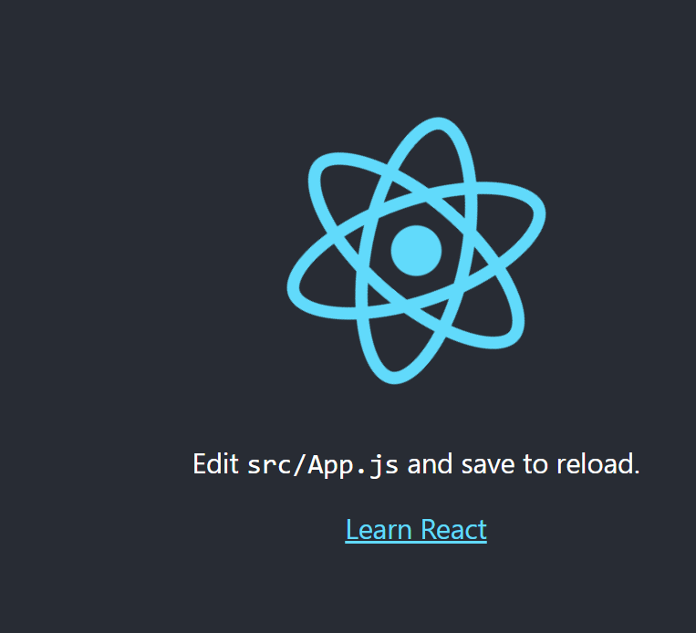
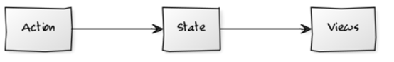
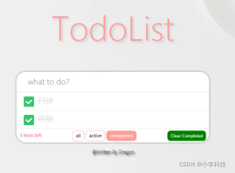

# Mobx 学习进阶

[TOC]

项目代码

https://github.com/dL-hx/react-redux-guide

#### [v1.0 ](https://github.com/dL-hx/mobx-guide/releases/tag/v1.0)…

```
v1.0 mobx练习
```

#### [v2.0 ](https://github.com/dL-hx/mobx-guide/releases/tag/v2.0)…

```
v2.0 todos案例
```


Mobx官网: https://www.mobxjs.com/

简单可扩展的状态管理

+ 1. Mobx简介

  > 背景,浏览器兼容性

+ 2. 开发前的准备

  > 如何支持装饰器语法.

+ 3. Mobx+React

  > 如何结合使用

+ 4. Mobx异步

  > 异步更新本地状态

+ 5. Mobx数据监测

  > 数据检测方法

+ 6. 综合案例

## 一 Mobx简介

### 1.1 Mobx介绍

> 状态管理库


推荐(Mobx5)-------- 支持ES6proxy浏览器, 不支持IE11,Node6

(Mobx4)-------- 支持ES5浏览器

**让状态容易维护**


### 2 准备工作

#### [v1.0 ](https://github.com/dL-hx/mmbox/releases/tag/v1.0)…

```
v1.0 mobx项目搭建
```

> creact-react-app 创建项目

### 2.1 启用装饰器语法支持(方式1)

``` 
1. 弹射项目底层配置: npm run eject
2. 下载装饰器语法babel 插件: npm install @babel/plugin-proposal-decorators -D
3. 在package.json 文件中加入配置

"babel":{
    "plugins": [
    // ["import", {
    //   "libraryName": "antd",
    //   "libraryDirectory": "es",
    //   "style": "css" // `style: true` 会加载 less 文件
    // }],

    // ↓这里支持装饰器语法配置
    ["@babel/plugin-proposal-decorators", { "legacy": true }]
   
  ]
}
```

##### 相当于 => 在.babelrc文件加入配置

``` js
{
  "presets": [ // 预设,用来加载代码配置
    [
      "@babel/preset-env",
      {
        "useBuiltIns": "usage",// 添加浏览器不支持的语法
        "corejs": 3
      }
    ]
  ],
  "plugins": [// [导入的插件]
    // ["import", {
    //   "libraryName": "antd",
    //   "libraryDirectory": "es",
    //   "style": "css" // `style: true` 会加载 less 文件
    // }],

    // ↓这里支持装饰器语法配置
    ["@babel/plugin-proposal-decorators", { "legacy": true }]
   
  ]
}
```


### 2.2 启用装饰器语法支持(方式2)

``` shell
1. npm install react-app-rewired customize-cra @babel/plugin-proposal-decorators --save-dev
2. 在项目根目录下创建 `config-overrides.js` 并加入如下配置
```

--save 和 --save-dev 的作用和区别: 

https://blog.csdn.net/cvper/article/details/88728505

```js
--save-dev  => 等价于 -D  加入的工具,开发时候用

--save => 等价于 -S , 项目运行的必要文件
```


##### `config-overrides.js`

``` js
const { override, addDecoratorsLegacy } = require("customize-cra");
const path = require("path");

module.exports = override(

  addDecoratorsLegacy()  
   
); 
```


> 完整配置less版本

``` shell
npm install antd
npm install react-app-rewired customize-cra babel-plugin-import
npm install less less-loader
```


``` js
const { override, fixBabelImports, addLessLoader, addWebpackAlias, addDecoratorsLegacy } = require("customize-cra");
const path = require("path");

module.exports = override(
  // 针对antd 实现按需打包：根据import来打包 (使用babel-plugin-import)  
  fixBabelImports("import", {    
    libraryName: "antd",    
    libraryDirectory: "es",    
    style: true, //自动打包相关的样式 默认为 style:'css'  
  }),
  // 使用less-loader对源码重的less的变量进行重新制定，设置antd自定义主题  
  addLessLoader({  
    javascriptEnabled: true,    
    modifyVars: { "@primary-color": "#1DA57A" },  
  }),
  //增加路径别名的处理 
  addWebpackAlias({  
    '@': path.resolve('./src')  
  }),
  // 增加装饰器支持  
  addDecoratorsLegacy() 
); 
```

最后修改启动配置package.json

```js
 "scripts": {
    "start": "react-app-rewired start",
    "build": "react-app-rewired build",
    "test": "react--app-rewired test",
    "eject": "react-scripts eject"
  },
```


最后运行 npm start , 看到项目已经启动成功



**相关阅读**:

https://juejin.cn/post/6873725957673320461

https://www.jianshu.com/p/a3609201b6cf


最新版本参照:
Mobx6
https://blog.csdn.net/weixin_38245947/article/details/120338996


## 二 Mobx+React

### 2.1 安装Mobx

注意这里安装的版本, 最新版本已经是6了, 

参照: https://blog.csdn.net/weixin_38245947/article/details/120338996

``` js
$ npm install mobx@5.15.4 mobx-react@6.2.2 -S
```


### 2.2 工作流




### 2.3 创建Mobx工作流

@observable   可观测数据

> 将数据变为可观测数据, view才能看到变化

目录结构

``` js
+ store
    + CounterStore.js
```


### 2.4 计数器案例

1. 创建store对象，存储默认状态
   store/CounterStore.js

``` jsx
// 1. 创建store对象 存储默认状态0
// 2. 将store对象放在一个全局的 组件可以够的到的地方
// 3. 让组件获取store对象中的状态 并将状态显示在组件中
import { observable, action, autorun } from 'mobx';

class CounterStore {

   @action increment = () => {
     this.count = this.count + 1;
   }

  @action decrement = () => {
    this.count = this.count - 1;
  }

}

const counter = new CounterStore();

export default counter;
```


2.将store对象放在一个全局的组件可以得到的地方。 Provider

index.js中使用 Provider、counter

``` jsx
import React from 'react';
import ReactDOM from 'react-dom';
import { Provider } from 'mobx-react';
import App from './App';
import counter from './stores/counterStore';

ReactDOM.render(
  <Provider counter={counter}><App /></Provider>,
  document.getElementById('root')
    

```


3.让组件获取store对象中的状态，并将状态显示在组件中

使用定义的counter //通过inject


App.js

``` jsx
import React, { Component } from "react";
import { inject, observer } from "mobx-react";

@inject("counter")
@observer
class App extends Component {
  render() {
    const { counter } = this.props;
    return (
      <div>
        <button onClick={counter.increment}>+</button>
        <span>{counter.count}</span>
        <button onClick={counter.decrement}>-</button>
      </div>
    );
  }
}

export default App;
```


### 2.5. mobx异步
store/CounterStore.js

``` js
// 1。创建store对象，存储默认状态
// 2.将store对象放在一个全局的组件可以得到的地方。 Provider
// 3.让组件获取store对象中的状态，并将状态显示在组件中

import { observable, action, runInAction, flow } from "mobx"
import axios from 'axios'


class CounterStore {
  // 可观测的数据
  @observable count = 0
  @observable users = []

  // increment = () => {
  //   this.count = this.count + 1
  //   console.log(this.count)
  // }

  // decrement = () => {
  //   this.count = this.count - 1
  // }

  // 箭头头函数改成普通函数
  @action.bound increment() {
    this.count = this.count + 1
  }

  // 如果有异步操作，不能直接在这个函数中操作数据。处理方法如下：
  // 方法1.runInAction
  // @action.bound async getData () {
  //   let { data } = await axios.get('https://api.github.com/users');
  //   runInAction(() => {
  //     this.users = data || [{id: '1', login: '1'}]
  //   })
  // }

  // 方法2：flow
  getData = flow(function * (){
    let { data } = yield axios.get('https://api.github.com/users');
    this.users = data || [{id: '1', login: '1'}]
  }).bind(this)

}

const counter = new CounterStore()
export default counter
```


### 2.6.mobx数据检测

数据检测：当某一个状态发生变化的时候我们想根据这个值得到另外一个值
计算值：可以根据现有的状态或其他计算值衍生出的值
mobx提供的方法：
1.computed
什么时候使用计算值？
将复杂的业务逻辑从模板中进行抽离。
式例：

``` js
import {observable, action,computed} from 'mobx'
class BirdStore{
    @observable count = 10
    @observable price = 25
    

+	// 调用的时候可以不加括号，以属性的形式使用它。
  @computed get totalPrice() {
    return this.count * this.price
}
```


禁止普通函数更改程序状态并引入action装饰器。
默认情况下所有的函数都可以更改程序的状态，但是我们觉得这样是不好的，如果程序状态出现了问题，我们不得不排查每一个更改应用程序状态的函数，这样开发成本就比较高的，所以我们要把这个默认行为禁止掉，也就是不希望所有的函数都可以更改应用程序的状态。我们强制规定只有@action函数可以更改应用程序的状态，降低了程序的开发成本。

``` js
//  1。创建store对象，存储默认状态
// 2.将store对象放在一个全局的组件可以得到的地方。 Provider
// 3.让组件获取store对象中的状态，并将状态显示在组件中

import { observable, action, runInAction, flow, configure } from "mobx"
import axios from 'axios'

// 通过配置强制程序使用action函数更改应用程序中的状态
configure({enforceActions: 'observed'})
class CounterStore {
  // 可观测的数据
  @observable count = 0
  @observable users = []

+ @action increment = () => {
  this.count = this.count + 1
   console.log(this.count)
  }

+ @action decrement = () => {
  this.count = this.count - 1
  }

const counter = new CounterStore()
export default counter
```


数据检测（二）：
autorun方法
当检测的状态发生变化的时候，你想根据状态产生‘效果’，请使用autorun
autorun会在初始化的时候执行一次，会在每次状态发生变化时执行。

``` js
autorun(async () => {
    let response = await uniqueUserName(this.username)
},{delay: 1500})
```


## 三 .综合案例

案例： todo

``` js
{
  "name": "todo",
  "version": "0.1.0",
  "private": true,
  "dependencies": {
    "@babel/plugin-proposal-decorators": "^7.8.3",
    "@testing-library/jest-dom": "^4.2.4",
    "@testing-library/react": "^9.5.0",
    "@testing-library/user-event": "^7.2.1",
    "customize-cra": "^0.9.1",
    "mobx": "^5.15.4",
    "mobx-react": "^6.2.2",
    "react": "^16.13.1",
    "react-app-rewired": "^2.1.6",
    "react-dom": "^16.13.1",
    "react-scripts": "3.4.1"
  },
  "scripts": {
    "start": "react-app-rewired start",
    "build": "react-app-rewired build",
    "test": "react-app-rewired test",
    "eject": "react-scripts eject"
  },
  "eslintConfig": {
    "extends": "react-app"
  },
  "browserslist": {
    "production": [
      ">0.2%",
      "not dead",
      "not op_mini all"
    ],
    "development": [
      "last 1 chrome version",
      "last 1 firefox version",
      "last 1 safari version"
    ]
  }
}


```

config-overrides.js

``` js
const { override, addDecoratorsLegacy } = require("customize-cra");

module.exports = override(addDecoratorsLegacy());
```


index.js

``` js
import React from 'react';
import ReactDOM from 'react-dom';
import App from './components/App';
import todo from './stores/TodoStore';
import { Provider } from 'mobx-react';
import './index.css';

ReactDOM.render(
  <Provider todo={todo}><App /></Provider>,
  document.getElementById('root')
);


```

index.css

``` css
html,
body {
    margin: 0;
    padding: 0;
}

button {
    margin: 0;
    padding: 0;
    border: 0;
    background: none;
    font-size: 100%;
    vertical-align: baseline;
    font-family: inherit;
    font-weight: inherit;
    color: inherit;
    -webkit-appearance: none;
    appearance: none;
    -webkit-font-smoothing: antialiased;
    -moz-osx-font-smoothing: grayscale;
}

body {
    font: 14px 'Helvetica Neue', Helvetica, Arial, sans-serif;
    line-height: 1.4em;
    background: #f5f5f5;
    color: #4d4d4d;
    min-width: 230px;
    max-width: 550px;
    margin: 0 auto;
    -webkit-font-smoothing: antialiased;
    -moz-osx-font-smoothing: grayscale;
    font-weight: 300;
}

:focus {
    outline: 0;
}

.hidden {
    display: none;
}

.todoapp {
    background: #fff;
    margin: 130px 0 40px 0;
    position: relative;
    box-shadow: 0 2px 4px 0 rgba(0, 0, 0, 0.2),
                0 25px 50px 0 rgba(0, 0, 0, 0.1);
}

.todoapp input::-webkit-input-placeholder {
    font-style: italic;
    font-weight: 300;
    color: #e6e6e6;
}

.todoapp input::-moz-placeholder {
    font-style: italic;
    font-weight: 300;
    color: #e6e6e6;
}

.todoapp input::input-placeholder {
    font-style: italic;
    font-weight: 300;
    color: #e6e6e6;
}

.todoapp h1 {
    position: absolute;
    top: -155px;
    width: 100%;
    font-size: 100px;
    font-weight: 100;
    text-align: center;
    color: rgba(175, 47, 47, 0.15);
    -webkit-text-rendering: optimizeLegibility;
    -moz-text-rendering: optimizeLegibility;
    text-rendering: optimizeLegibility;
}

.new-todo,
.edit {
    position: relative;
    margin: 0;
    width: 100%;
    font-size: 24px;
    font-family: inherit;
    font-weight: inherit;
    line-height: 1.4em;
    border: 0;
    color: inherit;
    padding: 6px;
    border: 1px solid #999;
    box-shadow: inset 0 -1px 5px 0 rgba(0, 0, 0, 0.2);
    box-sizing: border-box;
    -webkit-font-smoothing: antialiased;
    -moz-osx-font-smoothing: grayscale;
}

.new-todo {
    padding: 16px 16px 16px 60px;
    border: none;
    background: rgba(0, 0, 0, 0.003);
    box-shadow: inset 0 -2px 1px rgba(0,0,0,0.03);
}

.main {
    position: relative;
    z-index: 2;
    border-top: 1px solid #e6e6e6;
}

label[for='toggle-all'] {
    display: none;
}

.toggle-all {
    position: absolute;
    top: -55px;
    left: -12px;
    width: 60px;
    height: 34px;
    text-align: center;
    border: none; /* Mobile Safari */
}

.toggle-all:before {
    content: '❯';
    font-size: 22px;
    color: #e6e6e6;
    padding: 10px 27px 10px 27px;
}

.toggle-all:checked:before {
    color: #737373;
}

.todo-list {
    margin: 0;
    padding: 0;
    list-style: none;
}

.todo-list li {
    position: relative;
    font-size: 24px;
    border-bottom: 1px solid #ededed;
}

.todo-list li:last-child {
    border-bottom: none;
}

.todo-list li.editing {
    border-bottom: none;
    padding: 0;
}

.todo-list li.editing .edit {
    display: block;
    width: 506px;
    padding: 12px 16px;
    margin: 0 0 0 43px;
}

.todo-list li.editing .view {
    display: none;
}

.todo-list li .toggle {
    text-align: center;
    width: 40px;
    /* auto, since non-WebKit browsers doesn't support input styling */
    height: auto;
    position: absolute;
    top: 0;
    bottom: 0;
    margin: auto 0;
    border: none; /* Mobile Safari */
    -webkit-appearance: none;
    appearance: none;
}

.todo-list li .toggle:after {
    content: url('data:image/svg+xml;utf8,%3Csvg%20xmlns%3D%22http%3A//www.w3.org/2000/svg%22%20width%3D%2240%22%20height%3D%2240%22%20viewBox%3D%22-10%20-18%20100%20135%22%3E%3Ccircle%20cx%3D%2250%22%20cy%3D%2250%22%20r%3D%2250%22%20fill%3D%22none%22%20stroke%3D%22%23ededed%22%20stroke-width%3D%223%22/%3E%3C/svg%3E');
}

.todo-list li .toggle:checked:after {
    content: url('data:image/svg+xml;utf8,%3Csvg%20xmlns%3D%22http%3A//www.w3.org/2000/svg%22%20width%3D%2240%22%20height%3D%2240%22%20viewBox%3D%22-10%20-18%20100%20135%22%3E%3Ccircle%20cx%3D%2250%22%20cy%3D%2250%22%20r%3D%2250%22%20fill%3D%22none%22%20stroke%3D%22%23bddad5%22%20stroke-width%3D%223%22/%3E%3Cpath%20fill%3D%22%235dc2af%22%20d%3D%22M72%2025L42%2071%2027%2056l-4%204%2020%2020%2034-52z%22/%3E%3C/svg%3E');
}

.todo-list li label {
    word-break: break-all;
    padding: 15px 60px 15px 15px;
    margin-left: 45px;
    display: block;
    line-height: 1.2;
    transition: color 0.4s;
}

.todo-list li.completed label {
    color: #d9d9d9;
    text-decoration: line-through;
}

.todo-list li .destroy {
    display: none;
    position: absolute;
    top: 0;
    right: 10px;
    bottom: 0;
    width: 40px;
    height: 40px;
    margin: auto 0;
    font-size: 30px;
    color: #cc9a9a;
    margin-bottom: 11px;
    transition: color 0.2s ease-out;
}

.todo-list li .destroy:hover {
    color: #af5b5e;
}

.todo-list li .destroy:after {
    content: '×';
}

.todo-list li:hover .destroy {
    display: block;
}

.todo-list li .edit {
    display: none;
}

.todo-list li.editing:last-child {
    margin-bottom: -1px;
}

.footer {
    color: #777;
    padding: 10px 15px;
    height: 20px;
    text-align: center;
    border-top: 1px solid #e6e6e6;
}

.footer:before {
    content: '';
    position: absolute;
    right: 0;
    bottom: 0;
    left: 0;
    height: 50px;
    overflow: hidden;
    box-shadow: 0 1px 1px rgba(0, 0, 0, 0.2),
                0 8px 0 -3px #f6f6f6,
                0 9px 1px -3px rgba(0, 0, 0, 0.2),
                0 16px 0 -6px #f6f6f6,
                0 17px 2px -6px rgba(0, 0, 0, 0.2);
}

.todo-count {
    float: left;
    text-align: left;
}

.todo-count strong {
    font-weight: 300;
}

.filters {
    margin: 0;
    padding: 0;
    list-style: none;
    position: absolute;
    right: 0;
    left: 0;
}

.filters li {
    display: inline;
}

.filters li button {
    color: inherit;
    padding: 0 7px;
    text-decoration: none;
    border: 1px solid transparent;
    border-radius: 3px;
}

.filters li button:hover {
    border-color: rgba(175, 47, 47, 0.1);
}

.filters li button.selected {
    border-color: rgba(175, 47, 47, 0.2);
}

.clear-completed,
html .clear-completed:active {
    float: right;
    position: relative;
    line-height: 20px;
    text-decoration: none;
    cursor: pointer;
}

.clear-completed:hover {
    text-decoration: underline;
}

.info {
    margin: 65px auto 0;
    color: #bfbfbf;
    font-size: 10px;
    text-shadow: 0 1px 0 rgba(255, 255, 255, 0.5);
    text-align: center;
}

.info p {
    line-height: 1;
}

.info a {
    color: inherit;
    text-decoration: none;
    font-weight: 400;
}

.info a:hover {
    text-decoration: underline;
}

/*
    Hack to remove background from Mobile Safari.
    Can't use it globally since it destroys checkboxes in Firefox
*/
@media screen and (-webkit-min-device-pixel-ratio:0) {
    .toggle-all,
    .todo-list li .toggle {
        background: none;
    }

    .todo-list li .toggle {
        height: 40px;
    }
    
    .toggle-all {
        -webkit-transform: rotate(90deg);
        transform: rotate(90deg);
        -webkit-appearance: none;
        appearance: none;
    }

}

@media (max-width: 430px) {
    .footer {
        height: 50px;
    }

    .filters {
        bottom: 10px;
    }

}
```


stores/TodoStore.js

``` js
import { observable, action, computed } from 'mobx';

class TodoStore {
  // todo 列表
  @observable todos = [];
  // 筛选条件
  @observable filter = 'All';
  // 添加任务
  @action.bound todoAdd (taskName) {
    this.todos.push({
      taskName,
      isCompleted: false
    })
  }
  // 删除任务
  @action.bound todoDelete (index) {
    this.todos.splice(index, 1);
  }
  // 更改任务的是否已完成状态
  @action.bound changeCompleted (index, flag) {
    this.todos[index].isCompleted = flag;
  }

  @computed get unfinishedTodoCount () {
    return this.todos.filter(todo => todo.isCompleted === false).length;
  }

  // 更改筛选条件
  @action.bound changeFilter(condition) {
    this.filter = condition
  }

  // 监测筛选条件的变化 根据筛选条件对任务进行筛选
  @computed get filterTodo () {
    switch (this.filter) {
      case 'All':
        return this.todos;
      case 'Active':
        return this.todos.filter(todo => todo.isCompleted === false);
      case 'Completed':
        return this.todos.filter(todo => todo.isCompleted === true);
    }
  }
}

const todo = new TodoStore();

export default todo;
```


components/App.js

``` js
import React, { Component } from 'react';
import AddTodo from './addTodo';
import TodoList from './todoList';
import TodoExtra from './todoExtra';

class App extends Component {
  render() {
    return <section className="todoapp">
      <AddTodo />
      <TodoList />
      <TodoExtra />
    </section>
  }
}

export default App;
```


components/addTodo.js

``` js
import React, { Component } from "react";
import { inject, observer } from "mobx-react";

@inject('todo')
@observer
class AddTodo extends Component {
  // 添加任务
  addTodo (event) {
    const { todoAdd } = this.props.todo;
    // 判断用户敲击的是否是回车键
    if (event.key === 'Enter') {
      // 获取用户在文本框中输入的内容
      const taskName = event.target.value;
      // 判断用户在文本框中是否输入了内容
      if (taskName.trim().length === 0) {
        // 阻止程序向下执行
        return;
      }
      // 将任务添加到任务列表数组中
      todoAdd (taskName);
      // 清空文本框中的内容
      event.target.value = '';
    }

  }
  render() {
    return (
      <header className="header">
        <h1>todos</h1>
        <input onKeyUp={this.addTodo.bind(this)} className="new-todo" placeholder="What needs to be done?" />
      </header>
    );
  }
}

export default AddTodo;
```


components/todoList.js

``` js
import React, { Component } from "react";
import { inject, observer } from "mobx-react";

@inject("todo")
@observer
class TodoList extends Component {
  render() {
    const { todoDelete, changeCompleted, filterTodo } = this.props.todo;
    return (
      <section className="main">
        <input className="toggle-all" type="checkbox" />
        <ul className="todo-list">
          {filterTodo.map((todo, index) => {
            return (
              <li className={todo.isCompleted ? 'completed': ''} key={todo.taskName}>
                <div className="view">
                  <input onChange={event => changeCompleted(index, event.target.checked)} checked={todo.isCompleted} className="toggle" type="checkbox" />
                  <label>{todo.taskName}</label>
                  <button onClick={() => todoDelete(index)} className="destroy"></button>
                </div>
                <input className="edit" />
              </li>
            );
          })}
        </ul>
      </section>
    );
  }
}

export default TodoList;
```


components/todoExtra.js

``` js
import React, { Component } from "react";
import { inject, observer } from "mobx-react";

@inject("todo")
@observer
class TodoExtra extends Component {
  render() {
    const { unfinishedTodoCount, changeFilter, filter } = this.props.todo;
    return (
      <footer className="footer">
        <span className="todo-count">
          <strong>{unfinishedTodoCount}</strong> item left
        </span>
        <ul className="filters">
          <li>
            <button className={filter === 'All' ? 'selected': ''} onClick={() => changeFilter('All')}>All</button>
          </li>
          <li>
            <button className={filter === 'Active' ? 'selected': ''} onClick={() => changeFilter('Active')}>Active</button>
          </li>
          <li>
            <button className={filter === 'Completed' ? 'selected': ''} onClick={() => changeFilter('Completed')}>Completed</button>
          </li>
        </ul>

        <button className="clear-completed">Clear completed</button>
      </footer>
    );

  }
}

export default TodoExtra;
```





https://zhuanlan.zhihu.com/p/407390704

总结：
\1. Mobx5 + Mobx-React6 主要是在子Store依赖Mobx中的这几个方法 obsevable, action, computed, autorun
\2. @observeable 是用来修饰响应式变量的
\3. @action是用来修饰修改修改@aboserveable修饰的变量的
\4. @autorun是用来修饰自动运行方法的
\5. @computed是用来修饰修改@observeable修饰的响应式变量的，需要注意使用@computed修饰的方法前面必须加上get

 // @computed 状态发生变化时候会自动执行

// 这样就<无需关注复杂业务逻辑>,  只要是能计算出来的值就可以使用

\6. 在根组件中使用mobx-react中的Provider组件将store注入所有组件
\7. 在组件使用的话可以使用构造器语法，回更方便使用mobx中的数据，但是装饰器语法的需要配置相应的babel插件 ["@babel/plugin-proposal-decorators", { "legacy": true }], ["@babel/plugin-proposal-class-properties"] 注意顺序不能反了，这样就是@inject(['good']) @observer 顺序也不反，数组语法也是因为可能会使用多个子store，如果没有配置装饰器语法的就是要类似于高阶组件的使用方法 @inject(['good']) @observer（组件）这样的语法来写
