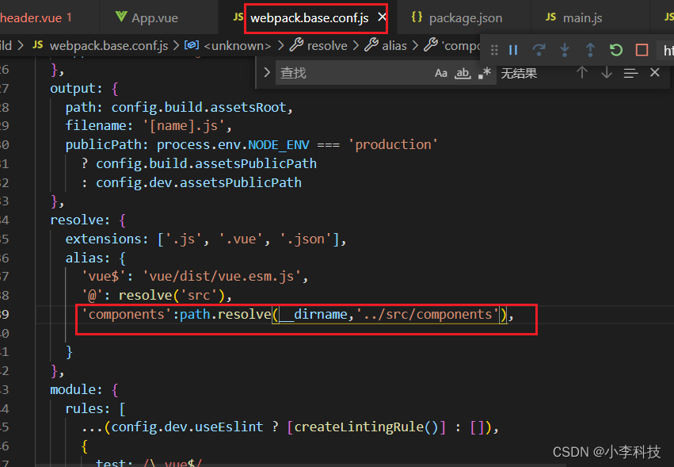
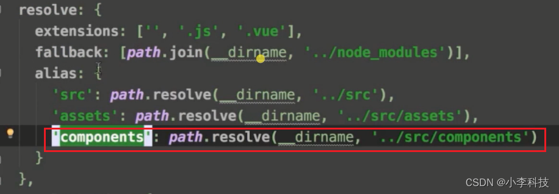

配置alias 参数,   在目录中可以直接使用<`alias`>  别名进行调用, 
 
避免过长调用链.

## 1. 配置alias


-----

## 2. 项目文件中进行调用
```js
import Goods from 'components/goods/goods'
import Ratings from 'components/ratings/ratings'
import Seller from 'components/seller/seller'
```