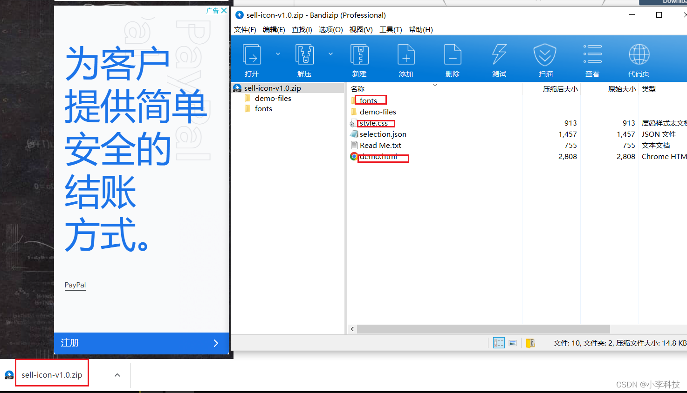

# 图标优化-------IconMoon 图标制作


## 1. 登录 icomoon.io
https://icomoon.io/#home


## 2. 制作字体图标
https://icomoon.io/app/#/select


2.1 选中需要的svg图标


2.2 选择完毕后，点击右下角的，generate Font:会进入图标确认界面。点击download下载压缩包。


2.3  解压后，把看到的文件夹添加到对应的前端开发文件夹中：下面是参考样式。



2.4  将解压后的style.css中的代码添加到自己项目中的css文件中，这表示引入了icomoon字体图标：如图所示是需要引入的代码。
第一步：引入字体图标


2.5   下面开始在html页面中使用字体图标：打开demo.html文件，在想要添加的图标右侧点击复制：然后粘贴到对应的html标签中，如：

```css
@font-face{
  font-family: 'sell-icon';
  src: url('../fonts/sell-icon.eot?k5xf13');
  src: url('../fonts/sell-icon.eot?k5xf13#iefix') format('embedded-opentype'),
    url('../fonts/sell-icon.ttf?k5xf13') format('truetype'),
    url('../fonts/sell-icon.woff?k5xf13') format('woff'),
    url('../fonts/sell-icon.svg?k5xf13#sell-icon') format('svg')
  font-weight: normal;
  font-style: normal;
}

span {
font-family: “icomoon”;
}
第三步：盒子里面添加结构
span::before {
content: “\e900”;
}
```


引入方式1 :   复制 空标签  [],   指定字体图标的class 样式


第二步：给盒子使用字体


引入方式2 :   直接使用Span 标签 + class 标识


## 3. 项目中具体使用
1. 找到这两个文件

2. 加入项目中
将style.css 改名为icon.css 后,  放入项目中,  注意与font文件的路径.


## 4. 补充字体图标
> 由其他第三方平台中,  下载出svg ,图标文件,    加入 selection.json文件中, 重新生成

步骤: 
1. 导入 原始的 selection.json 文件
2. 加入ui/第三方平台  设计出来的 字体图标文件
3. 重新生成

第二种：使用iconfont方式

补充：有时字体图标是需要我们自己单独定制的，这时我们可以给ui说一下，让他帮我们设计一个例如手机的svg格式的图标，当ui设计好之后，传给我们一个svg格式的图标后，在icomoon中点击上传图标之后，会自动帮我们转换为字体图标样式，这时我们就可以和以前一样正常使用啦！！！


补充2：追加新的图标后，但是也要保存以前的图标: 

上传图标,     上传成功后，选择想要追加的图标然后下载，替换原来的文件即可。


