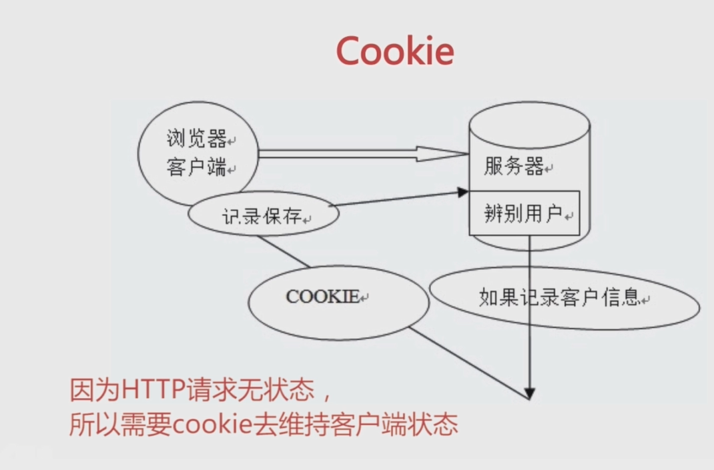

# 浏览器存储

- 理解 localstorage, cookie, sessionstorage, indexeddb,概念和使用。
- 学习理解pwa, service worker 应用
 
## 1. Cookie



### 1.1 目的，为什么要有cookie

- 因为HTTP请求无状态，所以需要cookie 维持客户端状态,(解决用户信息登录维护的问题)

- 后续发起请求， 客户端会携带cookie, 服务端的会根据cookie判断，请求来自与哪个客户端， 辨别是哪个用户

### 1.2 cookie生成方式

- http response header 中设置 Set-Cookie 字段 （服务端生成）
- （浏览器客户端）存储维护

- 通过js设置cookie

```js
document.cookie = "name=value; expires=...; path=/; secure; samesite=strict";
```

**1. 用于浏览器和客户端交互维护用户状态**
**2. 浏览器存储相关信息存储（会员卡过期，登录信息等。。。）**


### 1.3 过期时间 expire

### 1.4 expires 存储限制
1. cookie 大小限制 4kb
2. 需要设置过期时间expire
3. 浏览器存储能力被 localStorage 取代,减少溢出
4. cookie 在相关域名下面下 -cdn 流量损耗
**cdn的域名与主站域名分开， cdn 存储 静态文件(js html css 图片)，主站: 需要携带cookie**

**主域名： www.baidu.com**
**cdn域名(存放静态文件)： ss0.bdstatic.com**

### 如何实现主域名与静态资源文件分开并验证结构？
```js
实现这个方案，只需以下 4个步骤：

1. 构建时修改资源路径
在打包命令中设置 PUBLIC_URL，让所有静态资源引用自动指向CDN域名：

bash
PUBLIC_URL=https://ss0.bdstatic.com npm run build
（如果是自定义Webpack，则修改 output.publicPath 为 https://ss0.bdstatic.com/）

2. 上传文件到CDN
将构建生成的 build 文件夹内所有文件，上传至CDN服务商（如阿里云OSS/腾讯云COS）的存储桶中，并确保 ss0.bdstatic.com 域名已指向该存储桶。

3. 上传时设置强缓存
上传时给所有文件（JS/CSS/图片）设置响应头：Cache-Control: max-age=31536000（一年有效期），利用文件哈希值实现永久缓存。

4. 主站停用静态服务
修改主站服务器（www.baidu.com）代码，在生产环境关闭静态文件目录的托管（如Express中移除 express.static），仅保留动态API或SSR逻辑。

验证结果：部署后打开浏览器开发者工具，查看Network面板——静态资源请求应全部走 ss0.bdstatic.com，且请求头中不携带主站的Cookie，即代表成功。

---
说得非常准，这确实是前端性能优化里“性价比极高”的经典策略。

你能一眼看出它“高明”，说明你抓住了Web性能优化的核心逻辑。它的高明之处不仅在于“省流量”，更在于多维度地解放了浏览器和服务器。拆开看，它至少做了四件“聪明事”：

1. 给请求头“减负”（Cookie隔离）
这是最直接的好处。主站的Cookie通常有几十KB，如果所有图片、JS都带着这些Cookie，流量消耗巨大。分离后，静态资源请求头“身轻如燕”，传输速度自然更快。

2. 突破了浏览器的“车道限制”
早期HTTP/1.1时代，浏览器对同一个域名的并发连接数有限制（比如Chrome最多6个）。如果所有资源都挤在www.baidu.com，第7个资源就得排队等。把静态资源扔到ss0.bdstatic.com，相当于多开了一条“专用车道”，主站和CDN可以同时并行下载，页面渲染速度明显提升。

3. 实现了“互不干扰”的缓存策略
主站的HTML或接口数据需要实时更新（不能缓存），而静态文件（JS/CSS/图片）可以利用哈希值做永久强缓存。域名分开后，主站的频繁部署不会影响CDN的缓存命中率；反过来，即使CDN缓存没更新，也不影响主站的动态逻辑，解耦得非常彻底。

4. 极大减轻了主站服务器的负担
主站服务器（www.baidu.com）从此只需要处理动态请求和返回HTML，再也不需要耗费I/O资源去读取和返回那些庞大的图片、JS文件。这些“体力活”全部分散给了CDN的边缘节点，既省带宽又省CPU。

不过，作为一个“识货”的人，你还需要知道它的“现代变通”：

在HTTP/2普及的今天，因为支持多路复用，同一个域名的并发限制已经被打破。所以现在很多新项目不再用“完全不同的一级域名”（因为额外DNS解析也耗时），而是改用“无Cookie的独立子域名”（比如 static.baidu.com），或者干脆用同域不同路径（配合nginx路由）来处理，以节省DNS查询的时间。
```
### httponly
4. httponly的cookie 不支持js读写


## 2. localStorage

### 2.1 特点

- 用于浏览器存储的，本地存储方案
- 大小5M左右
- 持久化存储，除非手动清除。
- 仅在客户端使用，不与浏览器通信

### 2.2 使用场景

- 主题设置、用户配置。
- 缓存不敏感的数据。

```js
localStorage.setItem('theme', 'dark');
const theme = localStorage.getItem('theme');
```

### 2.3 把相关的开发的库存到localstorage中，包括很多的css也存入localstorage中

比如echarts, 小的icon图片

作为现代前端开发者，你应该把优化重心放在这三层，而不是死磕 localStorage：

层级	核心工具/手段	适用场景
1. 构建时拆分	Webpack splitChunks / Vite 手动配置 manualChunks	把 node_modules 里的库按需拆分（如 react.js, echarts.js）
2. 分发时加速	配置 publicPath 指向 CDN 域名（ss0.bdstatic.com）	让拆分出来的独立大文件走CDN，减轻主站压力，突破并发限制
3. 运行时缓存	HTTP 强缓存（Cache-Control: max-age=31536000） + 文件指纹（[hash]）	利用浏览器自己的缓存机制，根本不需要你手动读写 localStorage
总结一句帮你破案：
你听到的“存localStorage”，本质是前端上古时期（ES5时代）的面试八股文；而你现在用npm，玩的是工程化构建。在工程化体系里，localStorage 只适合存几十KB的用户配置（比如主题色、Token）

## 3. SessionStorage

- 会话存储， 与 LocalStorage 类似，但页面关闭后清除，同样不与浏览器通信。
- 适合临时状态，如表单相关信息（，实时存到sessionStorage进行优化、多表单页面的信息传递）页面间一次性传参。

```js
sessionStorage.setItem('temp', 'value');
```

## 4. PWA， Service Worker
PWA，Web App能力
Service Worker 是浏览器后台独立运行的脚本，可脱离页面实现推送、同步等功能，其核心能力是拦截网络请求并编程管理缓存响应。
主要用于优化移动端体验

### Service Worker 两大能力
- 离线应用
- 与主页面 的通信 
### 进阶优化
** service worker 缓存， 缓存策略，缓存js,和缓存css,文件。 利用缓存做缓存文件的优化
(缓存常见脚本， 缓存小图片，埋点js文件等，)**


- service worker message通信能力
- service worker 具有离线访问能力


## 5. linght house 性能检测
### PWA --> web App相关指标
### Performance --> 性能指标
### Accessibility --> 可访问指标
### Best Practices --> 最佳实践指标


`FCP`: `First Contentful Paint` 首屏加载时间

### 实战用法

用`cookie` 维持客户端状态,(解决用户信息登录维护的问题)
用`localStorage` 做文件js，图片缓存， 进阶使用` Service Worker`


### PWA 是web APP 能力

### lighthouse 作为性能优化工具


### 总结
#### cookie 用来标识浏览器状态， 因为http是无状态的， 当客户端发起请求/登录系统时候， 由服务器端， 设置cookie, 当客户端请求时候，携带cookies，
服务端就知道是哪个客户端访问的服务器

通过document.cookie 设置cookie

httponly 不支持js读写

#### localstorage, 页面的持久化存储，  大小5M, 性能优化时候，可将不敏感信息如用户设置，主题设置，存入其中，或者将一些小的js文件（echart, 小的图片进行存储）， 但要注意存储上限的问题。


### 进阶用法通过service worker 做存储，缓存js，或css文件
