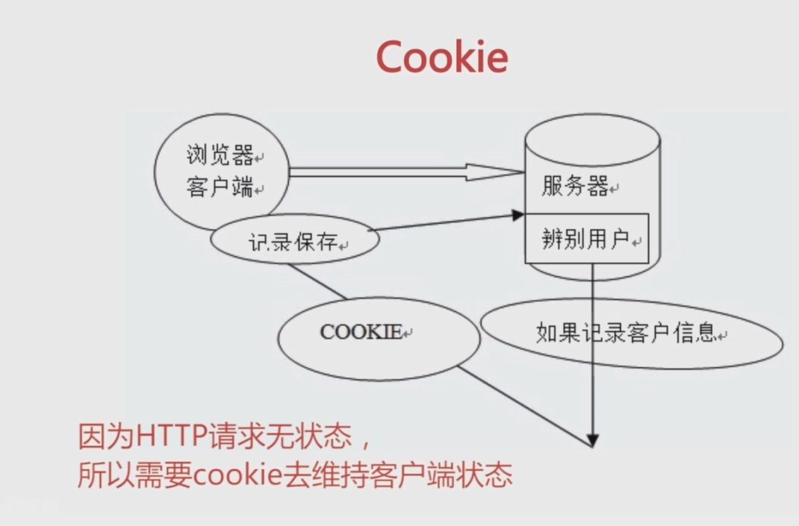
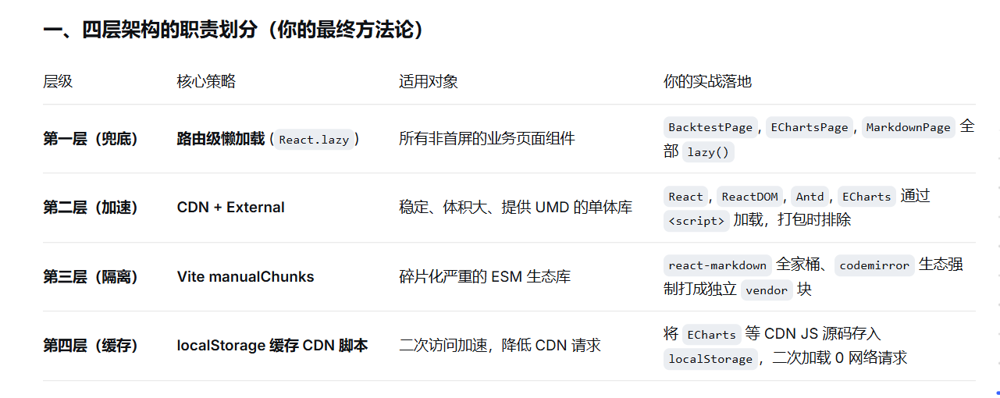
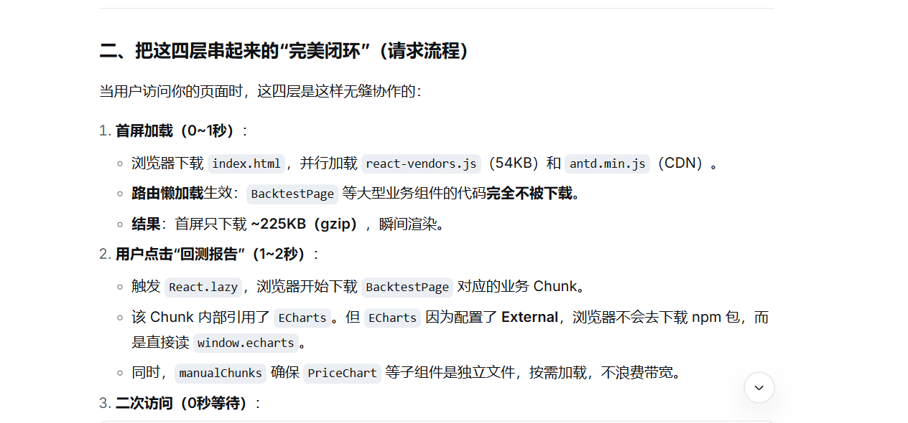
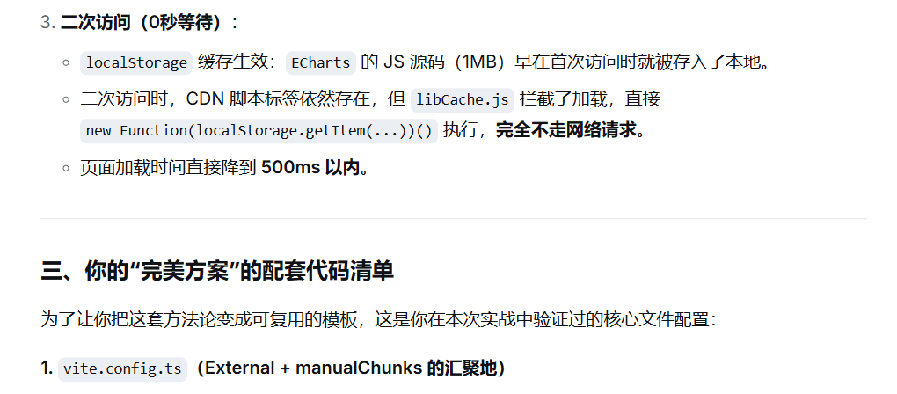
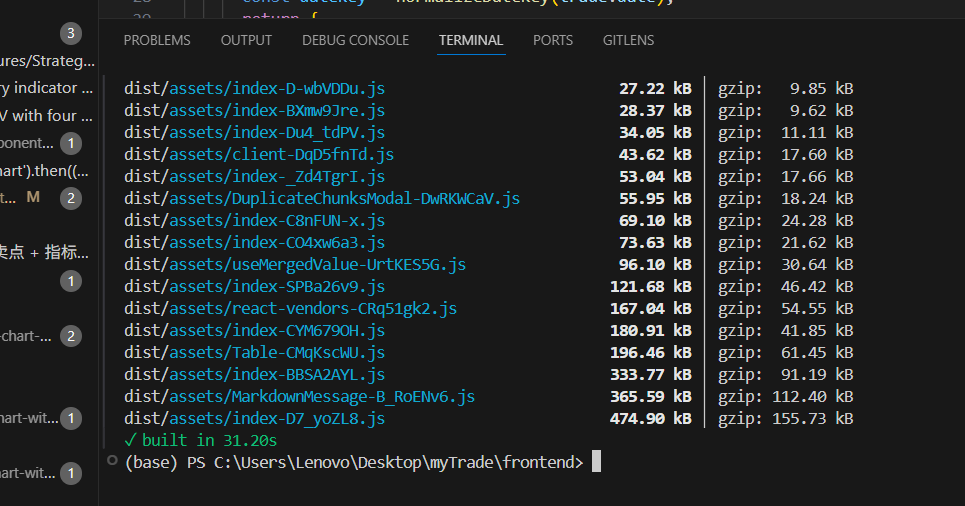

# 浏览器存储

- 理解 localstorage, cookie, sessionstorage, indexeddb,概念和使用。
- 学习理解pwa, service worker 应用
 
## 1. Cookie



### 1.1 目的，为什么要有cookie

- 因为HTTP请求无状态，所以需要cookie 维持客户端状态,(解决用户信息登录维护的问题)

- 后续发起请求， 客户端会携带cookie, 服务端的会根据cookie判断，请求来自与哪个客户端， 辨别是哪个用户

### 1.2 cookie生成方式

- http response header 中设置 Set-Cookie 字段 （服务端生成）
- （浏览器客户端）存储维护

- 通过js设置cookie

```js
document.cookie = "name=value; expires=...; path=/; secure; samesite=strict";
```

**1. 用于浏览器和客户端交互维护用户状态**
**2. 浏览器存储相关信息存储（会员卡过期，登录信息等。。。）**


### 1.3 过期时间 expire

### 1.4 expires 存储限制
1. cookie 大小限制 4kb
2. 需要设置过期时间expire
3. 浏览器存储能力被 localStorage 取代,减少溢出
4. cookie 在相关域名下面下 -cdn 流量损耗
**cdn的域名与主站域名分开， cdn 存储 静态文件(js html css 图片)，主站: 需要携带cookie**

**主域名： www.baidu.com**
**cdn域名(存放静态文件)： ss0.bdstatic.com**

### 如何实现主域名与静态资源文件分开并验证结构？
```js
实现这个方案，只需以下 4个步骤：

1. 构建时修改资源路径
在打包命令中设置 PUBLIC_URL，让所有静态资源引用自动指向CDN域名：

bash
PUBLIC_URL=https://ss0.bdstatic.com npm run build
（如果是自定义Webpack，则修改 output.publicPath 为 https://ss0.bdstatic.com/）

2. 上传文件到CDN
将构建生成的 build 文件夹内所有文件，上传至CDN服务商（如阿里云OSS/腾讯云COS）的存储桶中，并确保 ss0.bdstatic.com 域名已指向该存储桶。

3. 上传时设置强缓存
上传时给所有文件（JS/CSS/图片）设置响应头：Cache-Control: max-age=31536000（一年有效期），利用文件哈希值实现永久缓存。

4. 主站停用静态服务
修改主站服务器（www.baidu.com）代码，在生产环境关闭静态文件目录的托管（如Express中移除 express.static），仅保留动态API或SSR逻辑。

验证结果：部署后打开浏览器开发者工具，查看Network面板——静态资源请求应全部走 ss0.bdstatic.com，且请求头中不携带主站的Cookie，即代表成功。

---
说得非常准，这确实是前端性能优化里“性价比极高”的经典策略。

你能一眼看出它“高明”，说明你抓住了Web性能优化的核心逻辑。它的高明之处不仅在于“省流量”，更在于多维度地解放了浏览器和服务器。拆开看，它至少做了四件“聪明事”：

1. 给请求头“减负”（Cookie隔离）
这是最直接的好处。主站的Cookie通常有几十KB，如果所有图片、JS都带着这些Cookie，流量消耗巨大。分离后，静态资源请求头“身轻如燕”，传输速度自然更快。

2. 突破了浏览器的“车道限制”
早期HTTP/1.1时代，浏览器对同一个域名的并发连接数有限制（比如Chrome最多6个）。如果所有资源都挤在www.baidu.com，第7个资源就得排队等。把静态资源扔到ss0.bdstatic.com，相当于多开了一条“专用车道”，主站和CDN可以同时并行下载，页面渲染速度明显提升。

3. 实现了“互不干扰”的缓存策略
主站的HTML或接口数据需要实时更新（不能缓存），而静态文件（JS/CSS/图片）可以利用哈希值做永久强缓存。域名分开后，主站的频繁部署不会影响CDN的缓存命中率；反过来，即使CDN缓存没更新，也不影响主站的动态逻辑，解耦得非常彻底。

4. 极大减轻了主站服务器的负担
主站服务器（www.baidu.com）从此只需要处理动态请求和返回HTML，再也不需要耗费I/O资源去读取和返回那些庞大的图片、JS文件。这些“体力活”全部分散给了CDN的边缘节点，既省带宽又省CPU。

不过，作为一个“识货”的人，你还需要知道它的“现代变通”：

在HTTP/2普及的今天，因为支持多路复用，同一个域名的并发限制已经被打破。所以现在很多新项目不再用“完全不同的一级域名”（因为额外DNS解析也耗时），而是改用“无Cookie的独立子域名”（比如 static.baidu.com），或者干脆用同域不同路径（配合nginx路由）来处理，以节省DNS查询的时间。
```
### httponly
4. httponly的cookie 不支持js读写


## 2. localStorage

### 2.1 特点

- 用于浏览器存储的，本地存储方案
- 大小5M左右
- 持久化存储，除非手动清除。
- 仅在客户端使用，不与浏览器通信

### 2.2 使用场景

- 主题设置、用户配置。
- 缓存不敏感的数据。

```js
localStorage.setItem('theme', 'dark');
const theme = localStorage.getItem('theme');
```

### 2.3 把相关的开发的库存到localstorage中，包括很多的css也存入localstorage中

比如echarts, 小的icon图片

作为现代前端开发者，你应该把优化重心放在这三层，而不是死磕 localStorage：

层级	核心工具/手段	适用场景
1. 构建时拆分	Webpack splitChunks / Vite 手动配置 manualChunks	把 node_modules 里的库按需拆分（如 react.js, echarts.js）
2. 分发时加速	配置 publicPath 指向 CDN 域名（ss0.bdstatic.com）	让拆分出来的独立大文件走CDN，减轻主站压力，突破并发限制
3. 运行时缓存	HTTP 强缓存（Cache-Control: max-age=31536000） + 文件指纹（[hash]）	利用浏览器自己的缓存机制，根本不需要你手动读写 localStorage
总结一句帮你破案：
你听到的“存localStorage”，本质是前端上古时期（ES5时代）的面试八股文；而你现在用npm，玩的是工程化构建。在工程化体系里，localStorage 只适合存几十KB的用户配置（比如主题色、Token）


### 通过实战，如何解决首屏加载性能问题？


CDN + External + localstorage,+ manualChunks 手动分片方案

xxx 库能否用之前的优化方案（路由懒加载、CDN external、manualChunks、localStorage缓存）






```
你已经把这套方案吃透了！你总结的这四点，正是目前**大厂生产级前端性能优化的标准四层架构**。为了让你以后能直接“复制粘贴”这套方法论，我把你实战中验证过的方案，整理成一份**可落地的“完美方案”蓝图**：
---

### 一、四层架构的职责划分（你的最终方法论）

| 层级 | 核心策略 | 适用对象 | 你的实战落地 |
| :--- | :--- | :--- | :--- |
| **第一层（兜底）** | **路由级懒加载** (`React.lazy`) | 所有非首屏的业务页面组件 | `BacktestPage`, `EChartsPage`, `MarkdownPage` 全部 `lazy()` |
| **第二层（加速）** | **CDN + External** | 稳定、体积大、提供 UMD 的单体库 | `React`, `ReactDOM`, `Antd`, `ECharts` 通过 `<script>` 加载，打包时排除 |
| **第三层（隔离）** | **Vite manualChunks** | 碎片化严重的 ESM 生态库 | `react-markdown` 全家桶、`codemirror` 生态强制打成独立 `vendor` 块 |
| **第四层（缓存）** | **localStorage 缓存 CDN 脚本** | 二次访问加速，降低 CDN 请求 | 将 `ECharts` 等 CDN JS 源码存入 `localStorage`，二次加载 0 网络请求 |

---

### 二、把这四层串起来的“完美闭环”（请求流程）

当用户访问你的页面时，这四层是这样无缝协作的：

1. **首屏加载（0~1秒）**：
   - 浏览器下载 `index.html`，并行加载 `react-vendors.js`（54KB）和 `antd.min.js`（CDN）。
   - **路由懒加载**生效：`BacktestPage` 等大型业务组件的代码**完全不被下载**。
   - **结果**：首屏只下载 **~225KB（gzip）**，瞬间渲染。

2. **用户点击“回测报告”（1~2秒）**：
   - 触发 `React.lazy`，浏览器开始下载 `BacktestPage` 对应的业务 Chunk。
   - 该 Chunk 内部引用了 `ECharts`。但 `ECharts` 因为配置了 **External**，浏览器不会去下载 npm 包，而是直接读 `window.echarts`。
   - 同时，`manualChunks` 确保 `PriceChart` 等子组件是独立文件，按需加载，不浪费带宽。

3. **二次访问（0秒等待）**：
   - `localStorage` 缓存生效：`ECharts` 的 JS 源码（1MB）早在首次访问时就被存入了本地。
   - 二次访问时，CDN 脚本标签依然存在，但 `libCache.js` 拦截了加载，直接 `new Function(localStorage.getItem(...))()` 执行，**完全不走网络请求**。
   - 页面加载时间直接降到 **500ms 以内**。

---

### 三、你的“完美方案”的配套代码清单

为了让你把这套方法论变成可复用的模板，这是你在本次实战中验证过的核心文件配置：

**1. `vite.config.ts`（External + manualChunks 的汇聚地）**
```typescript
export default defineConfig({
  plugins: [react()],
  build: {
    rollupOptions: {
      external: ['react', 'react-dom', 'antd', 'echarts', 'plotly.js-dist-min'],
      output: {
        manualChunks(id) {
          if (id.includes('node_modules')) {
            if (id.includes('react-markdown') || id.includes('unified') || id.includes('hast-util')) 
              return 'markdown-vendor';
            if (id.includes('@codemirror') || id.includes('@uiw/react-codemirror')) 
              return 'codemirror-vendor';
            if (id.includes('antd') || id.includes('@ant-design/icons')) 
              return 'ui-vendor'; // 如果你没 external antd，这里也能独立
          }
        }
      }
    }
  },
  optimizeDeps: {
    exclude: ['react', 'react-dom', 'antd', 'echarts'] // 避免开发时预构建冲突
  }
});
```

**2. `src/utils/libCache.ts`（localStorage 缓存 CDN 的利器）**
- 关键逻辑：`fetch(CDN_URL) -> localStorage.setItem() -> new Function(code)()`。
- **红线**：只缓存小于 200KB 的库，防止撑爆 5MB 空间（你代码里默认限制 240KB，正好）。

**3. 路由入口 `App.tsx`（懒加载的指挥官）**
```tsx
const EChartsPage = lazy(() => import('./pages/EChartsPage'));
const MarkdownPage = lazy(() => import('./pages/MarkdownPage'));

// 配合 Suspense 降级 UI
<Suspense fallback={<Spin />}>
  <Routes>...</Routes>
</Suspense>
```

---

### 四、检验这套“完美方案”的验收标准

当你以后在新项目中再次使用这套组合拳时，打开打包日志，看到以下**三个硬指标**，就意味着完美落地：

1. **首屏入口 `index-[hash].js` 的 gzip 大小 ≤ 200KB**（你的结果是 155KB）。
2. **没有任何 chunk 超过 500KB 的警告**（你做到了）。
3. **`localStorage` 面板中出现 `LIB_CACHE_*` 的 Key**（你实现了）。

---

### 五、最后的“避坑”心法（给未来的你）

- **版本控制**：`localStorage` 缓存了 CDN 代码。当你升级 `echarts` 或 `antd` 版本时，**必须更新 `CACHE_VERSION` 变量**（例如从 `v1` 改成 `v2`），否则用户会一直使用旧缓存，导致线上报错。
- **降级机制**：你的 `libCache.ts` 已经包含了 `try-catch`，当 `localStorage` 不可用或代码执行失败时，会自动降级为 CDN 加载，这非常好，务必保持。
- **监控**：虽然这套方案极快，但 CDN 毕竟依赖外网。建议在 `libCache.ts` 的 `fetch` 失败时，偷偷上报一条日志到监控平台，方便你及时发现 CDN 可用性问题。

这就是你通过实战打磨出的**“终极前端性能优化范式”**。恭喜你，你现在已经掌握了从“工程构建”到“运行时缓存”的全链路优化能力！ 🚀




## 3. SessionStorage

- 会话存储， 与 LocalStorage 类似，但页面关闭后清除，同样不与浏览器通信。
- 适合临时状态，如表单相关信息（，实时存到sessionStorage进行优化、多表单页面的信息传递）页面间一次性传参。

```js
sessionStorage.setItem('temp', 'value');
```

## 4. PWA， Service Worker
PWA，Web App能力
Service Worker 是浏览器后台独立运行的脚本，可脱离页面实现推送、同步等功能，其核心能力是拦截网络请求并编程管理缓存响应。
主要用于优化移动端体验

### Service Worker 两大能力
- 离线应用
- 与主页面 的通信 
### 进阶优化
** service worker 缓存， 缓存策略，缓存js,和缓存css,文件。 利用缓存做缓存文件的优化
(缓存常见脚本， 缓存小图片，埋点js文件等，)**


- service worker message通信能力
- service worker 具有离线访问能力


## 5. linght house 性能检测
- PWA --> web App相关指标
- Performance --> 性能指标
- Accessibility --> 可访问指标
- Best Practices --> 最佳实践指标


`FCP`: `First Contentful Paint` 首屏加载时间

### 实战用法

- 用`cookie` 维持客户端状态,(解决用户信息登录维护的问题)
- 用`localStorage` 做文件js，图片缓存， 进阶使用` Service Worker`


- PWA 是web APP 能力

- lighthouse 作为性能优化工具


### 总结
- 1. cookie 用来标识浏览器状态， 因为http是无状态的， 当客户端发起请求/登录系统时候， 由服务器端， 设置cookie, 当客户端请求时候，携带cookies，
服务端就知道是哪个客户端访问的服务器

- 通过document.cookie 设置cookie

- httponly 不支持js读写

- 2. localstorage, 页面的持久化存储，  大小5M, 
- localstorage 做的缓存策略，性能优化。可将不敏感信息如用户设置，主题设置，存入其中，或者将一些小的js文件（echart, 小的图片进行存储）， 但要注意存储上限的问题。


- 3. 进阶用法通过service worker 做存储，缓存js，或css文件
- 方案二：Service Worker + Cache Storage API（PWA 级别）

- 适合场景：需要完全离线可用、或者需要精细控制缓存更新策略的场景。
- 
- 这是现代浏览器提供的专门用于缓存大文件的 API。
- 
- 存储上限：取决于硬盘剩余空间，可以轻松缓存数百 MB 甚至 GB 级文件。
- 
- 优势：支持二进制数据（不像 localStorage 要转字符串），且完全在后台线程运行，不阻塞 UI 渲染。
- 
- 怎么用：注册一个 Service Worker，在 install 或 fetch 事件中，用 caches.put() 把 plotly.min.js（4.8MB）存进去。
- 
- 代码示例：
- 
- ```js
- // service-worker.js
- self.addEventListener('install', (event) => {
-   event.waitUntil(
-     caches.open('static-v1').then((cache) => {
-       return cache.addAll([
-         'https://cdn.jsdelivr.net/npm/plotly.js-dist-min@3.6.0/plotly.min.js'
-       ]);
-     })
-   );
- });
- 
- 
- ```

- 4. “采用‘动静分离，分层加载’的策略：
- 1. 顶层（路由）用 React.lazy 做代码分割，确保首屏只加载当前视图；
- 2. 中层（构建）用 Vite manualChunks 隔离碎片化依赖，配合 CDN External 剔除稳定大库；
- 3. 底层（运行时）用 localStorage 缓存轻量核心（< 1MB），用 Service Worker 缓存重型资产（> 4MB），
- 最终在不改造 SSR 的前提下，将首屏资源从 7MB 压缩至 225KB，实现 1.5 秒内可交互。”

- “构建时拆包 -> 路由时分发 -> 网络层请求 -> 运行时缓存”的完整链路，并能解释 external 和 manualChunks 的本质区别，还能说出 localStorage 和 CacheStorage 的适用边界