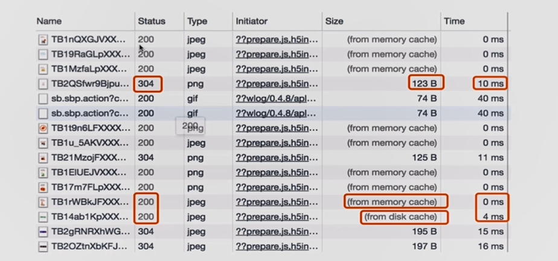
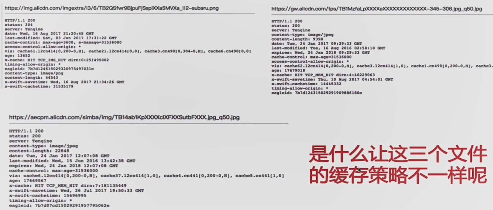
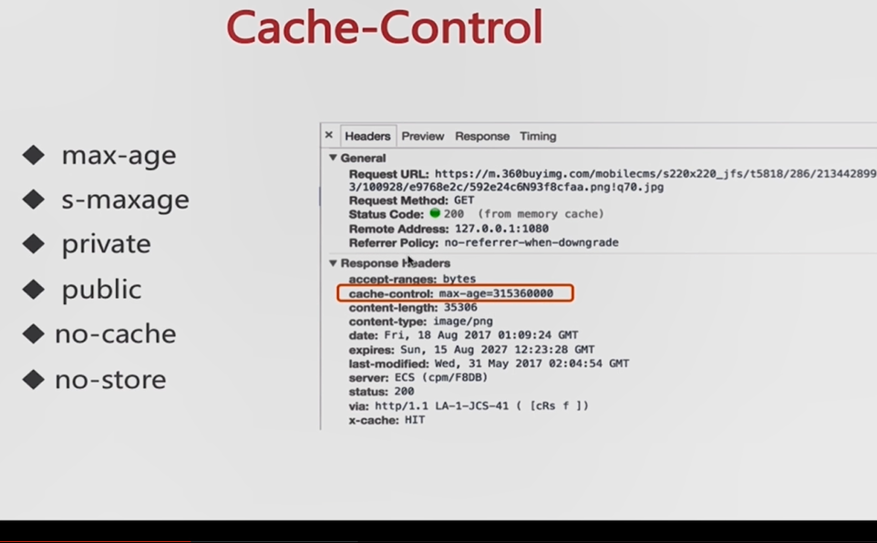
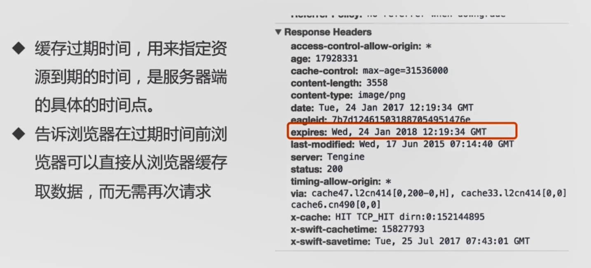
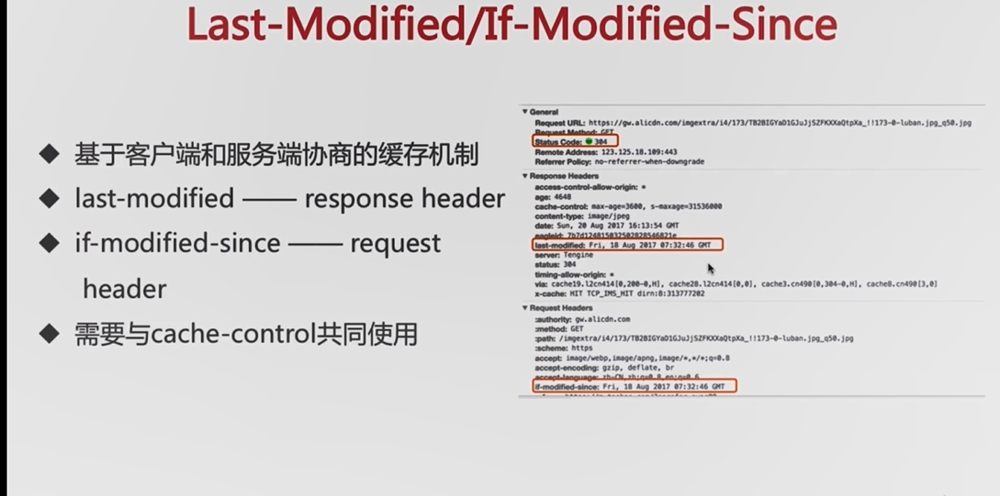
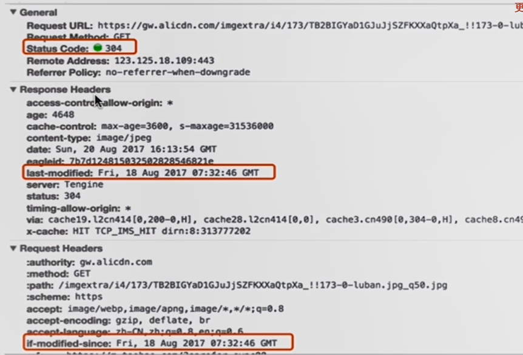
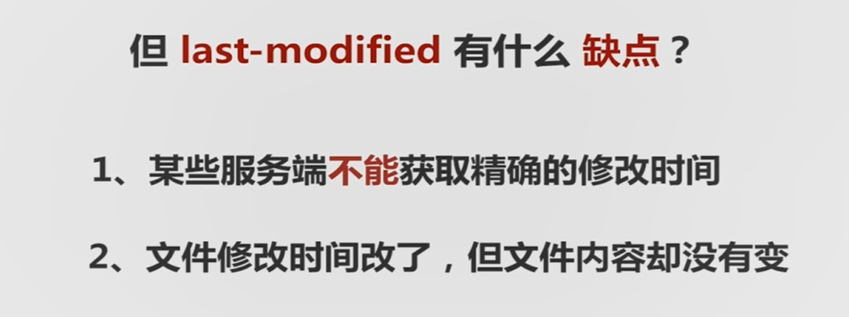
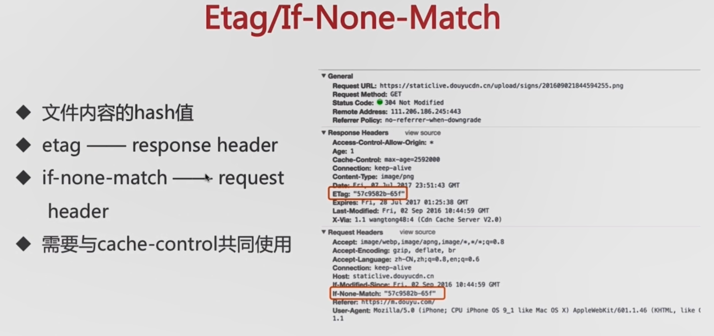
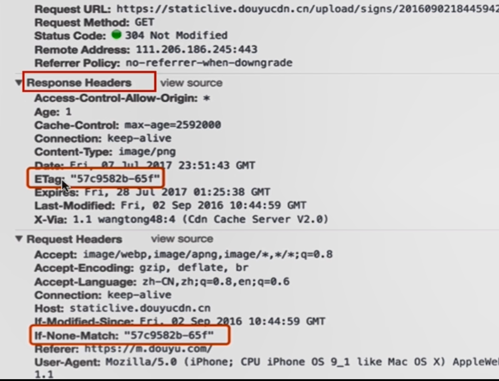
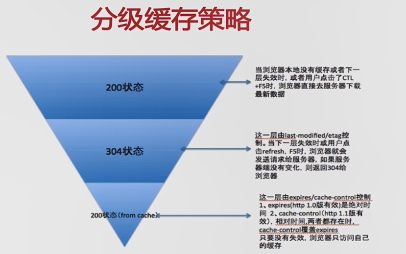

# 浏览器缓存

浏览器缓存是前端性能优化中最直接、最有效的手段之一。合理使用缓存可以显著减少网络请求、降低服务器压力、加快页面加载速度。

## 0. 课程目标
Http Response Header,与 Http Request 的缓存方式

- 理解 `cache-control` 所控制的缓存策略
- 理解 `last-modified 和 etag`，以及整个服务端与浏览器端的缓存流程
- 通过`Node js` 理解缓存策略如何在`客户端`，`服务端`运作




## 是什么导致了三个文件的缓存策略的不同
## 1.  Response header
通过`httpheader` 配置缓存信息




### 1.1 Cache-Control

```http
Cache-Control: max-age=3600
```

- HTTP/1.1 引入，优先级高于 `Expires`。
- 常用指令：

| 指令 | 含义 |
|------|------|
| `max-age=3600` | 缓存 3600 秒 |
| `no-cache` | 不强制缓存，每次使用协商缓存 |
| `no-store` | 不缓存任何内容 |
| `private` | 仅客户端可缓存 |
| `public` | 客户端和代理服务器都可缓存 |


### 1.2 Expires




- 缓存的过期时间，指定资源到期时间
- 告诉浏览器在过期时间前， 直接使用浏览器缓存读取数据，而无需再次请求接口

| `immutable` | 资源不会改变，强缓存期间不必协商 |

### 1.3. 协商缓存

强缓存失效后，浏览器会携带缓存标识向服务器确认资源是否变化。未变化时候返回 `304`。

### 1.4 Last-Modified / If-Modified-Since








```http
// 响应头
Last-Modified: Wed, 21 Oct 2026 07:28:00 GMT

// 再次请求时
If-Modified-Since: Wed, 21 Oct 2026 07:28:00 GMT
```

- 服务器返回资源的最后修改时间。
- 再次请求时携带该时间，服务器对比后决定返回 304 或新资源。
- 缺点：
  - 时间精度为秒，秒内多次修改无法感知。
  - 文件内容未变但修改时间变化时也会重新返回。


### 1.5 ETag / If-None-Match
> 用ETag， 解决文件内容未变但修改时间变化时，需要给文件加Md5方式。







```http
// 响应头
ETag: "33a64df5-0b7c-11e6-9a11-000c29c0a18e"

// 再次请求时
If-None-Match: "33a64df5-0b7c-11e6-9a11-000c29c0a18e"
```

- 服务器为资源生成唯一标识（通常是内容哈希）。
- 再次请求时携带该标识，服务器对比内容是否变化。
- 优先级高于 `Last-Modified`。
- 优点：内容不变则 ETag 不变，修改时间变化也不会误更新。


**304的情况，服务器资源没变‌，浏览器可以直接用本地缓存**
### 1.6 分级缓存策略




## 2. 案例解析


## 3. 缓存策略流程图


## 3.1 缓存流程图

```
        发起请求
           │
           ▼
    Service Worker 缓存？
           │
    ┌──────┴──────┐
    ▼             ▼
  命中          未命中
    │             │
    ▼             ▼
  返回        Memory Cache？
               │
        ┌──────┴──────┐
        ▼             ▼
      命中          未命中
        │             │
        ▼             ▼
      返回        Disk Cache？
                   │
            ┌──────┴──────┐
            ▼             ▼
          命中          未命中
            │             │
            ▼             ▼
          返回        Push Cache？
                       │
                ┌──────┴──────┐
                ▼             ▼
              命中          未命中
                │             │
                ▼             ▼
              返回        发起网络请求
                           │
                           ▼
                    服务器返回 + 缓存头
```

## 3.2. 缓存决策流程

```
请求资源
   │
   ▼
Cache-Control / Expires 是否有效？
   │
┌──┴──┐
▼     ▼
是    否
│     │
▼     ▼
强缓存  协商缓存
命中    ETag / Last-Modified 是否有效？
│         │
▼      ┌──┴──┐
200    ▼     ▼
(from  是    否
cache) │     │
       ▼     ▼
     304   200 + 新资源
```


## 4. 缓存策略实战


## 4. 实战建议
手写 `nodejs`服务器，实现缓存策略，服务器的`gzip压缩`， 与`服务器资源，性能`的优化
### 4.1 HTML 文件

- 不建议强缓存，或设置很短的有效期。
- 使用 `Cache-Control: no-cache` 保证每次都能获取最新版本。

```http
Cache-Control: no-cache
```

### 4.2 静态资源（JS、CSS、图片）

- 文件名带哈希，可长期强缓存。
- 资源更新时 URL 变化，浏览器会自动请求新资源。

```http
Cache-Control: public, max-age=31536000, immutable
```


## 5. 常见问题

### 5.1 为什么改了代码用户还是看到旧页面？

- HTML 被强缓存了，没有请求新的资源链接。
- 解决：HTML 不设置强缓存，或资源文件名带哈希。

### 5.2 强制刷新缓存

- 用户角度：按 `Ctrl + F5` 或 `Cmd + Shift + R`。
- 开发角度：修改资源文件名或 URL 加版本号。

### 5.3 Cache-Control 与 ETag 同时使用

- `max-age` 期间走强缓存，过期后携带 `If-None-Match` 协商缓存。
- 推荐组合使用。

## 8. 总结

| 缓存类型 | 状态码 | 特点 |
|---------|--------|------|
| 强缓存 | 200 (from cache) | 不发请求，速度最快 |
| 协商缓存 | 304 Not Modified | 发请求确认，节省带宽 |
| 无缓存 | 200 | 重新下载完整资源 |

合理配置缓存策略，是性能优化中性价比最高的措施之一。
