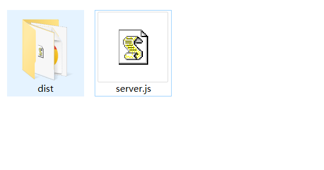

# 自定义开发服务


创建 `server.js`文件

然后使用`node server.js`启动服务`
```js
const http = require('http');
const fs = require('fs');
const path = require('path');

// ---------- 自动查找 dist 目录 ----------
const possible = [
  path.join(__dirname, 'frontend', 'dist'),
  path.join(__dirname, 'dist'),
  path.join(__dirname, 'build'),
];
let DIST_DIR = null;
for (const p of possible) {
  if (fs.existsSync(p) && fs.existsSync(path.join(p, 'index.html'))) {
    DIST_DIR = p;
    break;
  }
}
if (!DIST_DIR) {
  console.error('❌ 未找到包含 index.html 的 dist 目录，请检查路径。');
  console.error('   当前尝试的路径:');
  possible.forEach(p => console.error(`   - ${p}`));
  process.exit(1);
}
console.log(`✅ 使用静态目录: ${DIST_DIR}`);

const PORT = 4000;
const mimeTypes = {
  '.html': 'text/html',
  '.css': 'text/css',
  '.js': 'application/javascript',
  '.json': 'application/json',
  '.png': 'image/png',
  '.jpg': 'image/jpeg',
  '.gif': 'image/gif',
  '.svg': 'image/svg+xml',
  '.woff': 'font/woff',
  '.woff2': 'font/woff2',
  '.ttf': 'font/ttf',
  '.eot': 'application/vnd.ms-fontobject',
  '.ico': 'image/x-icon',
};

const server = http.createServer((req, res) => {
  try {
    let urlPath = req.url.split('?')[0];
    const cleanPath = urlPath.replace(/^\//, '');
    let filePath = path.join(DIST_DIR, cleanPath);

    const ext = path.extname(filePath);
    if (!ext || filePath.endsWith(path.sep)) {
      filePath = path.join(filePath, 'index.html');
    }

    console.log(`📥 请求: ${req.url} → ${filePath}`);

    fs.readFile(filePath, (err, content) => {
      if (err) {
        // 文件不存在 → 回退到 index.html
        console.log(`↩️  回退到 index.html`);
        const fallback = path.join(DIST_DIR, 'index.html');
        fs.readFile(fallback, (err2, fallbackContent) => {
          if (err2) {
            console.error(`❌ 回退失败: ${err2.message}`);
            res.writeHead(500, { 'Content-Type': 'text/plain' });
            res.end('Internal Server Error: ' + err2.message);
            return;
          }
          res.writeHead(200, { 'Content-Type': 'text/html' });
          res.end(fallbackContent);
        });
        return;
      }

      const mime = mimeTypes[path.extname(filePath)] || 'application/octet-stream';
      res.writeHead(200, { 'Content-Type': mime });
      res.end(content);
    });
  } catch (e) {
    console.error('❌ 异常:', e.stack);
    res.writeHead(500, { 'Content-Type': 'text/plain' });
    res.end('Internal Server Error');
  }
});

server.listen(PORT, () => {
  console.log(`✅ 服务器启动: http://localhost:${PORT}`);
});
```