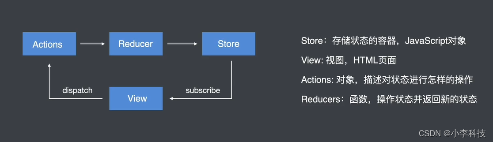

# 一. redux 学习进阶---Redux核心

JavaScript 状态容器, 提供可预测的状态管理

+ 1. Redux核心

  > 核心工作流

+ 2. React + Redux

  > **共享数据流, 共享状态与方法**

+ 3. Redux中间件

  > 常见中间件 ,redux-saga,  redux-thunk ,redux-action

+ 4. 开发Redux中间件

  > 开发中间件

+ 5. Redux综合案例

  > 巩固所学知识点

## 一 Redux核心

### 1.1 Redux介绍

javascript 状态容器,  提供可预测化的状态管理

**让状态容易维护**

```js
const state={
    modelOpen:'yes', // 弹窗展示或隐藏
    btnClicked:'no', // 按钮是否点击
    btnActiveClass:'active',
    page:5,
    size:10
}
```

### 1 Redux 核心

### 1.3 Redux核心概念及工作流程




**dispatch**: view 需要通过dispatch派发 action对象,更新store 数据,从而更新页面view

**subscribe**: 订阅数据,更新视图


### 1.4 Redux计数器案例


```html
<!DOCTYPE html>
<html lang="en">
<head>
    <meta charset="UTF-8">
    <meta http-equiv="X-UA-Compatible" content="IE=edge">
    <meta name="viewport" content="width=device-width, initial-scale=1.0">
    <title>Document</title>
</head>
<body>
    <button id="plus">+</button>
    <span id='count'>0</span>
    <button id="minus">-</button>

    <script src="redux.min.js"></script>
    <script>


        // 3. 存储默认状态
        var initialState = {count: 0} 
        // 2. 创建reducer函数
        function reducer(state=initialState, actions) {
            console.log('actions', actions);
            var type= actions.type
            if(type==='increment'){
                return {
                    count:state.count+1
                };
            }


            if(type==='decrement'){
                 return {
                    count:state.count-1
                 };
            }

            
            return state;
        }
        // 1. 创建store对象
        var store = Redux.createStore(reducer)


        // 获取store对象中存储的状态
        console.log(store.getState());
        
        // 4.定义action
        var increment = {type:'increment'}
        var decrement = {type:'decrement'}


        // 5.获取按钮 给按钮添加点击事件
        document.getElementById('plus').onclick=function(){
            // console.log(1);
            // 6. 触发action
            store.dispatch(increment)
        }

        document.getElementById('minus').onclick=function(){
            // console.log(1);
            store.dispatch(decrement)
        }

        // 7.订阅store
        store.subscribe(()=>{
            // 获取store对象中存储的状态
            // console.log(store.getState());
            
            // 将获取到的数据进行订阅赋值
            document.getElementById('count').innerHTML=store.getState().count

        })

    </script>
</body>
</html>


```


### 1.5 Redux核心Api

```js
// 创建Store 状态容器
const store = Redux.createStore(reducer)

// 创建用于处理状态的 reducer 函数
function reducer(state = initialState, action){}

// 获取状态
store.getState();

// 订阅状态
store.subscribe(function(){});

// 触发Action(由dispatch 触发action  )
store.dispatch({type:'description...'})
```

下一篇:    
[二. redux 学习进阶---React + Redux
](https://blog.csdn.net/qq_35812380/article/details/122160758)


