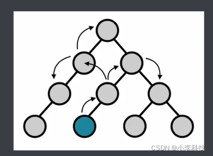
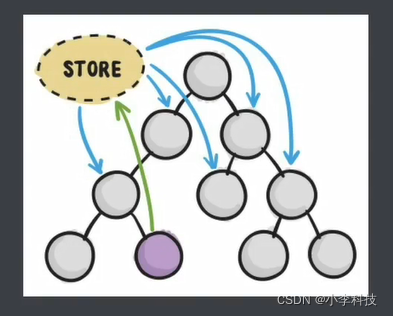
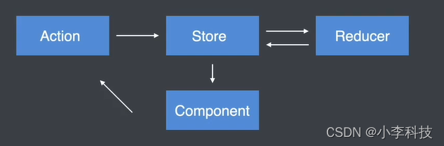
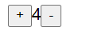

# 二. redux 学习进阶---React + Redux
## Redux解决了什么问题


## 二 React + Redux

### 2.1 在React 中不使用Redux 时遇到的问题


1. **在React中组件通信的数据流是单向的,**

2. **顶层组件可以通过props属性向下层组件传递数据,**

3. **而下层组件不能向上层组件传递数据,**

4. **要想实现下层组件修改数据, 需要上层组件传递修改数据的方法到下层组件**
5. **当项目越来越大时候,组件之间传递数据变得越来越困难.**




 

### 2.2 在React 中加入Redux 好处

**使用Redux管理数据, 由于Store独立于组件, 使得数据管理独立于组件, 解决了组件与组件之间传递数据困难的问题.**




 

## 在React 中使用 Redux

### 2.3 下载Redux

安装 redux , react-redux  这两个模块

```bash
$	npm install redux react-redux
```

 

### 2.4 Redux工作流程

1. 组件通过dispatch方法触发Action
2. Store 接收Action并将Action分发给Reducer
3. Reducer 根据Action类型对状态进行更改并将更改后的状态返回给Store
4. 组件订阅了Store中的状态, Store中的状态更新会同步到组件




[nvm环境配置](https://www.bilibili.com/video/BV12h411z7Kq?from=search&seid=6898323572004308878&spm_id_from=333.337.0.0)

配合博客安装:https://www.mintimate.cn/2021/07/26/nvmNode/

相关博文:

https://segmentfault.com/a/1190000040688010

```js
NPM配置淘宝镜像
临时使用

npm install --registry https://registry.npm.taobao.org
 

全局使用

npm config set registry https://registry.npm.taobao.org
查看全局配置

npm config get registry
恢复全局配置

npm config set registry https://registry.npmjs.org
 

通过CNPM使用

npm install -g cnpm --registry=https://registry.npm.taobao.org
```


创建项目

```bash
$	npm install create-react-app -g
$   create-react-app react-redux-guide
$   cd react-redux-guide/
$   npm start

//项目目录
|____react-redux-guide
|____README.md
|____node_modules/
| |____package.json
|____.gitignore
|____public
| |____favicon.ico
| |____index.html
|____src
| |____App.js

| |____index.js


```


 在浏览器中打开 [http://localhost:3000/](https://link.segmentfault.com/?enc=v9ECHhrO%2BHBORN62Gi3fpQ%3D%3D.2P5E2cFGk%2Fmrcgslvd3vQP71pxc4TBVhpFo3qXkyzB4%3D) ，即可显示




// src\App.js

```jsx
import React from "react";
import ReactDOM from "react-dom";
import App from "./App";

import { createStore } from "redux";

const initialState = {
  count: 0,
};

function reducer(state = initialState, actions) {
  switch (actions.type) {
    case "increment": // 数值 + 1 ,返回一个新对象
      return {
        count: state.count + 1
      }

    case "decrement":
      return {
        count: state.count - 1
      }
    default:
      return state;
  }


}

const increment = { type: "increment" };
const decrement = { type: "decrement" };

const store = createStore(reducer);

function Counter() {
  return (
    <div>
      <button onClick={() => store.dispatch(increment)}>+</button>
      <span>{store.getState().count}</span>
      <button onClick={() => store.dispatch(decrement)}>-</button>
    </div>
  );
}

// 必须要订阅订阅数据更新,返回一个新的组件
store.subscribe(()=>{// 订阅数据返回新的数值
  ReactDOM.render(<Counter />, document.getElementById("root"));
})


// console.log("store", store.getState());

ReactDOM.render(<Counter />, document.getElementById("root"));

```


发现遇到一些问题, 

1.  **store部分代码写了两次,  如何分离store**
2.  **分离后如何拿到store对象, 将是解决的问题**

https://github.com/dL-hx/react-redux-guide

feat/1.0.0分支


## Provider组件与connect方法

https://github.com/dL-hx/react-redux-guide

feat/1.1.0分支


### 2.5 connect方法两个参数


mapStateToProps，

mapDispatchToProps，

1.1 Provider组件与connect方法

为了使react 和 redux进行结合 ，需要通过 react-redux 模块实现连接


```
connect 作用
1. 帮助订阅store
2. 当store中状态发生变化，  会重新渲染组件

3. 获取store中的状态， 将状态映射到props属性中映射给组件
4. 获取dispatch方法， 触发action 
```

connect方法两个参数意义
mapStateToProps，
mapDispatchToProps，

```jsx
import React from "react";
import { connect } from "react-redux";
import {increment, decrement} from './../../index'

// function Counter(props) {
// 解构操作
function Counter({count, addCount, minusCount, dispatch}) {
  console.log(count);
  
  return (
    <div>
      {/* <button onClick={() => store.dispatch(increment)}>+</button> */}
      {/* <button onClick={() => dispatch(increment)}>+</button> */}
      {/* <button onClick={() => addCount()}>+</button> */}
      <button onClick={addCount}>+</button>
      {/* <span>{store.getState().count}</span> */}
      <span>{count}</span>
      {/* <button onClick={() => store.dispatch(decrement)}>-</button> */}
      {/* <button onClick={() => minusCount()}>-</button> */}
      <button onClick={minusCount}>-</button>
    </div>
  );
}


const mapStateToProps = (state)=>{
  return {
    // a:'b',
    count:state.count
  }
}


const mapDispatchToProps = (dispatch)=>{
  
  return {
    // addCount:function (data) {
    //   dispatch(increment)
    // },

    // 简化后如下
    addCount(data) {
      dispatch(increment)
    },

    minusCount(data) {
      dispatch(decrement)
    },


    dispatch
  }
}


export default connect(mapStateToProps,mapDispatchToProps )(Counter);
```


## bindActionsCreators方法

### 2.6 bindActionsCreators方法

https://github.com/dL-hx/react-redux-guide

feat/1.2.0分支


 目的： 调用方法生成函数， 优化如下代码

```js
const mapDispatchToProps = (dispatch)=>{
  
  return {
    // addCount:function (data) {
    //   dispatch(increment)
    // },

    // 简化后如下
    addCount(data) {
      dispatch(increment)
    },

    minusCount(data) {
      dispatch(decrement)
    },


    dispatch
  }
}
```

优化后

```js
import { bindActionCreators } from "redux";


const mapDispatchToProps = (dispatch) => ({
  // 用于生成函数
  ...bindActionCreators(
    {
      addCount() {
        return increment;
      },

      minusCount() {
        return decrement;
      },
    },
    dispatch
  ),
  
});
```

等价于

```js
const mapDispatchToProps = (dispatch) => ({
  // 用于生成函数
  ...bindActionCreators(
    {
      addCount() {
        return {type:'increment'};
      },

      minusCount() {
        return {type:'decrement'};
      },
    },
    dispatch
  ),
});
```


```js
import * as counterActions  from './../../store/actions/counter.actions'


const mapDispatchToProps = (dispatch) => ({
  // 用于生成函数
  ...bindActionCreators(counterActions, dispatch),
});
```


一个action简化如下

```js
const mapDispatchToProps = (dispatch) =>
(bindActionCreators(counterActions, dispatch));

```


### 2.7 代码重构

https://github.com/dL-hx/react-redux-guide

feat/1.3.0分支


App.js

```js
import React from "react";
import ReactDOM from "react-dom";
// import App from "./App";
import Counter from "./components/Counter";

import {store} from "./store";

// import { createStore } from "redux";
import { Provider } from "react-redux";

/* 
react-redux 
  Provider: 将store放到全局中，  组件都能拿到的地方
  connect
*/


ReactDOM.render(
  // 通过Provider 组件， 将store 放到了全局组件可以够得到的地方
  <Provider store={store}>
    <Counter />
  </Provider>,
  document.getElementById("root")
);

```


1.将reducer函数， 创建store代码放到store代码中

store

```js
import { createStore } from "redux";
import reducer from './reducers/counter.reducer'

export const store = createStore(reducer);

```

const

const/counter.const.js

```js
export const INCREMENT= "increment"
export const DECREMENT= "decrement"

```

reducers

reducers/counter.reducer.js


```js
import { INCREMENT ,DECREMENT } from "../const/counter.const";

const initialState = {
    count: 0,
  };

function reducer(state = initialState, actions) {
      switch (actions.type) {
        case INCREMENT: // 数值 + 1 ,返回一个新对象
          return {
            count: state.count + 1,
          };
    
        case DECREMENT:
          return {
            count: state.count - 1,
          };
        default:
          return state;
      }
}

export default reducer
    
```

actions

actions/counter.action.js

```js
export const INCREMENT= "increment"
export const DECREMENT= "decrement"

```


2. 将action类型代码拆分为常量，防止写错
   INCREMENT, DECREMENT


## Action传递参数

### 2.8 Redux使用步骤

为action传递参数

#### 1. 传递参数

点击按钮时候数值 + 5

```jsx
<button onClick={()=>addCount(5)}> + 1</button>
```


#### 2.接收参数, 传递reducer

```jsx
export const addCount = payload =>({type:INCREMENT, payload });
```


#### 3. reducer根据接收到的数据进行处理

```js
export default (state, actions)=>{
    switch(actions.type){
        case INCREMENT:
           // 返回一个新的对象给 store
            return {count: state.count + actions.payload }
    }
}
```

https://github.com/dL-hx/react-redux-guide


feat/1.4.0分支


## Redux弹出框

https://github.com/dL-hx/react-redux-guide

feat/1.5.0分支


reducers/counter.reducer.js

```js
import { INCREMENT, DECREMENT } from "../const/counter.const";
import { SHOW_MODAL, HIDE_MODAL } from "../const/modal.const";

const initialState = {
  count: 0,
  show: false,
};

function reducer(state = initialState, actions) {
  switch (actions.type) {
    case INCREMENT: // 数值 + 1 ,返回一个新对象
      return {
        ...state,
        // count: state.count + 1,
        count: state.count + actions.payload,
      };

    case DECREMENT:
      return {
        ...state,
        // count: state.count - 1,
        count: state.count - actions.payload,
      };

    // 这里需要保存原有的state,进行拷贝
    case SHOW_MODAL:
      return {
        ...state,
        show: true,
      };

    case HIDE_MODAL:
      return {
        ...state,
        show: false,
      };
    default:
      return state;
  }
}

export default reducer;

```

modal.actions.js

```js
import { SHOW_MODAL, HIDE_MODAL } from "../const/modal.const";

export const show = () => ({ type: SHOW_MODAL });
export const hide = () => ({ type: HIDE_MODAL });
```

components/Modal/index.js

```js
import React from "react";
import { connect } from "react-redux";
import { bindActionCreators } from "redux";
import * as modalActions from "./../../store/actions/modal.actions";

function Modal(props) {
  
  const styles = {
    width: 200,
    height: 200,
    position: "absolute",
    left: "50%",
    top: "50%",
    // marginLeft 等于,负的 自己盒子W的一半
    // -200/2 = -100
    marginLeft: -100,
    // marginTop 等于,负的 自己盒子H的一半
    // -200/2 = -100
    marginTop: -100,
    backgroundColor: "skyblue",
    display: props.vist ? "block" : "none",
  };

  return (
    <div>
      <button onClick={()=>props.show()}>显示</button>
      <button onClick={()=>props.hide()}>隐藏</button>
      {/*  {
             props.show&&<div style={styles}></div>
        } */}
      <div style={styles}></div>
    </div>
  );
}

// export default Modal;
const mapStateToProps = (state) => {
  return {
    vist: state.show,
  };
};

const mapDispatchToProps=(dispatch)=>{
    return bindActionCreators(modalActions, dispatch)
}

export default connect(mapStateToProps, mapDispatchToProps)(Modal);

```
## **拆分Reducer**

https://github.com/dL-hx/react-redux-guide


feat/1.6.0分支


既匹配了counter的reducer,又匹配了modal的reducer,看如何拆分reducer,又能将其进行组合


### 1. 拆分reducer

counter.reducer.js

modal.reducer.js

### 2. 合并reducer

combineReducers

```js
 import { combineReducers } from 'redux'
```


reducers/root.reducer.js
```js
// root reducer 用来reducer的合并
 import { combineReducers } from 'redux'

//  1. 拆分reducer
 import CounterReducer from './counter.reducer'
 import ModalReducer from './modal.reducer'

 // 2. 合并reducer
 // {counter:{count:0}, model:{show:false}}
export default combineReducers({
    counter: CounterReducer,
    modal: ModalReducer,
})
```


\src\store\index.js

```js
import { createStore } from "redux";
// import reducer from './reducers/counter.reducer'
// 改为合并后的reducers
import RootReducer from './reducers/root.reducer'

export const store = createStore(RootReducer);
```


调用时候修改如下

```js
const mapStateToProps = (state) => {
  return {
    vist: state.modal.show,
  };
};
```


```js
const mapStateToProps = (state) => {
  return {
    // a:'b',
    count: state.counter.count,
  };
};
```


上一篇:    
[一. redux 学习进阶---Redux核心](https://blog.csdn.net/qq_35812380/article/details/122137770)
下一篇
[三. redux 学习进阶---Redux 中间件](https://blog.csdn.net/qq_35812380/article/details/122205883)
