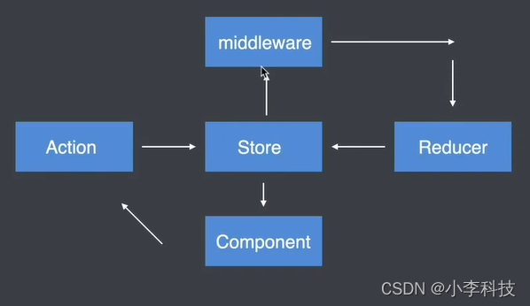
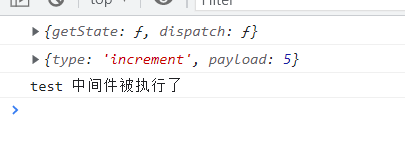
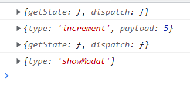
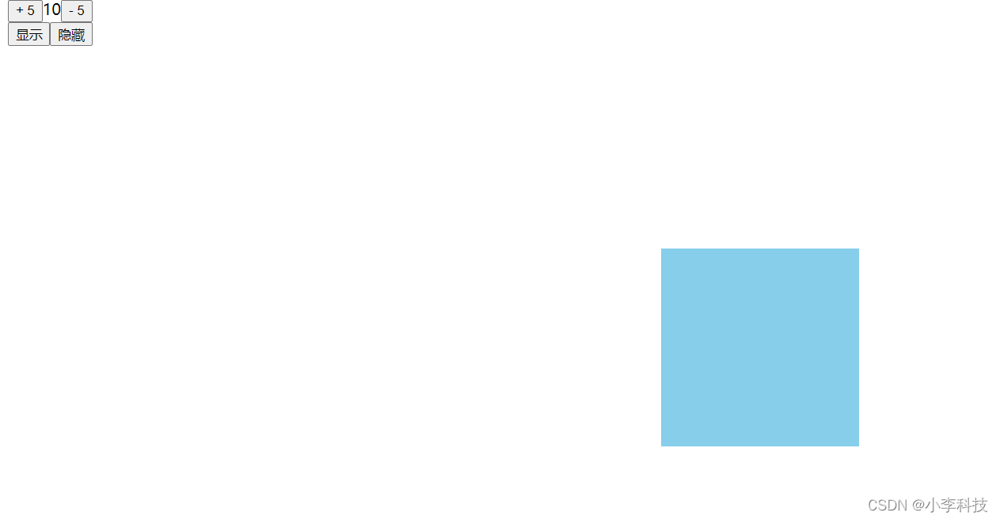

# 三. redux 学习进阶---Redux 中间件


## 中间件概念介绍
### 3.1 什么是中间件?

1. **中间件允许我们扩展redux应用程序**
2. **中间件是一个函数,  扩展增强redux能力**
3. **组件优先被中间件处理**
4. **增强action的处理能力**


### 3.2 加入了中间件的Redux工作流?
中间件中处理action,处理完成后交给reducer



## 开发Redux中间件

https://github.com/dL-hx/react-redux-guide

feat/1.7.0分支


### 3.3 开发Redux中间件

开发中间件的模板代码

```js
export default store => next =>action=> {}
```

### 3.4 注册中间件

将开发好的中间件需要 为store注册,  这个中间件才会生效

> 中间件在开发完成以后只有被注册才能在Redux的工作流程中生效

./store/index.js

```js
import {createStore, applyMiddleware } from 'redux';
import logger from './middlewares/logger';

createStore(reducer, applyMiddleware( 
    logger
));
```


```
//项目目录
|____react-redux-guide
|____src
| |____...
| |____store
| 	|____actions
| 	|____const
+ 	|____middleware
+ 		|____logger.js
| 	|____reducers
| 	|____index.js


```

./middleware/logger.js

```js
// 导出中间件的模板代码
export default function (store) {
    return function (next) {
        return function (action) {
            // 在这里执行自己的逻辑
        }
    }
}
```

===> 简化为

箭头函数的写法简化

```js
export default (store) => (next) => (action) => {
    // 在这里执行自己的逻辑
};
```

1. 定义中间件

```js
export default (store) => (next) => (action) => {
    // 在这里执行自己的逻辑

    // 输出store
    console.log(store);

    // 输出这个action
    console.log(action);

    // <调用>next 方法
    // 目的: 将这个action 传递给 reducer,
    // 并将action 传递给reducer
    next(action);
    
};
```

2. 注册中间件

./store/index.js

```js
import { createStore, applyMiddleware } from "redux";
// import reducer from './reducers/counter.reducer'
// 改为合并后的reducers
import RootReducer from "./reducers/root.reducer";

// 引入中间件
import logger from "./middleware/logger";

// 注册中间件
export const store = createStore(RootReducer, applyMiddleware(logger));

```

发现中间件组件已经被注册.




多个中间件的注册,   多中间件的执行顺序

./middleware/test

```js
export default (store) => (next) => (action) => {
    console.log('test 中间件被执行了');
    next(action) // 需要传递给下一个中间件,让reducer接收,否则代码卡到这里不会向下执行
};
```


```js
import { createStore, applyMiddleware } from "redux";
// import reducer from './reducers/counter.reducer'
// 改为合并后的reducers
import RootReducer from "./reducers/root.reducer";

// 引入中间件
import logger from "./middleware/logger";
import test from "./middleware/test";

// 注册中间件-------------(执行顺序取决于这里的注册顺序)
export const store = createStore(RootReducer, applyMiddleware(
    logger,
    test
));

```




## 中间件开发实例



https://github.com/dL-hx/react-redux-guide

feat/1.8.0分支


延迟相加/延迟弹窗展示

通过中间件完成

> **在redux工作流中加入异步操作**

在修改时候,不会修改中间件代码,这样设计比较灵活.

.\store\middleware\thunk.js

```js
export default store =>next => action =>{
    // 1.当前这个中间件函数不关心你想执行什么样的异步操作,  只关心你是不是异步操作

    // 2. 如果是异步操作,  触发action, 传递为一个函数

    // 3. 如果是同步操作,传递action 对象

    // 4. 异步操作写在你传递进来的函数

    // 5. 当前这个中间件函数在调用你传递的函数时候,  将dispatch 传递过去

    // 6. 在函数中,通过dispatch 派发action --->reducer保存数据

    // 让action自己决定什么时候,进行dispatch 数据
    if(typeof action === 'function'){
        return action(store.dispatch)
    }

    next(action)


    // if(action.type==='increment'||action.type==='decrement'){
    //     setTimeout(()=>{
    //         next(action)// 延迟两秒后生效
    //     },2000)
    // }
}
```


```js
import { createStore, applyMiddleware } from "redux";
// import reducer from './reducers/counter.reducer'
// 改为合并后的reducers
import RootReducer from "./reducers/root.reducer";

// 引入中间件
import logger from "./middleware/logger";
import test from "./middleware/test";
import thunk from "./middleware/thunk";

// 注册中间件
export const store = createStore(RootReducer, applyMiddleware(
    logger,
    test,
    thunk
));

```

.\store\actions\modal.actions.js

```js
// 让弹出框延迟显示

export const show_async = ()=> (dispatch)=>{
    setTimeout(()=>{
        dispatch(show())
    },2000)
}
```

.\store\actions\counter.actions.js

```js
import { INCREMENT ,DECREMENT } from "../const/counter.const";
//---------------=> action 对象
export const addCount = (payload)=> ({type:INCREMENT, payload })

export const addCount_async = (payload)=> (dispatch)=>{
    setTimeout(()=>{
        // 两秒后派发dispatch ,到reducer 处理
        dispatch(addCount(payload))
        // 等价于这个
        // dispatch({type:INCREMENT, payload })
    },2000)
}
```

组件代码调用

```js
  <button onClick={()=>addCount_async(5)}>+ 5 </button>
```

```js
  <button onClick={()=>props.show_async()}>显示</button>
```


上一篇:    
[二. redux 学习进阶---React + Redux](https://blog.csdn.net/qq_35812380/article/details/122160758)
下一篇
[四. redux 学习进阶---Redux常用中间件](https://blog.csdn.net/qq_35812380/article/details/122223437)


