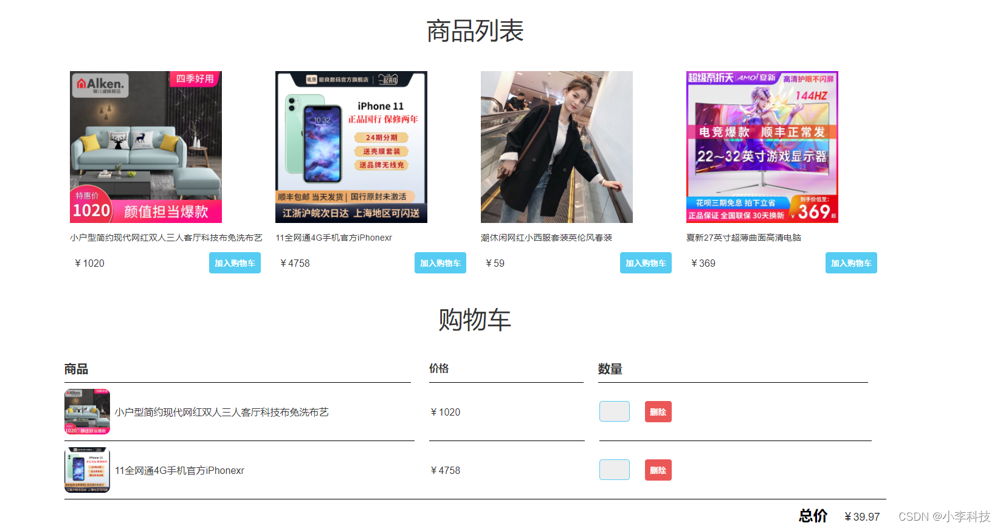
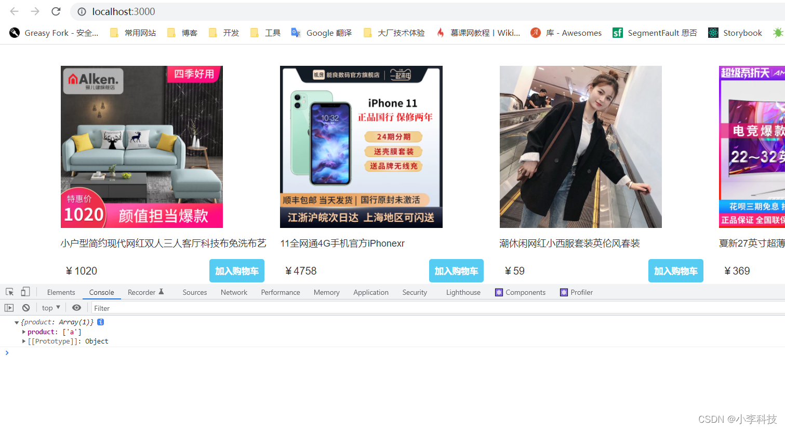

# 五. redux shopping案例


https://github.com/dL-hx/shopping

### 5.1 项目初始化

shoppingCart 项目前端文件

shoppingCartService 项目服务端文件




```js
import React from 'react'
import CartTable from './CartTable';
import ProductList from './ProductList';


function App() {
  return (
    <div>
       <ProductList />
       <CartTable />
    </div>
  );
}

export default App;
```

### 5.2 搭建redux工作流

> 搭建完成的工作流查看如下:
>
> https://github.com/dL-hx/shopping/releases/tag/v1.0
>
> ```
> redux工作流创建
> ```


git tag 使用技巧

> https://wenku.baidu.com/view/63cf605502f69e3143323968011ca300a6c3f6bc.html
>
> 1、添加tag
>
> > git tag v0.2.0 -m"use sdl [render](https://so.csdn.net/so/search?q=render&spm=1001.2101.3001.7020) audio."
>
> 2、提交tag
>
> > git push --tags


#### 5.2.1 依赖安装

```shell
$	npm install redux react-redux redux-saga redux-actions --save

```

#### 5.2.2 项目文件目录

> 参考如下进行搭建         feat/1.6.0分支

> https://github.com/dL-hx/react-redux-guide

```
+ ------store
	+ ------actions
	+ ------reducers
		+ product.reducer.js
		+ ------root.reducer.js // 根目录的reducer
	+ ------sagas
	+ ------index.js

```


app.js

> 引入Provider

```js
import React from 'react';
import ReactDOM from 'react-dom';
import App from './components/App';
import { Provider } from 'react-redux'
import {store} from './store' // 引入Provider
import './index.css';

ReactDOM.render(
  <Provider store={store}>
    <App />
  </Provider>,
  document.getElementById('root')
);
```

至此基本搭建完成
### 5.3 action文件编写

#### 5.3.1 实现商品列表数据获取

> ```
> redux-saga搭建获取产品数据
> ```
>
> 查看如下:
>
> https://github.com/dL-hx/shopping/tree/v1.1
>
> ```
> redux-saga搭建获取产品数据
> ```


> 查看  4.2 redux-saga, 异步操作,放入redux-store中
>
> 查看  4.3 redux-actions 中间件 减少了模板代码的编写
>
> 思考为什么要使用redux-saga?
>
> https://blog.csdn.net/weixin_34293059/article/details/93169225

redux-saga优点：

- 异步解耦：异步操作被被转移到单独saga.js中，不再是掺杂在action.js或component.js中；
- action摆脱thunk function: dispatch的参数依然是⼀个纯粹的 action (FSA)，⽽不是充满 “⿊魔法” thunk function；
- 异常处理：受益于 generator function 的saga实现，代码异常/请求失败都可以直接通过try/catch语法直接捕获处理；
- 功能强⼤：redux-saga提供了⼤量的Saga辅助函数和Effect创建器供开发者使⽤，开发者⽆须封装或者简单封装即可使⽤；
- 灵活：redux-saga可以将多个Saga可以串⾏/并⾏组合起来，形成⼀个⾮常实⽤的异步flow；
- 易测试，提供了各种case的测试⽅案，包括mock task，分⽀覆盖等等。

redux-saga缺陷：

- 额外的学习成本：redux-saga不仅在使⽤难以理解的generator function，⽽且有数⼗个API，学习成本远超reduxthunk，最重要的是你的额外学习成本是只服务于这个库的
- 体积庞⼤：体积略⼤，代码近2000⾏，min版25KB左右；
- 功能过剩：实际上并发控制等功能很难⽤到，但是我们依然需要引⼊这些代码；
- ts⽀持不友好：yield⽆法返回TS类型。

		+ ------store
		+ ------actions
		+ ------reducers
			+ product.reducer.js
			+ ------root.reducer.js // 根目录的reducer
		+ ------sagas
			+ product.saga.js    // product.saga
			+ ------root.saga.js // 合并saga
		
		+ ------index.js
	

```js
product.action.js

	+ loadProducts

	+ saveProducts
```


bindActionCreactors

sagaMiddleware


#### [v1.2](https://github.com/dL-hx/shopping/releases/tag/v1.2)

```
redux-saga展示购物车数据
```


#### 5.3.2 商品加入购物车中


#### [v1.3](https://github.com/dL-hx/shopping/releases/tag/v1.3)

```
CRUD
```

#### 5.3.2 商品加入购物车中

```js
// 加入购物车
export const addCartListServer = createAction('addCartListServer');

// 更改商品数量
export const changeCartNumListClick = createAction('changeCartNumListClick');
```


#### 5.3.3 购物车案例CRUD

```js
// 加入购物车
export const addCartListServer = createAction('addCartListServer');

// 更改商品数量
export const changeCartNumListClick = createAction('changeCartNumListClick');


// 更改购物车中的商品数量
export const addCartItemNumServer = createAction('addCartItemNumServer');

// 改变货物数量(修改本地数据)
export const changeCartNumListLocal = createAction('changeCartNumListLocal');


// 删除购物车商品

export const delCartItemServer = createAction('delCartItem');

// 改变删除后的CartList (修改本地数据)
export const delCartItemLocal = createAction('delCartItemLocal');
```


上一篇:
[四. redux 学习进阶---Redux常用中间件](https://blog.csdn.net/qq_35812380/article/details/122223437)
下一篇
...