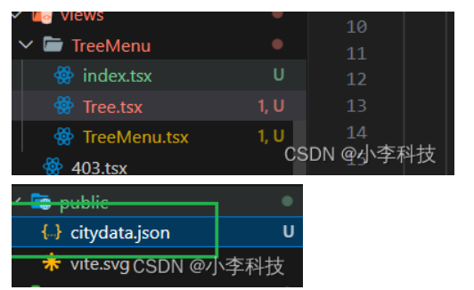

# React18-树形菜单-递归

## 案例分析
[https://github.com/dL-hx/manager-fe/commit/85faf3b1ae9a925513583feb02b9a1c87fb462f7](https://github.com/dL-hx/manager-fe/commit/85faf3b1ae9a925513583feb02b9a1c87fb462f7)
> 从接口获取城市数据,渲染出一个树形菜单
> 要求:
> 可以展开和收起
##  技巧
> 1. 学会递归渲染出一个树形菜单, 并点击后可以展开和收起
> 2. 通过对数据上添加控制字段(show)避免在子组件添加各种同步的useState,等字段.保证单向数据流向, 来简化问题.

## 通信
> 父子通信


## 展示效果


## 实现代码

`src\views\TreeMenu\index.tsx`
```js
import TreeMenu from "./TreeMenu";
export default TreeMenu
```

### 技巧点
> 1. 调用pulic/citydata.json数据
> 2. 通过原数据添加`show`字段,递归处理.为每一个item添加`show`字段
> 3. 当再次点击`item`选项时候,根据**原数据上的`show`字段进行控制**,  递归修改源数据对应的id(判断条件找到对应item, if (item.value === id) ).
将其取反后setData
> 对于接口源数据没有返回的**ui控制字段**,前端**需要自己添加**

**因为是react, 对引用数据修改要注意需要生成新数据后在setData**
`src\views\TreeMenu\TreeMenu.tsx`
```js
import { Button } from "antd";
import { useState, useEffect } from "react";
import Tree from "./Tree";
export default function TreeMenu() {
    const [data, setData] = useState([])

    useEffect(() => {
        fetch('/citydata.json').then(res => res.json()).then(res => {
            setData(recursionAddProps(res))
        })
    }, [])

    // 当数据请求过来后,我们要递归式给每一个数据加一个属性,用来控制是否展开功能
    const recursionAddProps = (data) => {
        // 在item 上加一个属性
        // show: true 则展开,  false 折叠
        return data.map((item) => {
            item.show = false
            // 递归式自己调用自己
            if (item.children) {
                recursionAddProps(item.children)
            }
            return item
        })
    }

    /**
     * 
     * @param data 源数据
     * @param id 点击的id选项
     * @returns 
     */
    const recursionEditProps = (data, id) => {
        // 在item 上加一个属性
        // show: true 则展开,  false 折叠
        return data.map((item) => {
            if (item.value === id) { // 判断条件: 找到对应id在取反
                item.show = !item.show // 取反
            } 
            // 递归式自己调用自己
            if (item.children) {
                recursionEditProps(item.children, id)
            }
            return item
        })
    }

    // 获取到子组件传递过来的数据
    const setShow = (child) => {
        // item.show = true
        // const newData = data.map((item) => {
        //     if (item['value'] === child.value) {
        //         // @ts-ignore
        //         item['show'] = !child.show
        //     }
        //     return item
        // })
        // setData(newData)

        // 需要递归处理这个show展开 
        // console.log(recursionEditProps(data, child.value));
        // 通过item-id,把数据中的show 改为true
        setData(recursionEditProps(data, child.value))
    }
    return <div>
        <Tree data={data} setShow={setShow}></Tree>
    </div>
}
```


### 技巧点
> 1. 递归调用自身
> 2. 通过为父组件原数据添加`show`字段,  子组件修改父组件数据结构的`show`字段来控制,子组件是否展示
**因为是单向数据流, 数据控制视图, 通过递归完成**

`src\views\TreeMenu\Tree.tsx`
```js
import Tree from './Tree'

export default ({ data, show=true, setShow }: any) => {
    console.log(data);

    return <ul style={{display: show? 'block': 'none'}}>
        {
            Array.isArray(data) && data.length && data.map(item => {
                return <li key={item.value} onClick={(event)=>{
                    // 清除冒泡
                    event.stopPropagation()
                    setShow(item)
                }}>
                    {item.value}
                    {/* 递归组件 */}
                    {
                        item.children && item.children.length && <Tree data={item.children} show={item.show} setShow={setShow}/>
                    }
                </li>
            })
        }
    </ul>
}
```
`/public/citydata.json`
```json
[
    {
        "lable": "北京市",
        "value": "北京市",
        "children": [
            {
                "lable": "东城区",
                "value": "东城区",
                "children": [
                    {
                        "lable": "东城区-0",
                        "value": "东城区-0"
                    },
                    {
                        "lable": "东城区-1",
                        "value": "东城区-1"
                    },
                    {
                        "lable": "东城区-2",
                        "value": "东城区-2"
                    }
                ]
            },
            {
                "lable": "西城区-1",
                "value": "西城区",
                "children": [
                    {
                        "lable": "西城区-0",
                        "value": "西城区-0"
                    },
                    {
                        "lable": "西城区-1",
                        "value": "西城区-1"
                    },
                    {
                        "lable": "西城区-2",
                        "value": "西城区-2"
                    }
                ]
            },
            {
                "lable": "海淀区-2",
                "value": "海淀区-2"
            }
        ]
    },
    {
        "lable": "西安市",
        "value": "西安市",
        "children": [
            {
                "lable": "长安区-0",
                "value": "长安区-0"
            },
            {
                "lable": "桥西区-1",
                "value": "桥西区-1"
            },
            {
                "lable": "新华区-2",
                "value": "新华区-2"
            }
        ]
    },
    {
        "lable": "天津市",
        "value": "天津市"
    }
]
```
## Refer to
[https://www.bilibili.com/video/BV19W4y1p7eu](https://www.bilibili.com/video/BV19W4y1p7eu)