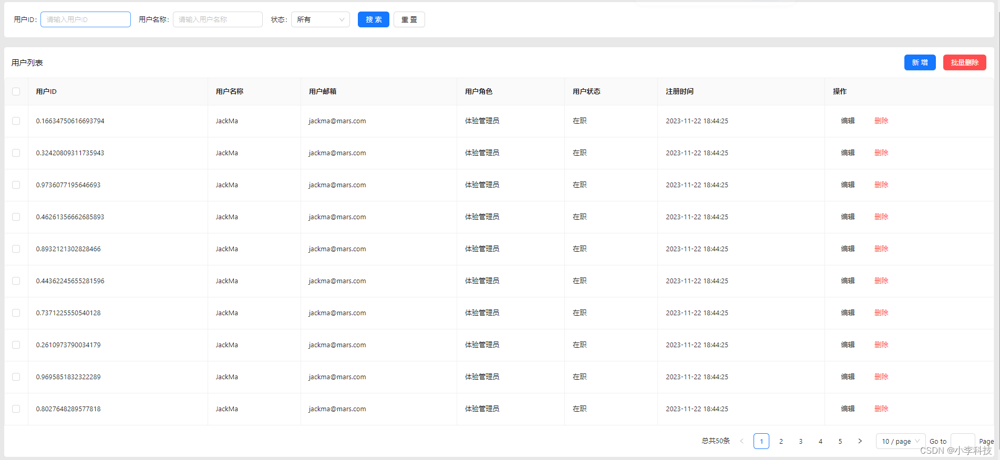
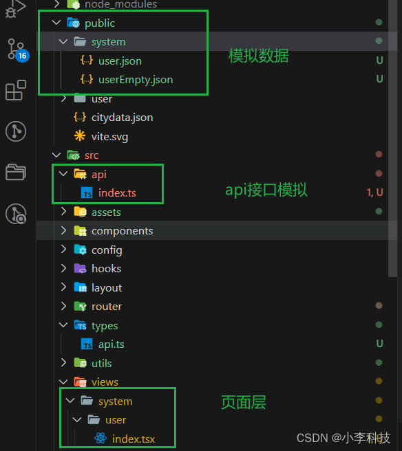
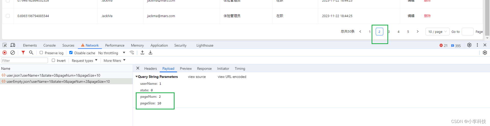
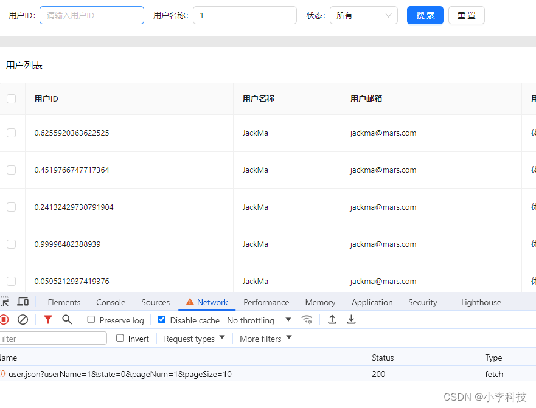

# React18-模拟列表数据实现基础表格功能

##  分页功能


##  分页组件有两种

table组件自带分页

```shell
<Table
  bordered
  rowKey="userId"
  rowSelection={{ type: 'checkbox' }}
  pagination={{
    position: ['bottomRight'],
    pageSize: pagination.pageSize,
    current: pagination.current,
    showQuickJumper: true,
    showSizeChanger: true,
    onChange: (page, pageSize) => {
      setPagination({
        current: page,
        pageSize
      })
    }
  }}
  dataSource={data}
/>
```

分页组件

```js
<Pagination
  pageNum={pagination.pageNum}
  pageSize={pagination.pageSize}
  total={pagination.total}
  onChange={(pageNum: number, pageSize: number) => {
    setPagination({
      current: page,
      pageSize
    })
  }}
/>
```

### 接口参数

```js
{
  pageNum: 1,
  pageSize: 10,
  userId: '',
  userName: '',
  state: ''
}
```

### 分页类型

```js
export interface PageParams {
  pageNum: number | undefined
  pageSize?: number | undefined
}
```

### 用户列表参数类型

```js
export interface Params extends PageParams {
	userId?: number
	userName?: string
	state?: number
}
```
## 模拟列表数据
```js
const list = Array.from({length:20})
				.fill({})
				.map((item:any)=>{
					item = {...data.list[0]}
					item.userId = Math.random()
					return item
				})
```
## 分页触发方式
1. 进入页面，模拟初始化列表
2. 点击搜索，初始化列表
3. 点击页码，更新列表
4. 点击每页条数， 更新列表


## 实现

`system/index.tsx`
```js
import api from "@/api";
import { PageParams, User } from "@/types/api";
import { formatDate } from "@/utils";
import { Button, Form, Input, Select, Space, Table } from "antd";
import { ColumnsType } from "antd/es/table";
import { useEffect, useState } from "react";

export default function UserList() {
    const [form] = Form.useForm();
    const [data, setData] = useState<User.UserItem[]>([])
    const [total, setTotal] = useState(0)
    const [pagination, setPagination] = useState({
        current: 1,
        pageSize: 10
    })

    // 获取用户列表
    const getUserList = async (params: PageParams) => {
        const values = form.getFieldsValue()
        const data = await api.getUserList({
            ...values,
            pageNum: params.pageNum,
            pageSize: params.pageSize
        });
        const list = Array.from({ length: 50 })// 模拟数据
            .fill({})
            .map((item: any) => {
                item = { ...data.list[0] }
                item.userId = Math.random()
                return item
            })

        // setData(data.list)
        // setTotal(data.page.total)
        setData(list) // 模拟数据
        setTotal(list.length)// 模拟数据
        setPagination({
            current: data.page.pageNum,
            pageSize: data.page.pageSize,
        })
    }

    useEffect(() => {
        getUserList({
            pageNum: pagination.current,
            pageSize:  pagination.pageSize
        })
    }, [pagination.current, pagination.pageSize])// 在Page切换时候，进行依赖收集，修改其中的pageNum，与pageSize，完成列表更新

    // 搜索
    const handleSearch = ()=>{
        getUserList({
            pageNum: 1,
            pageSize: pagination.pageSize
        })
    }

    // 重置表单
    const handleReset = ()=>{
        form.resetFields()
    }
    // const dataSource = [
    //   {
    //     _id: '',
    //     userId: 0,
    //     userName:'',
    //     userEmail: '',
    //     deptId: '',
    //     state: 0,
    //     mobile: '',
    //     job: '',
    //     role: 0,
    //     roleList: '',
    //     createId: 0,
    //     deptName: '',
    //     userImg: '',
    //   }
    // ];


    // https://ant-design.antgroup.com/components/table-cn
    const columns: ColumnsType<User.UserItem> = [
        {
            title: '用户ID',
            dataIndex: 'userId',
            key: 'userId',
        },
        {
            title: '用户名称',
            dataIndex: 'userName',
            key: 'userName',
        },
        {
            title: '用户邮箱',
            dataIndex: 'userEmail',
            key: 'userEmail',
        },
        {
            title: '用户角色',
            dataIndex: 'role',
            key: 'role',
            render(role: number) {
                return {
                    0: '超级管理员',
                    1: '管理员',
                    2: '体验管理员',
                    3: '普通用户'
                }[role]
            }
        },
        {
            title: '用户状态',
            dataIndex: 'state',
            key: 'state',
            render(state: number) {
                return {
                    1: '在职',
                    2: '试用期',
                    3: '离职',
                }[state]
            }
        },
        {
            title: '注册时间',
            dataIndex: 'createTime',
            key: 'createTime',
            render(createTime: string) {
                return formatDate(createTime)
            }
        },
        {
            title: '操作',
            render(record, values) {
                return <Space>
                    <Button type="text">编辑</Button>
                    <Button type="text" danger>删除</Button>
                </Space>
            }
        },
    ];
    return <div className="user-list">
        <div className="search-form">
            <Form
                layout="inline"
                form={form}
                initialValues={{ state: 0 }}
            >
                <Form.Item name="userId" label="用户ID">
                    <Input placeholder="请输入用户ID" />
                </Form.Item>

                <Form.Item name="userName" label="用户名称">
                    <Input placeholder="请输入用户名称" />
                </Form.Item>


                <Form.Item name="state" label="状态">
                    <Select style={{ width: 120 }}>
                        <Select.Option value={0}>所有</Select.Option>
                        <Select.Option value={1}>在职</Select.Option>
                        <Select.Option value={2}>试用期</Select.Option>
                        <Select.Option value={3}>离职</Select.Option>
                    </Select>
                </Form.Item>


                <Form.Item>
                    <Space>
                        <Button type="primary" onClick={handleSearch}>搜索</Button>
                        <Button type="default" onClick={handleReset}>重置</Button>
                    </Space>

                </Form.Item>
            </Form>
        </div>
        <div className="base-table">
            <div className="header-wrapper">
                <div className="title">用户列表</div>
                <div className="action">
                    <Button type="primary">新增</Button>
                    <Button type="primary" danger>批量删除</Button>
                </div>
            </div>
            <Table
                bordered
                pagination={{
                    position:['bottomRight'],
                    current: pagination.current,
                    pageSize:pagination.pageSize,
                    total,
                    showQuickJumper: true,
                    showSizeChanger:true, // 控制分页器一直有，如果不设置，那么只有total>50时，展示分页器
                    showTotal:(total)=>`总共${total}条`,
                    onChange:(page, pageSize)=>{
                        setPagination({
                            current: page,
                            pageSize: pageSize
                        })
                    }
                }}
                rowKey='userId'
                rowSelection={{
                    type: 'checkbox'
                }}
                dataSource={data}
                columns={columns}
            />
        </div>
    </div>
}
```


`api/index.tsx`
```js
import { User } from '@/views/system/user'
import qs from 'qs'
export default {
  getUserList(params: User.Params) {
    // mock
    console.log('userList请求参数')
    console.log(qs.stringify(params))
    if (params.pageNum > 1) {
      return fetch('/system/userEmpty.json?' + qs.stringify(params))
        .then(res => res.json())
        .then(res => {
          return {
            ...res.data,
            data: {
              page: {
                pageNum: params.pageNum,
                pageSize: params.pageSize,
                total: 0
              },
              list: [{}]
            }
          }
        })
    } else {
      return fetch('/system/user.json?' + qs.stringify(params))
        .then(res => res.json())
        .then(res => res.data)
    }
  }
}

```


`public/system/user.json`
```json
{
    "code": 0,
    "data": {
      "page": {
        "pageNum": 1,
        "pageSize": 10,
        "total": 10
      },
      "list": [
        {
          "userImg": "https://zos.alipayobjects.com/rmsportal/jkjgkEfvpUPVyRjUImniVslZfWPnJuuZ.png",
          "createTime": "2023-11-22T10:44:25.532Z",
          "userId": 1000016,
          "userName": "JackMa",
          "userEmail": "jackma@mars.com",
          "mobile": "17011221122",
          "sex": 0,
          "deptId": "",
          "deptName": "",
          "job": "前端工程师",
          "state": 1,
          "role": 2,
          "createId": 1000002,
          "lastLoginTime": "2024-01-30T15:47:11.116Z",
          "roleList": "655dbedb11c02c8597dce76f"
        },
        {
          "userId": 100017,
          "userName": "JackBean",
          "userEmail": "jackbean@mars.com",
          "deptId": "655dbef811c02c8597dce77a",
          "deptName": "大前端",
          "state": 1,
          "role": 1,
          "roleList": "655dbedb11c02c8597dce76f",
          "createId": 1000002,
          "userImg": "",
          "createTime": "2023-11-22T08:52:47.963Z",
          "lastLoginTime": "2023-11-22T09:21:22.314Z",
          "__v": 0
        },
        {
          "userId": 100018,
          "userName": "9549587",
          "userEmail": "9549587@mars.com",
          "deptId": "",
          "deptName": "",
          "state": 1,
          "role": 1,
          "roleList": "",
          "createId": 1000002,
          "userImg": "http://api-driver.marsview.cc/3f9393c68f57ac57704652f00.png",
          "createTime": "2023-11-22T08:52:47.963Z",
          "lastLoginTime": "2024-01-30T06:53:57.530Z",
          "__v": 0,
          "job": "测试"
        },
        {
          "userId": 100020,
          "userName": "1366143860",
          "userEmail": "1366143860@mars.com",
          "deptId": "6568c7254a54800ac8d5b18e",
          "deptName": "部门5",
          "state": 1,
          "role": 1,
          "roleList": "",
          "createId": 1000002,
          "userImg": "https://zos.alipayobjects.com/rmsportal/jkjgkEfvpUPVyRjUImniVslZfWPnJuuZ.png",
          "createTime": "2023-11-22T08:52:47.963Z",
          "lastLoginTime": "2023-12-21T07:41:46.976Z",
          "mobile": "13072361279",
          "job": "前端1"
        },
        {
          "userId": 100022,
          "userName": "413401333",
          "userEmail": "413401333@mars.com",
          "deptId": "6582ae994a54800ac8d76b80",
          "deptName": "前端",
          "state": 1,
          "role": 1,
          "roleList": "6582aeb44a54800ac8d76b88",
          "createId": 1000002,
          "userImg": "https://zos.alipayobjects.com/rmsportal/jkjgkEfvpUPVyRjUImniVslZfWPnJuuZ.png",
          "createTime": "2023-11-22T08:52:47.963Z",
          "lastLoginTime": "2024-01-02T02:16:53.036Z",
          "job": "前端"
        },
        {
          "userId": 100023,
          "userName": "1050732226",
          "userEmail": "1050732226@mars.com",
          "deptId": "",
          "deptName": "大前端",
          "state": 1,
          "role": 1,
          "roleList": "",
          "createId": 1000002,
          "userImg": "https://zos.alipayobjects.com/rmsportal/jkjgkEfvpUPVyRjUImniVslZfWPnJuuZ.png",
          "createTime": "2023-11-22T08:52:47.963Z",
          "lastLoginTime": "2024-01-06T05:55:34.501Z"
        },
        {
          "userId": 100024,
          "userName": "191337035",
          "userEmail": "191337035@mars.com",
          "deptId": "",
          "deptName": "大前端",
          "state": 1,
          "role": 1,
          "roleList": "",
          "createId": 1000002,
          "userImg": "https://zos.alipayobjects.com/rmsportal/jkjgkEfvpUPVyRjUImniVslZfWPnJuuZ.png",
          "createTime": "2023-11-22T08:52:47.963Z",
          "lastLoginTime": "2024-01-06T05:56:01.926Z"
        },
        {
          "userId": 100025,
          "userName": "717210290",
          "userEmail": "717210290@mars.com",
          "deptId": "",
          "deptName": "大前端",
          "state": 1,
          "role": 1,
          "roleList": "",
          "createId": 1000002,
          "userImg": "https://zos.alipayobjects.com/rmsportal/jkjgkEfvpUPVyRjUImniVslZfWPnJuuZ.png",
          "createTime": "2023-11-22T08:52:47.963Z",
          "lastLoginTime": "2024-01-06T05:56:16.764Z"
        },
        {
          "userId": 100027,
          "userName": "475721797",
          "userEmail": "475721797@mars.com",
          "deptId": "",
          "deptName": "大前端",
          "state": 1,
          "role": 1,
          "roleList": "",
          "createId": 1000002,
          "userImg": "https://zos.alipayobjects.com/rmsportal/jkjgkEfvpUPVyRjUImniVslZfWPnJuuZ.png",
          "createTime": "2023-11-22T08:52:47.963Z",
          "lastLoginTime": "2024-01-06T06:10:25.195Z"
        },
        {
          "userId": 100028,
          "userName": "1667519970",
          "userEmail": "1667519970@mars.com",
          "deptId": "",
          "deptName": "大前端",
          "state": 1,
          "role": 1,
          "roleList": "",
          "createId": 1000002,
          "userImg": "https://zos.alipayobjects.com/rmsportal/jkjgkEfvpUPVyRjUImniVslZfWPnJuuZ.png",
          "createTime": "2023-11-22T08:52:47.963Z",
          "lastLoginTime": "2024-01-06T06:02:09.986Z"
        }
      ]
    },
    "msg": ""
  }
```
`public/system/userEmpty.json`

```json
{
    "code": 0,
    "data": {},
    "msg": ""
  }
```

在切换分页时候看到参数发生变化


搜索时候可以看到搜索参数传入

[代码地址](https://github.com/dL-hx/manager-fe/commit/8538583905e4755813ca889bc0b0553b4bd3e74b)