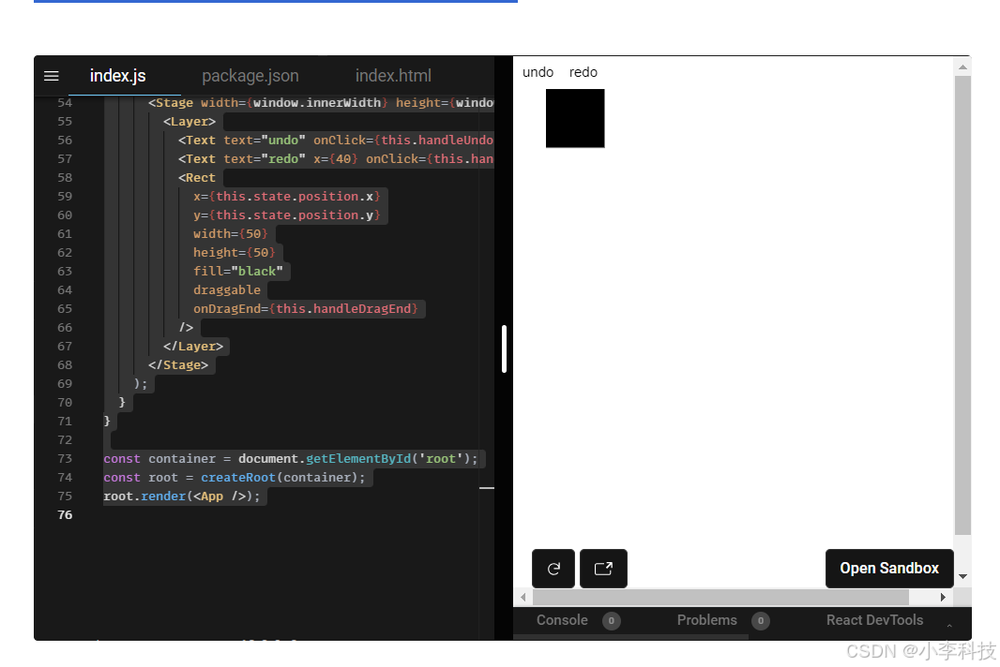

# 如何使用react在画布上实现redo-undo

To implement undo/redo functionality with React you don’t need to use Konva‘s serialization and deserealization methods.

You just need to save a history of all the state changes within your app. There are many ways to do this. It may be simpler do to that if you use immutable structures.

Instructions: Try to move the square. Then undo/redo your actions.




```javascript
在import React, { Component } from 'react';
import { createRoot } from 'react-dom/client';
import { Stage, Layer, Rect, Text } from 'react-konva';

let history = [
  {
    x: 20,
    y: 20,
  },
];
let historyStep = 0;

class App extends Component {
  state = {
    position: history[0],
  };

  handleUndo = () => {
    if (historyStep === 0) {
      return;
    }
    historyStep -= 1;
    const previous = history[historyStep];
    this.setState({
      position: previous,
    });
  };

  handleRedo = () => {
    if (historyStep === history.length - 1) {
      return;
    }
    historyStep += 1;
    const next = history[historyStep];
    this.setState({
      position: next,
    });
  };

  handleDragEnd = (e) => {
    history = history.slice(0, historyStep + 1);
    const pos = {
      x: e.target.x(),
      y: e.target.y(),
    };
    history = history.concat([pos]);
    historyStep += 1;
    this.setState({
      position: pos,
    });
  };
  render() {
    return (
      <Stage width={window.innerWidth} height={window.innerHeight}>
        <Layer>
          <Text text="undo" onClick={this.handleUndo} />
          <Text text="redo" x={40} onClick={this.handleRedo} />
          <Rect
            x={this.state.position.x}
            y={this.state.position.y}
            width={50}
            height={50}
            fill="black"
            draggable
            onDragEnd={this.handleDragEnd}
          />
        </Layer>
      </Stage>
    );
  }
}

const container = document.getElementById('root');
const root = createRoot(container);
root.render(<App />);

```
