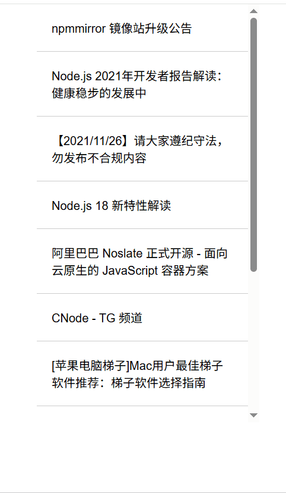

# 移动端上拉加载，下拉刷新实现方案？


## 上拉加载

### 使用场景

用于长列表，需要通过上拉加载提高性能

### 实现步骤

1. 滚动事件监听


2. 怎么判断触底

3. 回调触发列表加载更多




```html
<!DOCTYPE html>
<html lang="en">

<head>
    <meta charset="UTF-8">
    <meta name="viewport" content="width=device-width, initial-scale=1.0">
    <title>上拉加载</title>

    <style>
        #content {
            width: 300px;
            height: 80vh;
            overflow-y: auto;
            margin: 0 auto;
            /* border: 1px solid #ccc; */
        }

        body {
            margin: 0;
            padding: 0;
            font-family: Arial, sans-serif;
        }

        .item {
            padding: 20px;
            border-bottom: 1px solid #ccc;
        }

        .loading {
            text-align: center;
            padding: 20px;
            display: none;
            color: red;
        }
    </style>
</head>

<body>
    <div id="content">
        <div id="items"></div>
        <div id="loading" class="loading">加载中...</div>
    </div>
    <script>
        const content = document.getElementById('content')
        const items = document.getElementById('items');
        const loading = document.getElementById('loading');
        loading.style.display = 'none';
        let page = 1;
        function loadMoreData(page) {
            return fetch(`https://cnodejs.org/api/v1/topics?page=${page}&limit=10`)
                .then(res => res.json())
                .then(res => {
                    if (res.success) {
                        loading.style.display = 'block';
                        const data = res.data
                        data.forEach(item => {
                            const div = document.createElement('div');
                            div.className = 'item';
                            div.textContent = item.title
                            items.appendChild(div);
                        })
                    }

                }).catch(err => {
                    loading.style.display = 'none';
                })

        }

        function handleScroll() {
            // 当滚动到底部时，触底，发送请求，追加内容
            if (content.scrollTop + content.clientHeight >= content.scrollHeight - 10) { 
                page++
                loadMoreData(page)
            }
        }

        content.addEventListener('scroll', handleScroll)

        // Init load
        loadMoreData(page)
    </script>
</body>

</html>
```

## 下拉刷新

### 使用场景
移动端， 用户在页面顶部向下拉时，触发页面重新加载


### 实现步骤

1. （移动端）滚动触摸监听 touch, top
2. 显示刷新指示器， 显示有没有达到下拉阈值
3. 回调触发刷新操作


```html
<!DOCTYPE html>
<html lang="en">

<head>
    <meta charset="UTF-8">
    <meta name="viewport" content="width=device-width, initial-scale=1.0">
    <title>下拉刷新</title>
    <script src="https://cdn.jsdelivr.net/npm/lodash@4.17.21/lodash.min.js"></script>

    <style>
        #content {
            width: 300px;
            height: 80vh;
            overflow-y: auto;
            margin: 0 auto;
            /* border: 1px solid #ccc; */
        }

        body {
            margin: 0;
            padding: 0;
            font-family: Arial, sans-serif;
        }

        .item {
            padding: 20px;
            border-bottom: 1px solid #ccc;
        }

        .loading {
            text-align: center;
            padding: 20px;
            display: none;
            color: red;
        }
    </style>
</head>

<body>
    <div id="content">
        <div id="loading" class="loading">正在加载中...</div>
        <div id="items"></div>
    </div>
    <script>
        const { debounce } = _;
        const content = document.getElementById('content')
        const items = document.getElementById('items');
        const loading = document.getElementById('loading');

        let startY = 0
        let isPulling = false
        loading.style.display = 'none';
        let page = 1;
        function loadMoreData(page) {
            return fetch(`https://cnodejs.org/api/v1/topics?page=${page}&limit=10`)
                .then(res => res.json())
                .then(res => {
                    if (res.success) {
                        const data = res.data
                        data.forEach(item => {
                            const div = document.createElement('div');
                            div.className = 'item';
                            div.textContent = item.title
                            items.appendChild(div);
                        })
                        loading.style.display = 'none';
                    }
                })

        }


        content.addEventListener('touchstart', (event) => {
            if (content.scrollTop === 0) {
                startY = event.touches[0].pageY
                isPulling = true
            }
        })


        content.addEventListener('touchmove', function (e) {
            if (isPulling) {
                const currentY = event.touches[0].pageY
                if (currentY > startY) {
                    loading.style.display = 'block';
                    loading.style.height = (currentY - startY) + 'px';
                }
            }

        }

        )


        content.addEventListener('touchend', debounce(
            function (e) {
                if (isPulling) {
                    const loadingHeight = parseInt(loading.style.height, 10)
                    if (loadingHeight > 80) { // loading div 的高度
                        page++

                        loadMoreData(page)
                    } else {
                        loading.style.display = 'none';

                    }
                    isPulling = false
                    loading.style.height = '80px'  // loading div 的高度
                }

            }
            , 500)
        )

        // Init load
        loadMoreData(page)
    </script>
</body>

</html>
</body>

</html>
```

## 考虑的点

### 性能优化
1. 节流防抖
2. 懒加载

### 用户体验
1. 视觉反馈， 下拉刷新的指示器
2. 平滑动画
3. 错误处理

## 兼容
1. 触摸动画
2. css hack