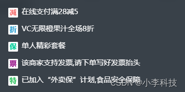
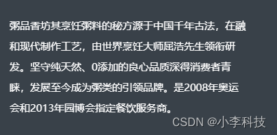

# Vue组件------列表组件设计


## 一 问题分析
设计列表组件

关键点:
ul,li布局, 两边留白


## 二.代码实现
基础布局
```html
    
          <ul v-if="seller.supports" class="supports">
            <li class="support-item" v-for="(item, index)  in seller.supports" :key="index">
              <span class="icon" :class="classMap[seller.supports[index].type]"></span>
              <span class="text">{{ item.description }}</span>
            </li>
          </ul>
```
css
```css
 .supports {
        // 1. 水平居中
        width: 80%;
        margin: 0 auto;

        .support-item {
          padding: 0 12px;
          margin-bottom: 12px;
          font-size: 0;

          &:last-child {
            /*2. 最后一个盒子距离*/
            margin-bottom: 0;
          }

          .icon {
            /*3. 设置icon图片大小*/

            /*3.1. 设置盒子的大小*/
            display: inline-block;
            width: 16px;
            height: 16px;
            vertical-align: top;

            margin-right: 6px;
            /*3.2 */
            background-size: 16px 16px;
            background-repeat: no-repeat;

            &.decrease {
              .bg-image('decrease_2');
            }

            &.discount {
              .bg-image('discount_2');

            }

            &.guarantee {
              .bg-image('guarantee_2');
            }

            &.invoice {
              .bg-image('invoice_2');
            }

            &.special {
              .bg-image('special_2');
            }

          }

          .text{
            line-height: 12px;
            font-size: 12px;
          }
        }
      }
```


```js
<script>

export default {
  props: {
    seller: {
      type: Object
    }
  },

  data() {
    return {
 
    }
  },
  created() {// 转换为对应的样式
    // 映射为Map
    this.classMap = ['decrease', 'discount', 'guarantee', 'invoice', 'special']

  },

  methods: {
 
  }

}
</script>
```
## 三.技术点回顾
`加强对css的理解`

```css
/*1. 水平居中,块级元素, margin: 0 auto*/
width: 80%;
margin: 0 auto;

/*2. 设置上下间距与, 最后一个盒子距离为0*/
.support-item

&:last-child {
     margin-bottom: 0;
}

/*3. 设置icon图片大小*/

/*3.1. 设置盒子的大小*/
display: inline-block;
width: 16px;
height: 16px;
vertical-align: top;

margin-right: 6px;
/*3.2 */
background-size: 16px 16px;
background-repeat: no-repeat;

/*与附加样式进行配合*/
&.decrease{}

&.discount{}

/*4. :class属性与&decrease ,属性配合,附加样式 */
:class="classMap[seller.supports[index].type]"
```


```html
          <div class="bulletin">
            <!-- 大段文字, p -->
            <p class="content">{{ seller.bulletin }}</p>
          </div>
```

块级水平对齐, 内容距离
```css
      .bulletin{
        width: 80%;
        margin: 0 auto;
        .content{
          padding: 0 12px;
          line-height: 24px;
          font-size: 12px;
        }
      }
```
大段文字, p

----
    // 设置模糊属性, 实现渐进增强效果, ios设备支持
    backdrop-filter: blur(10px);