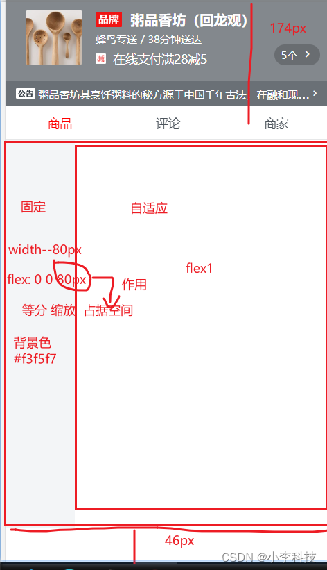
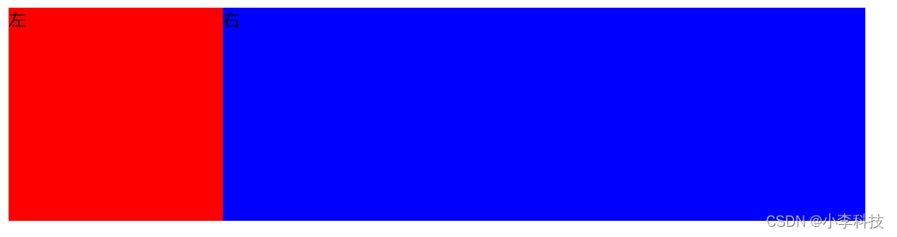

# Vue组件------商品列表页面


## 一 问题分析
实现商品列表页面


技术分析:
两栏布局,  flex
一列固定,   一列自适应

基本结构
```html
 <div class="good">
    <div class="menu-wrapper"></div>
    <div class="foods-wrapper"></div>
  </div>
```


## 二.代码实现
html
```html
 <div class="good">
    <div class="menu-wrapper"></div>
    <div class="foods-wrapper"></div>
  </div>
```
css
```css
.good {
  display: flex;
  position: absolute;
  top: 174px;
  bottom: 46px;
  width: 100%;
  /*超出隐藏*/ 
  overflow: hidden;

  .menu-wrapper {
    flex: 0 0 80px;
    width: 80px;
    background-color: #f3f5f7;
  }

  .foods-wrapper {
    flex: 1;

  }
}
```
## 三.技术点回顾

### 3.1 固比



```html
 <style>
        .container{
            /* 1.固定宽度*/
			width:800px;
            
            /*
            	项目中
   ==================================
				width: 100%;
				或者(居中部分)
				width:80%;
				margin: 0 auto
				
			*/
/*height:200px;*/
======================================

  display: flex;/*2. 父级元素设置flex*/
/*
用如下样式,  确定位置, 替代固定高度
    position: absolute;
    top: `175px`;
    bottom:`46px`;
*/		

/*3.超出隐藏*/	
overflow: hidden;      

        }
        .left{
            background: red;
            display: flex;
            width:200px;/*4. 固*/
        }
        .right{
            background: blue;
            display: flex;
            flex:1;/*5. 比*/
        }
        
    </style>
</head>
<body>
    <div class="container">
        <div class="left">
            左
        </div>
        <div class="right">
            右
        </div>
    </div>
</body>

```

### 3.2 技术总结
```css
.good {
/*1. 设置父级flex*/
  display: flex;
/*2. 元素定位,设置高宽,  用于替换之前的固定高度height:xx px*/
  position: absolute;
  top: 174px;
  bottom: 46px;
/*2 设置宽, 充满全屏*/
  width: 100%;
/*3. 超出文字隐藏*/
  overflow: hidden;

  .menu-wrapper {
/*4.左侧固定
flex: 等分, 缩放,  占据空间
*/
    flex: 0 0 80px;
    width: 80px;
    background-color: #f3f5f7;
  }

  .foods-wrapper {
/*5.自适应 , flex:1*/
    flex: 1;

  }
}
```