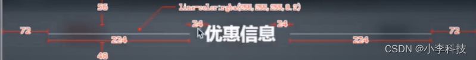

# Vue组件------小标题组件设计



## 一 问题分析
设计小标题组件

关键点:
1. 两侧宽度自适应,  (线条自适应)
2. 中间文字部分
3. 间距

关键技术点: **FLEX布局**

flex: (内容)等分   缩放  占位空间

## 二.代码实现
基础布局
```html
          <div class="title-wrapper">
            <div class="line"></div>
            <div class="text">优惠信息</div>
            <div class="line"></div>
          </div>
```
css
```css
   .title-wrapper{
        display: flex;
        /*1. 设置宽度*/
        width: 80%;
        margin: 28px auto 24px auto;
        .line{
          flex:1;/*2. 设置自适应,所占空间大小,配合父级flex*/
          /*3.向上偏移-6px, 结合relative*/
          position: relative;
          top: -6px;
          /*4.设置细线粗细,  border-bottom*/
          border-bottom: 1px solid rgba(255, 255, 255, .2);

        }
        .text{/*4.设置文本,fz, fw*/
          padding: 0 12px;
          font-size: 14px;
          font-weight: 700;/*文案加粗 */
        }
      }
```


## 三.技术点回顾
`加强对css的理解`

```css
 /*1. 设置宽度, 水平居中, 上下间距*/
width: 80%;
margin: 28px auto 24px auto;

 /*2.向上偏移-6px, 结合relative*/
position: relative;
top: -6px;

/*3.设置细线粗细,  border-bottom*/
border-bottom: 1px solid rgba(255, 255, 255, .2);

/*4. 设置自适应,所占空间大小,配合父级flex*/
父级元素, display:flex;
flex:1;

/*5.设置文本,fz, fw,  内间距, padding,外边距margin */
.text{
          padding: 0 12px;
          font-size: 14px;
          font-weight: 700;/*文案加粗 */
}
```

## 四. 组件抽象
最后可以顺理成章的抽象为一个可以复用的组件`<v-title title="xxx"/>`

