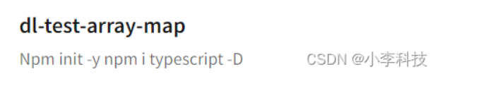

# 如何通过typescript写一个包

[https://github.com/dL-hx/test-array-map](https://github.com/dL-hx/test-array-map)
[课程链接](https://www.bilibili.com/video/BV1Ra411T7Ey?p=22&vd_source=631062e9ff21033189723c8ac931c360)

## 安装
npm init -y
npm i typescript -D

## 配置tsconfig.json
```json
"declaration": true    //生成声明文件

"outDir": "./dist",    // 输出目录

"exclude": [        //排除待编译文件

  "./dist",
  "./example"   
]

```

## 编译代码
编译ts-array-map.ts
```
$ tsc
```

## 测试执行代码
```
$ tsc .\example\test.ts

$ node .\example\test.js
```

## 发包
配置 .npmignore 发包忽略文件
npm login
npm publish

**每次发布前需要执行 tsc命令 编译后**
**再 `npm publish`**




## 使用
npm i dl-test-array-map

``` ts
import arrayMap from '../dist/dl-test-array-map';
const res = arrayMap([1,2], item=> item + 2)
console.log(res);
```
