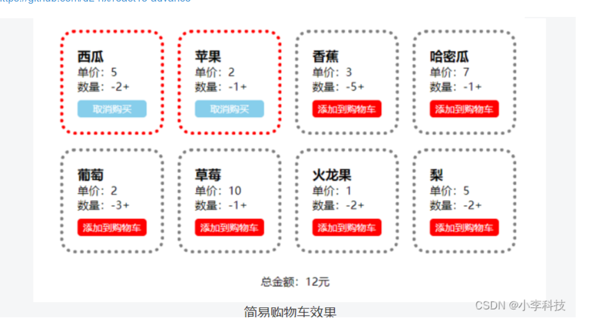

# [前端] 简易购物车的Hook版本


利用所学习的React +Hook 完成一个简易的购物车效果，案例如下所示。

[https://github.com/dL-hx/react18-advance](https://github.com/dL-hx/react18-advance)




这个效果首先准备了对应的json数据，然后再去拆分组件，最后实现逻辑的部分，代码如下：
```html
<!DOCTYPE html>
<html lang="en">

<head>
  <meta charset="UTF-8">
  <meta http-equiv="X-UA-Compatible" content="IE=edge">
  <meta name="viewport" content="width=device-width, initial-scale=1.0">
  <title>Document</title>
  <style>
    * {
      margin: 0;
      padding: 0;
    }

    li {
      list-style: none;
    }

    .cart {
      width: 700px;
      margin: 30px auto;
    }

    ul {
      overflow: hidden;
    }

    li {
      width: 100px;
      border: 5px gray dotted;
      border-radius: 20px;
      padding: 20px;
      float: left;
      margin: 10px;
    }

    .remove,
    .add {
      cursor: pointer;
    }

    .cartbtn {
      font-size: 14px;
      text-align: center;
      background: red;
      color: white;
      padding: 3px;
      border-radius: 5px;
      margin-top: 10px;
      cursor: pointer;
    }

    li.active {
      border-color: red;
    }

    li.active .cartbtn {
      /**样式覆盖*/
      background-color: skyblue;
    }

    .all {
      text-align: center;
      margin: 20px 0;
    }
  </style>
  <script src="../react.development.js"></script>
  <script src="../react-dom.development.js"></script>
  <script src="../babel.min.js"></script>
  <script src="../lodash.min.js"></script>
</head>

<body>
  <div id="app"></div>
  <script type="text/babel">
    /**
     * 1. 获取数据
     * 2. 定义方法
     * 3. 计算总价
     * 
     * 
     * 关注点分离
     * list 更新时候就会调用更新方法,   更新价格
    */
    let app = document.querySelector('#app');
    let root = ReactDOM.createRoot(app);

    let { useState, useEffect } = React;

    let Item = (props) => {
      const {
        id,
        isActive,
        name,
        number,
        price,
        handleAdd,
        handleRemove,
        handleToCart
      } = props
      return <li className={isActive ? "active" : ""}>
        <h3>{name}</h3>
        <p>单价：{price}</p>
        <p>
          数量：
          <span className="remove" onClick={() => handleRemove(id)}>-</span>
          <span>{number}</span>
          <span className="add" onClick={() => handleAdd(id)}>+</span>
        </p>

        <div className="cartbtn" onClick={() => handleToCart(id)}>
          {
            isActive ? '取消购买' : '添加到购物车'
          }
        </div>
      </li>
    }


    let Cart = () => {
      const [list, setList] = useState([])
      const [all, setAll] = useState(0)
      useEffect(() => {//1. 获取数据
        // fetch获取本地数据
        fetch('./data.json').then((res) => {
          return res.json()
        }).then(res => {
          if (res.errcode === 0) {
            setList(res.list)
          }
        })
      }, [])

      // 更新list时候需要更新价格
      // 关注点分离
      useEffect(() => {
        computedAll()
      }, [list])


      // 2. 定义方法
      // 由id修改list数量
      const handleAdd = (id) => {
        let cloneList = _.cloneDeep(list)
        let now = cloneList.find((v) => v.id === id)
        now.number++
        setList(cloneList)
      }


      const handleRemove = (id) => {
        let cloneList = _.cloneDeep(list)
        let now = cloneList.find((v) => v.id === id)
        if (now.number >= 1) {
          now.number--
        }
        setList(cloneList)
      }


      const handleToCart = (id) => {
        // 改为是否激活(修改isActive状态)
        let cloneList = _.cloneDeep(list)
        let now = cloneList.find((v) => v.id === id)
        now.isActive = !now.isActive
        setList(cloneList)
      }


      // 计算金额,金额和 加入购物车的 ,✔ 有关
      const computedAll = () => {
        let all = 0
        // 过滤出已经勾选的选项,然后计算总价格
        list.filter((v) => v.isActive).forEach(v => {
          all += v.price * v.number
        });
        setAll(all)
      }
      return (
        <div className="cart">
          <ul>
            {
              list.map(v => {
                return <Item
                  {...v}
                  key={v.id}
                  handleAdd={handleAdd}
                  handleRemove={handleRemove}
                  handleToCart={handleToCart}
                />
              })
            }
          </ul>
          <div className="all">
            总金额：<span>{all}</span>元
          </div>
        </div>
      );
    }

    let element = (
      <Cart />
    );

    root.render(element)

  </script>
</body>

</html>
```