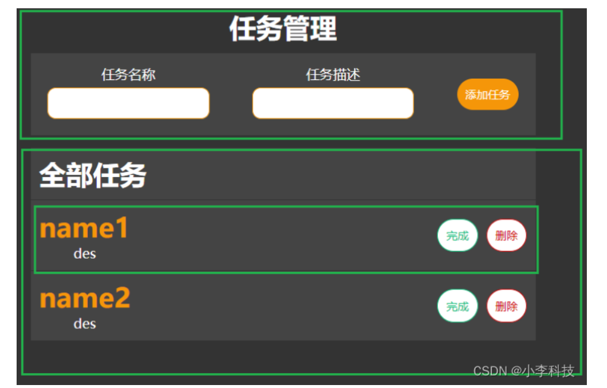

# [前端]使用TS编写任务管理系统




[https://github.com/dL-hx/client-side](https://github.com/dL-hx/client-side)
## axios
npm i axios

## 编写任务声明及后端管理API
`src/type.d.ts`
定义了表示任务的Task接口, 供其他ts文件引用,包含id, name(名称), description(描述), isDone(是否完成)等字段.
```ts
interface Task{
    id:number;
    name:string;
    description:string;
    isDone:boolean;
}
```

`src/apis.ts`
```ts
import axios , {AxiosResponse} from 'axios'
const baseUrl:string = 'http://localhost:8000'

/**
 * 
 * 提供了任务管理后端API的功能, 使用Axios调用前面编写的任务管理后端API
 * getTaskList()  调用API: 'http://localhost:8000/tasks' GET 获取全部任务列表
 * getTaskList()  调用API: 'http://localhost:8000/task' POST 创建新的任务
 * deleteTask()  调用API: 'http://localhost:8000/task/:id' DELETE 删除指定id的任务 
 * setTaskDone()  调用API: 'http://localhost:8000/task/:id' PUT 设置指定id的任务为完成状态
 * 
 */

// 声明返回值的泛型定义
export const getTaskList =async ():Promise<AxiosResponse<Task[]>> => {
    const tasks:AxiosResponse<Task[]> = await axios.get(
        baseUrl + '/tasks'
    )
    return tasks;
}

export const addTask =async (task:Task):Promise<AxiosResponse<Task>> => {
    const newTask:AxiosResponse<Task> = await axios.post(
        baseUrl + '/task',
        task
    )
    return newTask;
}

export const deleteTask =async (taskId:number):Promise<AxiosResponse<boolean>> => {
    const res:AxiosResponse<boolean> = await axios.delete(
        baseUrl + '/task/' + taskId
    )
    return res;
}

export const setTaskDone =async (taskId:number):Promise<AxiosResponse<boolean>> => {
    const res:AxiosResponse<boolean> = await axios.put(
        baseUrl + '/task/' + taskId
    )
    return res;
}
```

## 添加 任务UI与任务列表UI
### 1)添加 任务UI
`TaskCreator.tsx`

```ts
import React , {FC, useState} from 'react'

type Props = {
  addTask:(e:React.FormEvent, formData:Task | any) => void
}
/**
 * 声明函数式UI组件TaskCreator, 
 * 允许传入Props.addTask ,接收添加任务处理函数
 */
const TaskCreator:FC<Props> = ({addTask})=>{
    const [formData, setFormData] = useState<Task|{}>()

    // 处理表单组件,收集表单数据
    const handleForm = (e:React.FormEvent<HTMLInputElement>):void=>{
        setFormData({
            ...formData,
            [e.currentTarget.id]:e.currentTarget.value
        })
    }
    
    return (
        <form className='Form' onSubmit={(e)=>{
            e.preventDefault();
            addTask(e, formData)
        }}>
            <div>
                <div>
                    <label htmlFor="name">任务名称</label>
                    <input type="text" id="name" onChange={handleForm}/>
                </div>
            </div>

            <div>
                <div>
                    <label htmlFor="name">任务描述</label>
                    <input type="text" id="description" onChange={handleForm}/>
                </div>
            </div>
            <button disabled={formData===undefined?true:false}>添加任务</button>
        </form>
    )
}

export default TaskCreator;
```
+ 属性:
+ addTask()

### 2)添加 任务列表UI

`TaskItem.tsx`
```ts
import React , {FC, useState} from 'react'

type Props = {
    task: Task,
    deleteTask:(id:number) => void
    setTaskDone:(id:number) => void
}
/**
 * 声明函数式UI组件TaskItem, 
 * 允许传入Props.task ,接收当前任务数据
 * 允许传入Props.deleteTask, 来接收删除任务的处理函数
 * 允许传入Props.setTaskDone, 来接收设置任务为完成状态的处理函数
 * 
 * 根据任务完成状态(task.isDone)来决定是否显示"完成"按钮
 * 以及(是否在任务名称和描述上增加下划线)
 * 当 task.isDone === true . 在任务名称和描述上增加下划线,并改为完成状态
 */
const TaskItem:FC<Props> = ({task, deleteTask, setTaskDone})=>{
    return (
        <div className='Item'>
            <div className="Item--text">
                <h1 className={task.isDone?'done-task':''}>{task.name}</h1>
                <span className={task.isDone?'done-task':''}>{task.description}</span>
            </div>
            <div className="Item--button">
                <button
                    onClick={()=>setTaskDone(task.id)}
                    className={task.isDone?`hide-button`: 'Item--button__done'}
                >
                    完成
                </button>
                <button
                    onClick={()=>{deleteTask(task.id)}}
                    className='Item--button__delete'
                >
                    删除
                </button>
            </div>
        </div>
    )
}

export default TaskItem;
```

+ 属性:
+ task
+ deleteTask()
+ setTaskDone()


## 编写任务管理页面及样式
编写任务管理系统前端界面, 将添加任务UI组件,与任务列表项UI组件结合起来.

`App.tsx`
```ts
import React, { FC, useEffect, useState } from 'react';
import './App.css';
import TaskCreator from './components/TaskCreator';
import TaskItem from './components/TaskItem';
import { addTask, deleteTask, getTaskList, setTaskDone } from './apis';

const App: FC = () => {
  const [tasks, setTasks] = useState<Task[]>([])

  useEffect(() => {
    getTaskList().then(p => setTasks(p.data))
  }, [])

  const handleAddTask = (e: React.FormEvent, formData: Task): void => {
    addTask(formData).then(p => {
      setTasks([
        ...tasks,
        p.data
      ])
    })
  }

  const handleDeleteTask = (id: number) => {
    deleteTask(id).then(p => {
      let deleteTaskIndex = tasks.findIndex(y => y.id == id)
      let newTasks = [...tasks]
      newTasks.splice(deleteTaskIndex, 1)
      setTasks(newTasks)
    })
  }

  const handleSetTaskDone = (id: number) => {
    setTaskDone(id).then(p=>{
      let doneTaskIndex = tasks.findIndex(y => y.id == id)
      tasks[doneTaskIndex].isDone = true
      setTasks([...tasks])
    })
  }
  return (
    <div className="App">
      <h1>任务管理</h1>
      <TaskCreator addTask={handleAddTask} />
      <div className='Item'>
        <h1>全部任务</h1>
      </div>
      {
        tasks.map((task: Task) => {
          return <TaskItem
            key={task.id}
            task={task}
            deleteTask={handleDeleteTask}
            setTaskDone={handleSetTaskDone}
          />
        })
      }
    </div>
  );
}

export default App;

```
