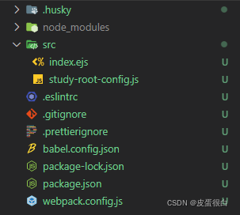
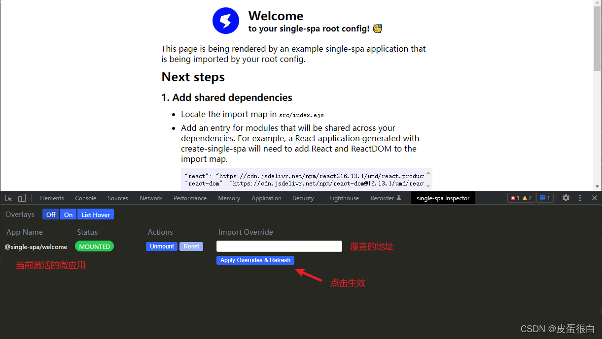

# single-spa

> 原文出处：https://blog.csdn.net/qq_35812380/article/details/124648336

## single-spa

微前端学习:
 https://www.bilibili.com/video/BV1Yq4y1o7ab?spm_id_from=333.337.search-card.all.click

#### 创建工作目录

#### 存放每个微应用（实际开发中每个微应用一般都是放在不同的开发人员的电脑中）

```
$	mkdir workspace
$	cd workspace
```

#### 全局安装脚手架

```
$	npm i create-single-spa -g
```

#### 脚手架创建微应用

```
$	create-single-spa
```

#### 如果不想将脚手架安装到全局，可以使用 npx 运行脚手架

####

```
$	npx create-single-spa
```

```
? Directory for new project container # 创建项目的文件夹（默认 ./）
? Select type to generate single-spa root config # 创建什么类型的应用
? Which package manager do you want to use? npm # 使用什么工具安装 package
? Will this project use Typescript? No # 是否使用 TS
? Would you like to use single-spa Layout Engine No # 是否使用 single-spa 布局引擎
? Organization name (can use letters, numbers, dash or underscore) study # 组织名称
```

组织名称可以理解为团队名称，微前端架构允许多团队共同开发应用，组织名称可以标识应用由哪个团队开发。

应用名称的命名规则为 @组织名称/项目名称，比如 @study/todos

安装完后启动应用：

> cd container
>  npm start
>
> 访问：http://localhost:9000/，看到 Welcome 欢迎页面即表示成功。

容器应用默认代码解析
 容器应用默认应该不包含任何页面，但是在 single-spa 的容器应用启动后显示了 Welcome 欢迎页面，这是因为在 single-spa 的容器应用中默认注册了一个微应用，名为 @single-spa/welcome，下面解析一下 single-spa 容器应用默认代码。



src 目录用于存放源代码文件：

index.ejs 是模板文件
 study-root-config.js 是应用入口文件
 注意：在整个微前端项目中只有一个模板文件，也就是说，其它微应用是不包含模板文件的。

xxx-root-config.js

```
// container\src\study-root-config.js
// 引入两个方法：
// - registerApplication: 用于注册微应用
// - start: 用来启动微前端应用
import { registerApplication, start } from 'single-spa'

/**

 * 注册一个微应用（默认的 Welcome 欢迎页面）
 * name {String} - 微应用名称 `@组织名称/项目名称`
 * app {() => <Function | Promise>} - 一个返回加载的模块或 Promise 的函数
 * activeWhen - 指定微应用在什么条件下激活
   */
   registerApplication({
     // welcome 微应用名称
     name: '@single-spa/welcome',

  // 通过 systemjs 引用打包好的微应用模块代码
  app: () => System.import('https://unpkg.com/single-spa-welcome/dist/single-spa-welcome.js'),

  // 使用数组，指定首页路由下激活
  activeWhen: ['/']
})

// registerApplication({
//   name: "@study/navbar",
//   app: () => System.import("@study/navbar"),
//   activeWhen: ["/"]
// });

// 启动当前应用
// start 方法必须在 single-spa 的配置文件中调用
// 调用 start 之前，应用会被加载，但不会初始化、挂载或卸载
start({
  // 是否可以通过 history.pushState() 和 history.replaceState() 更改触发 single-spa 路由
  // true: 不允许; false: 允许
  // 默认是 false
  // 在某些情况下，将此设置为true可以提高性能
  urlRerouteOnly: true
})
```

index.ejs
 以下拆分并解析主要内容。

引入 single-spa 和配置预加载：

```
  <!-- 引入公共模块地址 -->

  <script type="systemjs-importmap">
    {
      "imports": {
        "single-spa": "https://cdn.jsdelivr.net/npm/single-spa@5.9.0/lib/system/single-spa.min.js"
      }
    }
  </script>

  <!-- 预加载 single-spa -->
  <link rel="preload" href="https://cdn.jsdelivr.net/npm/single-spa@5.9.0/lib/system/single-spa.min.js" as="script">
```

引入 systemjs 模块加载器（区分了开发环境，为了引入压缩版本）：

```
  <!-- 引入模块加载器 -->
  <!-- isLocal(Boolean) 表示是否是本地开发环境 -->
  <% if (isLocal) { %>
  <!-- 开发环境 引入未压缩版本 -->
  <!-- systemjs 模块加载器 -->

  <script src="https://cdn.jsdelivr.net/npm/systemjs@6.8.3/dist/system.js"></script>

  <!-- systemjs 用来解析 AMD (浏览器优先)模块的插件（如果不使用 AMD 模块可以不引入） -->

  <script src="https://cdn.jsdelivr.net/npm/systemjs@6.8.3/dist/extras/amd.js"></script>

  <% } else { %>
  <!-- 其它环境 引入压缩版本 -->

  <script src="https://cdn.jsdelivr.net/npm/systemjs@6.8.3/dist/system.min.js"></script>
  <script src="https://cdn.jsdelivr.net/npm/systemjs@6.8.3/dist/extras/amd.min.js"></script>

  <% } %>
```

引入 root-config 容器应用模块，并通过 system.import() 加载：

```
  <!-- 引入容器应用模块 -->
  <!-- 开发环境指定本地地址 -->
  <% if (isLocal) { %>

  <script type="systemjs-importmap">
    {
      "imports": {
        "@study/root-config": "//localhost:9000/study-root-config.js"
      }
    }
  </script>

  <% } %>

  <!-- 加载容器应用模块 -->

  <script>
    System.import('@study/root-config');
  </script>
```

或者不使用 import-map，直接引入：

```
  <!-- 加载容器应用模块 -->
<script>
    System.import('./study-root-config.js');
  </script>
```

引入浏览器调试工具（single-spa）并使用（需安装浏览器插件）：

官方介绍：
 [single-spa-inspector | single-spa](https://single-spa.js.org/docs/devtools/)
 [single-spa-inspector | single-spa](https://single-spa.js.org/docs/devtools/#import-map-overrides)

```
  <!-- 调试工具：用于覆盖通过 import-map 设置的 JavaScript 模块地址 -->

  <script src="https://cdn.jsdelivr.net/npm/import-map-overrides@2.2.0/dist/import-map-overrides.js"></script>

  <!-- 调试工具。可以通过浏览器调试工具（single-spa-Inspector）更改注册的微应用模块的地址 -->
  <!-- 例如，将线上环境的模块地址更改为开发环境的模块地址 -->
  <import-map-overrides-full show-when-local-storage="devtools" dev-libs></import-map-overrides-full>
```



文章参考:

> https://blog.csdn.net/u012961419/category_11610108.html

总结:
 就是将各种架构的应用如react ,vue ,ang ,进行组合, 是一种架构方案, 正合模块的方案,只要很大的项目才会使用
