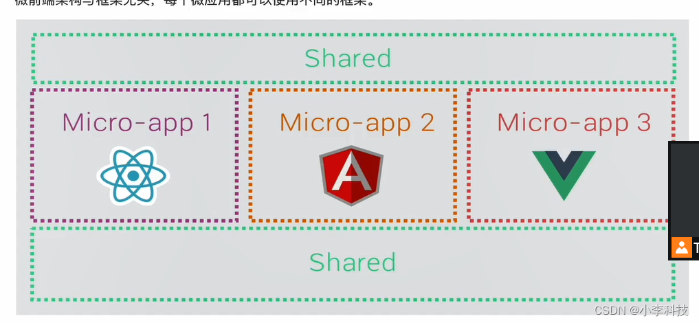
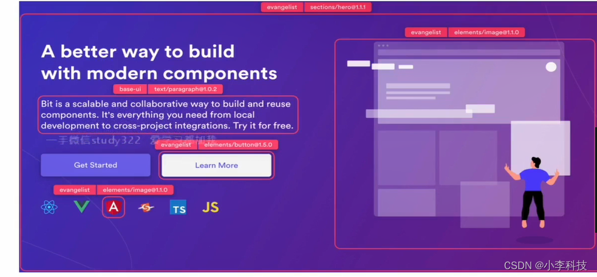

# 微前端基础

> 原文出处：https://blog.csdn.net/qq_35812380/article/details/124646439

## 微前端基础

### 一 什么是微前端

类似组件架构, 微前端应用会被升级为不同**应用**, 应用可以独立发布

每个微应用可以使用不同框架



### 二 微前端价值

1. 增量迁移

   > 对超级大的项目, 增量进行构建, 模块可以进行拆分独立应用, 构建时间加快
2. 独立发布

   > 小块发布,独立发布
3. 允许单个团队做出技术决策

   > 允许技术团队绝对使用团队技术栈,
   >
   > 如果页面按钮文字变化,只用更新按钮组件即可,不用更新整体应用重新构建

   各团队间的技术栈可以更加灵活



#### 使用场景

1. 拆分巨型应用,使应用容易维护
2. 兼容历史应用,增量进行开发

#### 三 微前端如何实现

1. 多个微应用如何组合?

   在微前端架构中, 存在多个微应用,还存在容器应用, 每个微应用都需要被注册到容器应用中. 微前端中每个应用在浏览器中都是一个独立的JS模块,

   * 通过模块化的方式被容器应用启动运行
   * 通过模块化防止微应用运行时发生冲突
2. 微应用如何实现路由?

​ 在架构中, 当路由发生变化,容器应用会拦截路由变化,根据路由匹配微前端应用,

​ 匹配到微应用后,再启动微应用路由,匹配具体的页面组件

3. 微应用间的状态共享?

   由**发布订阅模式实现**状态共享, 如使用:**RxJS**
4. 如何实现框架与库的共享?

   由 **imort-map**和**webpack**中的**externals** 属性

### 四 Systemjs

> https://github.com/dL-hx/system-reactjs

systemjs 是一个最小系统加载工具，用来创建插件来处理可替代的场景加载过程，包括加载 CSS 场景和图片，主要运行在浏览器和 NodeJS 中。它是 ES6 浏览器加载程序的的扩展，将应用在本地浏览器中。通常创建的插件名称是模块本身，要是没有特意指定用途，则默认插件名是模块的扩展名称。
 缺点：版本兼容性差，对开发者体验不好使用

通过[webpack](https://so.csdn.net/so/search?q=webpack&spm=1001.2101.3001.7020)将react应用打包为systemjs模块，在通过systemjs在浏览器中加载模块

**安装配置**

```
npm install webpack@5.17.0
```

**添加文件**

package.json

```
{
  "name": "systemjs",
  "version": "1.0.0",
  "description": "",
  "main": "index.js",
  "dependencies": {
    "@babel/cli": "^7.12.10",
    "@babel/core": "^7.12.16",
    "@babel/preset-env": "^7.12.7",
    "@babel/preset-react": "^7.12.7",
    "babel-loader": "^8.2.2",
    "html-webpack-plugin": "^4.5.1",
    "webpack": "^5.8.0",
    "webpack-dev-server": "^3.11.2",
    "webpack-cli": "^4.2.0"
  },
  "devDependencies": {
  },
  "scripts": {
    "start": "webpack serve"
  },
  "author": "",
  "license": "ISC"
}
```

导入以上配置，执行

> npm install

webpack.config.js
 指定构建需要的库system
 排除公共包打包

```
const path = require("path");
const HtmlWebpackPlugin = require("html-webpack-plugin")

module.exports = {
    mode:"development",// 配置开发模式
    entry:"./src/index.js",
    output: {
        path: path.join(__dirname,"build"),
        filename: "index.js",
        //指定构建需要的库
        libraryTarget: "system"
    },
    devtool: "source-map",
    devServer: {
        port:9000,
        contentBase:path.join(__dirname,"build"),
        historyApiFallback: true
    },
    module: {
        rules:[
            {// 匹配文件打包规则
                test:/\.js$/,
                exclude:/node_modules/,
                use:{// 配置打包loader
                    loader: "babel-loader",
                    options: {// 配置预设
                        presets:["@babel/preset-env","@babel/react"]
                    }
                }
            }
        ]
    },
    plugins: [
        new HtmlWebpackPlugin({
            inject: false,
            template: "./src/index.html"
        })
    ],
    //添加打包排除选项
    externals:["react","react-dom","react-router-dom"]
};
```

src/index.html

```
<!DOCTYPE html>
<html lang="en">
<head>
    <meta charset="UTF-8"/>
    <title>systemjs-react</title>
    <!--按照systemjs模块化的方式引入React框架应用-->
    <script type="systemjs-importmap">
        {
            "imports":{
                "react": "https://cdn.jsdelivr.net/npm/react@17.0.1/umd/react.production.min.js",
                "react-dom": "https://cdn.jsdelivr.net/npm/react-dom@17.0.1/umd/react-dom.production.min.js",
                "react-router-dom": "https://cdn.jsdelivr.net/npm/react-router-dom@5.2.0/umd/react-router-dom.min.js"
            }
        }
    </script>
    <!--systemjs-->
    <script src="https://cdn.jsdelivr.net/npm/systemjs@6.8.0/dist/system.js"></script>
</head>
<body>
    <div id="app"></div>
    <script>
        //引入具体应用
        System.import("./index.js")
    </script>
</body>
</html>
```

src/index.js

```
import App from './App.js'

ReactDOM.render(<App/>,document.getElementById('app'));
```

src/app.js

```
import * as React from "react"

export default function App() {
    return <div>Hello systemjs</div>
}
```

### 项目打包

> 使用Webpack打包

### 项目打包

> 使用Webpack打包

```
  "scripts": {
    "start": "webpack serve",
    "build": "webpack --env production"
  },
```

总结
 Systemjs平时真的用的很少，而且很不友好，一直有冲突，这里是后面要做react和Vue统一模块才选择使用的，平时不建议使用，配置冲突是真的麻烦
