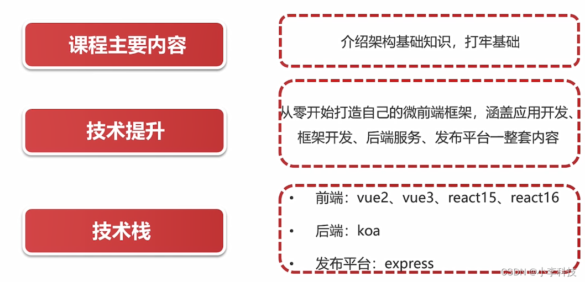
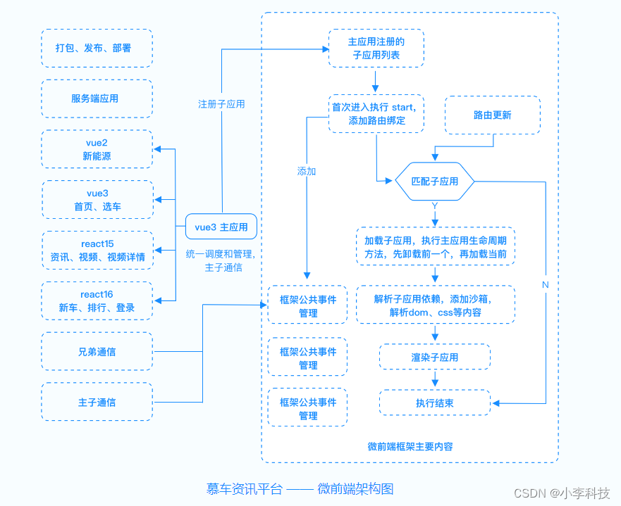

# [微前端实战]---01导学

> 原文出处：https://blog.csdn.net/qq_35812380/article/details/126063446

### 目录讲解

#### 一. 课程目标

> 1. 高质量:代码对标一线互联网大厂
> 2. 从0开始开发自己的微前端框架
> 3. 全流程: 子应用-> 主应用-> 服务端->发布平台
> 4. 源码解析: 剖析现有微前端框架–qiankun, single-spa, 使用成熟框架重构现有项目

#### 二. 与架构老师学习

#### 三. 课程目标

好厉害的设计 😂

#### 四 课程设计

* 1.架构基础知识介绍
* 2.项目前期准备
* 3.应用开发
* 4.微前端框架开发
* 5.现有框架重写

#### 五 技术点

> 1. html, css,js基础
> 2. 熟练使用vue, react框架
> 3. 熟悉node语法与express,koa框架

**高级开发 + 初中级架构人员**
