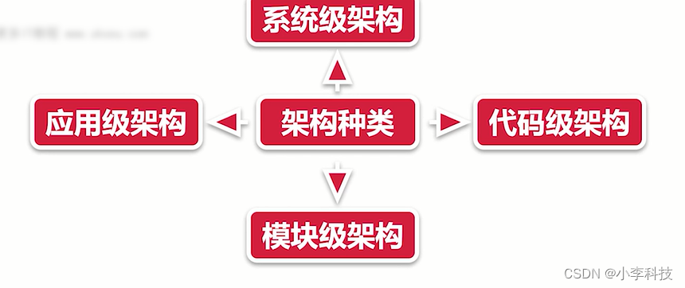

# [微前端实战]---021软件设计原则与分层

> 原文出处：https://blog.csdn.net/qq_35812380/article/details/126131812

### 软件设计原则与分层

#### 一. 软件设计原则

##### 1.1 单一职责原则

永远不应该有多于一个原因来改变某个类

**理解**:对于一个类而言,应该仅有一个引起它变化的原因

**应用**:如果一个类拥有了两种职责,那就可以将这个类分成两个类

##### 1.2 开放封闭原则

软件实体扩展应该是开放的, 但对于修改应该是封闭的

**理解**:对扩展开放,对修改封闭.**可以去扩展类,但不要去修改类**

**应用**:当需求有改动,尽量用继承或组合的方式来扩展类的功能,而不是直接修改类的代码

##### 1.3 里氏替换原则

Class 面向对象原则

**理解**:父类一定能够被子类替换

##### 1.4 最少知识原则

只与你最直接的对象交流

**理解**:低耦合,高内聚.

**应用**:做系统设计时,尽量减少依赖关系

##### 1.5 接口隔离原则

一个类与另一个类之间的依赖性,应该依赖于尽可能小的接口.

**理解**:不要对外暴露没有实际意义的接口.用户不应该依赖它不需要的接口

**应用**:当需要对外暴露接口时, 如果是非必要对外提供,尽量删除.

##### 1.6 依赖倒置原则

高层模块不应该依赖于低层模块,他们应该依赖于抽象.**抽象不应该依赖于细节,细节应该依赖于抽象**

**理解**: 应该面向接口编程, 不应该面向实现类编程.

并不是说,所有的类都要有一个对应的接口,而是说,如果有接口,那就尽量使用接口来编程.

**总结**:
 将以上六大原则的英文首字母拼在一起就是SOLID(稳定的), 所以也称之为SOLID原则.

只要满足了这六大原则,才能设计出稳定的软件架构!

#### 二. 补充设计原则

##### 2.1 组合/聚合复用原则

当要扩展类的功能时, 优先考虑使用组合,而不是继承.

该原则在23种经典设计模式中频繁使用.

如:代理模式, 装饰模式,适配器模式等.

##### 2.2 无环依赖原则

当A模块依赖于B模块,B模块依赖于C模块,C模块依赖于A模块,此时将出现循环依赖.

在设计中避免该问题, 可通过引入**中介者模式**解决

##### 2.3 共同封装原则

应该将易变的类放在同一个包里,将变化隔离出来.

该原则是"开放-封闭原则"的延生.

##### 2.4 共同重用原则

如果重用了包中的一个类,那么也就相当于重用了包中的所有类,我们要尽可能减少包的大小

##### 2.5 好莱坞原则

Don’t call me, I’ll call you.

“控制反转”(或称为"依赖注入")

不需要主动创建对象,而是由容器帮我们来创建并管理这些对象.

##### 2.6 不要重复你自己

不要让重复的代码到处都是,要让他们足够的重用,所以要尽可能的封装

##### 2.7 保持它简单与傻瓜

保持系统界面简洁,功能实用,操作方便.

##### 2.8 高内聚低耦合

模块内部需要做到内聚度高, 模块之间需要做到耦合度低.

##### 2.9 关注点分离

将一个复杂问题分离为多个简单的问题, 然后逐个解决.

**难点**: 如何进行分离? 分离的颗粒度,分离的原则

##### 2.10 你不需要它

不要一开始就把系统设计得非常复杂, 不要陷入"过渡设计"的深渊.
 让系统足够简单,而不失去扩展性

**注意设计原则使用,以及在日常开发中使用**

#### 三. 软件设计分层

##### 3.1 系统级架构

应用在整个系统内,如与后台服务如何通信, 与第三方系统如何集成.

设计前端首要条件:了解前端系统与其他系统之间的关系.

**关系包括**:业务关系和协作机制.

**设计后端**:只需要规定与后台数据传递的机制.

**包括**:api设计规则, 访问授权的一个开放标准(OAuth)跳转token的验证, 数据传递cookies的等.

前后端分离架构其实就是如何实施技术决策,用户鉴权,API接口管理和设计,API文档管理,MOCK的使用,BFF(服务于前端的后端,nodejs),是否需要服务端渲染等.

##### 3.2 微前端

* 在一个系统内微前端是应用间的架构方案
* 在多个应用之间,微前端则是一种系统间等架构方案
* 微前端是将多个前端应用以某种形式结合在一起进行应用
* 旨在解决单体应用在一个相对长的时间跨度下,由于参与的人员,团队的增多,变迁,从一个普通应用演变为一个巨石应用(Frontend Monolith)后,随之而来的应用不可维护的问题.

**单实例**:即同一时刻,只有一个子应用被展示, 子应用具备一个完整的应用周期形式

**多实例**:通常基于url的变化来做子应用的切换.

**多实例**:同一时刻可展示多个子应用

**通常使用Web Components**方案做子应用封装,子应用更像是一个业务组件而不是应用.

##### 3.3 应用级架构

应用级别架构可以看作是系统级架构的细化

单个应用与其他外部应用的关系, 微服务架构下多个应用的协作, 数据交换等.

* 脚手架
* 模式库
* 设计系统

##### 3.4 模块级别架构

在开始业务编码之前进行设计,称之为迭代

##### 3.5 代码级架构

规范与原则

**实操**

* 开发流程
* 代码质量以及改善
* 规范而非默契

**注**:

* 1. 在开发中,要注意可维护性.
* 2. 简单的代码可维护性高;越是写的抽象的代码越难维护

**注意可维护性与扩展性**

#### 四. 如何保证架构的质量—稳定性与健壮性

##### 4.1 如何保证架构的质量?

**系统的稳定性?**
 当一个实际的系统处于一个平衡状态时候,如果受到外来作用影响时,系统经过一个过渡过程仍然能够回到原来的平衡状态,
 我们称这个系统就是稳定的,否则称系统不稳定.

* 架构设计的基石
* 可以更好的实现自我修复

**系统健壮性?**

计算机软件在**输入错误,磁盘故障,网络过载,或者有意攻击**情况下,能否不死机,不崩溃,就是该软件健壮性的具体表现

**解释**:一个系统容错能力强,运行不易被干扰,安全性好

**度量标准**
 一个软件可以从错误的输入推断出合理的输入

一个软件可以正确的运行在不同环境下

一个软件能够检测出自己内部设计或者编码错误,并得到正确的结果

**健壮性与稳定性**
 健壮性与稳定性是特定软件自身的要求.
 健壮性与稳定性是软件处理的一部分

* 软件架构的健壮性和稳定性是该软件规划时所确定的目标
* 若软件的实现未达到原定目标,则该软件的健壮性和稳定性不够或者不好.

**架构质量的衡量**

* 1.扩展性
* 2.维护性
* 3.可管理
* 4.高可用(故障修复,容灾,降级,熔断)

**日常开放过程中的架构质量**

* 理解难度
* 接入依赖的成本

> 提高**扩展性**和**维护性**

* 崩溃率和错误率的指标
* 开发效率,便于开发设计
* **错误上报**与**信息收集**功能

**正确的选择是良好的开端-架构前期准备**

架构师分类

* 系统架构师
* 应用架构师
* 业务架构师

**系统架构师(技术追求)**

* 从系统的维度,负责整体系统的架构设计
* 主要是基础服务和各个系统间协调,着眼全局
* 比如关注负载, 可靠性,伸缩,扩展,整体项目切分,缓存应用等
   方面的基础架构设计.

应用架构师(\*\*并存,\*\*业务更好实现,数据更好交互,设计易于扩展,对业务系统的流转做架构设计)

* 应用程序维度,负责某个应用的技术架构, 主要偏向于业务系统
* 关注理解业务,梳理模型, 设计模式,接口,数据交换等方面.

业务架构师

* 从业务流程的维度,关注某一个行业, 业务领域分析, 获取领域模型,最终获得系统的模型
* 也可以叫业务领域专家,行业专家,产品咨询师,资深顾问.

**技术前期准备**
 **技术选型**:技术氛围,发展规模,未来发展趋势,与当前团队的契合度,执行成本,
 维护成本与迁移成本,执行效率等方面内容的调研

**充分调研每一项技术可能带来的利与弊.**

**最大程度上预测架构设计中的缺陷,以防止问题的发生.**

**技术优化**

* 在架构发展过程中,可能会存在一些有悖于当前架构设计的实现,造成了架构发展阻塞,所以需要进行架构优化,
   使得架构设计的适应性更高.

**实时改进**:改进实现,保证功能不去阻塞,更好获取状态

**技术优化性**

**架构优化**

代码集中一个文件,冗余,不易于查错, **将功能进行划分**

利用差错优化

**架构不是一蹴而就,在业务发展过程中,架构也在不断演进**

v1.0,v2.0,v3.0

**对架构设计进行实时调优, 使得架构优化成为常态化.**

**通过不断的调整架构实现,改进初始架构中设计的不足, 补足短板, 是设计不足导致,易于维护与扩展**

#### 总结:

架构师的分类,关注的技术点,架构的早期准备,架构实现过程, 技术优化是长期准备的过程.架构优化成为常态化, 不足架构设计的不足
