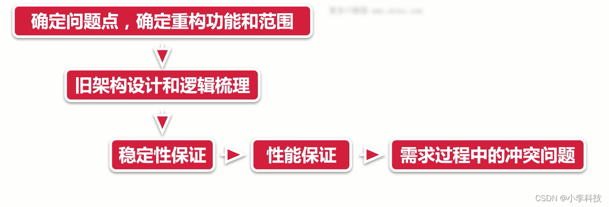

# [微前端实战]---023系统重构

> 原文出处：https://blog.csdn.net/qq_35812380/article/details/126132553

### 架构基础知识—系统重构

#### 一. 推倒?重来?-系统重构

是推到,还是重来?

* 架构不是永恒不变的.架构也是具有生命周期的.也会经历**初生, 发展,巅峰,衰弱,消亡**的过程.

> 我还做了个巅峰react :)期

重构工作的原因?

> **架构发展到巅峰时候,也是最能体现其优势之时, 但物极必反,否极泰来,会有缓慢衰弱到消亡的过程**
>  在衰弱的前期**并不需要做一些架构的重构工作**, 但是在衰弱的后期阶段, 需要对整体架构**做个重新的设计**,
>  **或者说对原有架构做一些改善.**

#### 二. 什么是重构?

* 对软件内部结构的一种调整,俗称的规范,提高速度
* **目的**: 在不改变原有软件可观察行为前提下,提高其可理解性, 降低修改成本, 提高代码质量,便于扩展
* 技术债务的实时处理,与修复,架构设计生命周期走向衰亡,避免出现新问题.

#### 三. 实现手法

* 使用重构,不改变软件行为前提下, 调整内部结构
* 系统重构工作

#### 四.重构理念

* **运用大量微小且保持软件行为的步骤,一步步达成大规模的修改.** (小部分修改)
* **快刀斩乱麻**

##### 早期系统优势:

1. 开发速度快
2. 快速迭代,代码复杂度低.,组织度低
3. 代码规范都保持完好
4. 严格注重开发规范,不会允许危及架构设计的代码产生
5. 以上因素导致添加功能难点低, 成本低

##### 晚期系统:

早期系统的优势在这里都将转换为晚期系统的劣势
 1.具备所有早期系统的劣势
 2.代码复杂度高
 3.修改时候不易,代码规范不完善, 对代码规范越界不完善

4.很多需求或功能,出现,逾越当前架构设计的情况(不可避免这种了)
 5.添加新功能兼顾较多, 涉及较多模块, 牵一发而动全身

> 在开发功能时候,涉及到的模块会很多,模块使用**引用**很多,**模块修改影响很多地方**,
>  会影响很多地方

**当我们发现一个现有架构体系已经不能满足当前迭代速度的时候,就要进行重构工作.**

#### 五.重构流程

##### 微重构

* 对有**代码坏味道**的代码,通过一些重构手段进行微重构.

> 小规模的重构

#### 总结

介绍了**如何进行系统的重构,**

**系统的重构是什么?**

**那么什么是重构的工作?**

**整体架构设计的生命周期,**

**实际的重构流程?**
