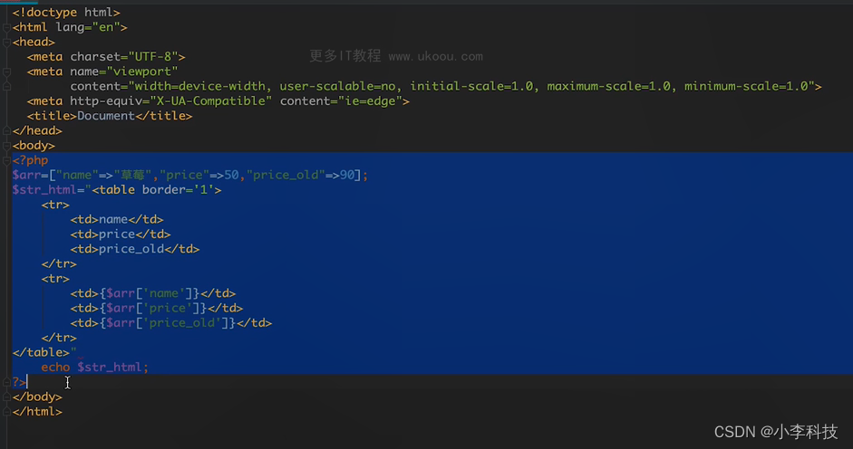
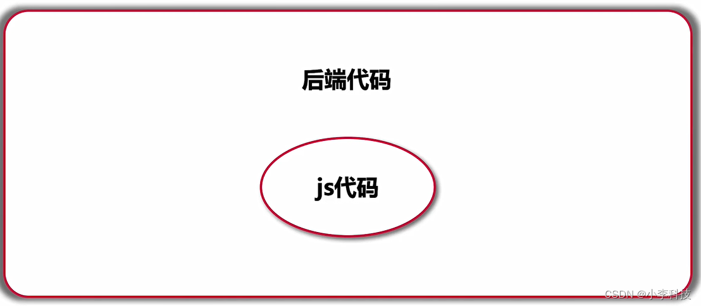
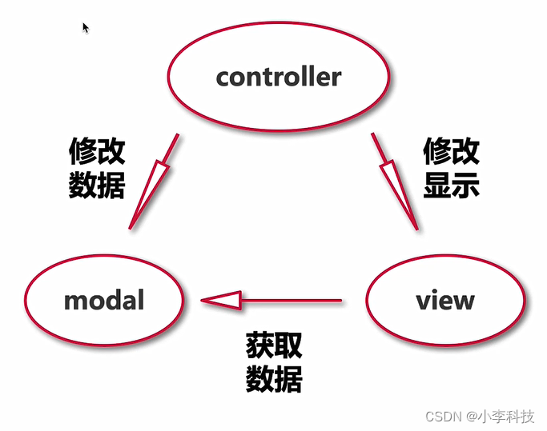
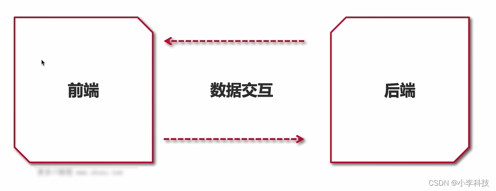
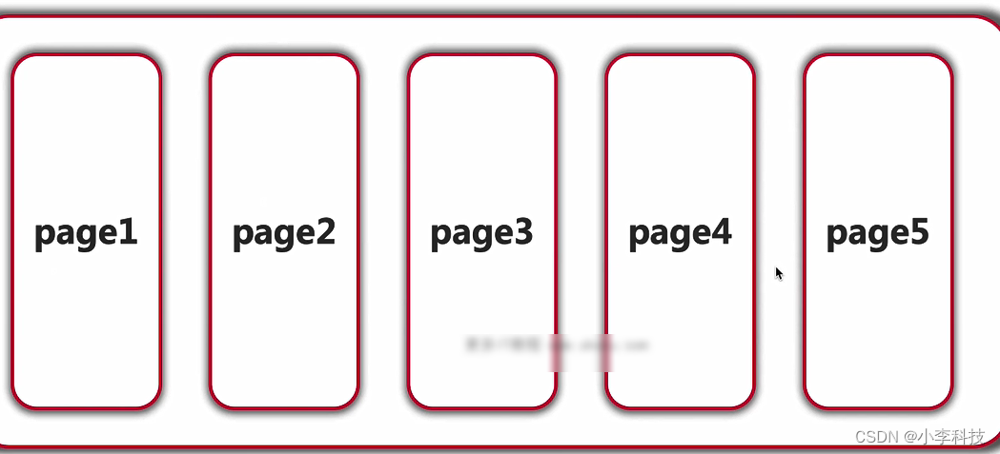

# [微前端实战]---02架构基础知识

> 原文出处：https://blog.csdn.net/qq_35812380/article/details/126064039

### 架构基础知识—前端架构的前世今生

万变不离其宗，没有一种架构是凭空想象出来的，每一种架构实践方式都是有基础的内容搭建起来的，了解到做架构设计的时候需要考虑哪些内容，如何更加合理的进行项目的架构设计工作，由浅入深，逐步踏入架构的门槛。

#### 一. 架构是如何产生的?

##### 1.1 初始架构

初始:无架构,前端代码内嵌到后端应用中(如早期的php, jsp代码)
 
 

**后端mvc架构**

1. 将视图层, 数据层, 控制层做分离
2. 缺点:重度依赖开发环境, 代码混淆严重, 没有拆解
    

##### 1.2 前后端分离架构

* 将前端代码从后端环境中提炼出来(ajax促进了前后端分离架构的发展)多页面架构

> ajax的异步,从后端获取服务端的数据

缺点:

* 前端缺乏独立部署能力, 整体流程依赖后端环境

##### 1.3 Nodejs技术的发展, 为了解决依赖后端环境的能力, 脱离后端环境

> 随着Nodejs广泛使用促进了前端技术飞速发展

* 1. 各种打包, 构建工具应运而生
* 2. 诞生了多元化前端开发方式,使得前端开发可以脱离整体后端环境

##### 1.4 单页面架构

* 1. 打包:gulp. rollup, webpack, vite…
* 2. 框架:vue/react/angular/…
* 3. ui库:antd/iview/elementui/mintui…

优势:

1. 切换页面无刷新浏览器, 用户体验好
2. 组件化的开发方式, 极大的提升了代码复用率

劣势:

1. 不利于SEO, 首次渲染需要加载js, 首次渲染会出现较长事件的白屏(可解决)

##### 1.5 大前端时代

1. 后端框架:express, koa
2. 包管理工具:npm, yarn
3. node版本管理: nvm

#### 二. 总结

1. 过于灵活的实现也导致了前端应用拆分过多, 维护困难
2. 往往一个功能火需求会跨两三个项目进行开发

#### 三. 微前端等新型架构—天下大势合久必分分久必合

**优势:**

1. 技术栈无关
2. 主框架不限制接入应用的技术栈, 微应用具备**完全自主权**
3. 独立开发, 独立部署
4. **增量升级**
5. 微前端是一个非常好的实施**渐进式重构**的手段和策略
6. 微应用仓库独立, 前后端可独立开发, 主框架自动完成同步更新
7. **独立运行**
8. 每个微应用之间**状态隔离**, **运行时状态不共享**

**劣势:**

1. **接入难度较高**
2. **应用场景-移动端少,管理端多**
