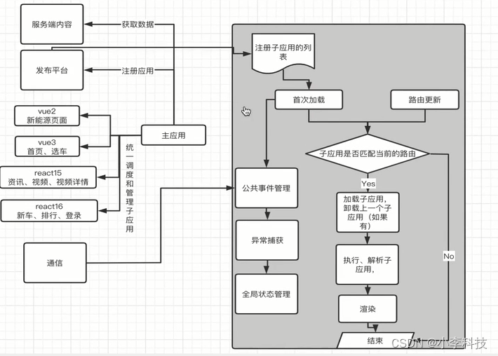
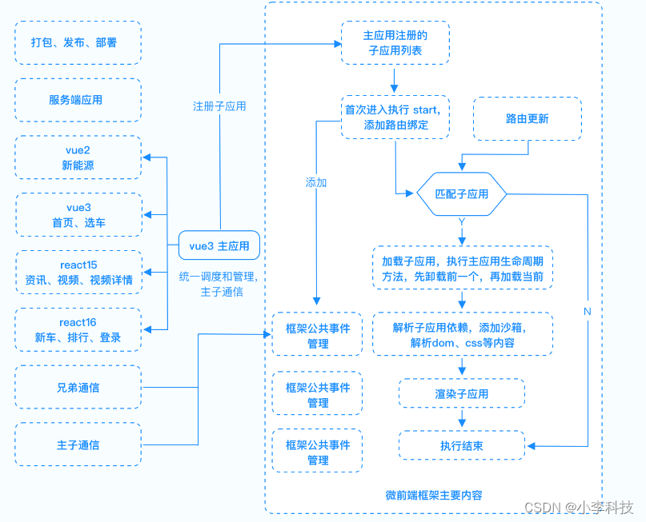

# [微前端实战]---032绘制项目架构图

> 原文出处：https://blog.csdn.net/qq_35812380/article/details/126257818

### 绘制项目架构图

#### 分析需求

**主子应用功能:**
 **框架功能**

* 1.主应用
* 注册子应用
* 加载,渲染子应用
* 路由匹配(activeWhen, rules-由框架判断)
* 获取数据(公共依赖,通过数据做鉴权处理)
* 通信(父子应用通信, 子父应用通信)
* 2.子应用功能
* 渲染页面
* 监听通信(主应用传递过来的数据, 监听主应用传递来的数据进行更新)
* 3.微前端框架
* 子应用的注册
* 开始内容(应用加载完成, )
* 路由更新判断
* 匹配对应的子应用
* 加载子应用的内容
* 完成所有依赖项的执行
* 将子应用渲染在固定的容器内
* 公共事件的管理
* 异常的捕获与报错(方便开发上的处理)
* 全局状态管理的内容
* 子应用间沙箱隔离
* 通信机制
* 4. 服务端功能
* 提高数据服务
* 5. 发布平台
* 主子应用的打包与发布

使用Processon.com绘制架构图
 <https://processon.com/>

 
