# [微前端实战]---033vue2 - 新能源子页面

> 原文出处：https://blog.csdn.net/qq_35812380/article/details/126332084

### vue2 - 新能源子页面

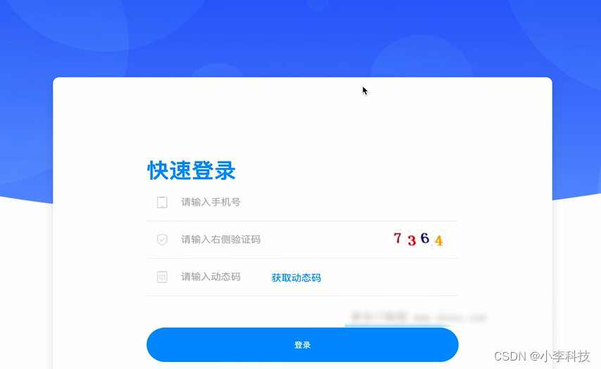

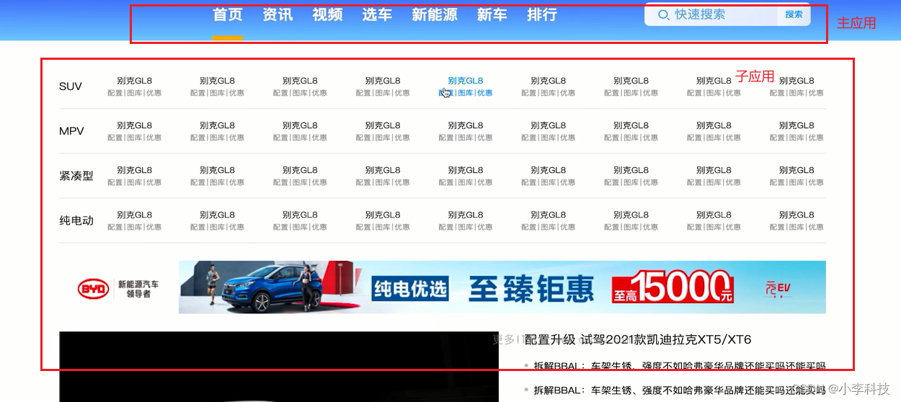

#### 一. 项目目录

* main (主应用)
* platform (发布平台)
* react15
* react16
* service (服务端)
* vue2
* vue3
* package.json
* README.md

#### 二.创建项目

vue项目: 使用vue命令创建项目

```
$ npm install -g @vue/cli //这个是从国外下载的比较慢
$ cnpm install -g @vue/cli //这个是从镜像源下载
```

```
$	 vue create vue2
```

https://blog.csdn.net/weixin_44882488/article/details/124220864

react: 应用使用create app 创建

```
$	npm install -g create-react-app
```

```
$	create-react-app react16
```

https://blog.csdn.net/oowweb/article/details/114481981

新建项目目录如下:

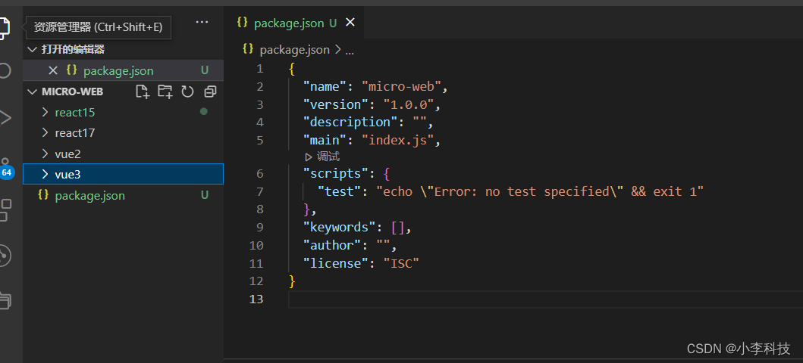

然后进入`vue2` 项目中执行命令

启动项目

```
$	npm run server
```

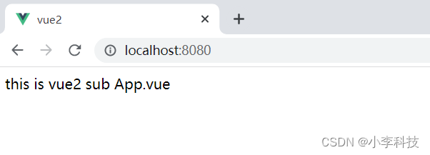

#### 三.基础配置

##### 3.1 安装vue-router

```
npm install vue-router@3.5.1 --save
```

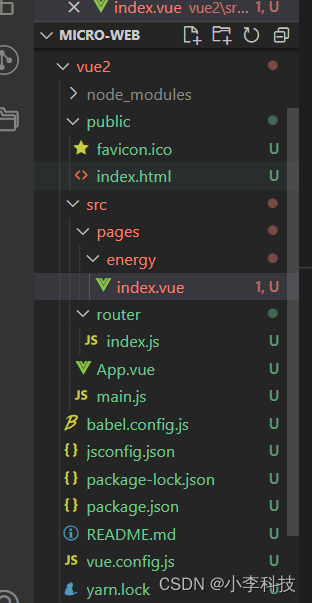

##### 3.2 实例代码

`router/index.js`

```
import Vue from 'vue'
import VueRouter from 'vue-router';
import Energy from '../pages/energy';

Vue.use(VueRouter)

const routes = [
    {
        path:'/energy',// 新能源页面
        name:'Energy',
        component: Energy
    }
]

// 创建router实例
const router = new VueRouter({
    mode: 'hash', // 使用hash 路由
    routes
})

export default router // 暴露当前路由并导出
```

`main.js`

```
import Vue from 'vue'
import App from './App.vue'

// 引入路由
+ import router from './router';

Vue.config.productionTip = false

new Vue({
+ router,
  render: h => h(App),
}).$mount('#app')
```

`pages/energy/index.vue`

```
<template>
    <div>新能源</div>
</template>

<script>
export default {
    data() {
        return {
        };
    },

    components: {},

    computed: {},

    mounted: {},

    methods: {}
}

</script>
<style lang='scss' scoped>
</style>
```

访问`http://localhost:8080/#/energy`, 查看项目是否配置成功.

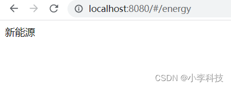

[vue2 初始化](https://github.com/dL-hx/micro-web/releases/tag/0.0.0)

#### 四.项目查看

> 这里导入先前代码, 查看结果

[feat: 导入之前的项目配置(完成vue2)](https://github.com/dL-hx/micro-web/releases/tag/0.0.1)

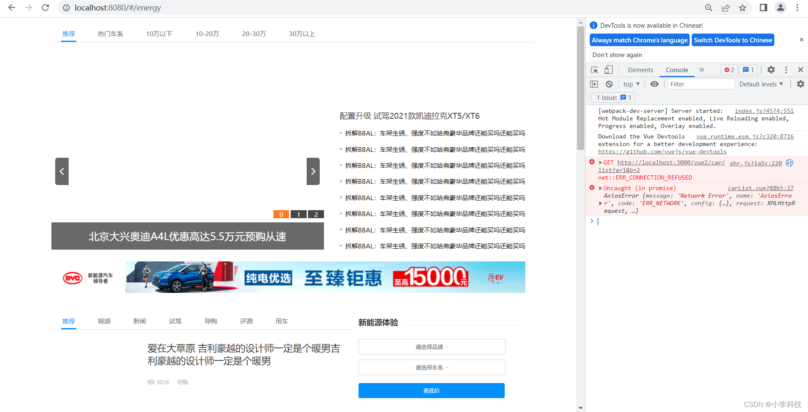

#### bug

##### 1. 缺少项目包

查找原因，是因为刚创建的项目没有引入路由, `安装包之后重启`,

> ```
> npm install vue-router --save
> ```

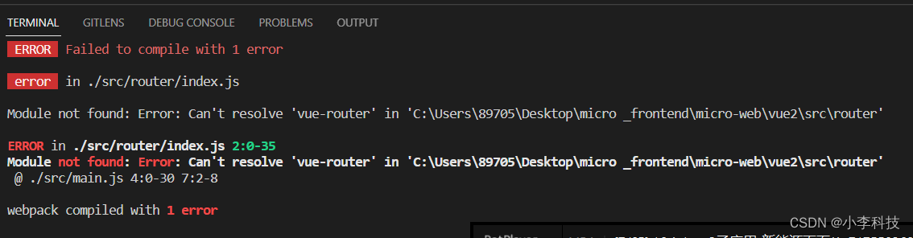

这里重新安装还是会报错, 这里查看 `安装npm的源,并清除代理`

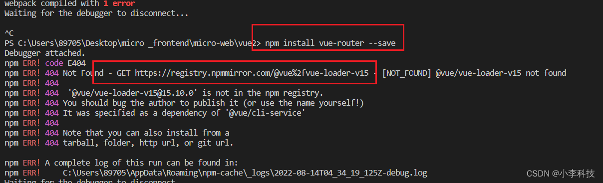

**首先查看当前的代理设置**

```
npm config get proxy
==> null
```

**清除代理**

```
npm config delete proxy
```

**查看机器中的`npmrc`配置**:

这时候发现这个源有问题

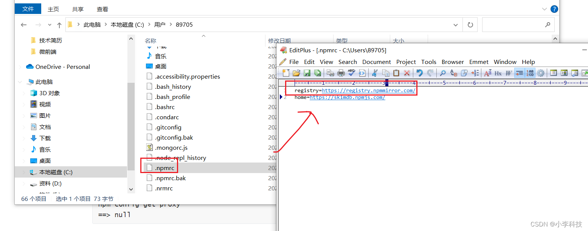

**然后使用`nrm` 方式修改镜像源**

下载 nrm：

```
$	npm install -g nrm
```

查看可切换的镜像源：(\*表示正在使用的镜像源)

```
$ 	nrm ls
```

```
* npm -------- https://registry.npmjs.org/ `官方源`
  yarn ------- https://registry.yarnpkg.com/
  cnpm ------- http://r.cnpmjs.org/       `淘宝源`
  taobao ----- https://registry.npm.taobao.org/
  nj --------- https://registry.nodejitsu.com/
  npmMirror -- https://skimdb.npmjs.com/registry/
  edunpm ----- http://registry.enpmjs.org/
```

修改镜像源, 这里推荐使用`官方源`/`淘宝源`

```
$	nrm use npm /nrm use taobao
```

**清除`node_modules`**,之后执行`npm install vue-router --save` , `npm install` 还是报错

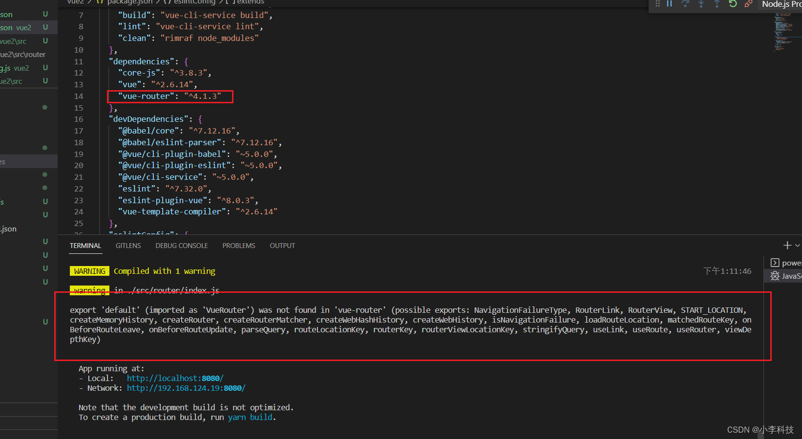

**这里是因为**

1. vue-router4 的路由和vue-router3 的路由不太一样, 需要使用相应的包
2. vue-router 版本比较高

一般安装旧版本即可

**运行如下命令安装指定版本**

```
$	npm install vue-router@3.5.1 --save-dev
```

**重新安装后, 执行`npm run serve` 项目即可重新启动**

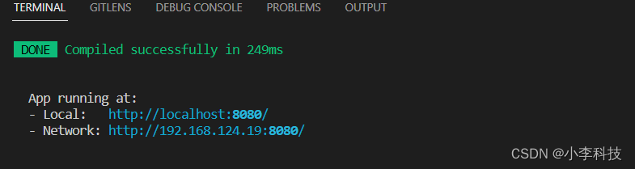

##### 2.router与route区别

routes: 路由

router: 路由器, 路由表

`package.json`

```
{
  "name": "vue2",
  "version": "0.1.0",
  "private": true,
  "scripts": {
    "start": "vue-cli-service serve",
    "build": "vue-cli-service build",
    "lint": "vue-cli-service lint",
    "clean": "rimraf node_modules"
  },
  "dependencies": {
    "core-js": "^3.6.5",
    "vue": "^2.6.11"
  },
  "devDependencies": {
    "@vue/cli-plugin-babel": "~4.5.0",
    "@vue/cli-plugin-eslint": "~4.5.0",
    "@vue/cli-service": "~4.5.0",
    "axios": "^0.21.1",
    "babel-eslint": "^10.1.0",
    "eslint": "^6.7.2",
    "eslint-plugin-vue": "^6.2.2",
    "node-sass": "^4.12.0",
    "sass-loader": "^8.0.0",
    "vue-router": "^3.5.1",
    "vue-template-compiler": "^2.6.11"
  },
  "eslintConfig": {
    "root": true,
    "env": {
      "node": true
    },
    "extends": [
      "plugin:vue/essential",
      "eslint:recommended"
    ],
    "parserOptions": {
      "parser": "babel-eslint"
    },
    "rules": {}
  },
  "browserslist": [
    "> 1%",
    "last 2 versions",
    "not dead"
  ]
}
```

`vue.config.js`

```
const path = require('path');

function resolve(dir) {
  return path.join(__dirname, dir);
}

const packageName = 'vue2';
const port = 8080;

module.exports = {
  outputDir: 'dist', // 打包的目录
  assetsDir: 'static', // 打包的静态资源
  filenameHashing: true, // 打包出来的文件，会带有hash信息
  publicPath: 'http://localhost:8080',
  devServer: {
    contentBase: path.join(__dirname, 'dist'),
    hot: false,
    disableHostCheck: true,
    port,
    headers: {
      'Access-Control-Allow-Origin': '*', // 本地服务的跨域内容
    },
  },
  // 自定义webpack配置
  configureWebpack: {
    resolve: {
      alias: {
        '@': resolve('src'),
      },
    },
    output: {
      // 把子应用打包成 umd 库格式 commonjs 浏览器，node环境
      library: `${packageName}`,
      libraryTarget: 'umd',
    },
  },
};
```
