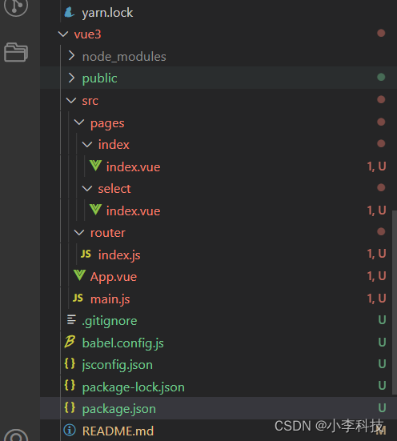
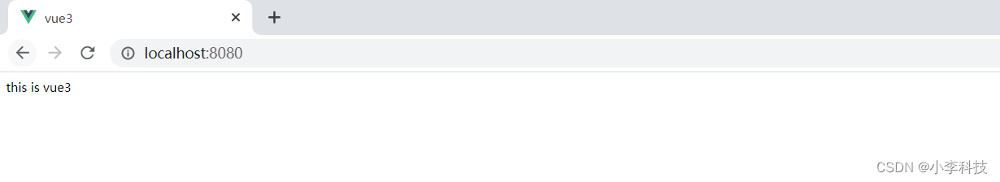
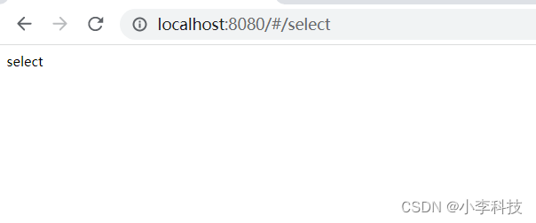
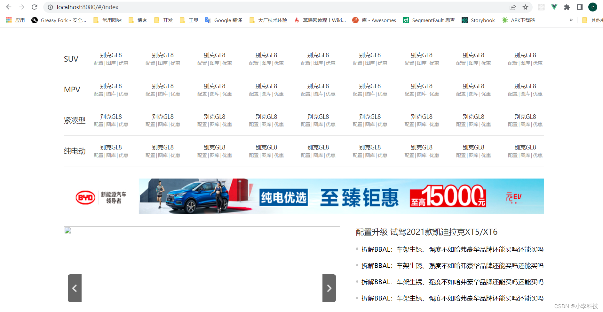
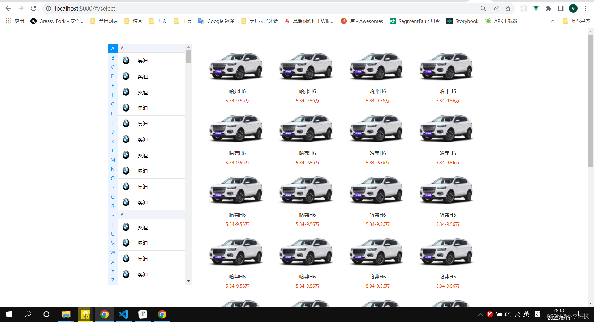
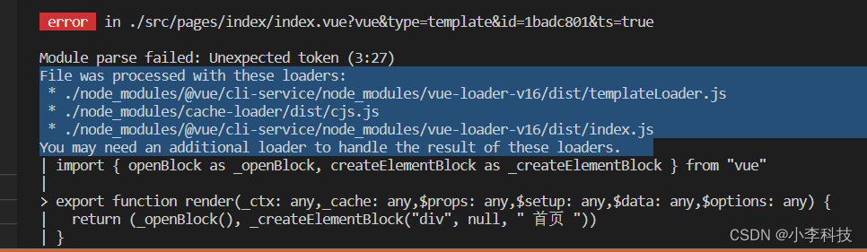
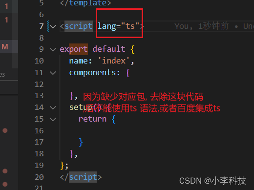

# [微前端实战]---034vue3 - 首页,选车页面

> 原文出处：https://blog.csdn.net/qq_35812380/article/details/126339064

### vue3 - 首页,选车页面

#### 一. 项目目录

新建项目目录如下:



#### 二.创建项目

```
$	 vue create vue3
```

然后进入`vue3` 项目中执行命令

启动项目

```
$	npm run serve
```



#### 三.基础配置

##### 3.1 package.json

```
{
  "name": "vue3",
  "version": "0.1.0",
  "private": true,
  "scripts": {
    "start": "vue-cli-service serve",
    "build": "vue-cli-service build"
  },
  "dependencies": {
    "core-js": "^3.6.5",
    "node-sass": "^5.0.0",
    "sass-loader": "^10.1.1",
    "scss-loader": "^0.0.1",
    "single-spa-vue": "^2.4.2",
    "vue": "^3.0.0-0",
    "vue-router": "^4.0.0-beta.11",
    "vuex": "^4.0.0-beta.4"
  },
  "devDependencies": {
    "@vue/cli-plugin-babel": "~4.5.0",
    "@vue/cli-plugin-eslint": "~4.5.0",
    "@vue/cli-service": "~4.5.0",
    "@vue/compiler-sfc": "^3.0.0-0",
    "babel-eslint": "^10.1.0",
    "babel-loader": "^8.0.6",
    "eslint": "^6.7.2",
    "eslint-plugin-vue": "^7.0.0-0",
    "html-webpack-plugin": "^3.2.0",
    "mini-css-extract-plugin": "^0.8.0",
    "style-loader": "^1.0.1",
    "vue-loader": "^15.9.3",
    "vue-template-compiler": "^2.6.11"
  },
  "eslintConfig": {
    "root": true,
    "env": {
      "node": true
    },
    "extends": [
      "plugin:vue/vue3-essential",
      "eslint:recommended"
    ],
    "parserOptions": {
      "parser": "babel-eslint"
    },
    "rules": {}
  },
  "browserslist": [
    "> 1%",
    "last 2 versions",
    "not dead"
  ]
}
```

##### 3.2 实例代码

`router/index.js`

```
import { createRouter, createWebHashHistory } from 'vue-router'
import Index from '../pages/index'
import Select from '../pages/select'

const routes = [
    // 首页
    {
        path: '/index',
        name:'Index',
        component:Index
    },
    // 选车
    {
        path: '/select',
        name:'Select',
        component:Select
    }
]
const router = createRouter({
    history: createWebHashHistory(), // 使用hash路由
    routes
})

export default router
```

`main.js`

```
import { createApp } from 'vue'
import App from './App.vue'
import router from './router'

+ createApp(App).use(router).mount('#app')
```

`pages/index/index.vue`

```
<template>
  <div>
    首页
  </div>
</template>

<script >

export default {
  name: 'index',
  components: {

  },
  setup() {
    return {

    }
  },
};
</script>

<style lang="scss">

</style>
```

`pages/select/select.vue`

```
<template>
  <div>select</div>
</template>

<script>
</script>
```

* 1. vue3兼容vue2的写法,使用方式是兼容自己写法
* 2. 也支持新写法`setup`方式,支持`Composition API`,可以定义自己的内容

访问`http://localhost:8080/#/index`, `http://localhost:8080/#/select`,查看项目是否配置成功.



[vue3 初始化](https://github.com/dL-hx/micro-web/releases/tag/0.0.2)

#### 四.项目查看

> 这里导入先前代码, 查看结果

[feat: 导入之前的项目配置(完成vue3)](https://github.com/dL-hx/micro-web/releases/tag/0.0.4)

`/index`



`/select`



#### bug




