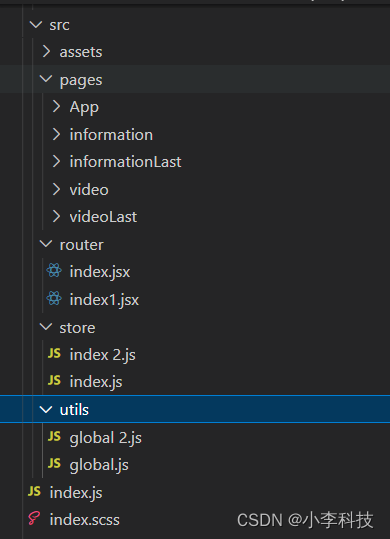
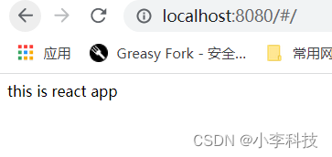
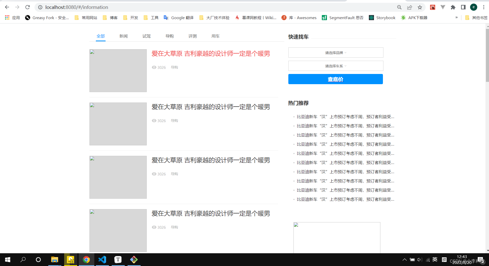
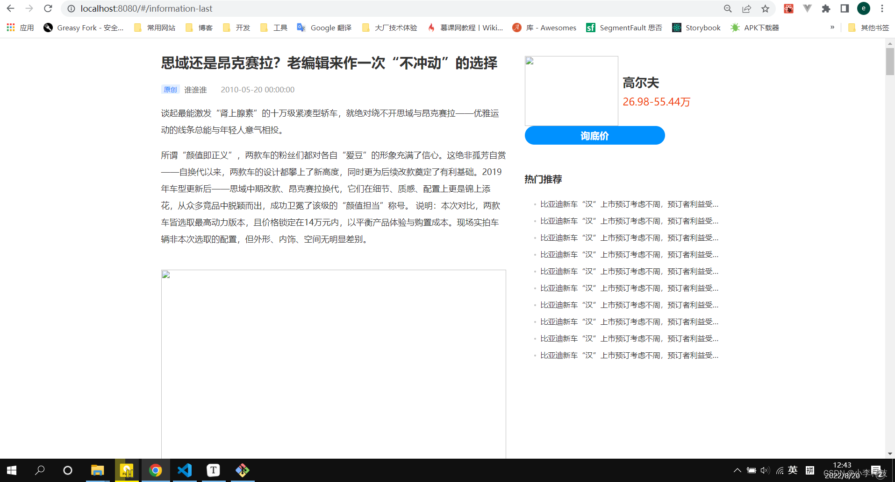
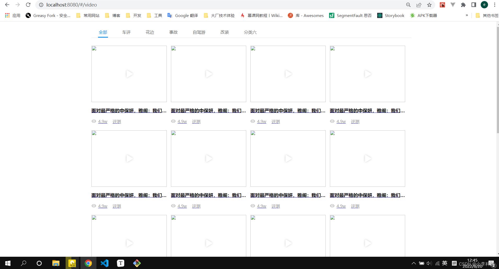
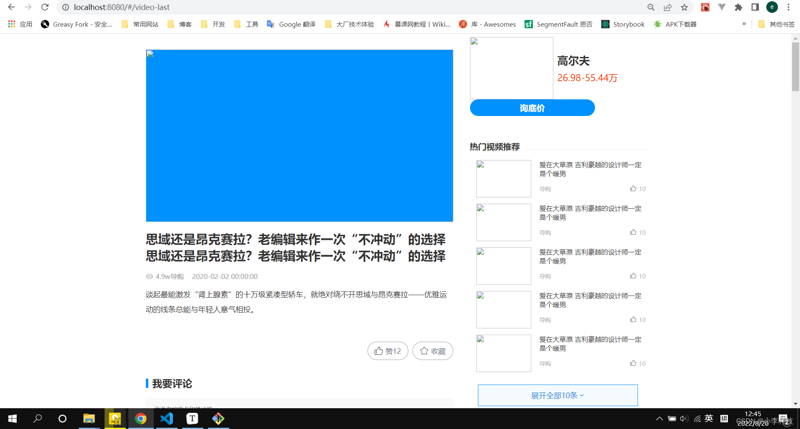

# [微前端实战]---035react15-资讯,视频,视频详情

> 原文出处：https://blog.csdn.net/qq_35812380/article/details/126438719

### react16 - 资讯视频视频详情页面

#### 零. 回顾

讲解了vue2,vue3 两个子应用开发.

vue2----开发新能源页面

vue3----开发选车,首页页面

vue3与vue2开发,

1. 可以使用`data,method`和写`vue2`一样开发子应用
2. 也可以使用`setup`/ `composition API`方式开发子应用

#### 一. 项目目录

新建项目目录如下:



#### 二.创建项目

```
$	create-react react15
```

然后进入`react15` 项目中执行命令

启动项目

```
$	npm run start
```

#### 三.基础配置

##### 3.1 package.json

```
{
  "name": "react16",
  "version": "1.0.0",
  "description": "",
  "main": "index.js",
  "scripts": {
    "start": "cross-env NODE_ENV=development webpack-dev-server --mode production"
  },
  "dependencies": {
    "node-sass": "^5.0.0",
    "react": "15.6.2",
    "react-dom": "15.6.2",
    "sass-loader": "^6.0.7"
  },
  "devDependencies": {
    "@babel/core": "^7.7.2",
    "@babel/plugin-transform-react-jsx": "^7.7.0",
    "@babel/preset-env": "^7.7.1",
    "@babel/preset-react": "^7.10.4",
    "babel-loader": "^8.0.6",
    "cross-env": "^6.0.3",
    "css-loader": "^3.2.0",
    "html-webpack-plugin": "^3.2.0",
    "mini-css-extract-plugin": "^0.8.0",
    "react-redux": "^7.2.4",
    "react-router": "^3.2.0",
    "style-loader": "^1.0.0",
    "url-loader": "^4.1.1",
    "webpack": "^4.41.2",
    "webpack-cli": "^3.3.10",
    "webpack-dev-server": "^3.9.0"
  },
  "license": "ISC"
}
```

`webpack.config.js`

```
const path = require('path')
const HtmlWebpackPlugin = require('html-webpack-plugin')
const MiniCssExtractPlugin = require('mini-css-extract-plugin')

module.exports = {
  entry: {
    path: ['./index.js']
  },
  module: {
    rules: [
      {
        test: /\.js(|x)$/,
        use: {
          loader: 'babel-loader',
          options: {
            presets: ['@babel/preset-env', '@babel/preset-react']
          }
        }
      },
      {
        test: /\.(c|sc)ss$/,
        use: [MiniCssExtractPlugin.loader, 'css-loader', 'sass-loader']
      },
      {
        test: /\.(png|svg|jpg|gif)$/,
        use: {
          loader: 'url-loader',
        }
      }
    ]
  },
  optimization: {
    splitChunks: false,
    minimize: false
  },
  plugins: [
    new HtmlWebpackPlugin({
      template: './public/index.html'
    }),

    new MiniCssExtractPlugin({
      filename: '[name].css'
    })
  ],
  output: {
    path: path.resolve(__dirname, 'dist'),
    filename: 'react15.js',
    library: 'react15',
    libraryTarget: 'umd',
    umdNamedDefine: true,
    publicPath: 'http://localhost:8080/'
  },
  devServer: {
    // 配置允许跨域
    headers: { 'Access-Control-Allow-Origin': '*' },
    contentBase: path.join(__dirname, 'dist'),
    compress: true,
    port: 8080,
    historyApiFallback: true,
    hot: true,
  },
  performance: {   //  就是为了加大文件允许体积，提升报错门栏。
    hints: "warning", // 枚举
    maxAssetSize: 500000000, // 整数类型（以字节为单位）
    maxEntrypointSize: 500000000, // 整数类型（以字节为单位）
    assetFilter: function(assetFilename) {
      // 提供资源文件名的断言函数
      return assetFilename.endsWith('.css') || assetFilename.endsWith('.js');
    }
  },
}
```

##### 3.2 实例代码

`router/index1.jsx`

```
import React from 'react'
import { Router, Route, hashHistory } from 'react-router';

import App from '../pages/App/index.jsx'

class BasicMap extends React.Component {
  render() {
    return (
      <Router history={hashHistory}>
        <Route path='/' component={App}/>
      </Router>
    )
  }
}

export default BasicMap
```

`index.js`:入口函数

```
import React from 'react'
import ReactDOM from 'react-dom'
import BasicMap from './src/router/index1.jsx';
import "./index.scss"

const render = () => {
  ReactDOM.render((
    <BasicMap />
  ), document.getElementById('app-react'))// 挂载到`public` app-react 节点
}
render()
```

`public/index.html`

```
<html lang="en">
  <head>
    <meta charset="utf-8">
    <meta http-equiv="X-UA-Compatible" content="IE=edge">
    <meta name="viewport" content="width=device-width,initial-scale=1.0">
    <title>react15</title>
  </head>
  <body>
    <noscript>
      <strong>We're sorry but sub-app1 doesn't work properly without JavaScript enabled. Please enable it to continue.</strong>
    </noscript>
    <div id="app-react"></div>
    <!-- built files will be auto injected -->
  </body>
</html>
```

`pages/App/index.jsx`

```
import React from 'react'

class App extends React.Component {
  constructor(props) {
    super(props)
    this.state = {

    }
  }
  componentDidMount() {

  }

  render() {
    return (
      <div className="app">
       this is react app
      </div>
    )
  }
}

export default App
```

访问`http://localhost:8080/#/`,查看项目是否配置成功.



[react15 初始化](https://github.com/dL-hx/micro-web/releases/tag/0.0.6)

#### 四.项目查看

> 这里导入先前代码, 查看结果

[feat: 导入之前的项目配置(完成react16)](https://github.com/dL-hx/micro-web/releases/tag/0.0.7)

`/information`



`/information-last`



`/video`



`video-last`


