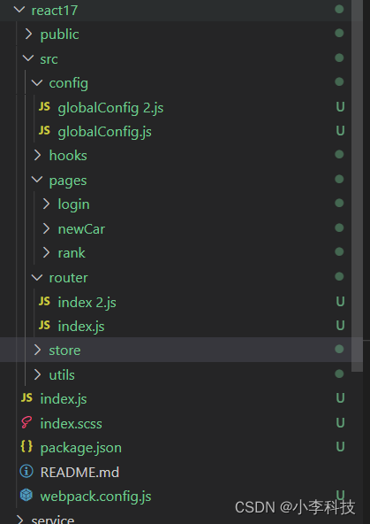
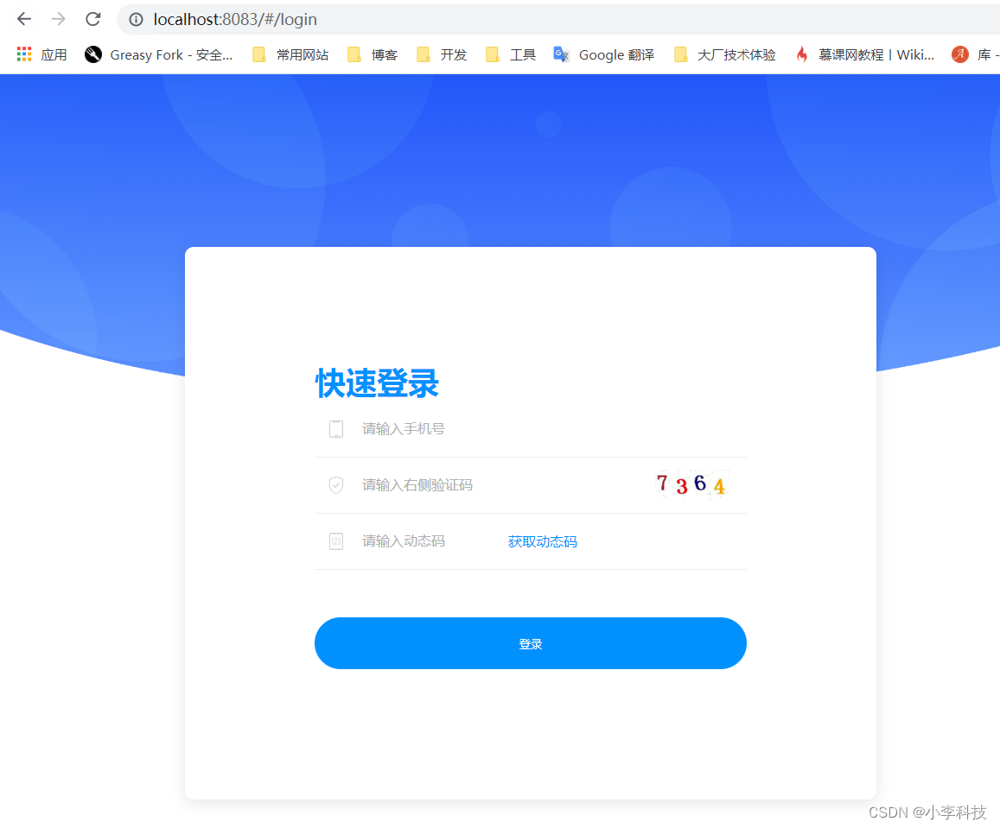
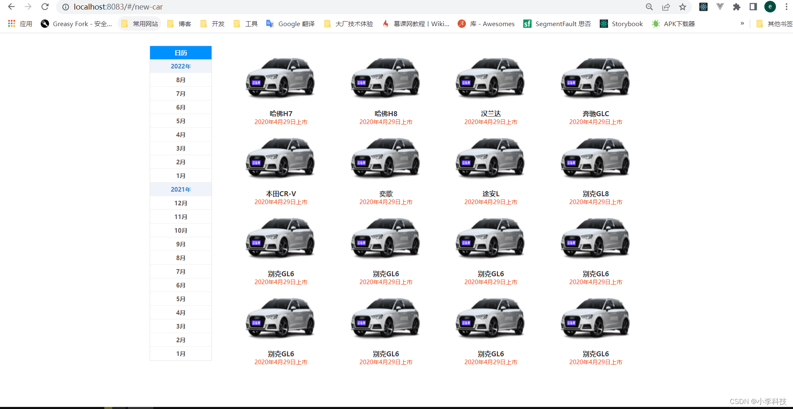
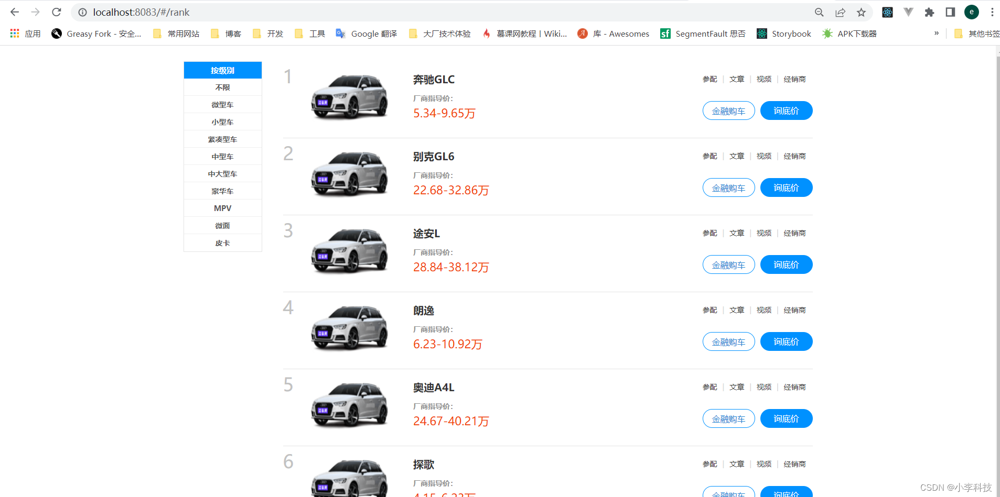

# [微前端实战]---036 react16 - 新车排行登录

> 原文出处：https://blog.csdn.net/qq_35812380/article/details/126458260

### react16 - 新车排行登录

#### 一. 项目目录

新建项目目录如下:



这里的redux模块可参考之前的`redux`模块搭建方案

#### 二.基础配置

##### 2.1 package.json

```
{
  "name": "react16",
  "version": "1.0.0",
  "description": "",
  "main": "index.js",
  "scripts": {
    "start": "cross-env NODE_ENV=development webpack-dev-server --mode production"
  },
  "dependencies": {
    "node-sass": "^5.0.0",
    "react": "^17.0.0-rc.0",
    "react-dom": "^17.0.0-rc.0",
    "regenerator-runtime": "^0.13.7",
    "single-spa-react": "^4.3.0"
  },
  "devDependencies": {
    "@babel/core": "^7.6.4",
    "@babel/preset-env": "^7.6.3",
    "@babel/preset-react": "^7.10.4",
    "axios": "^0.21.1",
    "babel-loader": "^8.0.6",
    "cross-env": "^6.0.3",
    "css-loader": "^3.2.0",
    "html-webpack-plugin": "^3.2.0",
    "mini-css-extract-plugin": "^0.8.0",
    "react-router": "3.2.0",
    "react-router-dom": "^5.2.0",
    "sass-loader": "^6.0.7",
    "style-loader": "^1.0.1",
    "webpack": "^4.41.1",
    "webpack-cli": "^3.3.9",
    "webpack-dev-server": "^3.8.2"
  },
  "author": "yancy",
  "license": "ISC"
}
```

`webpack.config.js`

```
/*
 * @Author: Sunny
 * @Date: 2021-11-07 23:25:54
 * @LastEditors: Suuny
 * @LastEditTime: 2022-04-19 17:02:45
 * @Description:
 * @FilePath: /micro-front-end-teach-asset/react16/webpack.config.js
 */
const path = require('path')
const HtmlWebpackPlugin = require('html-webpack-plugin')
const MiniCssExtractPlugin = require('mini-css-extract-plugin')

module.exports = {
  entry: { path: ['regenerator-runtime/runtime', './index.js'] },
  output: {
    path: path.resolve(__dirname, 'dist'),
    filename: 'react16.js',
    library: 'react16',
    libraryTarget: 'umd',
    umdNamedDefine: true,
    publicPath: 'http://localhost:8083'
  },
  module: {
    rules: [
      {
        test: /\.js(|x)$/,
        use: {
          loader: 'babel-loader',
          options: {
            presets: ['@babel/preset-env', '@babel/preset-react']
          }
        }
      },
      {
        test: /\.(cs|scs)s$/,
        use: [MiniCssExtractPlugin.loader, 'css-loader', 'sass-loader']
      },

    ]
  },
  optimization: {
    splitChunks: false,
    minimize: false
  },
  plugins: [
    new HtmlWebpackPlugin({
      template: './public/index.html'
    }),

    new MiniCssExtractPlugin({
      filename: '[name].css'
    })
  ],
  devServer: {
    headers: { 'Access-Control-Allow-Origin': '*' },
    contentBase: path.join(__dirname, 'dist'),
    compress: true,
    port: 8083,
    historyApiFallback: true,
    hot: true
  },
  performance: {   //  就是为了加大文件允许体积，提升报错门栏。
    hints: "warning", // 枚举
    maxAssetSize: 500000000, // 整数类型（以字节为单位）
    maxEntrypointSize: 500000000, // 整数类型（以字节为单位）
    assetFilter: function(assetFilename) {
      // 提供资源文件名的断言函数
      return assetFilename.endsWith('.css') || assetFilename.endsWith('.js');
    }
  },
}
```

##### 2.2 实例代码

`router/index1.jsx`

```
import React from 'react'
import {HashRouter, Route, Switch} from 'react-router-dom';
import Login from '../pages/login/index.jsx';
import NewCar from '../pages/newCar/index.jsx';
import Rank from '../pages/rank/index.jsx';

// 使用store的方法
import { useLocalReducer } from '../store/useLocalReducer';
import { context } from '../hooks/useLocalContext';

const BasicMap = () => {

  const [state, dispatch] = useLocalReducer();

  return (
    <context.Provider value={{ state, dispatch }}>
      <HashRouter>
        <Switch>
          {/* App页面 */}
          <Route path="/login" component={Login}/>
          <Route path="/new-car" component={NewCar} />
          <Route path="/rank" component={Rank} />
        </Switch>
      </HashRouter>
    </context.Provider>
  );
}

export default BasicMap
```

`index.js`:入口函数

```
import React from 'react'
import "./index.scss"
import ReactDOM from 'react-dom'
import BasicMap from './src/router';

const render = () => {
  ReactDOM.render(<BasicMap />, document.getElementById('app-react'))
}

render()
```

`public/index.html`

```
<html lang="en">
  <head>
    <meta charset="utf-8">
    <meta http-equiv="X-UA-Compatible" content="IE=edge">
    <meta name="viewport" content="width=device-width,initial-scale=1.0">
    <title>react16</title>
  </head>
  <body>
    <noscript>
      <strong>We're sorry but sub-app1 doesn't work properly without JavaScript enabled. Please enable it to continue.</strong>
    </noscript>
    <div id="app-react"></div>
    <!-- built files will be auto injected -->
  </body>
</html>
```

[react17 完成项目导入](https://github.com/dL-hx/micro-web/releases/tag/0.0.8)

`/login`



`/new-car`



`/rank`



#### 三. 一次启动所有项目

> 为了一次性启动所有的子应用, 所以在根目录`package.json`,配置启动命令

实现思路:

配置`nodejs` 启动文件脚本, 一次启动所有命令

`原配置命令修改`

```
"scripts":{
-    "vue2":"cd vue2 && npm start",
-   "vue3":"cd vue3 && npm start",
-   "react15":"cd react15 && npm start",
-   "react17":"cd react17 && npm start",
}
```

`新配置命令`

```
"scripts":{
+   "start": "node ./build/run.js",
}
```

`build/run.js`

```
// node 执行命令的包
const  childProcess = require('child_process')
// node 获取路径的包
const path = require('path')
// https://blog.csdn.net/qq_35812380/article/details/124626900 ==> 12

const filePath = {
    vue2: path.resolve(__dirname, '../vue2'),// 获取根目录, 再连接
    vue3:path.resolve(__dirname, '../vue3'),
    react15:path.resolve(__dirname, '../react15'),
    react17:path.resolve(__dirname, '../react17'),
}
// cd 子应用目录 && npm start 启动项目
function runChild() {
    // 获取子应用的路径,  然后执行命令
    Object.values(filePath).forEach(item=>{
        childProcess.spawn( `cd ${item} && npm start`,{ // 执行shell脚本配置
            stdio:'inherit',
            shell:true
        })
    })
}

// 运行子应用
runChild()
```

打开浏览器,检验项目是否启动正常.

> ​ vue2
>
> * http://:localhost:8080/#/
>    vue3
> * http://:localhost:8081/#/
>    react15
> * http://:localhost:8082/#/
>    react17
> * http://:localhost:8083/#/

[一次启动所有项目](https://github.com/dL-hx/micro-web/releases/tag/0.0.9)

**接下来学习构建后端服务**
