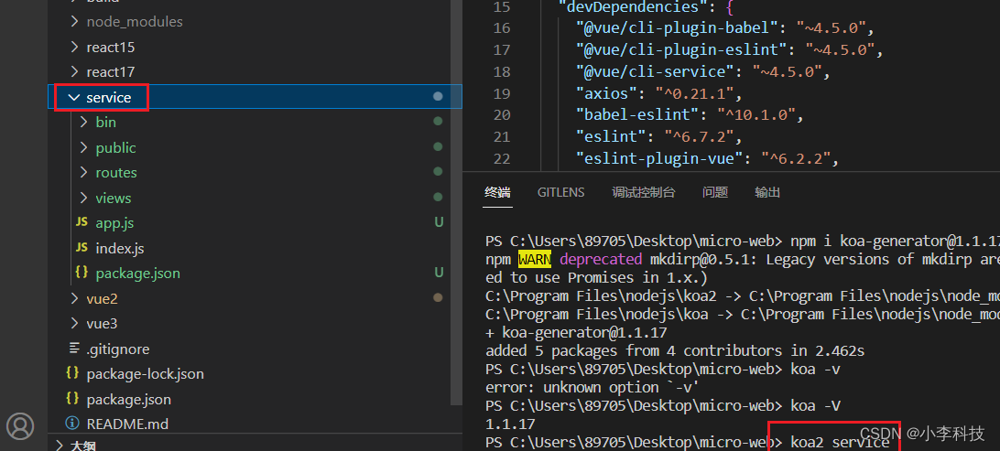
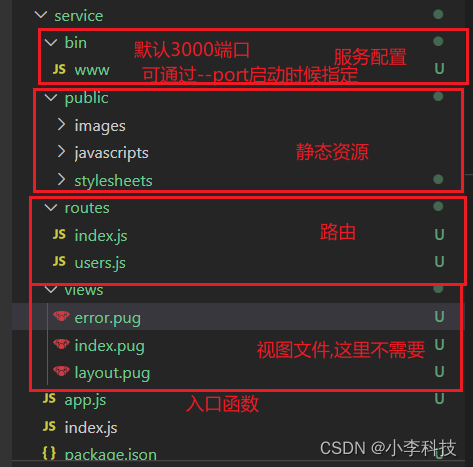
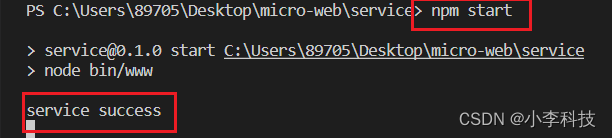
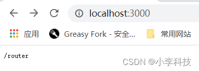
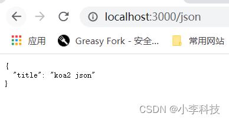

# [微前端实战]---037 后端服务

> 原文出处：https://blog.csdn.net/qq_35812380/article/details/126516883

### 后端服务

#### 一. 安装

`koa-generator`

```
$	npm i koa-generator@1.1.17 -g
```

```
$	koa -V               // 1.1.17
```

#### 二. 生成项目

`koa2 <项目名称>`

```
$  koa2 service
```



#### 二.目录介绍



##### 2.1 app.js

```
- const views = require('koa-views')

- app.use(views(__dirname + '/views', {
-  extension: 'pug'
- }))
```

##### 2.2 启动项目

```
$	cd service
$	npm i
$	npm start
```



`routes/index.js`

修改这个文件, 然后重新启动`npm start`, 访问`http://localhost:3000/`,`http://localhost:3000/json`

```
const router = require('koa-router')()

+router.get('/', async (ctx, next) => {
+ ctx.body = '/router'
+})
...
```





#### 三. 自动启动

发现每次修改代码后,都需要重新启动项目服务, 将其改为自动重启项目.

##### 3.1 supervisor

`npm install supervisor --save-dev`

##### 3.2 启动脚本

> 替换node启动, 由`supervisor` 启动

`package.json`

```
"scripts": {
-   "start": "node bin/www",
+   "start": "supervisor bin/www",
...
  },
```

**此时已经可以自动监听代码变动并更新,而用node 命令启动不会实时更新**

[配置后端Koa init](https://github.com/dL-hx/micro-web/releases/tag/0.1.0)

#### 回顾.

1. npm i koa-generator@1.1.17 -g
2. koa2 <项目名称> 生成项目
3. 熟悉项目的目录,与资源, 静态目录, `router`配置
4. `supervisor` 配置项目的自动更新
