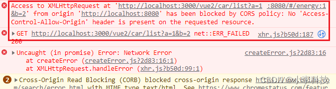
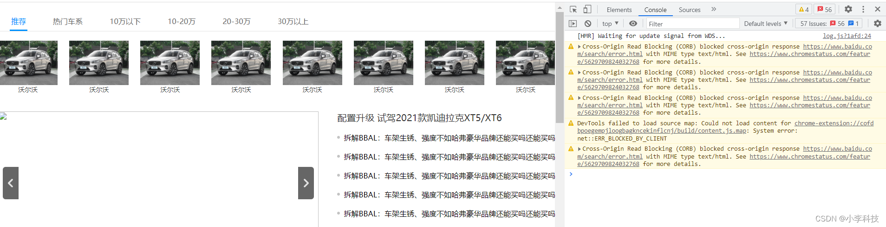
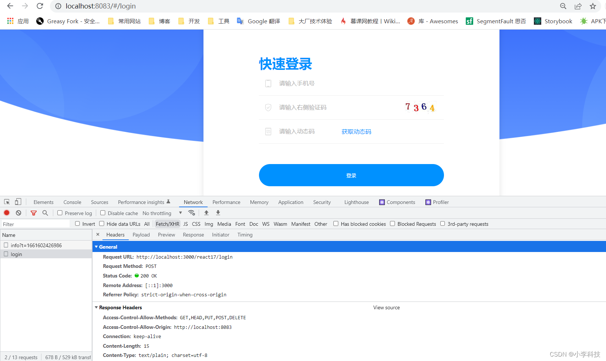

# [微前端实战]---038 请求数据

> 原文出处：https://blog.csdn.net/qq_35812380/article/details/126562155

### 后端服务-请求数据

#### 一. 添加启动命令

`build/run.js`

```
...

const filePath = {
...
  // 添加启动service命令
+  service: path.join(__dirname, '../service')
}
...
runChild()
```

新建`router/vue2.js`

##### 1.1 KOA get请求

```
const router = require('koa-router')()

router.prefix('/vue2') // 添加前缀 http://localhost:3000/vue2

router.get('/car/list', function (ctx, next) {
  // ctx.request.query   // 获取Get请求参数

  ctx.body = [
    {
      img: 'https://youjia-image.cdn.bcebos.com/modelImage/f9037020cac55360e436c2a4add6cef9/16593358938844266694.jpg@!1200_width',
      name: '沃尔沃'
    },
    {
      img: 'https://youjia-image.cdn.bcebos.com/modelImage/f9037020cac55360e436c2a4add6cef9/16593358938844266694.jpg@!1200_width',
      name: '沃尔沃'
    },
    {
      img: 'https://youjia-image.cdn.bcebos.com/modelImage/f9037020cac55360e436c2a4add6cef9/16593358938844266694.jpg@!1200_width',
      name: '沃尔沃'
    },
    {
      img: 'https://youjia-image.cdn.bcebos.com/modelImage/f9037020cac55360e436c2a4add6cef9/16593358938844266694.jpg@!1200_width',
      name: '沃尔沃'
    },
    {
      img: 'https://youjia-image.cdn.bcebos.com/modelImage/f9037020cac55360e436c2a4add6cef9/16593358938844266694.jpg@!1200_width',
      name: '沃尔沃'
    },
    {
      img: 'https://youjia-image.cdn.bcebos.com/modelImage/f9037020cac55360e436c2a4add6cef9/16593358938844266694.jpg@!1200_width',
      name: '沃尔沃'
    },
    {
      img: 'https://youjia-image.cdn.bcebos.com/modelImage/f9037020cac55360e436c2a4add6cef9/16593358938844266694.jpg@!1200_width',
      name: '沃尔沃'
    },
    {
      img: 'https://youjia-image.cdn.bcebos.com/modelImage/f9037020cac55360e436c2a4add6cef9/16593358938844266694.jpg@!1200_width',
      name: '沃尔沃'
    },
  ]
})

router.get('/bar', function (ctx, next) {
  ctx.body = 'this is a users/bar response'
})

module.exports = router
```

```
async getCarList() {
      const res = await axios.get('http://localhost:3000/vue2/car/list?a=1&b=2')
      this.carList = res.data
}
```

新建`router/react17.js`

##### 1.2 KOA post请求

```
const router = require('koa-router')()

router.prefix('/react17') // 添加前缀 http://localhost:3000/react17

router.post('/login', function (ctx, next) {
  // ctx.request.body   // 获取POST请求参数
  ctx.body = 'this is respose'
})

module.exports = router
```

```
  axios.post('http://localhost:3000/react17/login', {
      a: 1,
      b: 2,
    })
      .then(res => {
        console.log('登录成功')
    })
```

`app.js` 引入中间件和路由

```
...
// 注册koa中间件
+ const cors = require('koa-cors');   // 解决跨域

// 引入vue2的接口内容
+ const vue2 = require('./routes/vue2')
// 引入react17的接口内容
+ const react17 = require('./routes/react17')

...
+ app.use(cors());

// 注册routes
...
+ app.use(vue2.routes(), vue2.allowedMethods())
+ app.use(react17.routes(), react17.allowedMethods())

module.exports = app
```

> 注意要注册中间件, 在注册路由文件, 然后打开浏览器请求服务.

跨域问题, `配置代理服务`,见结尾.



再打开

http://localhost:8080/#/energy, 发起`get`请求



http://localhost:8083/#/login, 发起`post`请求



[后端服务-请求数据](https://github.com/dL-hx/micro-web/releases/tag/0.1.1)

#### 回顾.

1. 将服务设置为可跨域状态`koa2-cors`插件实现
2. app.js 引入插件, `router`文件 注册路由
3. ctx.request.query // 获取get请求参数
4. ctx.request.body // 获取post请求参数
5. axios.get /axios.post

下一章, 将对项目进行`微前端改造`

#### 配置`中间件`.

配置`中间件`

`/service`

```
$	cd service
```

```
$	npm install koa-cors --save
```

主要通过koa-cors插件来处理，共3个步骤：

①安装：

```
npm install koa-cors --save
```

②引入：

```
const cors = require('koa-cors');   // 解决跨域
```

③注册：

```
app.use(cors());
```

ps：注意，要把 app.use(cors()); 放在路由的前面，坑已踩
