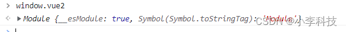
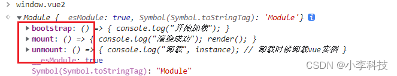
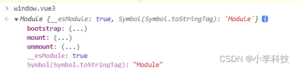

# [微前端实战]---039 子应用接入微前端-vue2，vue3

> 原文出处：https://blog.csdn.net/qq_35812380/article/details/126564150

### 子应用接入微前端-vue2，vue3

#### 一. vue2

`vue2/config.js`

```
const packageName = 'vue2';

module.exports = {
    ...
 output: {
      // 把子应用打包成 umd 库格式 commonjs 浏览器，node环境
+     libraryTarget: 'umd',
+     filename: `${packageName}.js`, // 打包后的文件名
+     library: `${packageName}`,// 可以通过window.vue2 获取应用的内容
+     jsonpFunction: `webpackJsonp_${packageName}`,// 用来按需加载chunk的JSONP函数
    },
};
```

```
library: 'library' // 名字随便取，代表我们全局暴露的变量
```

增加配置后

```
$	cd vue2
$	npm start
```

可以看到挂载到全局的变量`vue2`

``http://localhost:8080/#/energy`



修改`vue2/main.js`

```
import Vue from 'vue'
import App from './App.vue'

// 引入路由
import router from './router';

Vue.config.productionTip = false

+ let instance = null // 定义对象接收实例
+ const render = ()=>{
+   instance = new Vue({
+     router,
+     render: h => h(App),
+   }).$mount('#app-vue')
+ }
+
+ if(!window.__MICRO_WEB__){ // 如果不是微前端环境,执行render
+   render()
+ }
+
+ // 如果在微前端环境,暴露生命周期
+
+ // 开始加载结构 (加载前的处理, 如参数处理..)
+ export const bootstrap = ()=>{
+   console.log("开始加载");
+ }
+
+
+ //
+ export const mount = ()=>{
+   console.log("渲染成功");
+   render()
+ }
+
+ export const unmount = ()=>{
+   console.log("卸载", instance);
+   // 卸载时候卸载vue实例,卸载事件,清空当前根元素的内容
+ }
```

增加`bootstrap`,`mount`,`unmount`生命周期，

如果在不在微前端框架： 即 `cd vue2 && npm start` 启动， 直接`render`

如果在微前端框架中： 即根目录执行`npm start` , 会执行`bootstrap`,`mount`,`unmount` 生命周期进行挂载

再次在控制台查看`window.vue2`, 发现已经挂载到了全局实例中

---



定义`__MICRO_WEB__` 字段：， 微前端环境字段

方法：

`bootstrap`

`mount`

`unmount`

[feat:vue2微前端改造](https://github.com/dL-hx/micro-web/releases/tag/0.1.2)

#### 二. vue3

####

> 修改类似`vue2`

`vue3/config.js`

```
const packageName = 'vue3';

module.exports = {
    ...
 output: {
      // 把子应用打包成 umd 库格式 commonjs 浏览器，node环境
+     libraryTarget: 'umd',
+     filename: `${packageName}.js`, // 打包后的文件名
+     library: `${packageName}`,// 可以通过window.vue3 获取应用的内容
+     jsonpFunction: `webpackJsonp_${packageName}`,// 用来按需加载chunk的JSONP函数
    },
};
```

修改`vue3/main.js`

```
import { createApp } from 'vue'
import App from './App.vue'
import router from './router'

+ let instance = null // 定义对象接收实例
+
+
+ const render = () => {
+     instance = createApp(App)
+     // 挂载vue实例
+     instance.use(router).mount('#app')
+ }
+
+ if (!window.__MICRO_WEB__) { // 如果不是微前端环境,执行render
+     render()
+ }
+
+ // 如果在微前端环境,暴露生命周期
+
+ // 开始加载结构 (加载前的处理, 如参数处理..)
+ export const bootstrap = () => {
+     console.log("开始加载");
+ }
+
+
+ //
+ export const mount = () => {
+     console.log("渲染成功");
+     render()
+ }
+
+ export const unmount = () => {
+     console.log("卸载", instance);
+      // 卸载时候卸载vue实例,卸载事件,清空当前根元素的内容
+ }
```

`http://localhost:8081/#/index` 输入`window.vue3`



[feat:vue3微前端改造](https://github.com/dL-hx/micro-web/releases/tag/0.1.3)
