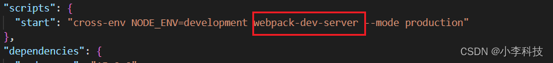
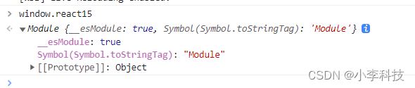
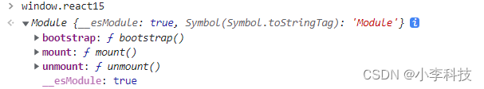
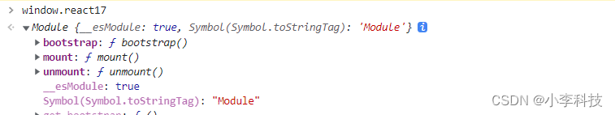

# [微前端实战]---040 子应用接入微前端-react15,react17

> 原文出处：https://blog.csdn.net/qq_35812380/article/details/126571431

### 子应用接入微前端react15,react17

#### 一. react15



`react15/webpack.config.js`

```
output: {
    path: path.resolve(__dirname, 'dist'),
+   filename: 'react15.js',
+   library: 'react15',
+   libraryTarget: 'umd',
+   umdNamedDefine: true,
+    publicPath: 'http://localhost:8082/'
},
```

```
library: 'library' // 名字随便取，代表我们全局暴露的变量
```

```
publicPath: 'http://localhost:8082/'
```

当前子应用启动的访问地址`8082`增加配置后

```
$	cd react15
$	npm start
```

可以看到挂载到全局的变量`react15`

``http://localhost:8082/#/information`



修改`react15/index.js`

```
import React from 'react'
import ReactDOM from 'react-dom'
import BasicMap from './src/router/index.jsx';
// import BasicMap from './src/router/index1.jsx';
import "./index.scss"

+ const render = () => {
+   ReactDOM.render((
+     <BasicMap />
+   ), document.getElementById('app-react'))
+ }
+ render()
+
+ if(!window.__MICRO_WEB__){ // 如果不是微前端环境,执行render
+   render()
+ }
+
+ // 如果在微前端环境,暴露生命周期
+
+ // 开始加载结构 (加载前的处理, 如参数处理..)
+ export const bootstrap = ()=>{
+   console.log("开始加载");
+ }
+
+
+ //
+ export const mount = ()=>{
+   console.log("渲染成功");
+   render()
+ }
+
+ export const unmount = ()=>{
+   console.log("卸载");
+   // 卸载时候卸载react实例,卸载事件,清空当前根元素的内容
+ }
```

增加`bootstrap`,`mount`,`unmount`生命周期，

如果在不在微前端框架： 即 `cd react15 && npm start` 启动， 直接`render`

如果在微前端框架中： 即根目录执行`npm start` , 会执行`bootstrap`,`mount`,`unmount` 生命周期进行挂载

再次在控制台查看`window.react15`, 发现已经挂载到了全局实例中

---



定义`__MICRO_WEB__` 字段：， 微前端环境字段

方法：

`bootstrap`

`mount`

`unmount`

[feat:react15微前端改造](https://github.com/dL-hx/micro-web/releases/tag/0.1.4)

#### 二. react17

> 修改类似`react15`

`react17/webpack.config.js`

```
  output: {
    path: path.resolve(__dirname, 'dist'),
    filename: 'react17.js',
    library: 'react17',
    libraryTarget: 'umd',
    umdNamedDefine: true,
    publicPath: 'http://localhost:8083'
  },
```

修改`react17/index.js`

```
import React from 'react'
import "./index.scss"
import ReactDOM from 'react-dom'
import BasicMap from './src/router';

+ const render = () => {
+   ReactDOM.render(<BasicMap />, document.getElementById('app-react'))
+ }
+
+
+ render()
+
+
+ if (!window.__MICRO_WEB__) { // 如果不是微前端环境,执行render
+   render()
+ }
+
+ // 如果在微前端环境,暴露生命周期
+
+ // 开始加载结构 (加载前的处理, 如参数处理..)
+ export const bootstrap = () => {
+   console.log("开始加载");
+ }
+
+
+ //
+ export const mount = () => {
+   console.log("渲染成功");
+   render()
+ }
+
+ export const unmount = () => {
+   console.log("卸载");
+   // 卸载时候卸载react实例,卸载事件,清空当前根元素的内容
+ }
```

`http://localhost:8083/#/index` 输入`window.react17`



[feat:react15微前端改造17](https://github.com/dL-hx/micro-web/releases/tag/0.1.5)

> 下一章开发主应用， 以及如何通过主应用控制子应用的加载
