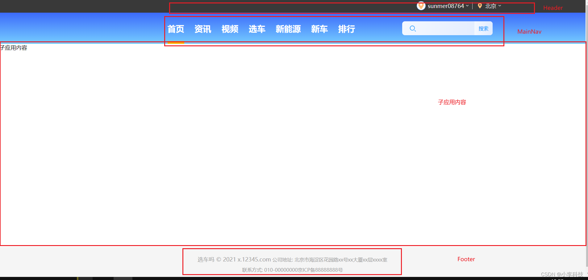
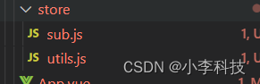
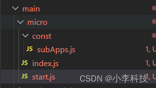
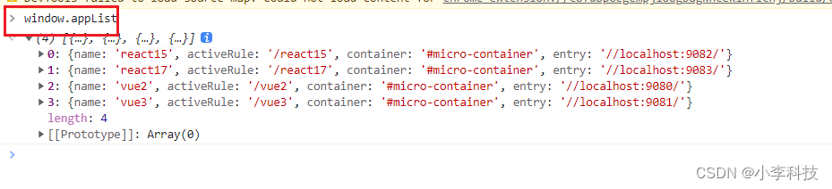

# [微前端实战]---041 框架初建（中央控制器， 子应用注册）

> 原文出处：https://blog.csdn.net/qq_35812380/article/details/126575681

### 框架初建（中央控制器， 子应用注册）

#### 一. 中央控制器

> 主应用: 中央控制器

> 主应用通过`vue3`构建

```
$	npm install @vue/cli@4.5.0 -g
```

```
$	vue create main
```



```
<template>
  <Header/>
  <MainNav />
  <div class="sub-container">
    <Loading v-show="loading"/>
    <div v-show="!loading" id="sub-container">子应用内容</div>
  </div>
  <Footer/>
</template>
```

`App.vue`

```
<template>
  <Header />
  <MainNav />
  <div class="sub-container">
    <Loading v-show="loading" />
    <div v-show="!loading" id="sub-body">子应用内容</div>
  </div>
  <Footer />
</template>

<script>
import { ref } from 'vue'

import Header from "./components/Header";
import MainNav from "./components/MainNav";
import Loading from "./components/Loading";
import Footer from "./components/Footer";

export default {
  name: 'App',
  components: {
    Header,
    MainNav,
    Loading,
    Footer
  },
  setup() {
    // 声明双向数据ref
    const loading = ref(true)

    setTimeout(()=>{// 3s 后关闭 loding
      loading.value = false
    },3000)

    return {
      loading,
    }
  }
}
</script>

<style>
html,
body,
#micro_web_main_app {
  width: 100%;
height: 100%;
}

* {
  margin: 0;
  padding: 0;
  box-sizing: border-box;
}

.sub-container {
  min-height: 100%;
  position: relative;
}

#micro-container {
  min-height: 100%;
  width: 100%;
}
</style>
```

> 通过一个`v-show`, `loading`变量， 控制显示隐藏

`components/MainNav.vue`

> 导航部分

```
<template>
  <div class="main-nav-container">
    <div class="main-nav-content">
      <!-- logo内容 -->
      <div class="main-nav-logo">
        
      </div>

      <!-- 导航列表详情 -->
      <div class="main-nav-list">
        <div v-for="(item, index) in NAV_LIST" :class="{ 'main-nav-active': currentIndex === index }" :key="index"
          @click="setCurrentIndex(item, index)">
          {{ item.name }}
        </div>
      </div>

      <!-- 搜索 -->
      <div class="main-nav-search">
        <div class="main-nav-search-icon">
          
        </div>
        <div class="main-nav-search-input">
          <input type="text" id="main-nav-search" v-if="searchStatus" @blur="setSearchStatus(false)">
          <div class="main-nav-search-input-fake" v-else @click="setSearchStatus(true)">
            快速搜索
          </div>
        </div>
        <div class="main-nav-search-button">
          搜索
        </div>
      </div>
    </div>
  </div>
</template>

<script>
import { ref, watch } from 'vue'
export default {
  name: 'MainNav',
  setup() {
    const NAV_LIST = [
    {
      name: '首页',
      status: true,
      value: 0,
      url: '/vue3/index',
      hash: '',
    },
    {
      name: '资讯',
      status: false,
      value: 1,
      url: '/react15/information',
    },
    {
      name: '视频',
      status: false,
      value: 2,
      url: '/react15/video',
      hash: '',
    },
    {
      name: '选车',
      status: false,
      value: 3,
      url: '/vue3/select',
      hash: '',
    },
    {
      name: '新能源',
      status: false,
      value: 4,
      url: '/vue2/energy',
      hash: '',
    },
    {
      name: '新车',
      status: false,
      value: 5,
      url: '/react17/new-car',
      hash: '',
    },
    {
      name: '排行',
      status: false,
      value: 6,
      url: '/react17/rank',
      hash: '',
    },
  ]

    const currentIndex = ref(0) // 创建响应式变量
    const setCurrentIndex = (data, index) => {
      currentIndex.value = index
    }

    const searchStatus = ref(true)
    const setSearchStatus = (type) => {
      searchStatus.value = type
    }
    return {
      NAV_LIST,
      currentIndex,
      setCurrentIndex,
      searchStatus,
      setSearchStatus,

    }
  }
}
</script>
<style lang="scss" scoped>
...
</style>
```

`public/index.html`

```
    <div id="micro_web_main_app"></div>
```

`main.js`

```
import { createApp } from 'vue'
import App from './App.vue'

createApp(App).mount('#micro_web_main_app')
```

> 注入到这个`micro_web_main_app`节点

[16.中央控制器-主应用开发](https://github.com/dL-hx/micro-web/releases/tag/0.1.7)

#### 二. 子应用注册

##### 2.1. 抽离导航

抽离导航–>`src/const/nav.js`

```
export const NAV_LIST = [...]
```

`components/MainNav.vue`

```
+ import { NAV_LIST } from '../const/nav'
```

vue3使用路由进行跳转：

> * import {useRouter, useRoute} from ‘vue-router’
> * router.push(data.url)

`router/index.js`

```
import { createRouter, createWebHistory,createWebHashHistory } from 'vue-router';

const routes = [
  {
    path: '/',
    component: () => import('../App.vue'),
  },
  {
    path: '/react15',
    component: () => import('../App.vue'),
  },
  {
    path: '/react16',
    component: () => import('../App.vue'),
  },
  {
    path: '/vue2',
    component: () => import('../App.vue'),
  },
  {
    path: '/vue3',
    component: () => import('../App.vue'),
  },
];

const router =  (basename='')=>createRouter({
//   history: createWebHashHistory(),
  history: createWebHistory(basename),
  routes,
});

export default router();
```

`main.js`

```
createApp(App).use(router).mount('#micro_web_main_app')
```

`components/MainNav.vue`

```
<script>
import { ref, watch } from 'vue'
import { NAV_LIST } from '../const/nav'
import {useRouter, useRoute} from 'vue-router'
export default {
  name: 'MainNav',
  setup() {
    const router = useRouter()
    const route = useRoute() // 获取当前路由对象

    // 刷新时候，在当前路由
    watch(route,(val)=>{
      console.log(val);
      // console.log(val.fullPath) // 当前路由
      for (let i = 0; i < NAV_LIST.length; i++) {
        if (val.fullPath.indexOf(NAV_LIST[i].url)!==-1) { // 如果当前路由与路由匹配上
           currentIndex.value = i  // 设置active
        }
      }
    }, {deep: true})    // 深度监听

    const currentIndex = ref(0) // 创建响应式变量

    const setCurrentIndex = (data, index) => {
      // 优化：如果当前路由就是当前的路由,就不要触发set
      if (data.url === route.fullPath) {
        return ;
      }

      currentIndex.value = index
      router.push(data.url)
    }

    const searchStatus = ref(true)
    const setSearchStatus = (type) => {
      searchStatus.value = type
    }
    return {
      NAV_LIST,
      currentIndex,
      setCurrentIndex,
      searchStatus,
      setSearchStatus,

    }
  }
}
</script>
```

> 1. 刷新时候，在当前路由
> 2. 优化：如果当前路由就是当前的路由,就不要触发set

##### 2.2 创建store,激活规则



`/store/sub.js`

```
// vue2
// - http://:localhost:9080/#/
//     - energy

// vue3
// - http://:localhost:9081/#/
//     - index
//     - select
// react15
// - http://:localhost:9082/#/
//    -/information
//    -/information-last
//    -/video
//    -/video-last
// react17
// - http://:localhost:9083/#/
//     -/login
//     -/new-car
//     -/rank

// ```

// 子应用列表
export const subNavList = [
    {
        name:'react15', //子应用名称
        activeRule:'/react15', // 激活规则
        container:'#micro-container' ,// 显示的容器，唯一标识
        entry:'//localhost:9082/' // 启动的入口
    },
    {
        name:'react17',
        activeRule:'/react17',
        container:'#micro-container',
        entry:'//localhost:9083/' // 启动的入口

    },
    {
        name:'vue2',
        activeRule:'/vue2',
        container:'#micro-container',
        entry:'//localhost:9080/'
    },
    {
        name:'vue3',
        activeRule:'/vue3',
        container:'#micro-container',
        entry:'//localhost:9081/'
    }
]
```

`/store/utils.js`

```
import { MicroStart } from '../../micro'

const { registerMicroApps }= MicroStart
// 注册子应用
export const registerApp=(list)=>{
    // 注册到微前端框架
    registerMicroApps(list)
}
```

`main.js`注册

```
import { createApp } from 'vue'
import App from './App.vue'
import router from './router'
import { subNavList } from './store/sub'
// 主应用引入 util 方法
import { registerApp } from './store/utils'

+ registerApp(subNavList)

createApp(App).use(router).mount('#micro_web_main_app')
```



`micro/start.js`

```
// start 文件
const registerMicroApps = (appList)=>{
    // 注册到window上
    window.appList = appList
}

export default {
    registerMicroApps
}
```

`micro/index.js`

```
// 引入文件
export {default as MicroStart } from './start'
```

输入`window.appList`,将其注册到`主应用`



一般不能将其放到全局，所以进行优化，后续通过`getList`方法获取整体内容

新建`const/subApps.js`

```
let list = []

export const getList = () => list

export const setList = (appList) => list = appList
```

**优化**： 将其保存在内部变量中， 通过`getList`方法获取整体内容

`micro/start.js`

```
import { setList } from './const/subApps'
// start 文件
const registerMicroApps = (appList)=>{
    // 注册到window上
    // window.appList = appList
   + setList(appList)
}

export default {
    registerMicroApps
}
```

[17.中央控制器-注册子应用](https://github.com/dL-hx/micro-web/releases/tag/0.1.8)

回顾：

1. 通过`useRouter`(路由跳转方法， push,…), 与`useRoute`（路由信息）
2. 子应用列表`subList`, (name, activeRule, container, entry)
3. 注册到主应用`registerApp`

这里可以选择其他的`变量保存策略`
